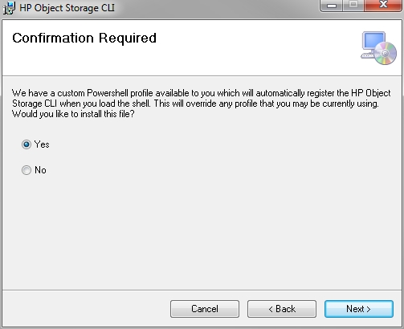
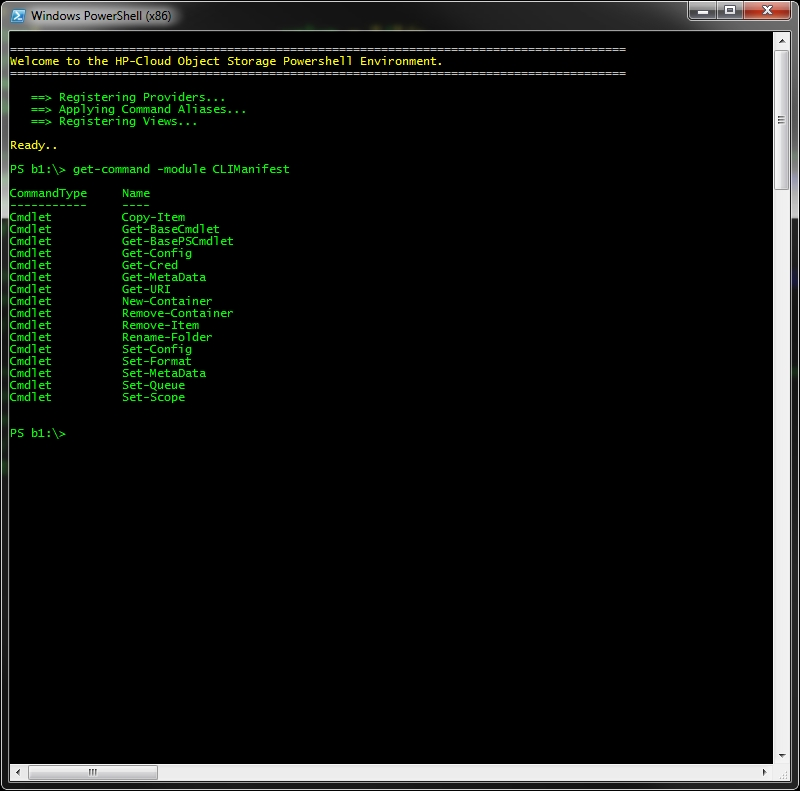

# HP Cloud Windows Powershell CLI

Windows Powershell has long been a widely used system administration tool, so it was a natural place to integrate scriptable access to HP Cloud Services.

## Installation
To get the HP Cloud Powershell environment running properly you must complete the following tasks:

* Run the Installer package found [Here](http://example.com/).
* Enable your Powershell environment to run scripts
* Launch Powershell 
 
####Running the installer package

Launching the Windows installer package will load the following wizard.

####Setting the Required Execution Policy

Now that we have installed the required files we need to make sure that your Powershell environment is capable of executing 3rd party modules. This can be done by issuing the *Set-ExecutionPolicy* command like so

[ Insert winps4.jpg ]

####Loading the Shell and Module Registration

Finally we need to register the Module with Powershell. This is done with the Import-Module Command. To issue this command properly load the shell as an administrator.

[ Insert winps5.jpg ]

If you have installed the software through the installer package, registration will happen automatically through a supplied Powershell Profile. If the profile was not used you must move to 
the install folder specified while in the setup wizard. From there you can register the module with Import-Module .\Climanifest.psd1. Note that this only last for the duration of the Powershell session and it's recommended to add this command to your Profile for best results.

####Supplying your Credentials

The first time that you run the shell you must supply a username and key that was assigned to you during the registration process. The shell will
detect that this is your first time logging in and prompt you for these items. When verified they will be persisted and reused the next time you
you the shell.

## In-Command Help

After module registration is complete you can view a list of available cmdlets and get detailed examples of their usage with a few commands.

Here we have a list of every Powershell Cmdlet exposed from the CLIManifest module that we previously registered.
For additional help on a specific command listed try the following.

[ Insert winps8.jpg ]

For more robust help with examples you can also issue the command with the examples argument.

Finally if you would like to get extensive help for all available Cmdlets in one shot, issue the following

       Get-Command -module CLIManifest | Get-Help

## Usage

The examples below demonstrate how the HP Cloud Windows Powershell CLI can be used with the Object Storage service: 

* [Container and Folder Management](/build/cli/win/container-and-folder-management)
* [Deleting and Moving Files](/build/cli/win/deleting-and-moving-files)
* [Folder Copy Operations](/build/cli/win/folder-operations)
* [Working with Metadata](/build/cli/win/working-with-meta-data) 
* [Changing Formats](/build/cli/win/response-formats)
* [Command Reference](/build/cli/win/command-reference)

 ## Having trouble?
[Get help over at the Forums](https://connect.hpcloud.com)
