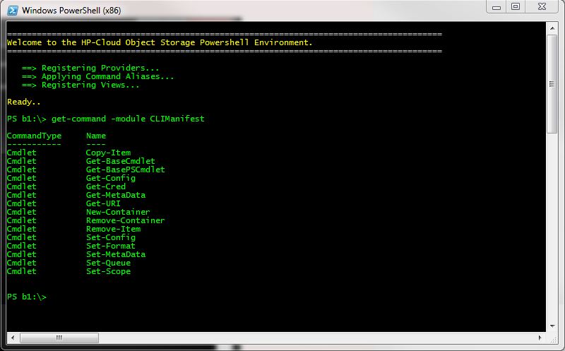
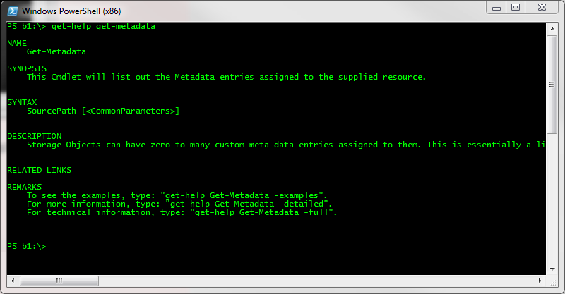
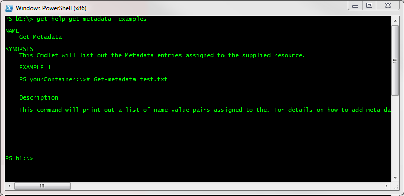

# Windows CLI : Getting Help

After module registration is complete you can view a list of available cmdlets and get detailed examples of their usage with a few commands.

    PS HPCS:\\> get-command -module CLIManifest

    CommandType     Name						Definition
    -----------     ----						----------
    Cmdlet          Add-Rule					Add-Rule [ [-FromPort] <String>] [ [-ToPort] <Stri...
    Cmdlet          Allocate-IP					Allocate-IP [-ResponseFormat <ResponseFormat>] [...
    Cmdlet          Assign-IP					Assign-IP [-ServerId] <String> [-IpAddress] <Str...
    Cmdlet          Attach-Volume				Attach-Volume [-ServerId] <String> [ [-VolumeId] ...
    Cmdlet          Copy-Item					Copy-Item [-SourcePath] <String> [ [-TargetPath] ...
    Cmdlet          Deallocate-IP				Deallocate-IP [-IpAddressId] <String> [-Response...
    Cmdlet          Detach-Volume				Detach-Volume [-ServerId] <String> [ [-VolumeId] ...
    Cmdlet          Get-BasePSCmdlet			Get-BasePSCmdlet [-ResponseFormat <ResponseForma...
    Cmdlet          Get-Catalog					Get-Catalog [-Verbose2] [-ResponseFormat <Respon...
    Cmdlet          Get-CDN						Get-CDN [-ResponseFormat <ResponseFormat>] [-Ver...
    Cmdlet          Get-Config					Get-Config [-ResponseFormat <ResponseFormat>] [-...

    . . .

    PS HPCS:\\> get-command -module CLIManifest

<!---->

Here we have a list of every Powershell Cmdlet exposed from the CLIManifest module that we previously registered.
For additional help on a specific command listed try the following.

    PS HPCS:\\> get-help get-metadata
    
    NAME
    	get-metadata
    
    SYNOPSIS
    	This Cmdlet will list out the Metadata entries assigned to the supplied resource.
    
    SYNTAX
    	SourtcePath [<CommonParameters>]
    
    DESCRIPTION
    	Storage Objects can have zero to many custom meta-data entries assigned to them.  This is essentially a li
    
    RELATED LINKS
    
    REMARKS
    	To see the examples, type: "get-help get-metadata -examples"
    	For more information, type: "get-help getmetadata -details"
    	For technical information, type: "get-help get-metadata -full"
    
    PS HPCS:\\> get-help get-metadata

<!---->

For more robust help with examples you can also issue the command with the examples argument.

    PS HPCS:\\> get-help get-metadata -examples
    
    NAME
    	get-metadata
    
    SYNOPSIS
    	This Cmdlet will list out the Metadata entries assigned to the supplied resource.
    
    	EXAMPLE 1
    	
    	PS yourContainer:\># get-metadata test.txt
    	
    	Description
    	-----------
    	This command will print out a list of name value pairs assigned to the supplied resource.  For details on how to add meta-data
    
    PS HPCS:\\> get-help get-metadata

<!---->

Finally if you would like to get extensive help for all available Cmdlets in one shot, issue the following

       Get-Command -module CLIManifest | Get-Help

