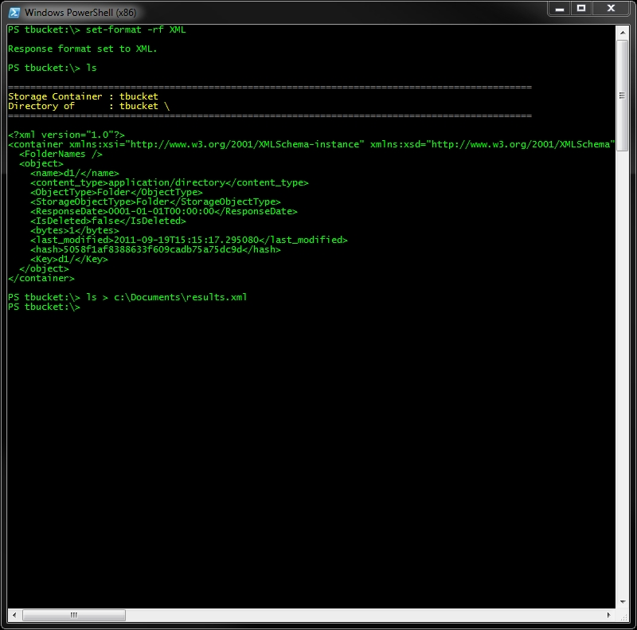
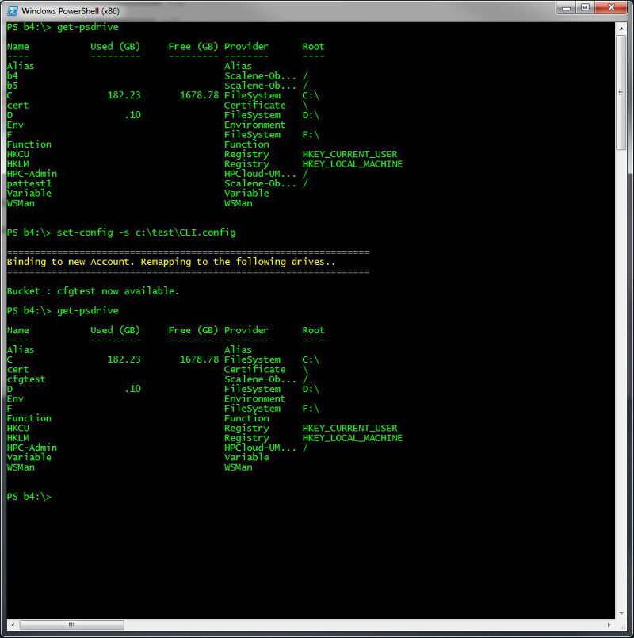

# Windows CLI: Changing Formats

##Changing Formats

Each command that you issue through the Provider or through a cmdlet will write out the response returned from the server in an easy to understand, human readable format. For a command line tool, this is the behaviour one would expect. The CLI can also reformat each response
depending on your need. This is accomplished through the Set-Format cmdlet. With this cmdlet you can specifiy the response to be one of three formats

*Data (the default)
*XML
*JSON

This cmdlet will take effect for the duration of the Session only.

Example: XML Based Responses

This example shows how we can quickly produce an XML file of what we find in the test folder. In addition, output recieved from cmdlets adhere to the format as well. Note
the response of the Get-Policy command.

Example: JSon Based Responses

A quick JSON example. After the listing, we revert back to the default style.

##Changing Configuration Files

This system persist its settings in the CLI.config file located 
in the users application directory. This file is important as it's used for storing
Credentials, connection information such as addresses and timeout values, and various other settings.
Each time the shell loads, this file is opened and it's settings are used throughout the session. There may be times when
you wish to temporarily change these settings to accomodate impersonation, environment change (Pro, QA etc) or other testing scenarios.
This can be done in one of two ways

*Per item 
*Per Configuration

First, to see what the current configuration you are running under use the Get-Config cmdlet.

Example : Viewing your Configuration

Now let's asume that connectivity issues have required us to increment the http timeout period for each connection. This specific value can be 
altered via the Set-Config cmdlet.

If you want to revert back to the defaults as defined in your CLI.config file just issue the following command.

           Set-config -resetcfg

In addition to Per Item changes to the configuration you can also swap out entire config files. When you do this and the new file contains
different credentials we have to re-evaluate the list of Containers that the current user has access to. Changing your credentials is changing your identity after all
and you may own just a small subset of Containers after the change. In this example you can see this rebinding in action.

##Finding an Objects Location

The contents of the Object store are URI addressable given that you have the proper permissions to view the resource. If you would like a quick way to load
the object into your browser, a fully qualified URI can be obtained with the Get-Uri cmdlet.

Note : When you issue this command the URI is also pasted to the Windows clipboard for your convenience. If you want to disable this behavior simply set the CLI.config
option entitled PasteGetURIResultsToClipboard to false.
