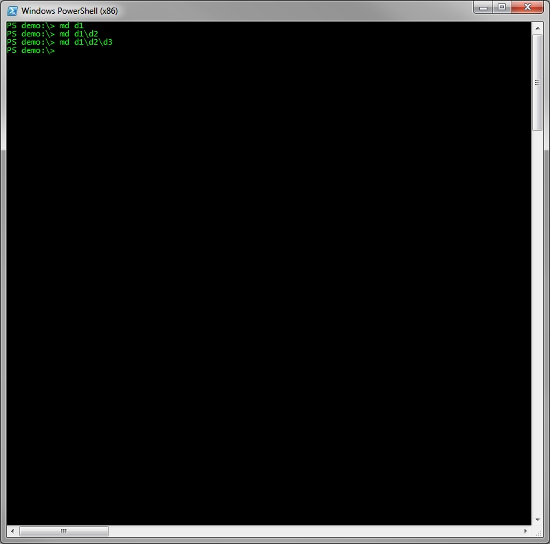

# Windows CLI: Container and Folder Management

##Creating Storage Containers

Storage Containers act as a fundamental unit of storage in HP Object Storage. These items are very similar to disk volumes that one would traditional use to maintain a set of hierarchically organized folders. PowerShell offers a natural way to represent these Storage Containers through the use of Providers. Instances of these Powershell Providers are called Drives and each Storage Container that you create will be represented as one. To illustrate this concept let's first create a Storage Container with the New-Storage Container command.

Now we can list out all of the available PowerShell drives on the system and we should see the Storage Container that we just created.

Notice the results with HP-Cloud Object Storage the Provider column value. These are HP-Cloud Object Storage drives that you can mount like any other drive with the CD command.

One caveat when creating new Storage Containers is that you must be attached to an existing Storage Container to have newly created Storage Containers show up in the Get-PsDrive results without a shell restart. The first time that you open the shell you won't have any Storage Containers to attach to. In this case, just CD to the default drive with 

           CD HPSO-Init: 

At this point you can issue the New-Container command and a subsequent issuance of Get-PSDrive will list what you just created (The default drive will not show up the next time you load the shell as it exist only temporarily to bootstrap the Storage Container creation process). Now it's time to take the file system for a spin but before we do that, let's go over a few basic concepts.

##Storage Paths
   
Storage paths in this system come in a few different varieties. People familiar with command line interfaces should feel at home with the ways that you can express a resources location within a HP-Cloud Object Storage based data store. The following resource addressing styles are supported by this Storage Provider.

<table class="table_data"><tr>
<th>Name</th>
<th>Description</th>
<th>Example</th>
</tr>
<TR>
<TD>
Fully Qualified \ Absolute Paths
</TD>
<TD>
This type of path includes the entire address to the resource including the Storage Container name.
</TD>
<TD>
Storage Container\Folder1\Folder2
</TD>
</TR>
<TR>
<TD>
Relative Paths (Adjacent Folder)
</TD>
<TD>
This type of path simply specifies the adjacent folder.
</TD>
<TD>
PS TestStorage Container:\Folder1>  ls Folder2    (Where Folder2 is a direct descendant of Folder1)
</TD>
</TR>
<TR>
<TD>
Relative Paths (Deep Node)
</TD>
<TD>
This Path gives a deep address to a node in the tree relative to its current position.
</TD>
<TD>
PS TestStorage Container :\Folder1>  ls Folder2 \ Folder3 \ Folder4   
</TD>
</TR>
<TR>
<TD>
Implicit Target Path
</TD>
<TD>
This is when the target path is omitted from a command. In these circumstances, the command will assume the current folder to be the target
</TD>
<TD>
PS TestStorage Container:\Folder1> Copy c:\Documents\Test.xml
</TD>
</TR>
</table>

Example directory listings (ls) of folders using various addressing styles..

##Creating Folders

Creating a Folder in HP-Cloud Object Storage is as easy as issuing the MD command..

Based on our supported Storage Path styles we can also create directory structures like so..

This will create a hierarchy of folders with D1 acting as the root, D2 as its immediate descendant , with D3 being the terminal node.

