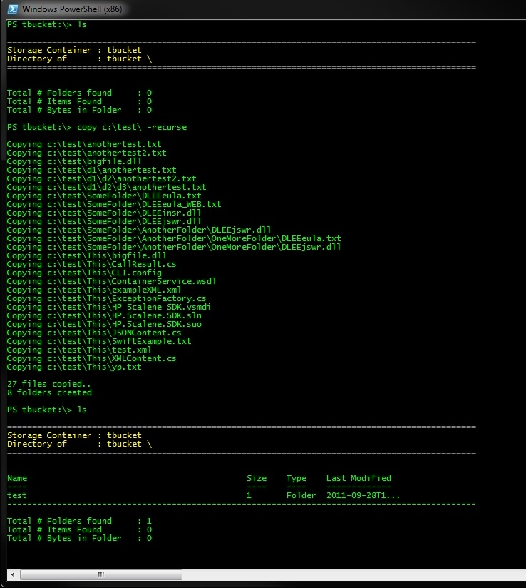
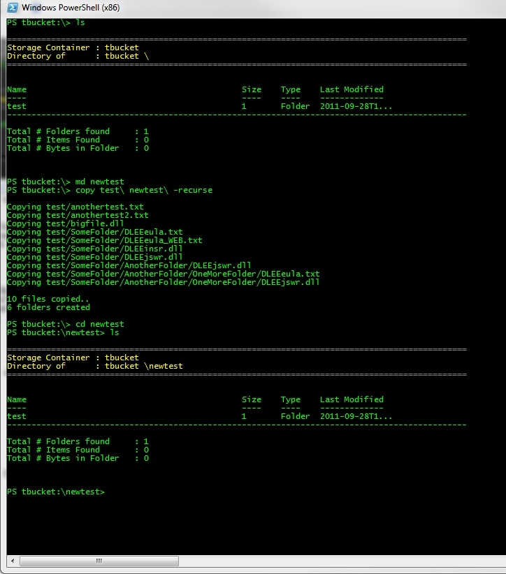
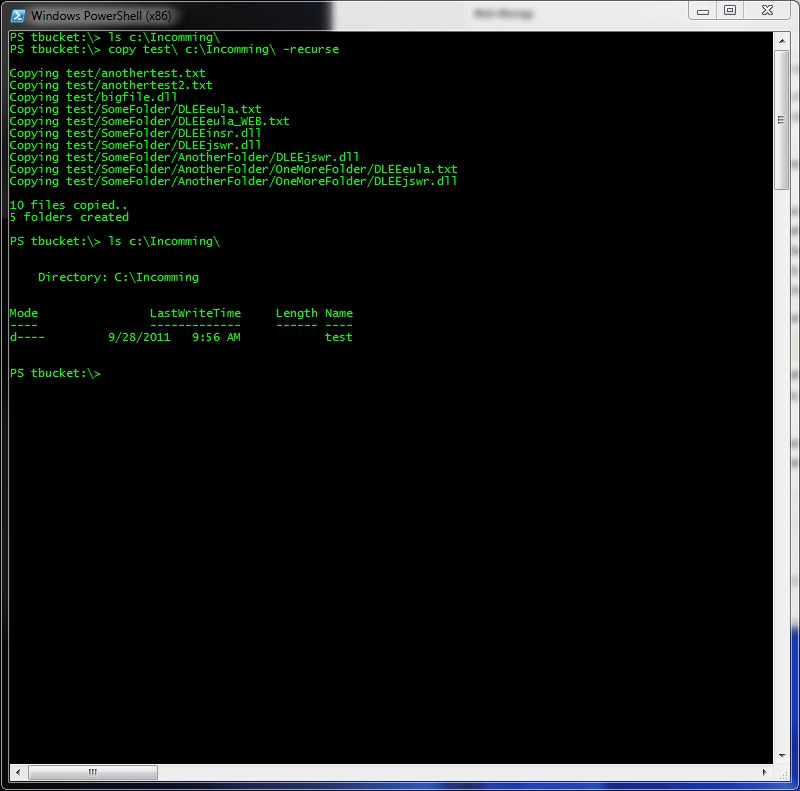
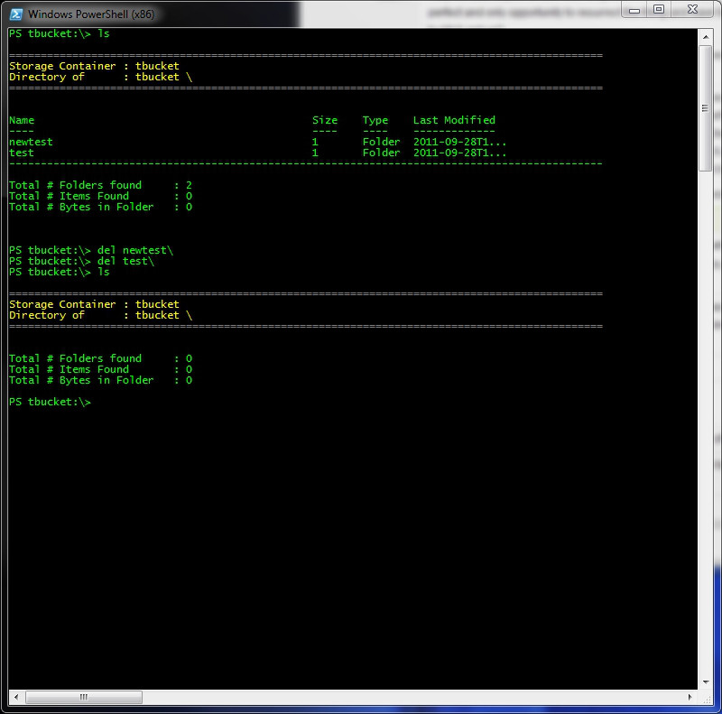

# Windows CLI: Folder Copy Operations

##Folder Operations

When you consider the sheer quantity of data that could be potentially moved into the cloud you soon realize that operations on individual files are impractical at best. To remedy this we have the ability to copy entire sets of objects from your local machine to
the store, within the store , and to your local machine in one operation. Each of these commands can be tailored to affect a specific folders contents, or any decendant folders beneath the target path.To address a folder, remember to include a trailing \ on the 
end of each path to indicate that you are working with a folder and not an individual file.

Example: Local-to-Server Copy

In this example, we're making a copy of the local folder namned Test to the current location on the server which is the root directory. The lack of target path will force the system to assume the current location is the target (this is also true of individual files).
Notice that when the operation completes that a new Folder named Test has been created off of root , in other words folder operations are inclusive of the container that you're pointing to. Also note the use of the -recurse argument. this instructs the cmdlet to make the copy 
in a recursive fashion with respect to the folders that it finds along the way.

Why don't we make sure that we can move these folders around on the server? Here we'll create another folder off of root and recursively copy what we just brought in from the 
client to that location.

Example: Intra-Server Copy

Example: Server-To-Local Copy

Finally, let's get these files back to the client for good measure..

Done...

Example: Server-To-Local Copy

And now back to our local file system with recursion...

[ Insert winps25.jpg ]

##Deleting Folders

Finally, when we're done with a folder we can simply remove it. Note that when you delete a folder, all of its contents are deleted along with any child folders as well.

