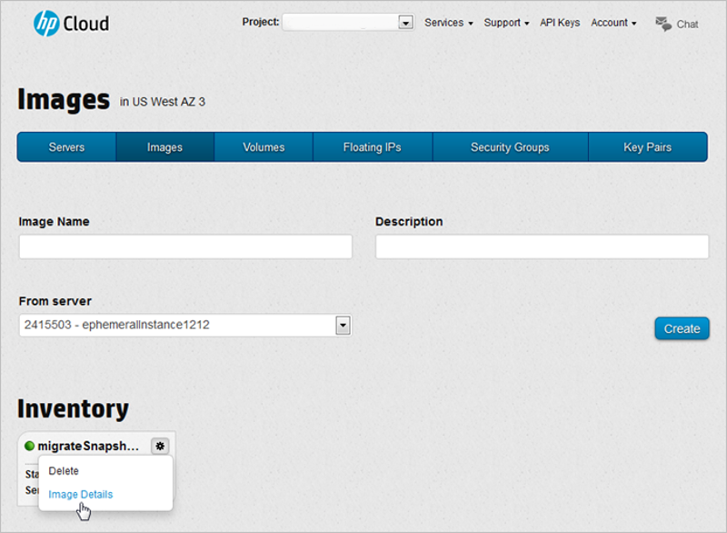
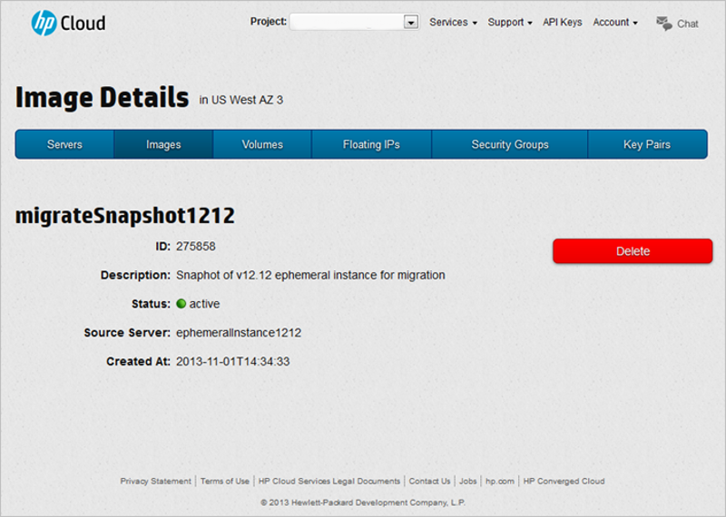
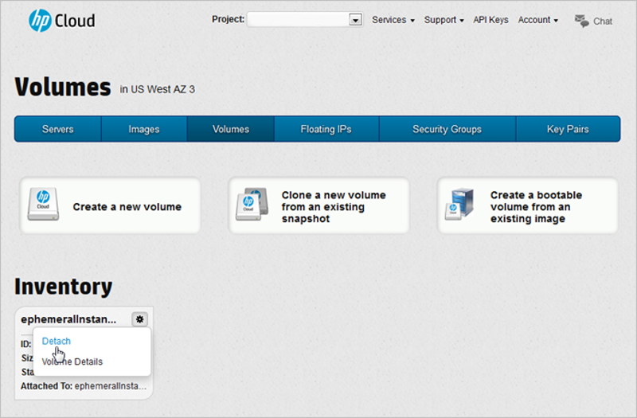
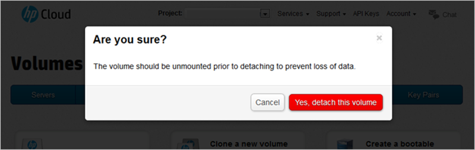
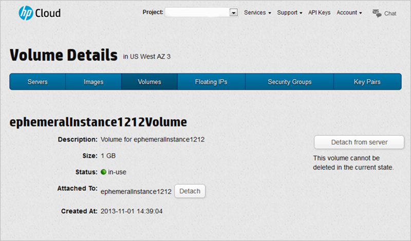
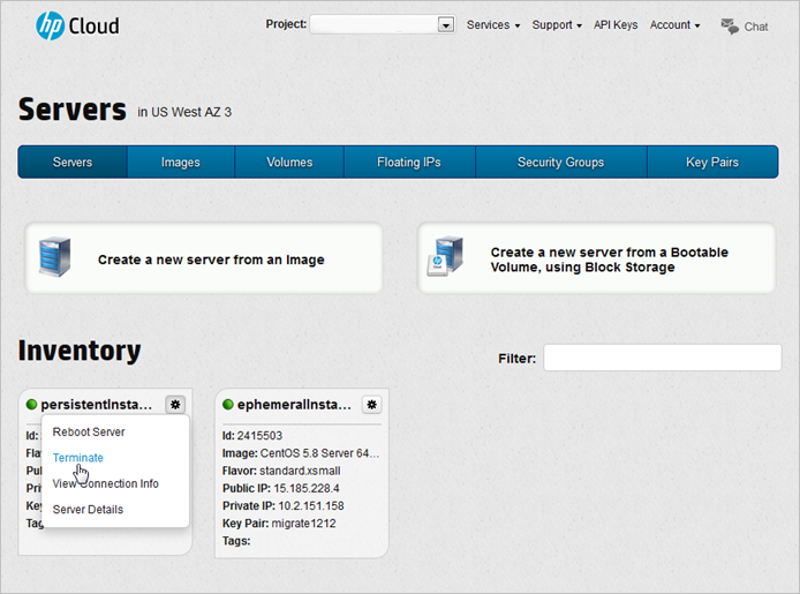
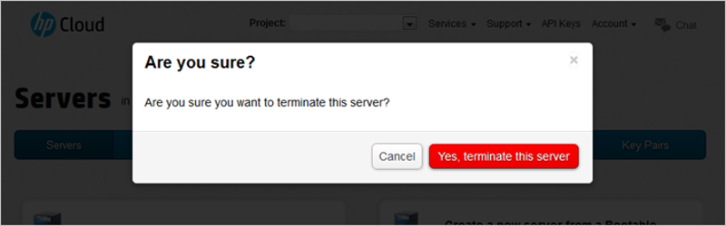
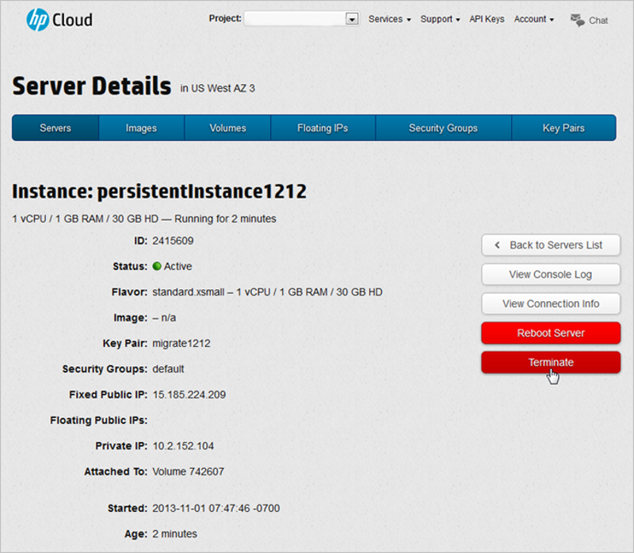

<!--
Troubleshooting or frequently asked questions (?)
-->

# HP Cloud Services version 12.12 to 13.5: Assisted Data Migration Reference Guide 

If you need assistance in migrating your data from HP Cloud Services version 12.12 to 13.5, this page provides you with detailed information about the tasks you need to complete before the data migration. Review this document and [contact support](#ContactingSupport) with any questions.

If you plan on performing the migration without support services, the [Self-Migration Reference Guide](/migration-overview) page contains details on how to migrate your data yourself from version 12.12 to 13.5 of the HP Cloud Services.

## Before you begin ## {#TransitionOverview}
For assistance with transitioning your data from version 12.12 to 13.5, there are a few preliminary tasks you must complete first:

* [Understand what's new for version 13.5](#VersionDiffs)
* [Review key migration information](#TransitionInfo)
* [Take a snapshot of an ephemeral instance](#Snapshot)
* [Prepare a volume for migration](#PrepVolume)
* [Terminate a persistent instance created from a block volume](#TerminatingPersistent)

Once you have completed these tasks, you must [contact support](#ContactingSupport) to assist you with the rest of your migration.

## Understand what's new for HP Cloud Services version 13.5 ## {#VersionDiffs}
HP Cloud Services version 13.5 is based on the latest version of OpenStack (Havana), which expands functionality and enhances the current capabilities of the existing services. The sections below give a brief overview of what's new for version 13.5.

### HP Cloud Compute ### {#hpCloudCompute}   
In version 13.5, the HP Cloud Compute service provides on-demand computing giving you the ability to provision and manage large clusters of instances (virtual machines). You have more flexibility to select the type of instance that meets the needs of your application without having to pay for additional resources.

In addition, you now have larger and more powerful instance types (sizes) to choose from--four times the size of the largest instances offered by most public clouds. And, our large, xlarge, and 2xlarge sizes are also offered in high memory versions.

### Region-wide resources ### {#RegionWideResources}

Each region--US East and US West--consists of three physically isolated availability zones in which you can create instances and block storage volumes. You can use resources spread across multiple availability zones to create an application with high availability. If you require redundancy for your virtual machines or volumes make sure to specify different availability zones for each.

**Important!** Volumes can only be attached to servers created in the same availability zone.

### Software defined networking ### {#SDN}

With the addition of our new best-in-class software defined networking (SDN) technology from HP Networking, you get enhanced network functionality and  a rich set of additional functionality including the ability to:

* Define and configure your own private virtual L2 networks
* Establish VPN and a VPN connection between the networks you create and your existing on-premise network
* Specify IP address ranges and security group parameters that define the firewall rules for your instances to ensure they don't conflict with your existing on-premise network
* Allocate and manage public floating IP addresses
* Connect to a specific network and connect an instance to more than one network
	
### Block storage ### {#BlockStorage}

Block storage has always been available in the HP Cloud Compute service, but now it is a separate, but integrated, service, providing persistent, manageable volumes along with the ability to take a snapshot of a volume. Bootable volumes can be created from images in the Image Management service and these bootable volumes can be used to create persistent instances.

### Bulk data import ### {#BulkDataImport}

Bulk import means we load your data into HP Cloud Block Storage or HP Cloud Object Storage--just send a hard drive directly to the HP data centers where we rapidly transfer your data to the cloud. Get apps with big data sets to the HP Cloud quickly and easily.

### For more information ### {#MoreVersionDiffInfo}
For more information on migrating your services, and to better understand the differences between versions 12.12 and 13.5, see:

* [Release Notes](/release-notes)
* [Getting Started](/article/getting-started-compute-135) 
* [Account Limits](/article/hp-cloud-account-limits-135)
* [Managing Floating IPs](/article/managing-your-floating-ips-135)
* [API Documentation](/api/v13/)

## Determine if you are moving an instance snapshot or creating a new instance ## {#moveInstanceCreateNew}
For each instance, you need to determine if you want to keep the data that resides on each instance. If you want to keep your existing data, you can do one of two things:

+ Move an instance snapshot to version 13.5
+ Create a new, version 13.5 instance and migrate the data

To move an instance snapshot, continue with the tasks in this document. To create a new instance and migrate your data, *do not continue with this document*; instead, you must follow the [Self-Migration Reference Guide](/migration-overview).

Using an instance snapshot can make migration easier, but might not be suitable for all transitions. An instance snapshot includes only the root partition; ephemeral or additional disk space is not stored in a snapshot.  If you use ephemeral storage, you must [manually transition this data](/migration-overview#createephinstance).  

**Important!** If you have questions about which process is best for your situation, [contact your support engineer](#ContactingSupport). If you do not need to keep your existing data, you should simply [create a new instance](/article/creating-your-first-instance-135).

## Review key migration information ## {#TransitionInfo}
Before you attempt an assisted migration from HP Cloud Services version 12.12 to 13.5, review the following critical pieces of information.

<ul>
<li>Purging unnecessary data and files

Before you transition to version 13.5, we recommend you purge any data you no longer need and remove any unnecessary log files.

</li>
<li>DNS entries

IP addresses change between the two environments; if you have any DNS entries that point to your current configuration, you must plan to change them after your transition.

</li>
<li>Instances offline and volumes unavailable

All of your instances will be offline and your volumes will not be available during the transition process outlined on this page.

</li>
</ul>

## Taking a snapshot of an ephemeral instance ## {#Snapshot}
The first step in preparing your data for migration to version 13.5 is to use the [Images screen](/mc/compute/images/) of the [Management Console](/mc/) (MC) to take a snapshot of your instance.  

**Note:**
For best results, we recommend using the latest version of the  following HTML5 browsers when accessing the management console:

- Chrome
- Firefox
- Internet Explorer (9+)
- Safari

To create a snapshot of an ephemeral instance:

1. From the MC, click the `Images` tab.
2. In the [Images screen](/mc/compute/images/), enter an `Image Name` and `Description` for your instance snapshot.
3. In the `From server` drop-down menu, select the server from which you want to create your snapshot .
4. Click `Create`.

The image appears in the list immediately with the status of `Queued`. While your image is being created, the `Status` changes to `Saving` and finally `Active`.  The new image is a snapshot of your server.

To display the details for the image, you can either click the image name, or click the action button (`*`) and select `Image Details`.

This launches the `Image Details` screen for your image, which contains the `ID`, `Description`, `Status`, `Source Server`, and `Created At` time for your image.

## Preparing a volume for migration ## {#PrepVolume}

To transition your data to version 13.5, you must prepare your volume (and associated data) for migration. When you migrate a block volume, the volume must be in an Available state:

- The data on the volume is not accessible
- The volume is not attached to an instance 
- The volume is not running as an instance

All volume snapshots and volumes created from those snapshots are migrated as well.

### Detaching a block volume ### {#DetachingBlock}

**IMPORTANT!** You need to unmount any device from your instance prior to detaching it to avoid  possible issues, such as data corruption.

To detach a volume:

1. From the MC, click the [Volumes](/mc/compute/volumes/) tab.
2. In the `Inventory` pane, click the action button (`*`) of the volume whose instance you want to detach and select `Detach`.

3. To verify the request, click `Yes, detach this volume`.

Your volume is detached. 

You can also detach a volume using the [volume details](/mc/compute/servers/view-details/) screen of the MC. To access the volume details screen from the `Inventory` pane, click on the volume name or click the action button (`*`) and select `Volume Details`.

Support must migrate all assets associated with your volumes (such as volume snapshots, the original volume if created from a snapshot, and the volume being requested). [Contact support](#ContactingSupport) for help when you reach this step.

**Note**: If you are using ephemeral storage to migrate a persistent instance, your data will be lost when you terminate the instance.

See the [Managing volumes](/mc/compute/volumes/manage/) page for details on using the MC for creating and deleting a volume and bootable volumes, attaching and detaching volumes, managing volume snapshots, and viewing volume details.

## Terminating a persistent instance created from a block volume ## {#TerminatingPersistent}

You cannot detach a volume that is running an instance; you must first terminate the instance to make the volume available.  To terminate an instance:

1. From the MC, click the `Servers` tab.
2. In the `Inventory` pane, click the action button (`*`) of the server whose instance you wish to terminate and select `Terminate`.

3. To verify the request, click `Yes, terminate this server`.

Your instance is terminated.

You can also terminate the instance from the [server details](/mc/compute/servers/view-details/) screen of the MC. To access the server details screen from the `Inventory` pane, click on the server name or click the action button (`*`) and select `Server Details`.

**Note**: When you terminate a persistent instance that was created from a bootable volume, any ephemeral storage that is being used is lost and the public IP is released for use. 

## Contacting support ## {#ContactingSupport}

Now that you have completed your preliminary transition steps, you need to [contact our Support team](https://www.hpcloud.com/contact_us):

* [Live chat from hpcloud.com](https://account.hpcloud.com/cases#support_chat)
* [Open a support case](https://account.hpcloud.com/cases)
* [Email support@hpcloud.com](mailto:support@hpcloud.com)
* Call at 1-855-61CLOUD (1-855-612-5683) in the U.S. or +1-678-745-9010 internationally.

## For further information ## {#MoreInfo}

For more information on migrating your services, as well as general information about version 13.5:

* The [Self-Migration Reference Guide](/migration-overview) page contains details on how to migrate your data yourself from version 12.12 to 13.5 of the HP Cloud Services
* Our [release notes for version 13.5](/release-notes/) of the HP Cloud software
* The [version 13.5 overview](/version-overview/) provides a look at the different software versions available
* The [technical support knowledge base](https://community.hpcloud.com)
* [UNIX command-line interface migration information](/cli/unix/articles/migration/)
