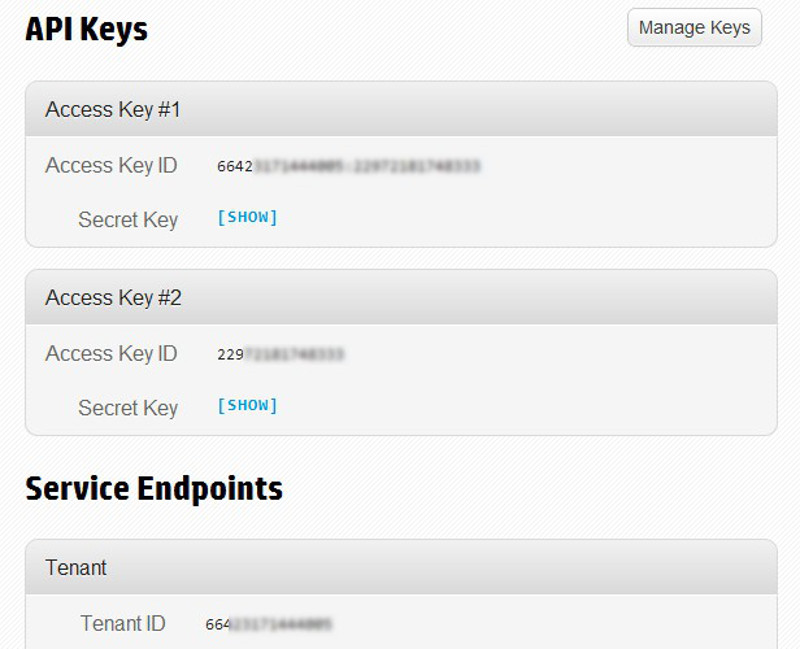

# HP Cloud UNIX CLI Installation

___________________

###Important Notice###

On November 4, 2013, the UNIX CLI was moved into its End-of-Life Cycle process toward final deprecation. During this 6-month transition time:

* New and existing customers are encouraged to migrate to the OpenStackClient (Unified) CLIs or the OpenStack command-line clients for each respective service
* No new feature requests will be honored
* Bug reports will be accepted

After 6-months, access to online resources will still be available, but no support will be offered from HP Public Cloud, and the software download will be disabled—although you are most welcome to continue development at your discretion! HP Cloud has contributed the Unix CLI back to the open source community, and you can access the source code, documentation, and downloads [here](https://github.com/hpcloud/unix_cli).

_________________________________________

Before you can begin working with the UNIX CLI, you have to install the package (of course!).  The instructions below work for Ubuntu, MacOS X, and CentOS installations.  Take a look at the [HP Cloud Unix CLI - Release Notes](/cli/unix/release-notes) for the latest features.

[You can download the latest version of the UNIX CLI software here (Version 1.9.1)](/file/hpcloud-1.9.1.gem)!

To install the UNIX CLI software, follow these steps:

1. Start by [installing](/bindings/fog/install) the [HP Cloud Ruby Fog Binding](/bindings/fog) software on which the HP Cloud Unix CLI depends.

2. Download and install the HPCloud Unix CLI gem using curl:

        curl -sL https://docs.hpcloud.com/file/hpcloud-1.9.1.gem >hpcloud.gem
        sudo gem install hpcloud.gem

3. Verify the installation:

        hpcloud info

    This shows you the version info for the installation.  In addition, you can type the command

        hpcloud

   If you see a listing of available commands similar to that shown below, your installation was successful:

        Tasks:
        hpcloud account:setup                                            # set up or modify your credentials
        hpcloud acl <object/container>                                   # view the ACL for an object or container
        hpcloud acl:set <resource> <acl>                                 # set a given resource to a canned ACL
        hpcloud addresses                                                # list of available addresses
        hpcloud addresses:add                                            # add or allocate a new public IP address
        . . .

4. Once installation is complete you can set up your account:

        hpcloud account:setup

You can find the values you need for your setup by clicking the [`API Keys`](https://console.hpcloud.com/account/api_keys) button in the [Console Dashboard](https://console.hpcloud.com/dashboard).  

Please be sure to confirm the default values for `Auth Uri` and your various zones and regions where services are activated.

Now that you've finished installing the software package, it's time to [perform a few configuration steps](/cli/unix/configuration)!

## Unistalling ##  {#Unistalling}

Its recommended that you uninstall a previous version prior to upgrading. To uninstall:

        gem uninstall hpcloud

