# HP Cloud Environment CLI Software for Windows PowerShell Object Storage Examples

One of the key features of the HP Cloud environment CLI software for Windows PowerShell Object Storage is that it provides a way to store and retrieve objects in a highly redundant cluster of publicly accessible physical machines hosted in HP data centers.  This page provides examples for how to use Object Storage via the Windows PowerShell CLI.  (See the [HP Cloud Object Storage Overview](/object-storage) for overview information on Object Storage.)

**Note:** When referencing an argument, like a container name, that has a space, use quotes to access that resource. For example:
     
     PS: HPCS:\> cd "my container:"
     PS: HPCS:\> new-container "my new container"

**Note**: The HP Cloud environment CLI software for Windows PowerShell supports the [standard Windows wildcard](http://msdn.microsoft.com/en-us/library/windows/desktop/aa717088(v=vs.85).aspx) characters asterix (`*`), question mark (`?`), and range brackets (`[]`) for the `ls, copy` and `delete` object storage commands.

##Interacting with the Storage Service## {#InteractingwiththeStorageService}

<iframe src="http://player.vimeo.com/video/33349560?title=0&amp;byline=0&amp;portrait=0" width="580" height="420" frameborder="0"> </iframe>

In addition to the video tutorial, which shows you how the basics of our object storage PowerShell environment, this page contains the following examples:

* [Creating Storage Containers](#CreatingStorageContainers)
* [Storage Paths](#StoragePaths)
* [Creating Folders](#CreatingFolders)
* [Folder Operations](#FolderOperations)
* [Deleting Folders](#DeletingFolders)
* [Working with MetaData](#WorkingwithMetaData)
* [Changing Response Formats](#ChangingResponseFormats)
* [Changing Configuration Files](#ChangingConfigurationFiles)
* [Viewing Your Service Catalog](#ViewingYourServiceCatalog)
* [Finding an Object's Location](#FindinganObjectsLocation)
* [Adding and Removing Drives](#AddingandRemovingDrives)
* [Getting Version Information](#GettingVersionInformation)
* [Using Another User's Credentials](#UsingAnotherUsersCredentials)
* [Viewing the Release Notes](#ViewingtheReleaseNotes)
* [Migrating Your Files From Another Storage System](#MigratingYourFiles)

##Creating Storage Containers## {#CreatingStorageContainers}

Storage Containers act as a fundamental unit of storage in HP Object Storage. These items are very similar to disk volumes that one would traditionally use to maintain a set of hierarchically organized folders. PowerShell offers a natural way to represent these Storage Containers through the use of Providers. Instances of these Powershell providers are called drives and each storage container that you create is represented as one. To illustrate this concept let's first create a Storage Container with the `New-Container` command. When Powershell first opens, use the `cd HPCS:` command to use the HPCS providers

    ------------------------------------------------------------------------------------------------------
    Welcome to the HP-Cloud Object Storage Powershell Environment.
    ===============================================================

      ==> Registering Providers. . .
      ==> Applying Command Aliases. . .
      ==> Registering Views. . .
    
    Ready. . .
    
    PS C:\Program Files (x86)\HP\HPCS-Powershell> cd HPCS:
    PS HPCS:\> new-container demo
    
    Storage Container demo created successfully.

    PS HPCS:\> 

<!--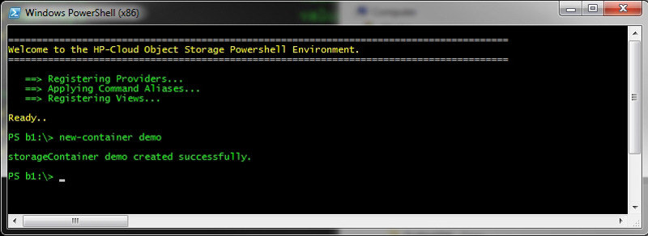-->

Now we can list out all of the available PowerShell drives on the system and we should see the Storage Container that we just created.

    PS b1:\> get-psdrive
    
    Name        Used (GB)    Free (GB)  Provider         Root
    ----        ---------    ---------  --------         ----
    Alpha                               HP-Objects. . .  /
    Alias                               Alias   
    Beta                                HP-Objects. . .  /
    Beta2                               HP-Objects. . .  /
    C              240.17      1620.85  FileSystem       C:\
    D                                   FileSystem       \    
    demo                                HP-Objects. . .  /
    . . .

<!--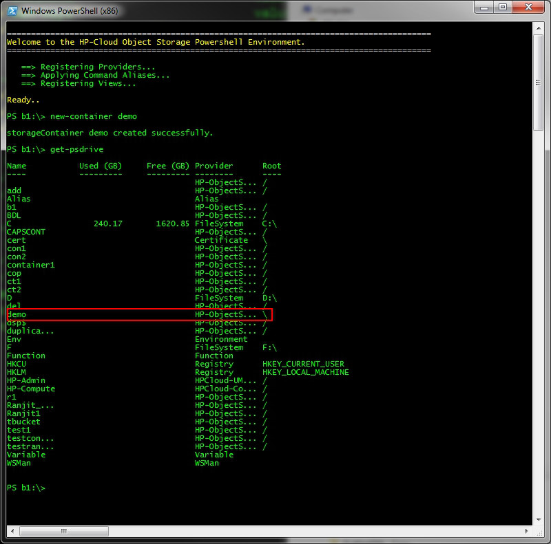-->

In the example above, notice the value of "HP-Objects..."  in the "Provider" column. These are HP-Cloud Object Storage drives that you can mount like any other drive with the `CD` command.

    PS con1:\> cd demo:
    PS demo:\> ls
    
    ===============================================================
    Storage Container : demo
    Directory of      : demo \
    ===============================================================
    
    Total # Folders found    : 0
    Total # Items Found      : 0
    Total # Bytes in Folder  : 0
    
    PS demo:\> 

<!--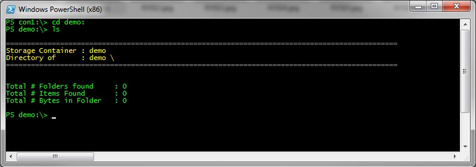-->

One caveat when creating new Storage Containers is that you must be attached to an existing Storage Container to have newly created Storage Containers show up in the Get-PsDrive results without a shell restart. The first time that you open the shell you won't have any Storage Containers to attach to. In this case, just CD to the default drive with: 

    CD HPSO-Init: 

At this point you can issue the New-Container command and a subsequent issuance of Get-PSDrive will list what you just created (The default drive will not show up the next time you load the shell as it exists only temporarily to bootstrap the Storage Container creation process). Now it's time to take the file system for a spin but before we do that, let's go over a few basic concepts.

##Storage Paths## {#StoragePaths}
   
Storage paths in this system come in a few different varieties. People familiar with command line interfaces should feel at home with the ways that you can express a resources location within a HP-Cloud Object Storage based data store. The following resource addressing styles are supported by this Storage Provider.

<head>
<meta http-equiv=Content-Type content="text/html; charset=windows-1252">
<meta name=Generator content="Microsoft Word 14 (filtered)">

</head>

<body lang=EN-US>

<table class=MsoTableLightShading border=1 cellspacing=0 cellpadding=0
 style='border-collapse:collapse;border:none'>
 <tr>
  <td width=213 valign=top style='width:159.6pt;border-top:solid black 1.0pt;
  border-left:none;border-bottom:solid black 1.0pt;border-right:none;
  padding:0in 5.4pt 0in 5.4pt'>
  
<strong>Name</strong>

  </td>
  <td width=303 valign=top style='width:227.4pt;border-top:solid black 1.0pt;
  border-left:none;border-bottom:solid black 1.0pt;border-right:none;
  padding:0in 5.4pt 0in 5.4pt'>
  
<strong>Description</strong>

  </td>
  <td width=390 valign=top style='width:292.5pt;border-top:solid black 1.0pt;
  border-left:none;border-bottom:solid black 1.0pt;border-right:none;
  padding:0in 5.4pt 0in 5.4pt'>
  
<strong>Example</strong>

  </td>
 </tr>
 <tr>
  <td width=213 valign=top style='width:159.6pt;border:none;background:silver;
  padding:0in 5.4pt 0in 5.4pt'>
  
Fully Qualified \ Absolute Paths

  </td>
  <td width=303 valign=top style='width:227.4pt;border:none;background:silver;
  padding:0in 5.4pt 0in 5.4pt'>
  
This type of path includes the entire
  address to the resource including the Storage Container name.

  </td>
  <td width=390 valign=top style='width:292.5pt;border:none;background:silver;
  padding:0in 5.4pt 0in 5.4pt'>
  
Storage Container\Folder1\Folder2

  </td>
 </tr>
 <tr>
  <td width=213 valign=top style='width:159.6pt;border:none;padding:0in 5.4pt 0in 5.4pt'>
  
Relative Paths (Adjacent Folder)

  </td>
  <td width=303 valign=top style='width:227.4pt;border:none;padding:0in 5.4pt 0in 5.4pt'>
  
This type of path simply specifies the
  adjacent folder.

  </td>
  <td width=390 valign=top style='width:292.5pt;border:none;padding:0in 5.4pt 0in 5.4pt'>
  
PS TestStorage Container:\Folder1&gt; ls
  Folder2 (Where Folder2 is a direct descendant of Folder1)

  </td>
 </tr>
 <tr>
  <td width=213 valign=top style='width:159.6pt;border:none;background:silver;
  padding:0in 5.4pt 0in 5.4pt'>
  
Relative Paths (Deep Node)

  </td>
  <td width=303 valign=top style='width:227.4pt;border:none;background:silver;
  padding:0in 5.4pt 0in 5.4pt'>
  
This Path gives a deep address to a node in
  the tree relative to its current position.

  </td>
  <td width=390 valign=top style='width:292.5pt;border:none;background:silver;
  padding:0in 5.4pt 0in 5.4pt'>
  
PS TestStorage Container :\Folder1&gt; ls Folder2
  \ Folder3 \ Folder4

  </td>
 </tr>
 <tr>
  <td width=213 valign=top style='width:159.6pt;border:none;border-bottom:solid black 1.0pt;
  padding:0in 5.4pt 0in 5.4pt'>
  
Implicit Target Path

  </td>
  <td width=303 valign=top style='width:227.4pt;border:none;border-bottom:solid black 1.0pt;
  padding:0in 5.4pt 0in 5.4pt'>
  
This is when the target path is omitted
  from a command. In these circumstances, the command will assume the current
  folder to be the target

  </td>
  <td width=390 valign=top style='width:292.5pt;border:none;border-bottom:solid black 1.0pt;
  padding:0in 5.4pt 0in 5.4pt'>
  
PS TestStorage Container:\Folder1&gt; Copy
  c:\Documents\Test.xml

  </td>
 </tr>
</table>

Here are some example directory listings (ls) of folders using the various addressing styles described above..

    PS b1:\> ls
    
    ------------------------------------------------------------------------------------------------------
    Storage Container : b1
    Directory of      : b1 \
    ------------------------------------------------------------------------------------------------------
    
    Name										Size    Type    Last Modified
    ----										----    ----    -------------
    anothertest.txt								3572    File    2011-11-14T2...
    builds										1       Folder  2011-11-15T2...
    r											1       Folder  2011-11-14T2...
    t											1       Folder  2011-11-14T2...
    test										1       Folder  2011-11-14T2...
    ------------------------------------------------------------------------------------------------------
    
    Total # folders found     : 4
    Total # Items Found       : 1
    Total # Bytes in Folder   : 3572
    
    
    PS b1:\> ls test\
    ------------------------------------------------------------------------------------------------------
    Storage Container : b1
    Directory of      : b1 \
    ------------------------------------------------------------------------------------------------------
    
    Name										Size    Type    Last Modified
    ----										----    ----    -------------
    anothertest.txt								3572    File    2011-11-14T2...
    anothertest2.txt							3572    File    2011-11-14T2...
    big file.dll								106496  File    2011-11-14T2...
    SomeFolder									1       Folder  2011-11-14T2...
    This										1       Folder  2011-11-14T2...
    d1											1       Folder  2011-11-14T2...
    foo											1       Folder  2011-11-14T2...
    ------------------------------------------------------------------------------------------------------
    
    Total # folders found     : 4
    Total # Items Found       : 3
    Total # Bytes in Folder   : 113460
    
    
    PS b1:\> ls test\foo
    ------------------------------------------------------------------------------------------------------
    Storage Container : b1
    Directory of      : b1 \
    ------------------------------------------------------------------------------------------------------
    
    Total # folders found     : 0
    Total # Items Found       : 0
    Total # Bytes in Folder   : 0
    
    PS b1:\>

<!--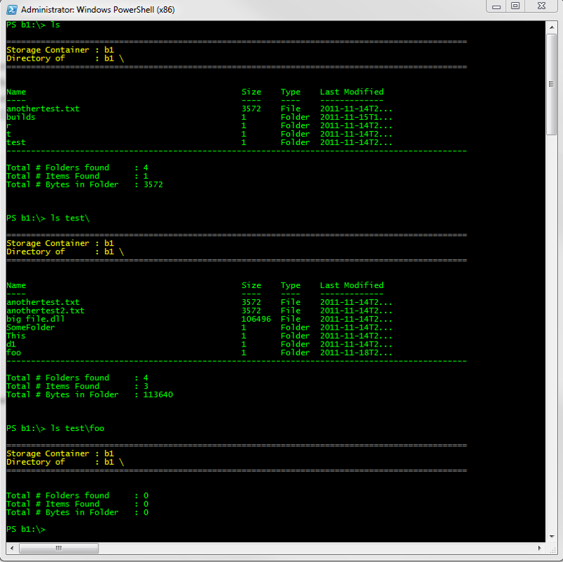-->

##Creating Folders## {#CreatingFolders}

Creating a Folder in HP-Cloud Object Storage is as easy as issuing the MD command..

    PS demo:\> ls
    
    ------------------------------------------------------------------------------------------------------
    Storage Container : demo
    Directory of      : demo \
    ------------------------------------------------------------------------------------------------------
    
    Total # folders found     : 0
    Total # Items Found       : 0
    Total # Bytes in Folder   : 0
    
    PS demo:\> md newFolderTest
    PS demo:\> ls

    ------------------------------------------------------------------------------------------------------
    Storage Container : demo
    Directory of      : demo \
    ------------------------------------------------------------------------------------------------------
    

    Name										Size    Type    Last Modified
    ----										----    ----    -------------
    newFolderTest								1       Folder  2011-09-27T1...
    ------------------------------------------------------------------------------------------------------
    
    Total # folders found     : 1
    Total # Items Found       : 0
    Total # Bytes in Folder   : 0
    
    
    PS demo:\> cd newFolderTest
    PS demo:\newFolderTest> ls
    
    ------------------------------------------------------------------------------------------------------
    Storage Container : demo
    Directory of      : demo \newFolderTest
    ------------------------------------------------------------------------------------------------------
        
    Total # folders found     : 0
    Total # Items Found       : 0
    Total # Bytes in Folder   : 0
    
    PS demo:\newFolderTest>

<!--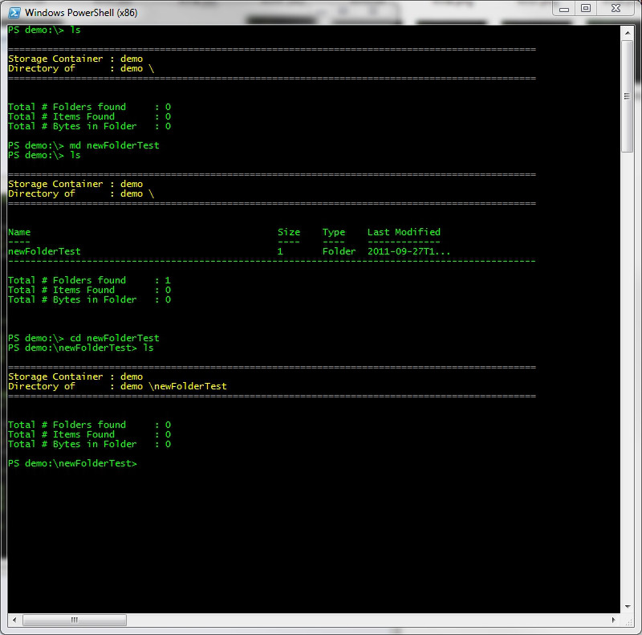-->

Based on our supported Storage Path styles we can also create directory structures like so..

    PS demo:\> md d1
    PS demo:\> md d1\d2
    PS demo:\> md d1\d2\d3
    PS demo:\> 

<!--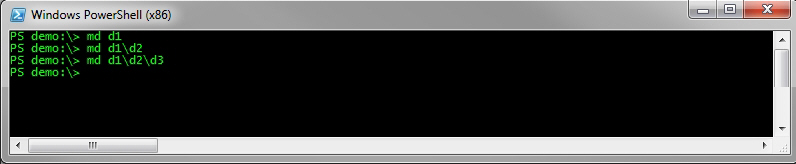-->

This will create a hierarchy of folders with D1 acting as the root, D2 as its immediate descendant , with D3 being the terminal node.

##Folder Operations## {#FolderOperations}

When you consider the sheer quantity of data that could be potentially moved into the cloud you soon realize that operations on individual files are impractical at best. To remedy this we have the ability to copy entire sets of objects from your local machine to the store, within the store , and to your local machine in one operation. Each of these commands can be tailored to affect a specific folders contents, or any descendant folders beneath the target path. To address a folder, remember to include a trailing `\` on the  end of each path to indicate that you are working with a folder and not an individual file.

**Example: Local-to-Server Copy**

In this example, we're making a copy of the local folder named Test to the current location on the server which is the root directory. The lack of target path will force the system to assume the current location is the target (this is also true of individual files).
Notice that when the operation completes that a new Folder named Test has been created off of root, in other words folder operations are inclusive of the container that you're pointing to.
    
    PS b1:\> copy c:\test\
    
    Copying c:\test\anothertest.txt
    Copying c:\test\anothertest2.txt
    Copying c:\test\big file.dll
    
    ------------------------------------------------------------------------------------------------------
    Operation Summary
    ------------------------------------------------------------------------------------------------------
    Total Files Copied : 3
    Total Bytes Copied : 113640

    PS b1:\> ls
    
    ------------------------------------------------------------------------------------------------------
    Storage Container : b1
    Directory of      : b1 \
    ------------------------------------------------------------------------------------------------------
            

    Name										Size    Type    Last Modified
    ----										----    ----    -------------
    test										1       Folder  2011-09-10T2...
    ------------------------------------------------------------------------------------------------------
    
    Total # folders found     : 1
    Total # Items Found       : 0
    Total # Bytes in Folder   : 0
    
    
    PS b1:\> cd test
    PS b1:\test> ls
    
    ------------------------------------------------------------------------------------------------------
    Storage Container : b1
    Directory of      : b1 \test
    ------------------------------------------------------------------------------------------------------
    
    Name										Size    Type    Last Modified
    ----										----    ----    -------------
    anothertest.txt								1       File    2011-09-10T2...
    anothertest2.txt							1       File    2011-09-10T2...
    big file.dll								106496  File    2011-09-10T2...
    ------------------------------------------------------------------------------------------------------
        
    Total # folders found     : 0
    Total # Items Found       : 3
    Total # Bytes in Folder   : 113640
    
    PS b1:\test>

<!--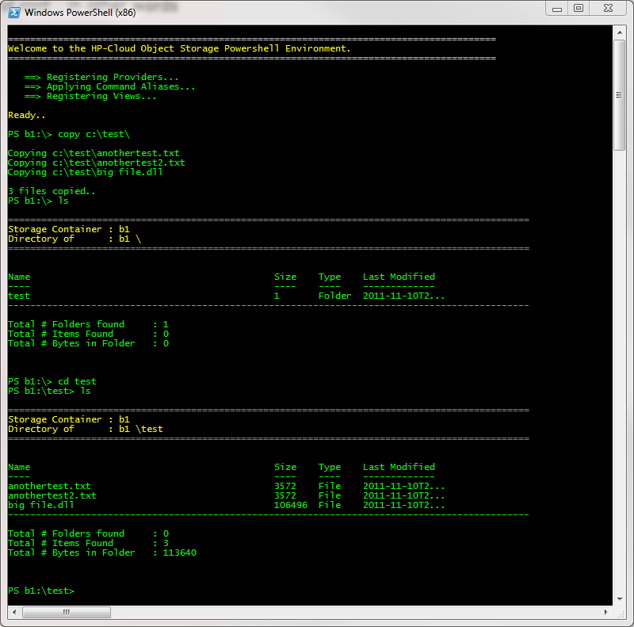-->

**Example: Local-to-Server Copy (Recursive)**

Here's another example of a Local to Remote copy but this time we will push an entire hierarchy of folders as shown below.

    PS b1:\> copy c:\test\ -recurse
    
    Copying c:\test\anothertest.txt
    Copying c:\test\anothertest2.txt
    Copying c:\test\big file.dll
    Copying c:\test\d1\anothertest.txt
    Copying c:\test\d1\d2\anothertest2.txt
    Copying c:\test\d1\d2\d3\anothertest.txt
    Copying c:\test\SomeFolder\DLEEeula.txt
    Copying c:\test\SomeFolder\DLEEeual_WEB.txt
    Copying c:\test\SomeFolder\DLEEinsr.dll
    Copying c:\test\SomeFolder\DLEEjswr.dll
    Copying c:\test\SomeFolder\AnotherFolder\DLEEjswr.dll
    Copying c:\test\SomeFolder\AnotherFolder\OneMoreFolder\DLEEeula.txt
    Copying c:\test\SomeFolder\AnotherFolder\OneMoreFolder\DLEEjswr.dll
    Copying c:\test\This\bigfile.dll
    Copying c:\test\This\CallResult.cs
    Copying c:\test\This\CLI.config
    Copying c:\test\This\ContainerService.wsdl
    Copying c:\test\This\ExampleXML.xml
    Copying c:\test\This\ExceptionFactory.cs
    Copying c:\test\This\Hp Scalene SDK.vsmdi
    Copying c:\test\This\HP.Scalene.SDK.sln
    Copying c:\test\This\HP.Scalene.SFK.suo
    Copying c:\test\This\JSONContent.cs
    Copying c:\test\This\SwiftExample.txt
    Copying c:\test\This\test.xml
    Copying c:\test\This\XMLContnet.cs
    Copying c:\test\This\yp.txt
    
    ------------------------------------------------------------------------------------------------------
    Operation Summary
    ------------------------------------------------------------------------------------------------------
    Total Files Copied : 27
    Total Bytes Copied : 372650
    
<!--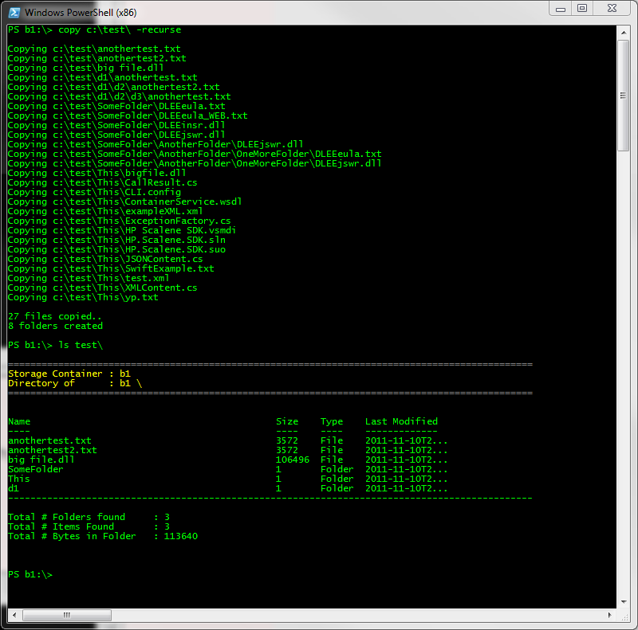-->

**Example: Server-To-Local Copy**

Now for the sake of completeness, let's throw this entire set of folders back to the client

    PS b1:\> ls test\
    
    
    ------------------------------------------------------------------------------------------------------
    Storage Container : b1
    Directory of      : b1 \
    ------------------------------------------------------------------------------------------------------
            

    Name										Size    Type    Last Modified
    ----										----    ----    -------------
    anothertest.txt								3572    File    2011-09-10T2…
    anothertest2.txt							3572    File    2011-09-10T2...
    big file.dll								106496  File    2011-09-10T2...
    SomeFolder									1       Folder  2011-09-10T2...
    This										1       Folder  2011-09-10T2...
    d1											1       Folder  2011-09-10T2...
    ------------------------------------------------------------------------------------------------------
    
    Total # folders found     : 3
    Total # Items Found       : 3
    Total # Bytes in Folder   : 113640
    
    
    PS b1>\> copy test\ c:\incoming\ -recurse
    
    Copying test/anothertest.txt
    Copying test/anothertest2.txt
    Copying test/big file.dll
    Copying test/SomeFolder/DLEEeula.txt
    Copying test/SomeFolder/DLEEeual_WEB.txt
    Copying test/SomeFolder/DLEEinsr.dll
    Copying test/SomeFolder/DLEEjswr.dll
    Copying test/SomeFolder/AnotherFolder\DLEEjswr.dll
    Copying test/SomeFolder/AnotherFolder\OneMoreFolder\DLEEeula.txt
    Copying test/SomeFolder/AnotherFolder\OneMoreFolder\DLEEjswr.dll
    
    ------------------------------------------------------------------------------------------------------
    Operation Summary
    ------------------------------------------------------------------------------------------------------
    Total Files Copied : 10
    Total Bytes Copied : 127630
    
<!--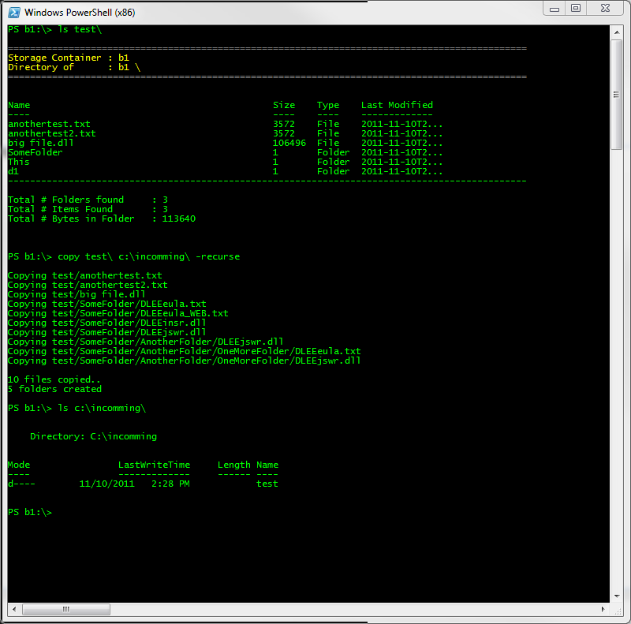-->

Done...

Now let's make sure that we can move these folders around on the server.
    
    PS b1>\> md testIncoming
    PS b1:\> copy test\ testIncoming\ -recurse
    
    Copying test/anothertest.txt
    Copying test/anothertest2.txt
    Copying test/big file.dll
    Copying test/SomeFolder/DLEEeula.txt
    Copying test/SomeFolder/DLEEeual_WEB.txt
    Copying test/SomeFolder/DLEEinsr.dll
    Copying test/SomeFolder/DLEEjswr.dll
    Copying test/SomeFolder/AnotherFolder\DLEEjswr.dll
    Copying test/SomeFolder/AnotherFolder\OneMoreFolder\DLEEeula.txt
    Copying test/SomeFolder/AnotherFolder\OneMoreFolder\DLEEjswr.dll
    
    ------------------------------------------------------------------------------------------------------
    Operation Summary
    ------------------------------------------------------------------------------------------------------
    Total Files Copied : 10
    Total Bytes Copied : 207560
    
<!--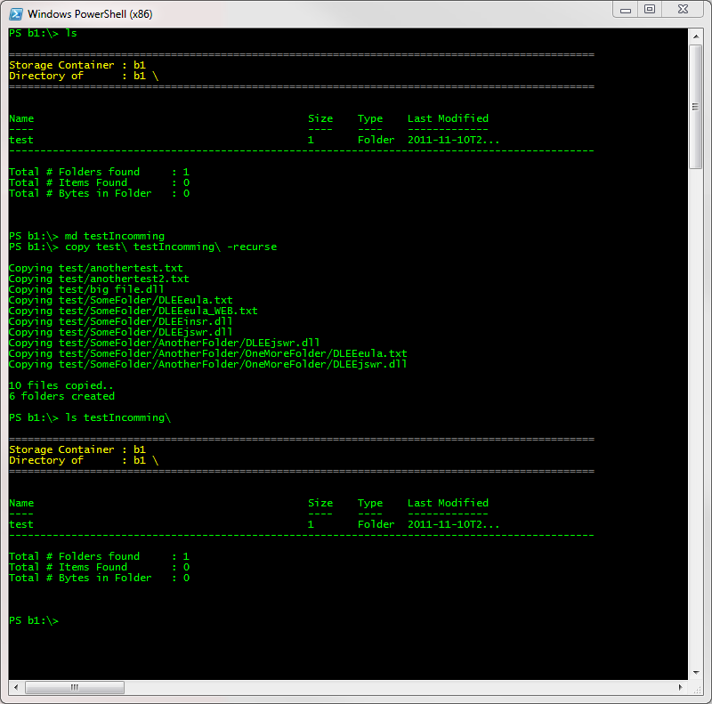-->

##Deleting Folders## {#DeletingFolders}

Finally, when we're done with a folder we can simply remove it. Note that when you delete a folder, all of its contents are deleted along with any child folders as well.

    PS b1:\> ls
    
    
    ------------------------------------------------------------------------------------------------------
    Storage Container : b1
    Directory of      : b1 \
    ------------------------------------------------------------------------------------------------------
            

    Name										Size    Type    Last Modified
    ----										----    ----    -------------
    test										1       Folder  2011-09-10T2…
    testIncoming								1       Folder  2011-09-10T2…
    ------------------------------------------------------------------------------------------------------
    
    Total # folders found     : 2
    Total # Items Found       : 0
    Total # Bytes in Folder   : 0
    
    
    PS b1>\> del test\
    PS b1:\> del testIncoming\
    PS b1:\> ls
    
    ------------------------------------------------------------------------------------------------------
    Storage Container : b1
    Directory of      : b1 \
    ------------------------------------------------------------------------------------------------------
            
            
    Total # folders found     : 0
    Total # Items Found       : 0
    Total # Bytes in Folder   : 0
    
        
    PS b1:\>

<!--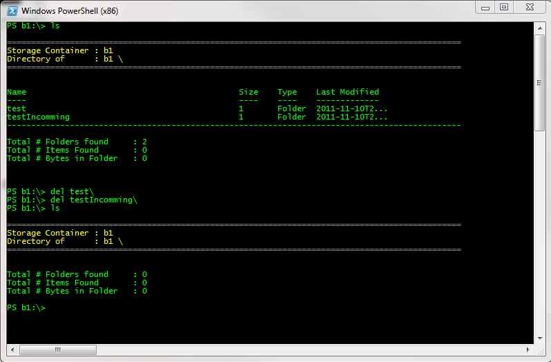-->

##Working with MetaData## {#WorkingwithMetaData}

When required, you have the ability to store user defined meta-data along with the objects placed within a Container. This is accomplished with the  set-metadata cmdlet. Input values for this parameter are a series of one to many key value pairs. Each Key Value pair must be enclosed in quotes and separated by the Pipe (|) character. Individual Key Values Pairs are delimited by a comma. For example..

    PS b1:\> set-metadata anothertest.txt -md "author|Travis", "priority|high"
    PS b1:\> get-metadata anothertest.txt
    ------------------------------------------------------------------------------------------------------
    Meta-Data for anothertest.txt is as follows.    
    ------------------------------------------------------------------------------------------------------
    
    Key   = Priority
    Value = high
    --------------------------------
    Key   = Author
    Value = Travis
    --------------------------------
    
    PS b1:\>
    
<!--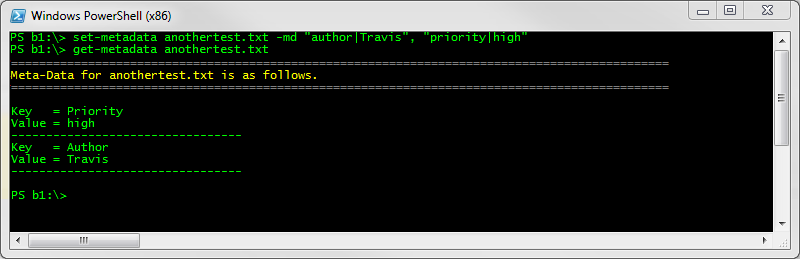-->

In addition, you can also see how one would view meta-data on an existing object with the Get-MetaData command. 

##Changing Response Formats## {#ChangingResponseFormats}

Each command that you issue through the Provider or through a cmdlet will write out the response returned from the server in an easy to understand, human readable format. For a command line tool, this is the behavior one would expect. The CLI can also reformat each response
depending on your need. This is accomplished through the Set-Format cmdlet. With this cmdlet you can specify the response to be one of three formats

+ Data (the default)
+ XML
+ JSON

This cmdlet will take effect for the duration of the Session only.

**Example: XML Based Responses**

This example shows how we can quickly produce an XML file of what we find in the test folder. In addition, output received from cmdlets adhere to the format as well. Note
the response of the "ls" command.

    ------------------------------------------------------------------------------------------------------
    Welcome to the HP-Cloud Object Storage Powershell Environment.
    ------------------------------------------------------------------------------------------------------

      ==> Registering Providers. . .
      ==> Applying Command Aliases. . .
      ==> Registering Views. . .
    
    Ready. . .
    
    PS b1:\> ls
    
    ------------------------------------------------------------------------------------------------------
    Storage Container : b1
    Directory of      : b1 \
    ------------------------------------------------------------------------------------------------------
            

    Name										Size    Type    Last Modified
    ----										----    ----    -------------
    anothertest.txt								3572    Folder  2011-09-10T2…
    ------------------------------------------------------------------------------------------------------
    
    Total # folders found     : 1
    Total # Items Found       : 1
    Total # Bytes in Folder   : 3572
    
    
    PS b1>\> set-format -rf XML
    
    Response format set to SML.
    
    PS b1:\> ls
    
    ------------------------------------------------------------------------------------------------------
    Storage Container : b1
    Directory of      : b1 \
    ------------------------------------------------------------------------------------------------------
            
            
    <?xml version="1.0">
    <container xmlns:xsi="http://www.w3.org/2001/XMLSchema-instance" xmlns:xsd="http://www.w3.org/2001/XMLSchema">
      <FolderNames />
      <object>
        <name>anothertest.txt</name>
        <content_type>text/plain</content_type>
        <ObjectType>File</ObjectType>
        <StorageObjectType>File</StorageObjectType>
        <ResponseDate>0001-01-01T00:00:00</ResponseDate>
        <IsDeleted>False</IsDeleted>
        <bytes>3572</bytes>
        <last_modified>2011-11-10T20:59:32.457171</last_modified>
        <hash>1d9ce6c7e631662b3268c35416fa76aa</hash>
        <Key>anothertest.txt</Key>
      </object>
    </container>
        
    PS b1:\>

<!--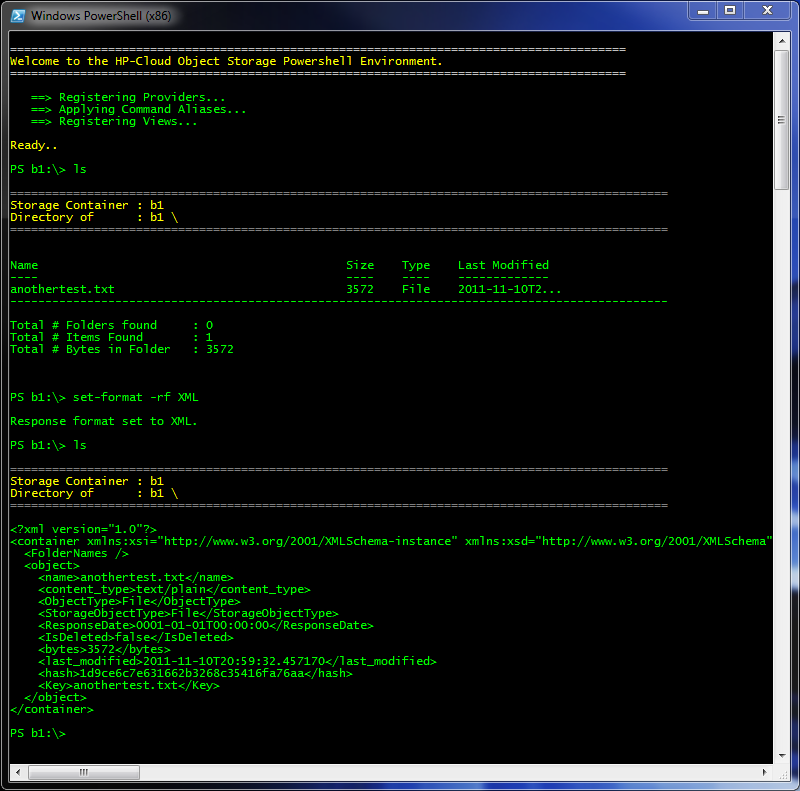-->

A quick JSON example.

    PS b1:\> set-format -rf JSON
    
    Response format set to JSON
    
    PS b1:\>> ls
    
    ------------------------------------------------------------------------------------------------------
    Storage Container : b1
    Directory of      : b1 \
    ------------------------------------------------------------------------------------------------------
    
    {"FolderNames":[],"list":[{"ContentType":"text\/plain","ETag":"1d9ce6c7e631662b3268c35416fa76aa","ExtendedProtocol"}]}
    
    PS b1:\> ls        
    
    ------------------------------------------------------------------------------------------------------
    Storage Container : b1
    Directory of      : b1 \
    ------------------------------------------------------------------------------------------------------

    Name										Size    Type    Last Modified
    ----										----    ----    -------------
    anothertest.txt								3572    File    2011-09-10T2…
    ------------------------------------------------------------------------------------------------------
    
    Total # folders found     : 0
    Total # Items Found       : 1
    Total # Bytes in Folder   : 3572
    
        
    PS b1:\> ls

<!--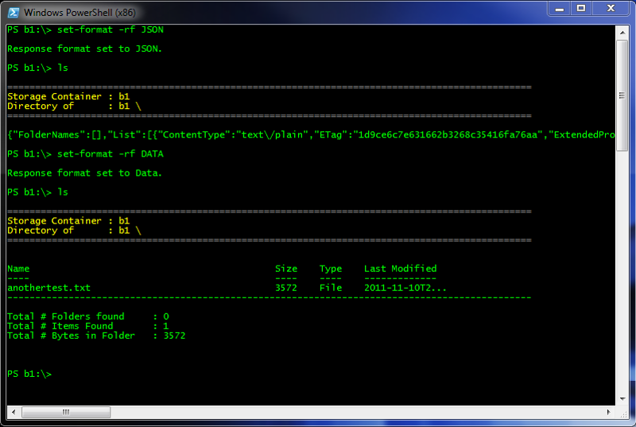-->

##Changing Configuration Files## {#ChangingConfigurationFiles}

This system persist its settings in the CLI.config file located in the users application directory. This file is important as it's used for storing Credentials, connection information such as addresses and timeout values, and various other settings. Each time the shell loads, this file is opened and it's settings are used throughout the session. There may be times when you wish to temporarily change these settings to accommodate impersonation, environment change (Pro, QA etc) or other testing scenarios. This can be done in one of two ways:

+ Per item 
+ Per Configuration

First, to see what the current configuration you are running under use the Get-Config cmdlet.  Assume that connectivity issues have required us to increment the http timeout period for each connection. This specific value can be altered via the Set-Config cmdlet.

    PS b1:\> get-config
    
    ------------------------------------------------------------------------------------------------------
    Current Session Settings are as follows.
    ------------------------------------------------------------------------------------------------------
    
    Configuration file located at C:\Users\Paybackman\Documents\HP\CLI.config
    
    Name							Value
    ----							-----
    TeststorageContainer			testcom
    AuthKey
    delimiter						/
    TeststorageContainerSecondary	b10
    StorageManagementURI			https://region-a.geo-1.objects.hpcloudsvc.com/auth/v1.0/
    HttpTimeoutInterval				2000
    AuthUser
    Host							https://region-a.geo-1.objects.hpcloudsvc.com/auth/v1.0/
    PasteGetURIResultsToClipboard	true
    TestFilePath					c:\documentst\anothertest.txt
    max-keys						1000
    
    PS b1:\> set-config -k "HttpTimeoutInterval" -v "100"
    PS b1:\> get-config
    
    ------------------------------------------------------------------------------------------------------
    Current Session Settings are as follows.
    ------------------------------------------------------------------------------------------------------
    
    Configuration file located at C:\Users\Paybackman\Documents\HP\CLI.config
    
    Name							Value
    ----							-----
    TeststorageContainer			testcom
    AuthKey
    delimiter						/
    TeststorageContainerSecondary	b10
    StorageManagementURI			https://region-a.geo-1.objects.hpcloudsvc.com/auth/v1.0/
    HttpTimeoutInterval				100
    AuthUser
    Host							https://region-a.geo-1.objects.hpcloudsvc.com/auth/v1.0/
    PasteGetURIResultsToClipboard	true
    TestFilePath					c:\documentst\anothertest.txt
    max-keys						1000
    
        
    PS b1:\> ls        

<!--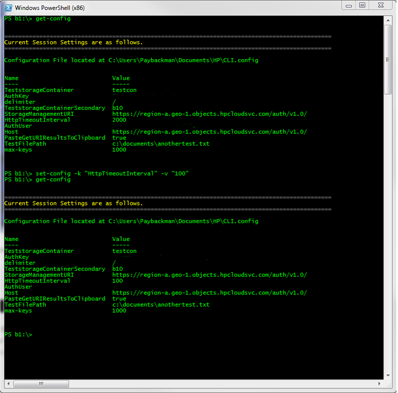-->

If you want to revert back to the defaults as defined in your CLI.config file just issue the following command.

           Set-config -resetcfg

In addition to changing individual configuration items, you can also swap in entire full configuration environments by inserting a new configuration file with the **`set-config -s**` command.  This is useful if you are using multiple environments at your site--for example, you have a set of credentials that you use for development, but a different set of credentials for performing testing.  Substituting in a different config file gives you a quick way to switch back and forth between those environments. 

When you set to a new config file and the new file contains different credentials, you have to re-evaluate the list of Containers that the current user has access to. Changing your credentials is equivalent to changing your identity, and you may own just a small subset of Containers after the change. In this example you can see this rebinding in action.

    PS dogs:\> get-config
    
    ------------------------------------------------------------------------------------------------------
    Current Session Settings are as follows.
    ------------------------------------------------------------------------------------------------------
    
    Configuration file located at C:\Users\tplummer\Documents\HP\CLI.config
    
    Name							Value
    ----							-----
    LocalTestDirectory				e:\Projects\Testing\
    TestFilePath					e:\Projects\Testing\Anothertest.txt
    PasteGetURIResultsToClipboard	false
    DefaultTenantId					13696299374008
    TeststorageContainerSecondary	b10
    max-keys						10000
    HttpTimeoutInterval				15000
    AccessKey						***********
    TeststorageContainer			testcon
    AuthenticationServiceURI		https://csnode.systest2.aw1.hpcloud.net:35357/v2.0/tokens
    SecretKey						***********
    delimiter						/
    ReleaseNotesURI					https://region-a.geo-1.objects.hpcloudsvc.com:443/v1/AUTH_2485a207-71a4-4429-9e24-
    
    
    PS b1:\> set-config -s C:\Projects\HPCloud\DotNetSDK\HPCloud.Client.Powershell\HPCloud.Client.Powershell\Deploy
    PS b1:\> get-config
    
    ------------------------------------------------------------------------------------------------------
    Binding to new Account. New service catalog is as follows.
    ------------------------------------------------------------------------------------------------------
    
    Type				Name					Provider Name
    ----				----					-------------
    hpext:cdn			CDN						Unknown
    object-store		Object Storage			HP-ObjectStorage
    identity			Identity				Unknown
    image				Image Management		Unknown
    Volume			Block Storage			Unknown
    compute				Compute					HPCloud-ComputeDrive
    
    ------------------------------------------------------------------------------------------------------
    Object Storage Services available. Rempapping to the following drives.
    ------------------------------------------------------------------------------------------------------
    
    Storage Container : ECOM-61 now available.
    Storage Container : ECOM-71 now available.
    Storage Container : ECOM-81 now available.
    Storage Container : [Invalid.container3] now available
    Storage Container : [Sya2_QA_Container3] now available
    Storage Container : [Sya2_QA_Conttainer6] now available
    Storage Container : [Sya2_node1_Container5] now available
    Storage Container : [Sya2_node1_Container6] now available
    Storage Container : [Systest2-CDN-3] now available
    Storage Container : [Systest2-CDN-4] now available
    Storage Container : [testtest] now available
    Storage Container : [yQAContainer6] now available
    Storage Container : [yQAContainer8] now available
    
    PS dogs:\>    

<!--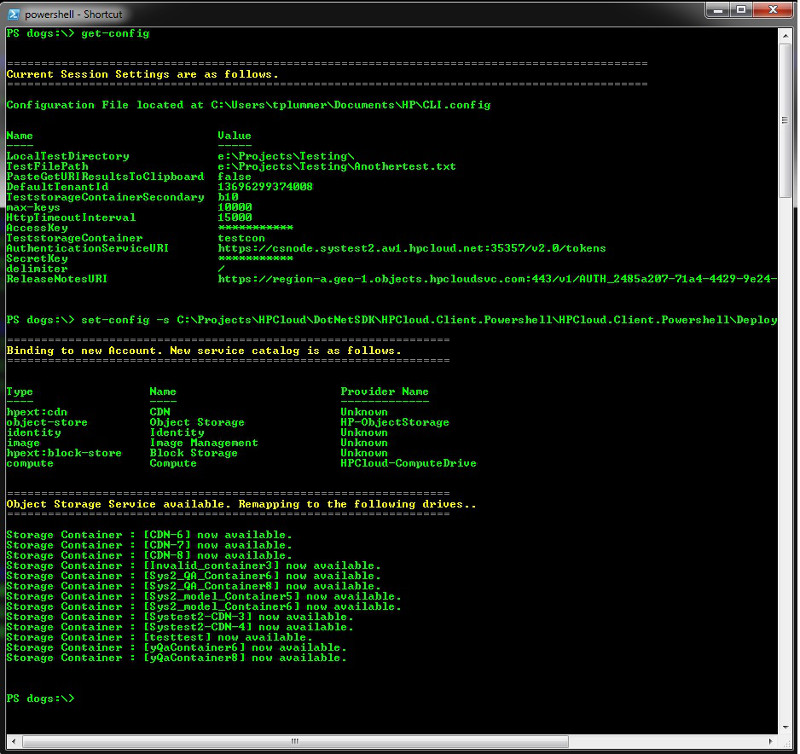-->

##Viewing Your Service Catalog## {#ViewingYourServiceCatalog}

If you want to take a look at your service catalog--for example, if you have modified some of your configuration credentials, and have authenticated them--you can use the **`get-config -v**` command, as shown below: 

    PS dogs:\> get-catalog
    
    ------------------------------------------------------------------------------------------------------
    You have access to the following services.
    ------------------------------------------------------------------------------------------------------
    
    Type				Name					Provider Name
    ----				----					-------------
    hpext:cdn			CDN						Unknown
    object-store		Object Storage			HP-ObjectStorage
    identity			Identity				Unknown
    image				Image Management		Unknown
    volume			Block Storage			Unknown
    compute				Compute					HPCloud-ComputeDrive
    
    PS dogs:\> get-catalog -v
    
    ------------------------------------------------------------------------------------------------------
    You have access to the following services.
    ------------------------------------------------------------------------------------------------------
    
    ------------------------------------------------------------------------------------------------------
    Service : CDN
    ------------------------------------------------------------------------------------------------------
    
    General
    
    Name			: CDN
    Type			: hpext:cdn
    Provider Name	: Unknown
    
    Associated Endpoints
    
    Region			: region-a.geo-1
    Public URL		: https://cdnmgmt.systest2.aw1.hpcloud.net/v1.0/AUTH_ed097cde-cb84-4d72-b37e-a4be48c98d0
    Internal URL	:
    Admin URL		:
    Version			: 1.0
    Version Info	:
    Version List	:
    
    ------------------------------------------------------------------------------------------------------
    Service : Object Storage
    ------------------------------------------------------------------------------------------------------
    
    General
        
    Name			: Object Storage
    Type			: object-store
    Provider Name	: HP-ObjectStorage
    
    Associated Endpoints
    
    Region			: region-a.geo-1
    Public URL		: https://cdnmgmt.systest2.aw1.hpcloud.net/v1.0/AUTH_ed097cde-cb84-4d72-b37e-a4be48c98d0
    Internal URL	:
    Admin URL		: https://objects.systest2.aw1.hpcloud.net/v1.0/
    Version			: 1.0
    Version Info	:
    Version List	:
    
    PS dogs:\> get-catalog

<!---->

This command provides you with all the service catalog information for your most-currently authenticated credential set.

##Finding an Object's Location## {#FindinganObjectsLocation}

The contents of the Object store are URI addressable given that you have the proper permissions to view the resource. If you would like a quick way to load the object into your browser, a fully qualified URI can be obtained with the [Get-Uri cmdlet](/cli/windows/reference#Get-Uri).

    ------------------------------------------------------------------------------------------------------
    Welcome to the HP-Cloud Object Storage Powershell Environment.
    ------------------------------------------------------------------------------------------------------
    
      ==> Registering Providers. . .
      ==> Applying Command Aliases. . .
      ==> Registering Views. . .
    
    Ready. . .
    
    PS b1:\> ls
    
    ------------------------------------------------------------------------------------------------------
    Storage Container : b1
    Directory of      : b1 \
    ------------------------------------------------------------------------------------------------------

    Name										Size    Type    Last Modified
    ----										----    ----    -------------
    anothertest.txt								3572    File    2011-09-10T2…
    ------------------------------------------------------------------------------------------------------
    
    Total # folders found     : 0
    Total # Items Found       : 1
    Total # Bytes in Folder   : 3572
    
        
    PS b1:\> get-uri anothertest.txt
    
    Object located at: https://region-a.geo-1.objects.hpcloudsvc.com:443/v1/AUTH_ed097cde-cb84-4d72-b37e-a4be48c98d0
    
    PS b1:\>

<!--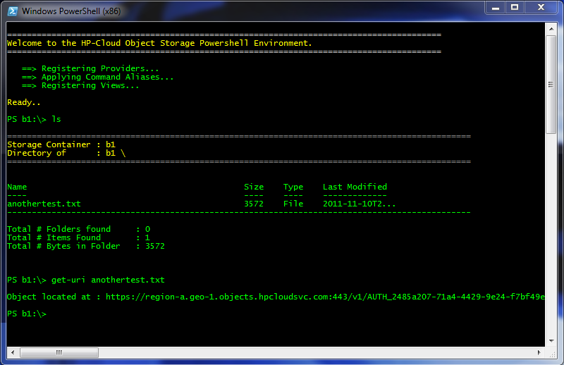-->

Note : When you issue this command the URI is also pasted to the Windows clipboard for your convenience. If you want to disable this behavior simply set the CLI.config option entitled PasteGetURIResultsToClipboard to false.

##Adding and Removing Drives## {#AddingandRemovingDrives}

There are times when you want to add or remove a drive from your list of available drives when it owned by another user.  To perform these actions, you can use the [new-container](/cli/windows/reference#New-Container) and [remove-container](/cli/windows/reference#Remove-Container) cmdlets.

To add a Container that someone else owns to your list of available drives:

    new-container https://objects.werr.net:443/v1/9153476658759/rgtest2
    
This adds the container `rgtest2` to your list of available drives.  To remove the container from your list:

    remove-container rgtest2

##Getting Version Information## {#GettingVersionInformation}

It may be useful at times to know what version of the product you are using. Just issue the Get-Version command to get the main assembly location, product and CLR version.

    ------------------------------------------------------------------------------------------------------
    Welcome to the HP-Cloud Object Storage Powershell Environment.
    ------------------------------------------------------------------------------------------------------
    
      ==> Registering Providers. . .
      ==> Applying Command Aliases. . .
      ==> Registering Views. . .
    
    Ready. . .
    
    PS demo:\> get-version
    
    Assembly Location 	: C:\Projects\Outgoing\HP\HPCloud.Client.Powershell.fll
    Product Version		: 1.0.0.0
    CLR Version			: v4.0.30319
            
<!--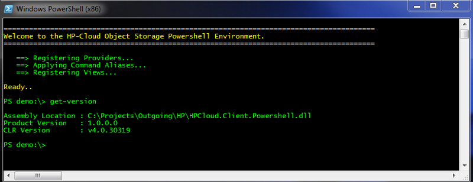-->

##Using Another User's Credentials## {#UsingAnotherUsersCredentials}

If you want to use the credentials of a particular user for a session ("imitating" that user), you can use the command **` set-credentials**`.  The **` set-credentials**` command allows you to define the access key, secret key, and tenant key for a session:

        set-credentials -ak Access-Key -sk Secret-Key -t Tenant-ID

Where you choose your desired values for `**Access-Key`**, `**Secret-Key`**, and `**Tenant-ID`**.

##Viewing the Release Notes## {#ViewingtheReleaseNotes}

The `Get-Notes` command gives you the ability to view release notes for the current version (no arguments), a specific version (-v), or all past versions of the product (-all).

    ------------------------------------------------------------------------------------------------------
    Welcome to the HP-Cloud Object Storage Powershell Environment.
    ------------------------------------------------------------------------------------------------------
    
      ==> Registering Providers. . .
      ==> Applying Command Aliases. . .
      ==> Registering Views. . .
    
    Ready. . .
    
    PS demo:\> get-notes
    ------------------------------------------------------------------------------------------------------
    Version	: 1.0.0.0
    Notes	:
    	 New Fixes
    	 
    	 * it worked
    	 * oieurd iphhrf oiuowio
    	 * iouioutrf t6r trtrerter
    	 
    	 New Features
    	 
    	 * eeeeehrfivuhewu
    	 * iuyquwehihi ioujiwirf oiuowio
    	 * iouioutrf t6r trtrerter
    	 
    PS demo:\> get-notes -v 1.0.0.4
    ------------------------------------------------------------------------------------------------------
    Version	: 1.0.0.4
    Notes	:
    	 New Fixes
    	 
    	 * wqqqqqqqqqqqqqqqqqqqu
    	 * iuqqqqqqqqq iofghdirf oiwowio
    	 * ipuioutrf t6r  trsdfgddddddder
    	 
    	 New Features
    	 
    	 * wiodoiajagoedklaglk;ja
    	 * lkadafkdsj; ldkjflkiekkd ioiowkdlks
    	 * laoiab laltl lalkdljafdk
    	 
    PS demo:\> get-notes all
    ------------------------------------------------------------------------------------------------------
    Version	: 1.0.0.0
    Notes	:
    	 New Fixes
    	 
    	 * it worked
    	 * oieurd iphhrf oiuowio
    	 * iouioutrf t6r trtrerter
    	 
    	 New Features
    	 
    	 * eeeeehrfivuhewu
    	 * iuyquwehihi ioujiwirf oiuowio
    	 * iouioutrf t6r trtrerter
    
    ------------------------------------------------------------------------------------------------------
    Version	: 1.0.0.4
    Notes	:
    	 New Fixes
    	 
    	 * wqqqqqqqqqqqqqqqqqqqu
    	 * iuqqqqqqqqq iofghdirf oiwowio
    	 * ipuioutrf t6r  trsdfgddddddder
    	 
    	 New Features
    	 
    	 * wiodoiajagoedklaglk;ja
    	 * lkadafkdsj; ldkjflkiekkd ioiowkdlks
    	 * laoiab laltl lalkdljafdk
    	 
    PS demo:\> 

<!--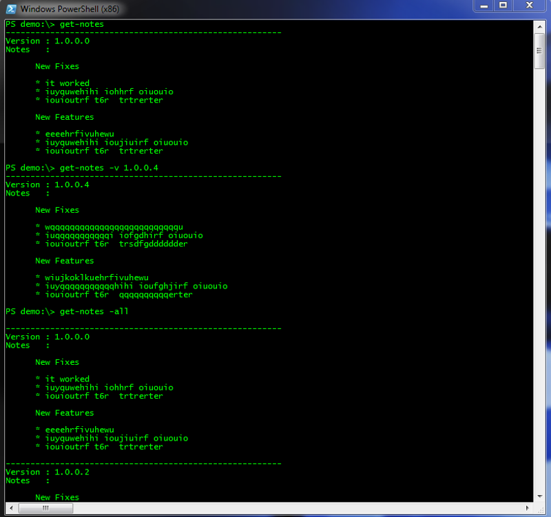-->

##Migrating Your Files From Another Storage System## {#MigratingYourFiles}

The Migrate-Drive command gives you the ability to migrate your data from a non-HP Cloud storage system such as Amazon S3, Dropbox, or Microsoft Skydrive into the HP Cloud system easily and quickly.  This example uses Amazon S3 buckets.  To move the TLPRoot and TLPTest2 Buckets in S3 and the TLPTest2 Bucket contained MikeConfig.txt and NewHelp.text files to the HP Cloud system:

    ------------------------------------------------------------------------------------------------------
    Welcome to the HP-Cloud Object Storage Powershell Environment.
    ------------------------------------------------------------------------------------------------------
    
      ==> Registering Providers. . .
      ==> Applying Command Aliases. . .
      ==> Registering Views. . .
    
    Ready. . .
    
    PS testcon2:\> migrate-drive "S3" -ak "SampleIn" -sk "SampleOut"
    
    ---------------------------------
    Processing Bucket : TLPRoot
    ---------------------------------
    
    Copying file 00322980.vmf
    Copying file 00476382.jpg
    Copying file 00489201.vmf
    Copying file 00489311.png
    Copying file 00574639.vmf
    Copying file 00643531.vmf
    Copying file 00736251.vmf
    Copying file 00847362.vmf
    Copying file NewDoc.xml
    
    Files Copied : 9
    Bytes Copied : 1007455
    
    ---------------------------------
    Processing Bucket : TLPTest2
    ---------------------------------
    
    Copying file MikeConfig.txt
    Copying file NewHelp.txt
    
    Files Copied : 2
    Bytes Copied : 17545
    
    ---------------------------------
    Operation Summary
    ---------------------------------
    
    Total Files Copied : 11
    Total Bytes Copied : 1025000
    
    PS testcon2:\>

<!--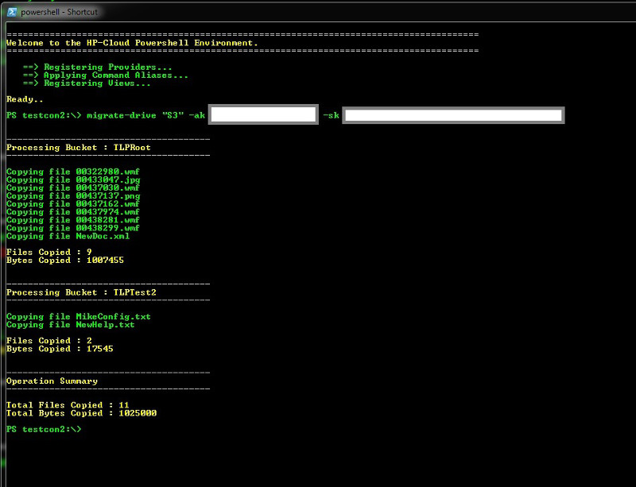-->

The `-sk` option is your API secret key, and the `-ak` option is your access key.

For additional information on this command, see Travis' [Migrating your files with the Windows CLI](https://blog.hpcloud.com/migrating-your-files-windows-cli) blog post.  For a full description of the options available with the **Migrate-Drive** command, please see the [Migrate-Drive](/cli/windows/reference#Migrate-Drive) section of the [Windows CLI Reference](/cli/windows/reference) page.
