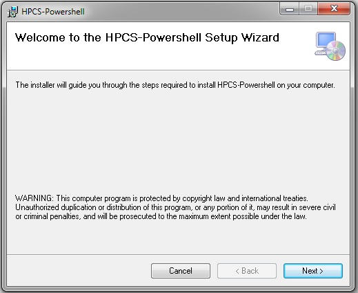
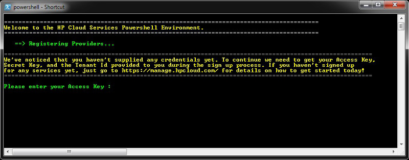
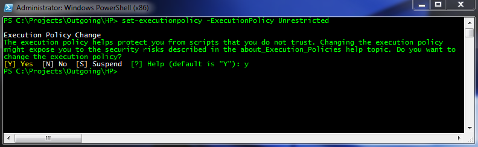

# Windows CLI: Installation

To get the Object Storage Powershell environment running properly you must complete the following tasks:

<!--+  Run the Installer package-->

*  [Run the installer package](#RunningtheInstallerPackage)
*  [Supply your credentials](#SupplyingyourCredentials)
*  [Set the required execution policy](#SettingtheRequiredExecutionPolicy)
*  [Load the shell and register the module](#LoadingtheShellandModuleRegistration)

This page also describes how to [upgrade to a new version](#Upgrading) of the Windows CLI software.

[Please download the latest version of the Windows PowerShell CLI software here](https://docs.hpcloud.com/file/WinCLI-1.3.1.9.zip)!

##Installation Prerequisites## {#Installation}

**Note** : This product requires the full (not client profile) 4.0 or higher version of the Microsoft .NET Framework to install properly which can be downloaded [here](http://www.microsoft.com/net/).
 
##Running the Installer Package## {#RunningtheInstallerPackage}

[Download the latest Windows Powershell Installer package](https://docs.hpcloud.com/file/WinCLI-1.3.1.9.zip).  (See the [Release Notes](/cli/windows/release-notes) for details on the current release.)

Launching the Windows installer package loads the following wizard.

Click the `Next` button; the next window allows you to select your installation folder:

Unless you need to have the installation files reside in a different folder, we recommend you just stay with the defaults and click `Next`, which takes you to the installation confirmation window:

The installation now proceeds on your system.

**NOTE**: Always use the powershell.exe appropriate for your OS. For 64bit systems, use the file located under \SysWOW64\, for 32bit systems, under \System32\ .

##Supplying your Credentials## {#SupplyingyourCredentials}

The first time that you run the shell you must supply the access key, secret key, and tenant ID that was assigned to you during the registration process; you can [find these in the system console](https://console.hpcloud.com/account/api_keys) by selecting `API Keys` on the dashboard or account page.  

The shell detects that this is your first time logging in and prompts you for these items. When verified they get reused the next time you open the shell.

    ===============================================================
    Welcome to the HP Cloud Services Powershell Environment.
    ===============================================================
    
       --> Registering Providers. . .
    
    ------------------------------------------------------------------------------------------------------
    We've noticed that you haven't supplied any credentials yet. To continue we need to get your Access Key,
    Secret Key, and the Tenant Id provided to you during the sign up process. If you haven't signed up
    for any services yet, just to go https://console.hpcloud.com for details on how to get started today!
    ------------------------------------------------------------------------------------------------------
    
    Please enter your Access Key :

<!---->

##Setting the Required Execution Policy## {#SettingtheRequiredExecutionPolicy}

Now that you have installed the required files, make sure that your Powershell environment is capable of executing 3rd party modules. Do this by issuing the *Set-ExecutionPolicy* command like so with a *set-executionpolicy -ExecutionPolicy Unrestricted*:

    PS C:\Projects\Outgoing\HP> set-executionpolicy -ExecutionPolicy Unrestricted
    
    Execution policy change
    The execution policy helps protect you from scripts that you do not trust. Changing the execution policy
    might expose you to the security risks described in the about_Execution_Policies help topic. Do you want to
    change the execution policy?
    [Y] Yes  [N] No  [S] Suspend  [?] Help (default is "Y"): y
    PS C:\Projects\Outgoing\HP> 

<!---->

Close the Powershell window and reopen as administrator for the policy changes to take affect.

##Loading the Shell and Module Registration## {#LoadingtheShellandModuleRegistration}

If you have installed the software through the installer package, registration happens automatically through a supplied Powershell Profile. If the profile was not used, you must move to 
the install folder specified while in the setup wizard. From there you can register the module with Import-Module .\Climanifest.psd1. Note that this only last for the duration of the Powershell session and it's recommended to add this command to your Profile for best results.

##Upgrading to a New Version## {#Upgrading}

When you upgrade to a new version of the Windows PowerShell CLI, you must first de-install the previous version of the software.  You can do this using the Windows `Add/Remove Programs` or `Programs and Features` utility (depending on the version of Windows you're using).  Search through the listing of programs for "HPCS-Powershell" and remove it.  

Once you have unistalled the previous revision, simply follow the instructions above to install the latest version, and you're be good to go!