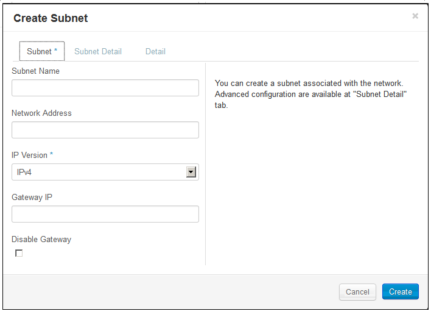
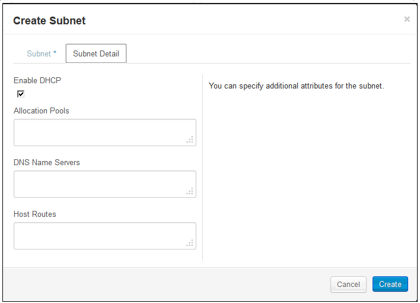

# Creating Your First Network - 13.5 #

<!-- Modeled after How To's with the Compute Service (https://docs.hpcloud.com/compute/using/) Some text from network guide. -->

As you get used to using the compute service, you might need to modify the default network or create additional networks.  This page gives you some how-to's for the following tasks: 
 
* Define and configure your own private virtual networks

* Specify IP addressing for those networks 

* Configure security group parameters that define the firewall rules for virtual servers

* Allocate and manage public floating IP addresses

You can use the the Horizon Cloud Console, the HP Cloud CLI, or the HP Cloud Compute Service API to customize a network configuration.  

## Using the Horizon Cloud Console ## 

You can use the Horizon Cloud Console to perform the following tasks:

* Create a network
* Manage a network
* Delete a network
* View network, subnet, and router details

### How to create a network ###

1. Login to the [Horizon Console](https://horizon.hpcloud.com/).

2. Select the Networks tab under the Project section:
     

3. Click **Create Network**. 
	 

4. On the **Network** tab, enter a name for the network.  
	 

5. Enter the following values, as appropriate:
	 

6. Enter the following values, as appropriate:
	 

7. Click **Create**.

### How to add a sub-network ###

1. Login to the [Horizon Console](https://horizon.hpcloud.com/).

2. Select the Networks tab under the Project section:
     

3. On the Networks screen, locate the network to which you want to add a subnet.

4. In the Actions column, click **More** -> **Add Subnet** for your the network. 
	 

5. Enter the following values, as appropriate:
	 

6. Enter the following values, as appropriate:
	 

7. Click **Create**.

See [the MC networking pages](/mc/compute/networks/) for more information about setting up networking using the MC.

## Using the Windows PowerShell ##

The HP Cloud environment command-line interface (CLI) software for Windows PowerShell allows Windows users to manage their HP Cloud services from the command line.

### How to create a network ###

1. On the 13.5 instance, launch a Windows PowerShell window.  

	Select the shell appropriate to your system, either the 64-bit or 32-bit version. 

2. Enter the HP Cloud environment CLI by entering:

	`PS C:> cd HPCS:`

3. Create a new network by executing the following command, using the appropriate values:

	`new-network -n Name - asu AdminStateUp`

	Where:

		n - The name of new Network.

		asu - Determines if the `AdminStateUp` flag is true or false.

	The following example creates a new network named `testNet1` with AdminStateUp set to `true`.
	
		new-network "testNet1" -asu 

### How to create a sub-network ###

1. On the 13.5 instance, launch a Windows PowerShell window.  

	Select the shell appropriate to your system, either the 64-bit or 32-bit version. 

2. Enter the HP Cloud environment CLI by entering:

	`PS C:> cd HPCS:`

3. Create a new network by executing the following command, using the appropriate values:

	`new-subnet -nid NetworkID -ipv IPVersion -c CIDRValue -a AllocationPools`

	Where:

		nid - Subnet name.

		ipv - Sets the IP Version

		c - CIDR value.

		a - Lists Allocation Pools, separating them by commas.

	The following example creates a new subnet called `testSubnet`.

		new-subnet -n testSubnet -nid bd1c30f7-71f1-455e-b91e-8d03da7f5224 -ipv 4 -c "10.0.6.0/24" -a "10.0.6.20", "10.0.6.22" , "10.0.6.26", "10.0.6.29" 

### How to create a port ###

1. On the 13.5 instance, launch a Windows PowerShell window.  

	Select the shell appropriate to your system, either the 64-bit or 32-bit version. 

2. Enter the HP Cloud environment CLI by entering:

	`PS C:> cd HPCS:`

3. Create a new network by executing the following command, using the appropriate values:

	`new-port -n Name - asu AdminStateUp -nid NetworkID -did PortsDeviceID`

	Where:
	
		n - The port name.
	
		asu - Determines if the `AdminStateUp` flag is true or false.

		nid - Identifies Port Network.

		did - Identifies Port Device.

	The following example creates a new port named `testPort1` on network `bd1c30f7-71f1-455e b91e-8d03da7f5224`. 

		new-port "testPort1" -nid bd1c30f7-71f1-455e b91e-8d03da7f5224 -asu -did "sdf\etc" 

