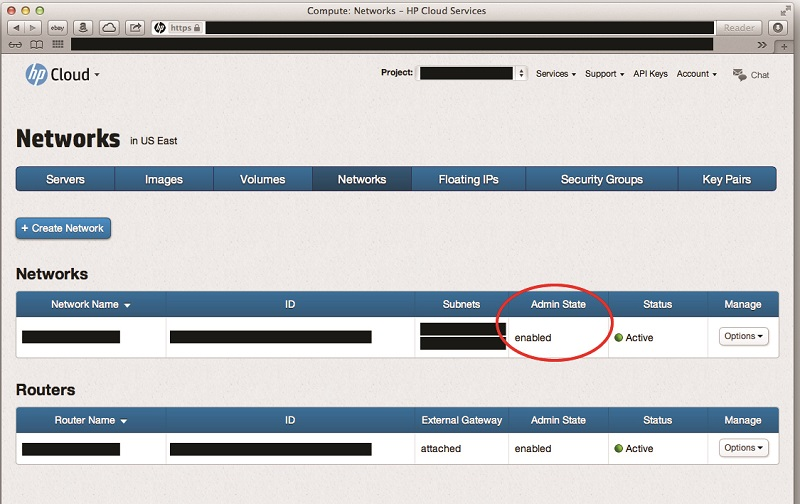
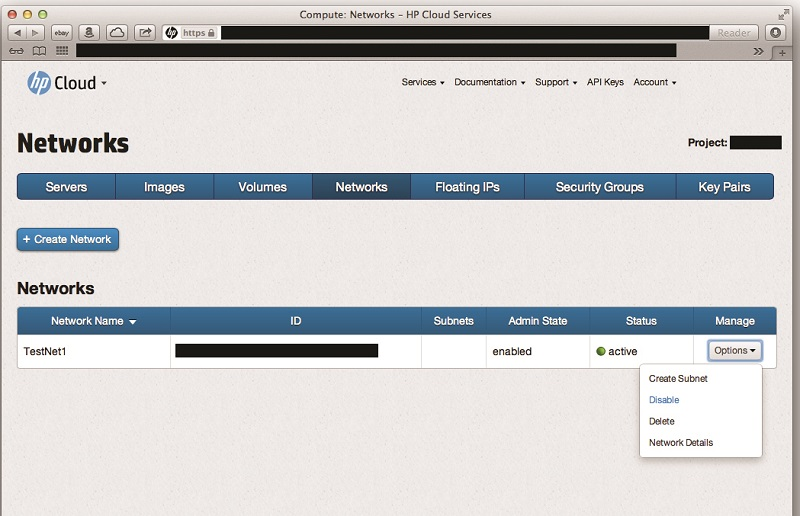

# How To's with HP Cloud Networking version 13.5

<!-- Modeled after How To's with the Compute Service (https://docs.hpcloud.com/compute/using/) Some text from network guide. -->

As you get used to using the networking service, you might need to modify the default network or create additional networks.  This page gives you some how-to's for the following tasks: 
 
* Specifying an IP address for those networks 
* Configuring security group parameters that define the firewall rules for virtual servers
* Allocating and managing public floating IP addresses

You can use the the Horizon Cloud Console, the HP Cloud CLI, or the HP Cloud Compute Service API to customize a network configuration.  

You can use the Horizon Cloud Console to perform the following tasks:

* Enabling and disabling a network
* Creating a sub-network
* Specifying an IP address
* Allocating floating IP address
* Configuring security group

##Before you begin## {#Overview}

Before you can enable or disable networks, you must:

* [Sign up for an HP Cloud compute account](https://account.hpcloud.com/signup)
* Activate compute service on your account
* [Create a network](/mc/compute/networks/create-network/)

## How to enable a network

By default, when you [create a network](/mc/compute/networks/create-network#Creating/), that network is created in an enabled admin state.  

If you have at some point [disabled](#Disabling) a network and want to enable it, in the `Manage` column of the `Networks` list, select the `Options` button and choose the `Enable` option.

<!-- Illustration of "Enable" option being selected needed here -->

##How to disable a network## {#Disabling}

By default, when you [create a network](/mc/compute/networks/create-network#Creating/), that network is created in an enabled admin state.  If you want to disable your network, in the `Manage` column of the `Networks` list, select the `Options` button and choose the `Disable` option.

## How to delete a network ##

1. Login to the [Horizon Console](https://horizon.hpcloud.com/).

2. Select the Networks tab under the Project section:
     

3. On the Networks screen, locate the network which you want to delete.

4. In the Actions column, click **More** -> **Delete Network** for your the network. 
	 

5. In the confirmation dialog, click **Delete Network**.

## How to specify an IP address ###

1. Login to the [Horizon Console](https://horizon.hpcloud.com/).

2. Select the Networks tab under the Project section:
     

3. Click **Create Network**. 
	 

4. On the **Network** tab, enter a name for the network.  
	 

5. Enter the following values, as appropriate:
	 

6. Enter the following values, as appropriate:
	 

7. Click **Create**.

<!--Can users enable/disable routers in 13.5?
##Enabling a router## {#Enabling}

When you enable the compute service, a router is enabled by default.  If you have [disabled](#Disabling) the router, to enable it, in the `Manage` column, select the `Options` button for the router you wish to disable and click the `Disable` item:

 

##Disabling a router## {#Disabling}

When you enable the compute service, a router is enabled by default.  To disable the router, in the `Manage` column, select the `Options` button for the router you wish to disable and click the `Disable` item:

-->

## Using the Windows PowerShell ##

The HP Cloud environment command-line interface (CLI) software for Windows PowerShell allows Windows users to manage their HP Cloud services from the command line.

### How to enable a network ###

By default, when you [create a network](/mc/compute/networks/create-network#Creating/), that network is created in an enabled admin state.  

###How to disable a network### {#Disabling}

By default, when you [create a network](/mc/compute/networks/create-network#Creating/), that network is created in an enabled admin state.  If you want to disable your network, in the `Manage` column of the `Networks` list, select the `Options` button and choose the `Disable` option.

### How to delete a network ###

1. On the 13.5 instance, launch a Windows PowerShell window.  

	Select the shell appropriate to your system, either the 64-bit or 32-bit version. 

2. Enter the HP Cloud environment CLI by entering:

	`PS C:> cd HPCS:`

3. Create a new network by executing the following command, using the appropriate values:
	
	remove-network

	remove-network -id -all

	Where
	
		id - The ID of the network to delete.

		all - Removes all networks in the current availability-zone associated with your project.

	The following example deletes a network with the specified ID

		remove-network -id 12857174-99cf-40e9-999e-fb0fa2e84898  

Deletes the Network with the id of 12857174-99cf-40e9-999e-fb0fa2e84898

## How to specify an IP address ###

## Using the HP Cloud Compute Service API ##

