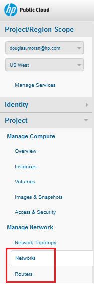
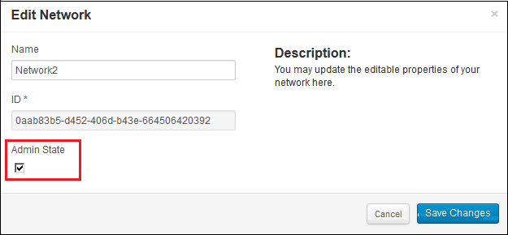
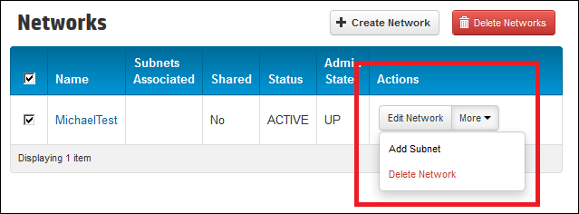
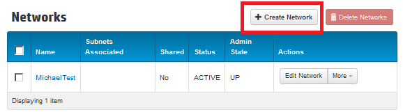
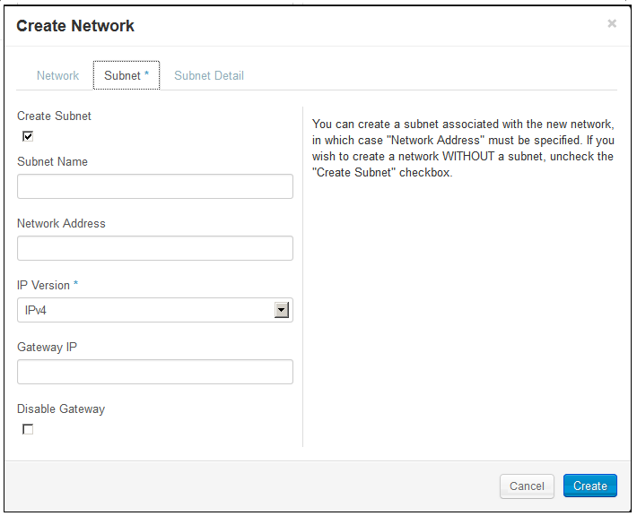
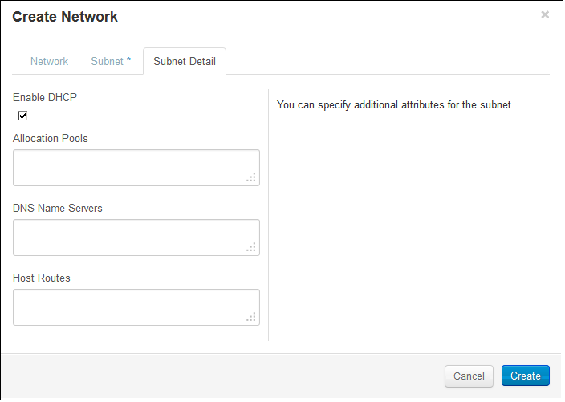
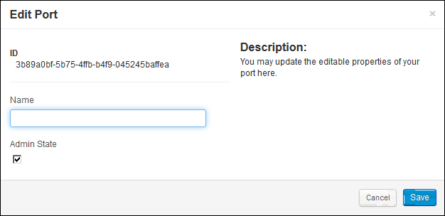

# How To's with HP Cloud Networking version 13.5

<!-- Modeled after How To's with the Compute Service (https://docs.hpcloud.com/compute/using/) Some text from network guide. -->

As you get used to using the networking service, you might need to modify the default network or create additional networks.  This page gives you some how-to's for the following tasks: 

- [Enable a network](#Enabling)
- [Disable a network](#Disabling)
- [Delete a network](#Deleting)
- [Specify an IP address](#SpecifyIP)
- [Rename a network](#RenameNet)
- [Edit a sub-net](#EditSub)
- [Rename a port](#RenamePort)
- [Assign a router to a network](#AssignRouter)
 
- [Delete a network using the CLI](#DeleteCLI)
- [Rename a network using the CLI](#RenameNet)
- [Edit a sub-net using the CLI](#EditSubCLI)
- [Rename a port using the CLI](#RenamePortCLI)
- [Assign a router to a network using the CLI](#AssignRouterCLI)
- [Rename a network using the CLI](#RenameNet)
- [Edit a sub-net using the CLI](#EditSub)
- [Rename a port using the CLI](#RenamePort)
- [Assign a router to a network using the CLI](#AssignRouter)

You can use the the [Horizon Cloud Console](#console) or [HP Cloud CLI for Windows PowerShell](#powershell) to work with a network.  

##Before you begin## {#Overview}

Before you can enable or disable networks, you must:

* [Sign up for an HP Cloud compute account](https://account.hpcloud.com/signup)
* Activate compute service on your account
* [Create a network](/mc/compute/networks/create-network/)

## Using the Horizon Cloud Console ## {#console}

You can use the Horizon Cloud Console to perform the following tasks:

* Enabling and disabling a network
* Creating a sub-network
* Specifying an IP address
* Allocating floating IP address
* Configuring security group

All of the procedures in this section require that you access the Networks or Routers tab in the Project section of the Horizon Cloud Console, as shown: {#NetworkTab}

    

## How to enable a network {#Enabling}

By default, when you [create a network](/mc/compute/networks/create-network#Creating/), that network is created in an enabled admin state.  

If you have at some point [disabled](#Disabling) a network, you can enable it.

1. Login to the [Horizon Console](https://horizon.hpcloud.com/).

2. Select the [Networks tab](#NetworkTab) under the Project section.

3. On the Networks screen, locate the network which you want to enable.

4. In the Actions column, click **Edit Network** for your the network. 

5. In the Edit Network screen, select the **Admin State** option and click **Save Changes**:
	 

##How to disable a network## {#Disabling}

By default, when you [create a network](/mc/compute/networks/create-network#Creating/), that network is created in an enabled admin state.  You can disable a network, as needed.

1. Login to the [Horizon Console](https://horizon.hpcloud.com/).

2. Select the [Networks tab](#NetworkTab) under the Project section.

3. On the Networks screen, locate the network which you want to disable.

4. In the Actions column, click **Edit Network** for your the network. 

5. In the Edit Network screen, clear the **Admin State** option and click **Save Changes**:
	 

## How to delete a network ## {#Deleting}

1. Login to the [Horizon Console](https://horizon.hpcloud.com/).

2. Select the [Networks tab](#NetworkTab) under the Project section.

3. On the Networks screen, locate the network which you want to delete.

4. In the Actions column, click **More** -> **Delete Network** for your the network. 
	 

5. In the confirmation dialog, click **Delete Network**.

## How to specify an IP address ### {#SpecifyIP}

1. Login to the [Horizon Console](https://horizon.hpcloud.com/).

2. Select the [Networks tab](#NetworkTab) under the Project section.

3. Click **Create Network**. 
	 

4. On the **Network** tab, enter a name for the network.  
	 

5. Enter the following values, as appropriate:
	 

6. Enter the following values, as appropriate:
	 

7. Click **Create**.

### How to rename a network ### {#RenameNet}

1. Login to the [Horizon Console](https://horizon.hpcloud.com/).

2. Select the [Networks tab](#NetworkTab) under the Project section.

3. On the Networks screen, locate the network which you want to rename.

4. In the Actions column, click **Edit Network** for your the network. 

5. In the Edit Network screen, enter a new name and click **Save Changes**
	 

###How to rename a sub-net### {#EditSub}

1. Login to the [Horizon Console](https://horizon.hpcloud.com/).

2. Select the [Networks tab](#NetworkTab) under the Project section.

3. On the Networks screen, click the network associated with the subnet you want to rename.

4. In the Actions column, click **Edit Subnet** for your the subnet you are changing. 

5. In the Edit Subnet screen, enter a new name and click **Save**
	 

###How to rename a port### {#RenamePort}

1. Login to the [Horizon Console](https://horizon.hpcloud.com/).

2. Select the [Networks tab](#NetworkTab) under the Project section.

3. On the Networks screen, click the network associated with the port you want to rename.

4. In the Actions column, click **Edit Port** for your the port you are changing. 

5. In the Edit Port screen, enter a new name and click **Save**
	 

###How to assign a router to an external network### {#AssignRouter}

1. Login to the [Horizon Console](https://horizon.hpcloud.com/).

2. Select the [Routers tab](#NetworkTab) under the Project section.

3. On the Routers screen, locate the network which you want to rename.

4. In the Actions column, click **Set Gateway** for your the network. 

5. In the Set Gateway screen, select a network from the **External Network** list and click **Set Gateway**
	 

<!--Can users enable/disable routers in 13.5?
##Enabling a router## {#Enabling}

When you enable the compute service, a router is enabled by default.  If you have [disabled](#Disabling) the router, to enable it, in the `Manage` column, select the `Options` button for the router you wish to disable and click the `Disable` item:

 

##Disabling a router## {#Disabling}

When you enable the compute service, a router is enabled by default.  To disable the router, in the `Manage` column, select the `Options` button for the router you wish to disable and click the `Disable` item:

-->

## Using the Windows PowerShell ## {#powershell}

The HP Cloud environment command-line interface (CLI) software for Windows PowerShell allows Windows users to manage their HP Cloud services from the command line.

For the full reference of supported HP Cloud CLI commands for Windows PowerShell, see [HP Cloud Environment CLI Software for Windows PowerShell Command Line Reference](docs.hpcloud.com/cli/windows/2/reference/). 

### How to delete a network ### {#DeleteCLI}

1. On the 13.5 instance, launch a Windows PowerShell window.  

	Select the shell appropriate to your system, either the 64-bit or 32-bit version. 

2. Enter the HP Cloud environment CLI by entering:

	`PS C:> cd HPCS:`

3. Create a new network by executing the following command, using the appropriate values:
	
	remove-network

	remove-network -id -all

	Where
	
		id - The ID of the network to delete.

		all - Removes all networks in the current availability-zone associated with your project.

	The following example deletes a network with the specified ID

		remove-network -id 12857174-99cf-40e9-999e-fb0fa2e84898  

Deletes the Network with the id of 12857174-99cf-40e9-999e-fb0fa2e84898

### How to rename a network ### {#RenameNetCLI}

You can change the name of a network, as needed.

1. On the 13.5 instance, launch a Windows PowerShell window.  

	Select the shell appropriate to your system, either the 64-bit or 32-bit version. 

2. Enter the HP Cloud environment CLI by entering:

	`PS C:> cd HPCS:`

3. Change the network name by executing the following command, using the appropriate values:
	
	update-network -id networkIP Identity -n Name

	Where

	id - The network ID.

	n - The new name for the network.

	The following example renames the specified network to Network1:

		update-Network -id 12857174-99cf-40e9-999e-fb0fa2e84898 -n "Network1" 

### How to edit a sub-net### {#EditSubCLI}

You can modify a sub-net to rename the sub-net or change the the external gateway assigned to the sub-net.

1. On the 13.5 instance, launch a Windows PowerShell window.  

	Select the shell appropriate to your system, either the 64-bit or 32-bit version. 

2. Enter the HP Cloud environment CLI by entering:

	`PS C:> cd HPCS:`

3. Modify the sub-net by executing the following command, using the appropriate values:
	
	update-subnet -id SubnetIdentifier -egw ExternalGatewayNetworkIPAddress - n Name

	Where

		id - The sub-net ID.

		egw - The external gateway network ID to assign.

		n - The new name for the sub-net.

	The following example reassigns the subnet to the designated external network and renames the sub-net to "NewSubnetName":

	update-Subnet -id 12857174-99cf-40e9-999e-fb0fa2e84898 -egw 129.15.124.12 -n "NewSubnetName" 

### How to rename a port### {#RenamePortCLI}

By default, when a port is created, the port is automatically assigned a name and ID. For example, when you create a subnet, a port is created for that subnet. 

You can change the name of a port, as needed.

1. On the 13.5 instance, launch a Windows PowerShell window.  

	Select the shell appropriate to your system, either the 64-bit or 32-bit version. 

2. Enter the HP Cloud environment CLI by entering:

	`PS C:> cd HPCS:`

3. Change the port name by executing the following command, using the appropriate values:
	
	update-port  -id port -did name

	Where

	id - The port ID.

	did - The new name for the port.

	The following example renames the specified port to port1:

	update-Port -id 12857174-99cf-40e9-999e-fb0fa2e84898 -did "port1" 

### How to assign a router to a network ### {#AssignRouterCLI}

You can assign a router to an external network, as needed.

1. On the 13.5 instance, launch a Windows PowerShell window.  

	Select the shell appropriate to your system, either the 64-bit or 32-bit version. 

2. Enter the HP Cloud environment CLI by entering:

	`PS C:> cd HPCS:`

3. Assign the external network by executing the following command, using the appropriate values:
	
	update-router  -id RouterID -nid Name

	Where

	id - The router ID.

	nid - The new name for the router.

	The following example renames the specified router to router1:

	update-Port -id 12857174-99cf-40e9-999e-fb0fa2e84898 -nid "router1" 

##For further information## {#ForFurtherInformation}

* For information about the router details screen, take a look at the [Viewing router details](/mc/compute/networks/view-router/) page
For the full reference of supported HP Cloud CLI commands for Windows PowerShell, see [HP Cloud Environment CLI Software for Windows PowerShell Command Line Reference](docs.hpcloud.com/cli/windows/2/reference/)
* For basic information about our HP Cloud compute services, take a look at the [HP Cloud compute overview](/compute/) page
* Use the MC [site map](/mc/sitemap) for a full list of all available MC documentation pages
* For information about the Open Stack networking features, surf on over to [their networking wiki](https://wiki.openstack.org/wiki/Quantum)