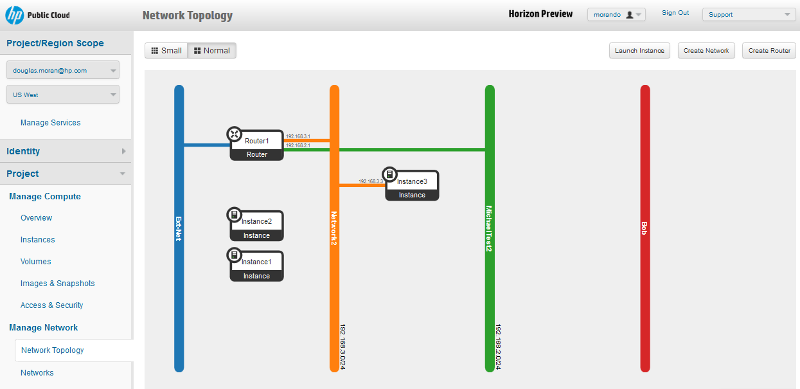

# Horizon console: Network Topology screen

The Horizon console Network Topology screen allows you to view and manipulate the networks in your project.  This page covers the following topics:

* [Network Topology screen overview](#Overview)
* [Network Topology screen functions](#Functions)
* [For further information](#ForFurtherInformation)

##Network Topology screen overview## {#Overview}

The Network Topology screen...

##Network Topology screen functions## {#Functions}

From the networks screen you can perform any of the following functions:

[Create an instance](/mc/compute/images/create/)
[View instance details](/mc/compute/servers/view-details)
[Terminate an instance](/mc/compute/servers/manage#Terminating)
[Create a network](/mc/compute/networks/create-network/)
[Create a router](mc/compute/routers/)
[View router details](/mc/compute/networks/view-router)
[Delete a router](/mc/compute/networks/manage-routers)
[Delete a network interface](/mc/compute/networks/manage-routers)

##For further information## {#ForFurtherInformation}

* For basic information about our HP Cloud compute services, take a look at the [HP Cloud compute overview](/compute/) page
* Use the MC [site map](/mc/sitemap) for a full list of all available MC documentation pages
* For information about the Open Stack networking features, surf on over to [their networking wiki](https://wiki.openstack.org/wiki/Quantum)
