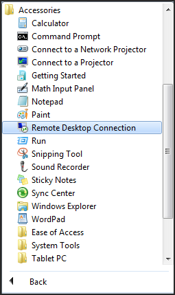
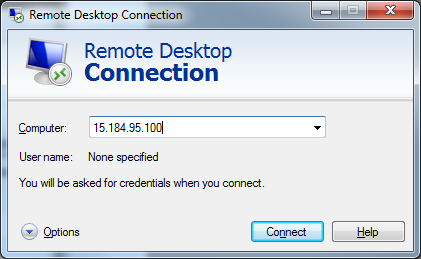
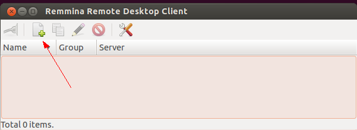
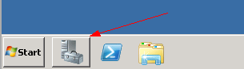
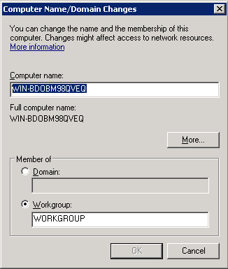

# How To's with the Compute Service

As you get used to using the compute service, you start finding that there are a number of tasks that you probably need to accomplish.  This page gives you some how-to's for the following tasks: 

* [How to Resize an Instance](#ResizingInstances)
* [How to Pause an Instance](#PausingInstances)
<!- * [How Transition Your Workload from an Ephemeral to a Persistent Instance](#TransitioningWorkload) -->
* [How to Remote Desktop into a Windows Instance](#WindowsRDP)
* [Changing your Administrator Password on Windows](#ChangeAdminPass)
* [Changing your Hostname/Computer Name in Windows](#ChangeHostname)

## How to Resize an Instance ## {#ResizingInstances}

Outgrown your instance? If you find yourself needing more space or horsepower, you can resize your instance in the [console](https://console.hpcloud.com/) by following these steps:

1.  Browse to the [compute dashboard](https://console.hpcloud.com/compute) and select your from the appropriate [AZ](glossary#AvailabilityZone) and region. 
  
2.  Select **Images** to take a snapshot of your server instance. Enter a name for your image, a brief description, select the instance you want to duplicate, and click `Create`. Your newly-created image appears in the `Manage Custom Images` list.
  
3.  On the `Servers` screen, create a server using your snapshot. You can increase the size of the instance by selecting a new `Flavor`, while keeping the same base-image as before.
  
4.  On the `Floating IPs` screen, reassign the Floating IP back to your newly-created instance.
  

**Note**:  We recommend using Floating IPs to ensure consistent IP assignment; click `Floating IPs` in your compute dashboard. 

##How to Pause an Instance## {#PausingInstances}

Need to Pause an instance? An easy way to do this is by taking a snapshot of your instance, then terminating the instance and creating a new instance with the newly created original image when ready. Here are the steps via the [console](https://console.hpcloud.com/):

**Note**:  To ensure your newly created instance has the same IP address, it is best to use Floating IPs to ensure no change to the IP assignment. You can assign Floating IPs via the <i>Floating IPs</i> tab. 

1.  Browse to the compute dashboard where your instance lives that you want to pause. Remember to select the appropriate AZ and region. 
2.  Browse to the <i>Images</i> tab to snapshot your server. Enter a name for your image, enter a brief description, select the instance you want to image and click Create. Your newly created image will appear in the Manage Custom Images List.
3.  Browse back to the <i>Servers</i> tab, and locate the server you just imaged. Click the image ID to view its detail.
4.  Select the terminate action to affectingly remove the instance from service. Remember, you have a backup image of the server from Step 2.
5.  When ready, browse back to the <i>Servers</i> tab and create a new instance using the newly created Backup Image.
6.  After creation, browse to the <i>Floating IPs</i> tab to reassign the Floating IP back to the newly created instance.

<!-- ##How Transition Your Workload from an Ephemeral to a Persistent Instance## {#TransitioningWorkload}

 I assume this is also using Snapshotting the data and recovering it in a different persistent instance? -->

## How to Access a Windows Instance via the Remote Desktop ##  {#WindowsRDP}

You can create Windows instances using the [management console](https://console.hpcloud.com), [bindings](bindings) and [CLIs](cli). The output of creating a Windows instance is an administrator password. You need this password to connect to Windows instances via the Remote Desktop Protocol (RDP).

### RDP via Windows ### {#RDPviaWindows}

After you receive your Administrator password, browse to your Remote Desktop Connection Shortcut in the Start Menu. You can also start RDP by executing `C:\%windir%\system32\mstsc.exe`.

In the *Computer* field, enter the public IP for your instance:

In the *Credentials* dialog, select **Use another account**.  In the *User name* field, enter **Administrator**.  In the *Password* field, enter the password provided by HPCS. This password is displayed to you after you create a Windows instance in our [CLIs](/cli) or [console](https://console.hpcloud.com). Simply cut and paste the provided password into this field.

### RDP via Ubuntu ### {#RDPviaUbuntu}

There are many RDP client available for Ubuntu. This demonstration uses the client Rimmina. 
**Note**: A client may be pre-installed on your Ubuntu OS. Try searching the keywords *Remote Desktop* for clients that are installed. 
After opening Remmina, select the **Create a new remote desktop file** button.

Create a name for your profile and enter your new server's public IP address as the *Server*, **Administrator** as the *User Name* and the generated password you received after creation as the *Password*. When ready, select **Connect**.

## Changing your Administrator Password on Windows ## {#ChangeAdminPass}

Once you are connected to the Windows Desktop, we highly recommended that you immediately change your administrator password. From the Windows Start, select **Search programs and files** and enter *user accounts*.  Hit enter to open the *User Accounts* dialog.

In the *User Accounts* dialog, select **Change your password** to change your administrator password.

**Note**: For Windows CLI users who wish to continue using the `connect-server` command, you need to sync your new password with the Windows CLI tool. See the [Password Management](/cli/windows/compute#PasswordManagement) command description for further information.

## Changing your Hostname/Computer Name in Windows ## {#ChangeHostname}

Its best practices to change the computer name of your windows instances after creation in order to make the name logical to your needs. This becomes especially important when creating Windows instances from image snapshots, as the computer name/hostname will be identical to the parent instance used to take the image. Here are the steps to change your computer name:

Select to the *Server Manager* icon in the task tray.

Click the link to the *Change System Properties*.

On the system properties dialog, select *Change*

Enter your new Computer Name and select *OK*. 

The system will prompt you to reboot to have the changes take effect.
