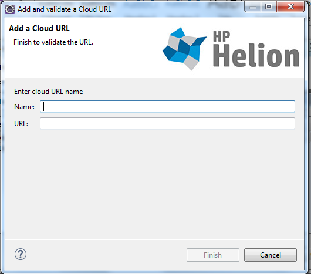
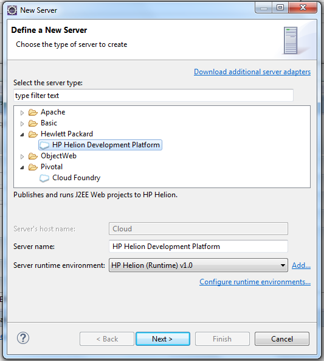

<!--PUBLISHED-->
# HP Helion 1.0 Development Platform: Eclipse Deployment Plugin
If you're building apps in Eclipse, use this plugin to configure, package, and deploy your app directly to HP Helion Development Platform.

Follow the steps outlined in this document to get the plugin up and running and to deploy one of the sample apps.

Before you begin, we recommend having [Eclipse IDE for Java EE developers](https://www.eclipse.org/downloads/packages/eclipse-ide-java-ee-developers/lunasr1) installed along with the Java Runtime Environment and [JDK](http://www.oracle.com/technetwork/java/javase/downloads/jdk8-downloads-2133151.html) if you'd like to deploy the Java samples we provide.

##Installation

1. Open the Eclipse IDE and install the plugin through the **Eclipse Marketplace** dialog.  You can find this dialog by clicking on **Help** and then **Eclipse Marketplace**. 
2. Type in the text **Helion** and hit **go** to find the Helion Eclipse plugin in the marketplace.
3. Click on **Install** and follow the prompts to install the **HP Helion Development Platform Eclipse Plugin**. 
4. Once the packages are discovered, ensure **HP Helion Development Platform** is checked and click **Confirm**. 
3. Accept the license agreement and Finish the wizard.
4. You will be prompted to restart Eclipse.  
##Setup/Configuration

1. Once Eclipse has reloaded, open the Servers window by navigating to Window-> Show View-> Servers. Note that if you have a different version of Eclipse, you might need to go to Window -> Show View -> Other -> Servers. 
2. Launch the HP Helion Development Platform plugin by clicking on the **Add New Server** link in the Servers window.  
2. Select **HP Helion Development Platform** from the tree view and click **Next**. 
3. Add a new Cloud URL by hitting the Manage Cloud button.  Enter the URL of your ALS cluster and give it a name. If you don't have an ALS cluster set up, the fastest way to create one is to use the [Quick Start Developer Trial](/helion/devplatform/ALS-developer-trial-quick-start/) in the public cloud. 
- **Note**: You may receive a warning that the peer is not authenticated, this is expected behavior as ALS images use a self-signed certificate. Select Yes when prompted with this error message.
	
4. Enter the credentials used to access your ALS cluster in the resulting dialog and then click **Validate Account** to ensure that the plugin can access the URL.
	- **Note**: If you encounter issues validating the connection, ensure that your proxy settings are configured correctly, and that you have access to the ALS cluster endpoint. Contact your IT Administrator for more help regarding network settings and trouble shooting.
  	
6. Note that you might get a warning about the site using a *self-signed certificate*.
6. Click **Next** to list your organizations and spaces. Pick an organization and space to work with in this connection and click **Yes** to import them into the IDE.  Click **Finish**.  If you do not have an organization or space set up, please create those through your ALS console by visiting the endpoint URL in a browser window.
6. Now you should see **Helion Development Platform** as a configured Server in your IDE.  You can explore the apps that have been deployed already, or continue reading to learn how to deploy a sample app.

##Usage
In order to demonstrate how the plugin works, we'll use a simple Java sample app that connects to a MySQL service.  If you'd like to follow along, [download and install](https://github.com/HelionDevPlatform/helion-mysql-java) the sample on your development machine.  If not, please skip the following 5 steps.

1. Start by adding a new project. Right-click on Project Explorer and select **New** > **Dynamic Web Project**. Name the project **MySQLSample** and then click **Finish**. 
3. Right-click the new MySQLSample project and import the sample app by clicking on **Import** > **Import**. 
4. Then import the sample app through your preferred method.  In this case we'll import from a directory on the file system.  Make sure that you click on the checkbox to import all files in the directory. Then click **Finish**. 
5. If you'd like to modify the sample and build it locally, ensure that all references can be resolved.  This sample uses javax.servlet and net.sourceforge.argo.  Note that they are declared in the POM.xml file.  To resolve these references, navigate to the files with reference warnings and click on the red squiggle.  Alternatively, if you have [Maven installed](http://www.eclipse.org/m2e) in Eclipse, you can build with Maven to resolve the references. 
6. For this sample, you also need to import two external jar files.  You can find the javax.servlet.* modules in the Java EE SDK under the Glassfish directory.  The Argo modules can be downloaded [here](http://argo.sourceforge.net/downloads.html). 

###Deploy sample
Now that our Sample app is set up, let's deploy it using the Helion Development Platform plugin.  

1. Right-click the project in Project Explorer and select Configure > Enable as Cloud Foundry App. 
2. We'll deploy this app to the Helion Development Platform by right-clicking on the project and selecting **Run As** > **Run on Server**. 
2. Select **Helion Development Platform** and click **Next**.  You can check the box to skip this step in future deployments. 
3. Next specify a name for your app and optionally pick a specific custom buildpack.  You can save these settings to your manifest if you'd deploy using the command-line tools in the future.  Since this is a standard Java applet, we'll stick with the default buildpack that is built into Helion Development Platform. 
4. You can see the deployment progressing in the console. 

Once your app is deployed, you can use the plugin to interact with it directly from Eclipse.  You can select Show Console to bring up the ALS console.  You can view the app in the browser by selecting Open Home Page and you can also stop/restart/remove it. 

----
