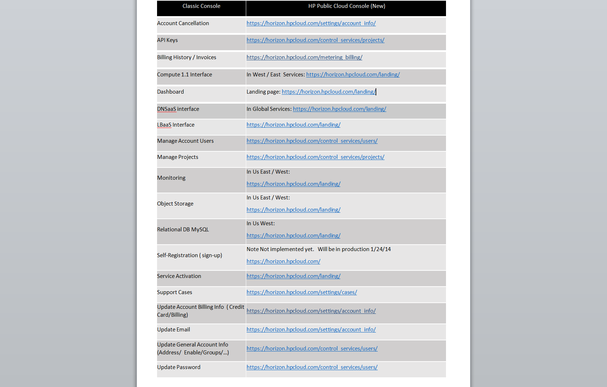

#Feature Mapping: HP Classic Console to the HP Public Cloud Console
HP encourages you to transition to HP Public Cloud 13.5 as soon as possible. The 13.5 version allows you to take advantage of significant product enhancements, including the new HP Public Cloud Console based on the OpenStack Horizon dashboard project.  Early transition also ensures uninterrupted service when support for the previous (12.12) version ends on June 1, 2014.

As of January 29, 2014, you can only manage your 13.5 services and update your account information through the HP Public Cloud Console. This document displays the feature map to the HP Public Cloud Console from the classic console.

##Find Classic Console Features in the HP Public Public Cloud##

[Account Cancelation](https://horizon.hpcloud.com/settings/account_info) 

[API Keys](https://horizon.hpcloud.com/control_services/projects/)

[Billing History/Invoices](https://horizon.hpcloud.com/metering_billing/)

[Compute 1.1 Interface (in US East/West services)](In West/East  Services: https://horizon.hpcloud.com/landing/)

[Dashboard](https://horizon.hpcloud.com/landing/)

[DNSaaS interface](https://horizon.hpcloud.com/landing/)

[LBaaS Interface](https://horizon.hpcloud.com/landing/)

[Manage Account Users](https://horizon.hpcloud.com/control_services/users/)

[Manage Projects](https://horizon.hpcloud.com/control_services/projects/)

[Monitoring (in US East/West)](https://horizon.hpcloud.com/landing/)

[Object Storage(in US East/West](https://horizon.hpcloud.com/control_services/projects/)

[Self-registration](https://horizon.hpcloud.com/register)

[Service Activation](https://horizon.hpcloud.com/control_services/projects/)

[Support Cases](https://horizon.hpcloud.com/settings/cases/)

[Update Account Billing Info](https://horizon.hpcloud.com/settings/account_info/)

[Update Email](https://horizon.hpcloud.com/settings/account_info/)

[Update General Account Info (Address/Enable/Groups, etc.)](https://horizon.hpcloud.com/control_services/users/)
[API Keys](https://horizon.hpcloud.com/control_services/projects/)

[Update Password](https://horizon.hpcloud.com/control_services/users/)

 
