<!--PUBLISHED-->

# Feature Mapping: HP Classic Console to the HP Helion Public Cloud Console

HP encourages you to transition to HP Helion Public Cloud 13.5 as soon as possible. The 13.5 version allows you to take advantage of significant product enhancements, including the new HP Helion Public Cloud Console based on the OpenStack Horizon dashboard project.  Early transition also ensures uninterrupted service when support for the previous (12.12) version ends on June 1, 2014.

As of January 29, 2014, you can only manage your 13.5 services and update your account information through the HP Helion Public Cloud Console. This document maps the feature changes from the HP Classic Console to the new HP Helion Public Cloud Console and provides links to other relevant information.

This page contains the following sections:

* [Logins and transition information for HP Classic Console and HP Helion Public Cloud Console](#Logins)
* [Find Classic Console Features in the HP Helion Public Cloud](#Findfeatures)
* [Using HP Helion Public Cloud Console](#Usinghpcc)
* [Feature mapping details](#featuremappingdetails)

##Logins and transition information for HP Classic Console and HP Helion Public Cloud Console## {#Logins}

[Login to the Classic Console](https://console.hpcloud.com/login)

[Register on HP Helion Public Cloud Console](https://horizon.hpcloud.com/register)

[Login to HP Helion Public Cloud Console](https://horizon.hpcloud.com/)

[HP Helion Public Cloud version 13.5 overview](http://docs.hpcloud.com/version-overview?jumpid=em_R11646_us/en/b_to_b/hpcs/email_13.5_Console/hpcs_overview/20131218&elq=31433aa6c52548059ccea9f4ddbff345&elqCampaignId=)

[HP Helion Public Cloud Services 12.12 to 13.5 transition overview](https://docs.hpcloud.com/migration-overview/?jumpid=em_R11646_us/en/b_to_b/hpcs/email_13.5_Console/hpcs_migration-overview/20131218&elq=31433aa6c52548059ccea9f4ddbff345&elqCampaignId=)

[Getting Started with HP Helion Public Cloud Console](/hpcloudconsole)

##Find Classic Console Features in the HP Helion Public Cloud## {#Findfeatures}

[Account Cancelation](https://horizon.hpcloud.com/settings/account_info) 

[API Keys](https://horizon.hpcloud.com/control_services/projects/)

[Billing History/Invoices](https://horizon.hpcloud.com/metering_billing/)

[Compute 1.1 Interface (in US East/West services)](https://horizon.hpcloud.com/landing/)

[Dashboard](https://horizon.hpcloud.com/landing/)

[DNSaaS interface](https://horizon.hpcloud.com/landing/)

[LBaaS Interface](https://horizon.hpcloud.com/landing/)

[Manage Account Users](https://horizon.hpcloud.com/control_services/users/)

[Manage Projects](https://horizon.hpcloud.com/control_services/projects/)

[Monitoring (in US East/West)](https://horizon.hpcloud.com/landing/)

[Object Storage(in US East/West](https://horizon.hpcloud.com/landing/)

[Relational DB MySQL (in US West)](https://horizon.hpcloud.com/landing/)

[Self-registration](https://horizon.hpcloud.com/register)

[Service Activation](https://horizon.hpcloud.com/landing/)

[Support Cases](https://horizon.hpcloud.com/settings/cases/)

[Update Account Billing Info](https://horizon.hpcloud.com/settings/account_info/)

[Update Email](https://horizon.hpcloud.com/settings/account_info/)

[Update General Account Info (Address/Enable/Groups, etc.)](https://horizon.hpcloud.com/control_services/users/)

[Update Password](https://horizon.hpcloud.com/control_services/users/)

##Using HP Helion Public Cloud Console## {#Usinghpcc}
In the HP Helion Public Cloud Console, the services are displayed for the selected "Project/Region Scope" on the [landing page](https://horizon.hpcloud.com/landing/). The landing page replaces the "Dashboard" page in the Classic Console.

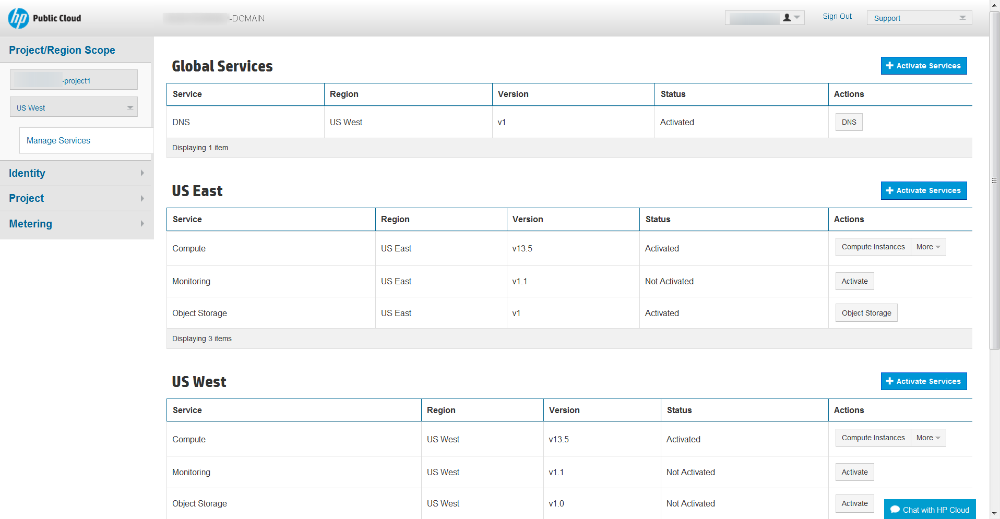

###Feature mapping details### {#featuremappingdetails}

Following are screenshots of  Classic Console features followed by the updated feature in the HP Helion Public Cloud Console.

####API keys####

**Classic Console**

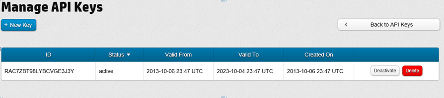

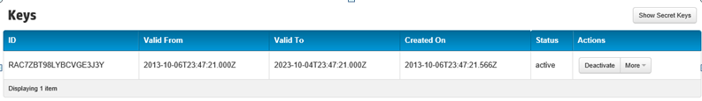

**HP Helion Public Cloud Console**

Access API Keys in the HP Helion Public Cloud Console via the pull-down menu next to the user name on the [landing page](https://horizon.hpcloud.com/landing/).

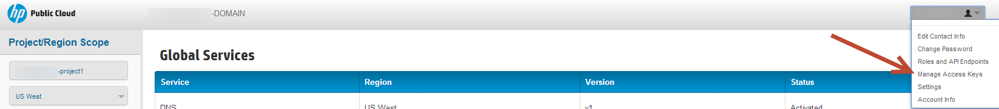

####Manage account users####

**Classic Console**

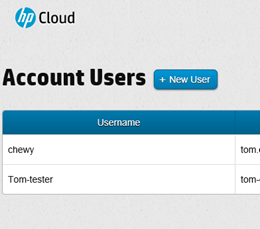

**HP Helion Public Cloud Console**

Click "Identity," then "Users" [here](https://horizon.hpcloud.com/control_services/users/) to manage account users.

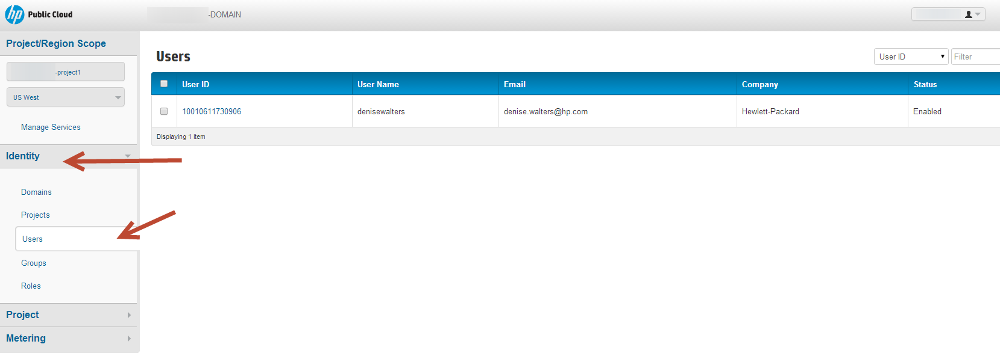

####Manage projects####

**Classic Console**

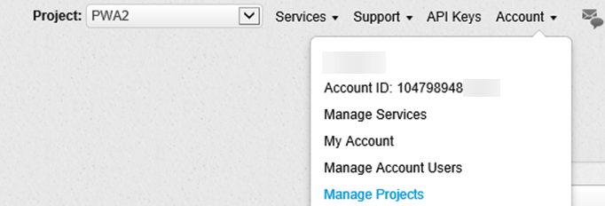

**HP Helion Public Cloud Console**

Click "Identity," then "Projects" [here](https://horizon.hpcloud.com/control_services/projects/) to manage projects.

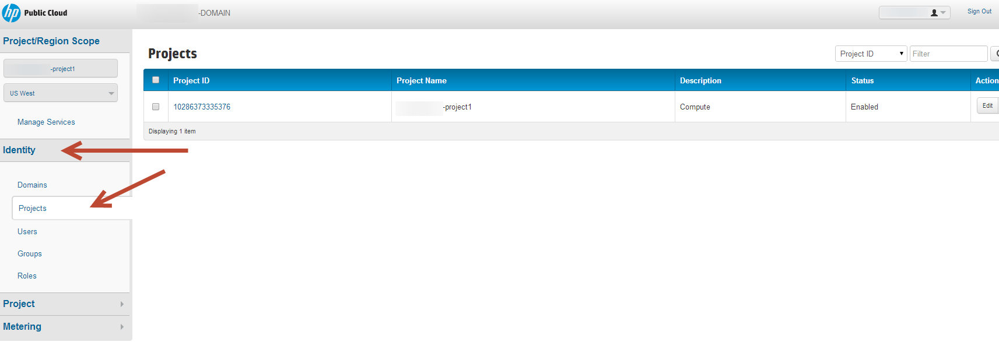

####Account cancelation####

**Classic Console**

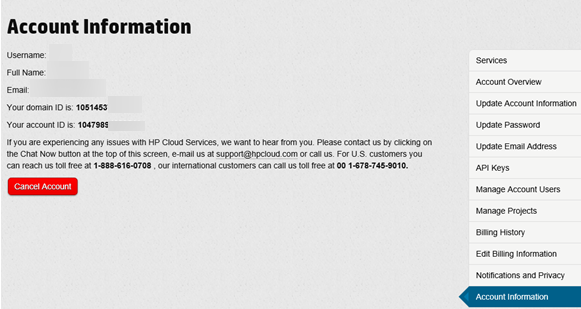

**HP Helion Public Cloud Console**

Cancel an account from the pull-down menu next to the user's name on the [landing page](https://horizon.hpcloud.com/landing/) or click [here](https://horizon.hpcloud.com/settings/account_info/).

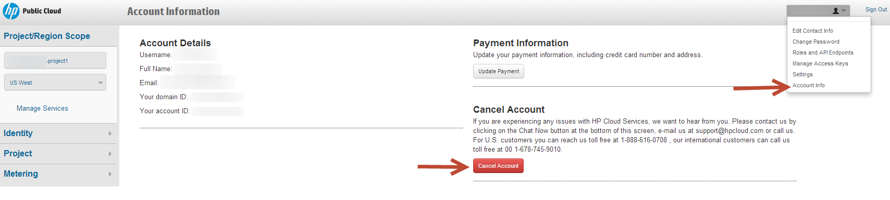

####Support cases####

**Classic Console**

**HP Helion Public Cloud Console**

Click [here](https://horizon.hpcloud.com/settings/cases/).

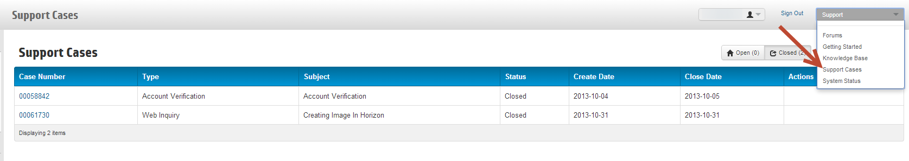

####Update general user information####

**Classic Console**

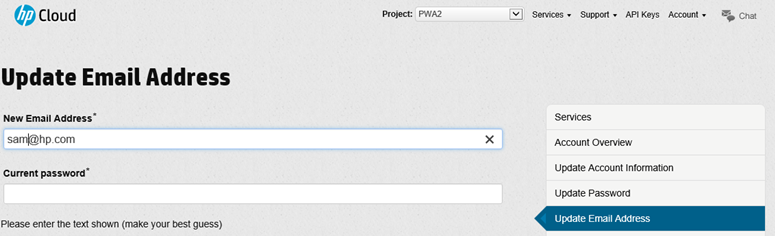

**HP Helion Public Cloud Console**

Update user information using the pull-down menu on the [landing page](https://horizon.hpcloud.com/landing/) next to the user's name.

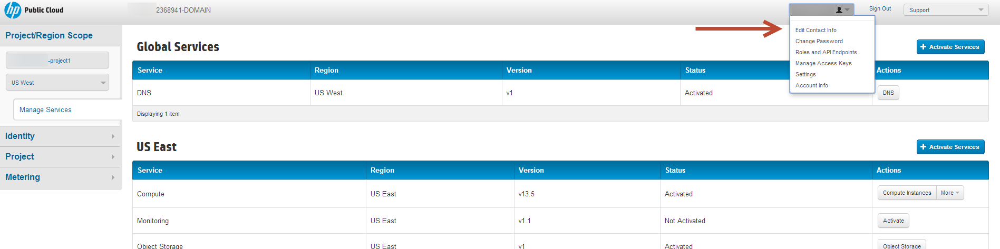

####Update password####

**Classic Console**

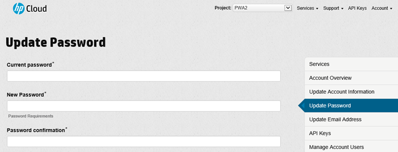

**HP Helion Public Cloud Console**

Change the password using the pull-down menu next to the user's name on the [landing page](https://horizon.hpcloud.com/landing/).

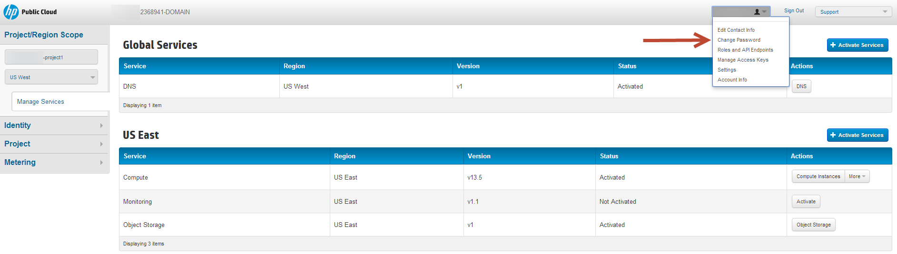

####Self-registration####

**Classic Console**

[Registration page](https://console.hpcloud.com/login)

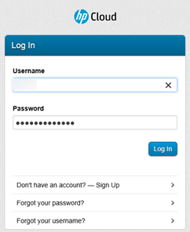

**HP Helion Public Cloud Console**

[Registration page](https://horizon.hpcloud.com/register)

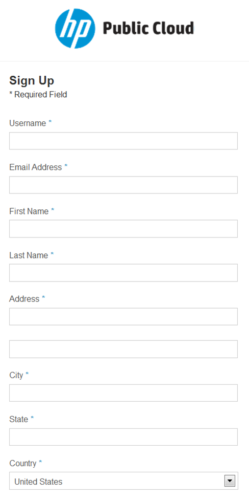

