# Getting Started with HP Public Cloud Console
Welcome to HP Public Cloud Console Horizon Preview Edition! HP Public Cloud wants you up and running quickly so this Getting Started guide walks you through network setup and connection (if not going with the default configuration setup when you activate compute services), instance and volume creation, security options, identity parameters, and management tools that facilitate your organization's use of HP Public Cloud. **This page takes you through the interface in the chronological order needed to get up and running, rather than the order displayed in the console**. 

After initial setup, revisit the interface to monitor usage, modify, add, and delete networks, instances, volumes, roles, groups, and more.

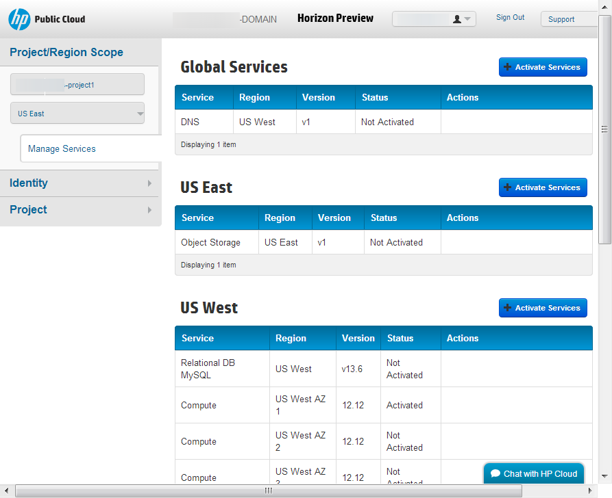

This page contains the following sections:

* [Creating and connecting a network](#Createandconnect)
* [Managing HP Public Cloud](#ManageHPPublicCloud)
* [For further information](#Forfurtherinformation)

##Creating and connecting a network## {#Createandconnect}

This section includes how to:

* [Create a network](#Createanetwork) 
* [Create a subnet](#Createasubnet)
* [Create a router](#Createarouter)
* [Connect your network](#Connectyournetwork)

**Note**:A default configuration comes with HP Cloud compute activation and includes:

* A network 
* A subnet
* A router connecting the subnets to the Internet
* A security group with basic server options, both SSH and Ping rules

You can use the default network to deploy HP Public Cloud compute instances (virtual servers), or create a network configuration through the HP Public Cloud Console with the following instructions.

###Create a network### {#Createanetwork}

1. Login to HP Public Cloud with your username and password.
2. On the HP Public Cloud console interface, click "Project," on the left side-bar then "Networks" under "Manage Networks."

    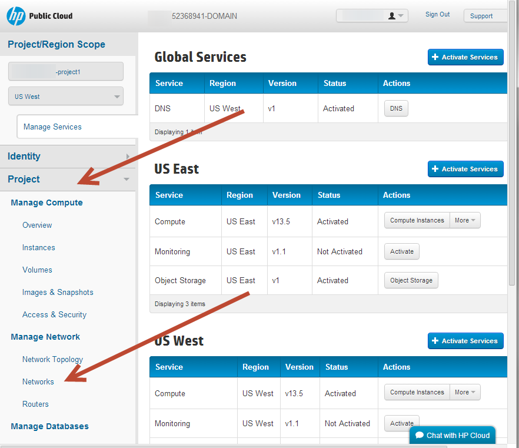

3. Click "+Create Network" in the right-hand navigation.

    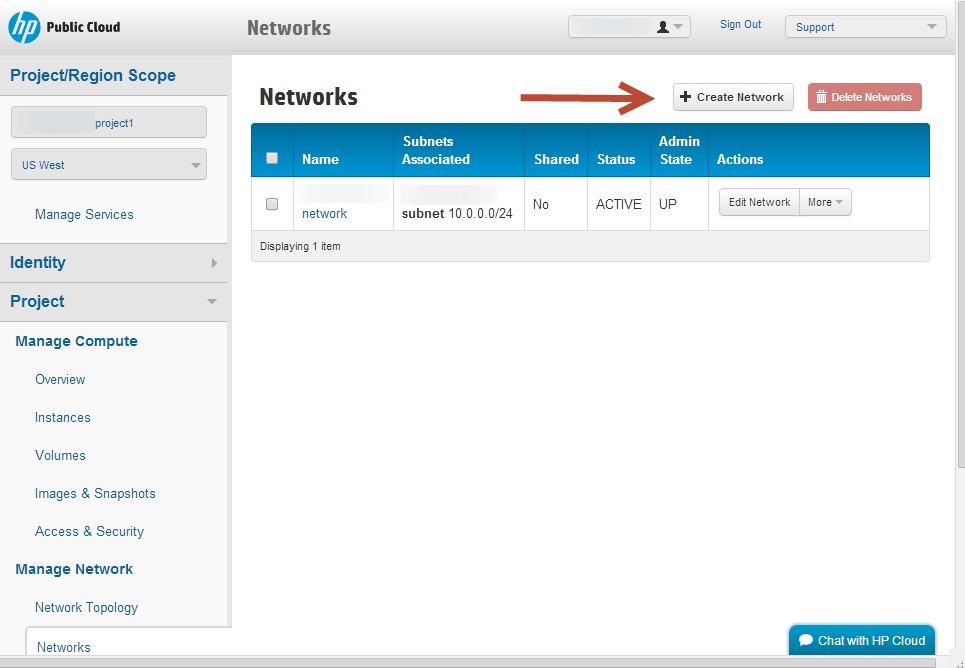 

4. Enter a "Network Name" in the "Create Network" pop-up screen, leave the Admin State box checked, and continue to the directions in "{#Create a subnet}" below.

    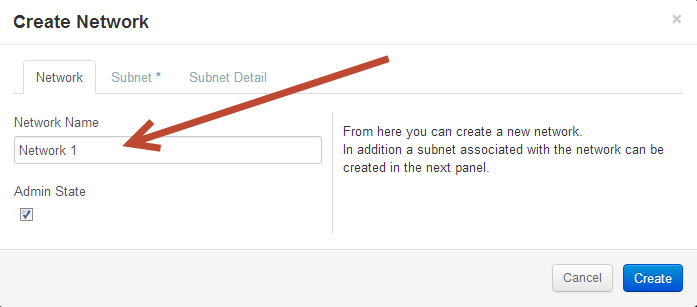

###Create a subnet### {#Createasubnet}

1. Click the "Subnet" tab in the "Create Network" pop-up screen. **Note**: If you click the "Create" button on the "Network" pop-up before setting up a "Subnet,"  you are prompted to specify a network address or turn off the option to create a subnet through an error message.
2. Enter the subnet name.
3. Click in the "Network Address" box. The pop-up message states the network address is in Classless Inter-Domain Routing (CIDR) format; i.e.,  000.000.0.0/00. Enter the network address displayed: 192.168.0.0/24.
4. Keep the IPv4 default in the "IP Version" box unless you know you have moved to IPv6.
5. Leave the "Gateway IP" box blank to use the default value of the network address; e.g., 192.168.0.1 for 192.168.0.0/24.
6. Leave the "Disable Gateway" box unchecked to use the default and click "Create." 

    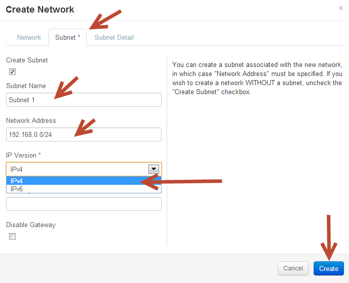

7. The "Networks" screen displays your network name and associated subnets.

    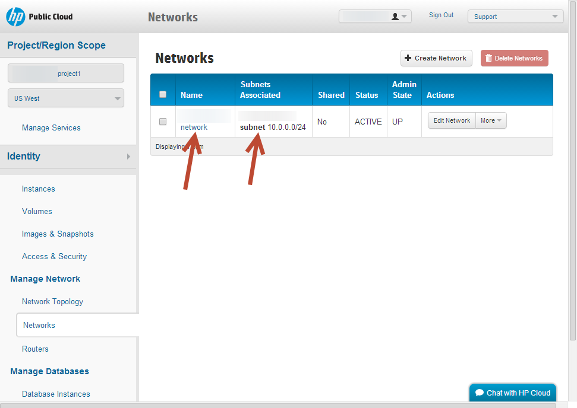

8. To see a graphic display of your network setup, click "Network Topology" under "Manage Network" in the left-hand navigation.  

    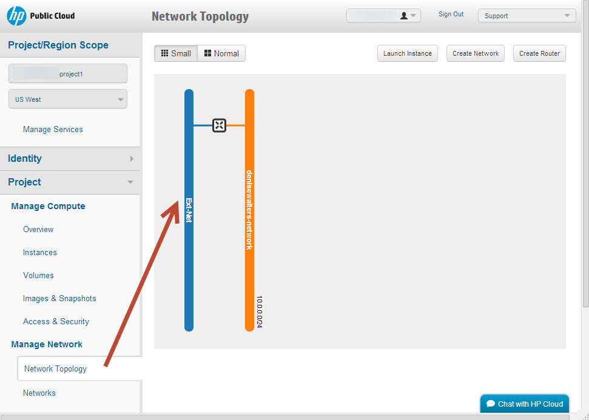

###Create a router### {#Createarouter}

1.  If on the "Network Topology" screen, click "Create Router" in the top right-hand navigation. If not, click "Routers" under the "Manage Network" heading in the left-hand navigation.

    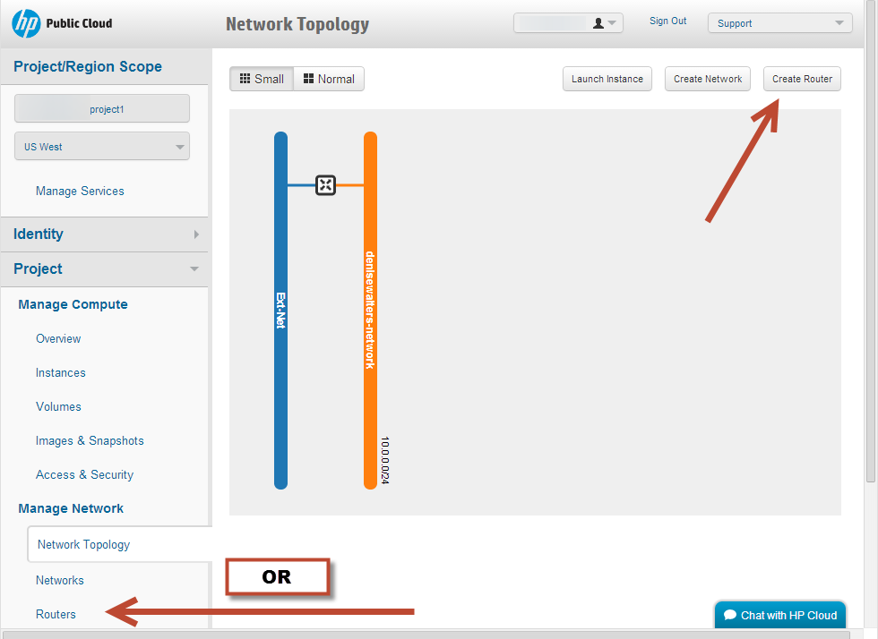

2.  If you clicked "Routers" under "Manage Network", click "+Create Router" in the upper right-hand navigation and enter the router name in the pop-up. If you clicked "+Create Router" on the "Network Topology" screen, enter your router name and click "Create Router."  
    
3. Click "Router" in the left-hand navigation to see the router name and status. **Note**:  Click the router "Name" to display its ID number and status. If you do this, click "Routers" in the left-hand navigation to make the "Set Gateway" action available for the following step or click the "Back" button in your browser.

    

4. On the "Router" page, click "Set Gateway" under "Actions" to connect your router to the Internet.

    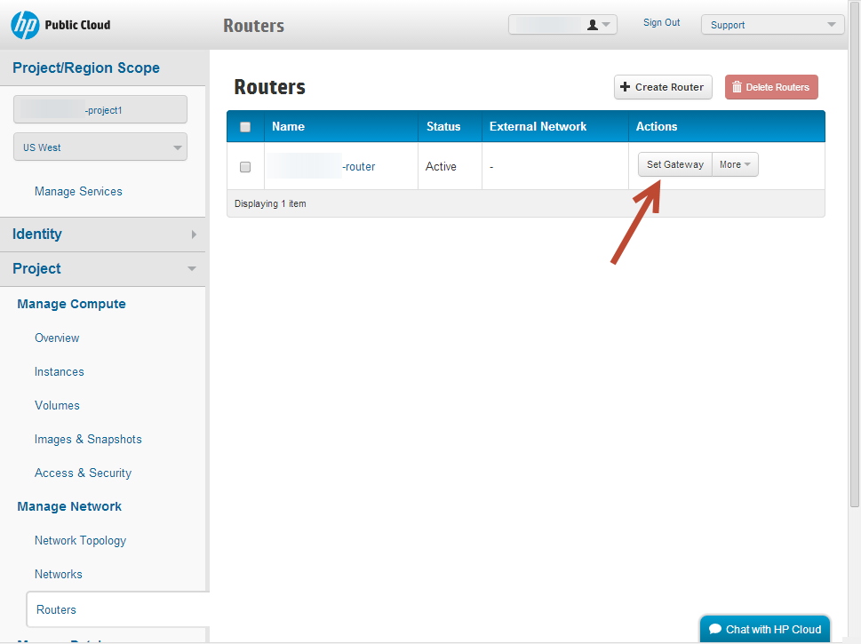

5. Click the drop-down menu in the "External Network" box in the "Set Gateway" pop-up, select "Ext-Net," and click "Set Gateway."

    **Note**: The external network is the router's default route, with the router acting as a gateway for external connectivity. While you can configure a subnet that is internal-only, you must connect it to another subnet with external connectivity.

    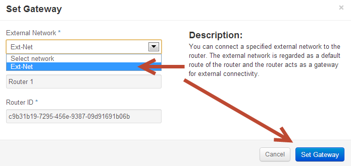

###Connect your network### {#Connectyournetwork}

1. Click the router name on the "Routers" page.

2. Click "+Add Interface" on the top far-right of the "Router Details" page. 

    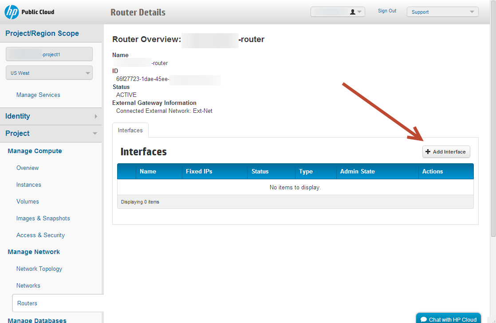

3. Click the drop-down menu in the "Select Subnet" box in the "Add Interface" pop-up and click on the network you configured. **Note**: You can optionally specify an IP address in the box provided, but the default interface IP address is the selected subnet's external gateway and the best choice unless you are setting up a more complicated connection. Any IP address you specify must belong to the subnet in the drop-down menu. 

4. Click "Add Interface."

    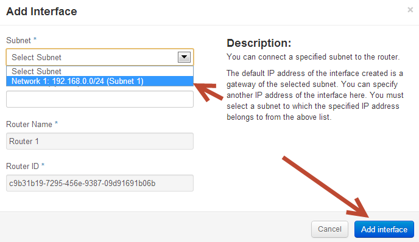

**Important: To delete a network, you must delete any instances running on that network (instance creation covered below) and the router interface before deleting the network. If you don't have instances on the network, you still have to delete the router interface before deleting the network**:

1. If you have created an instance, click "Instances" on the left-hand bar under "Manage Compute."

 2. Select the check box for any instance running on the network you want to delete and click "Terminate Instances" in the upper right-hand navigation. 

3. Click "Routers" under "Manage Network in the left-hand bar.

4. Click on the router "Name." 

3. On the "Router Details" page, select the check box next to the "Interface" name, and click "Delete Interface." 

4. Click "Networks" in the left-hand bar, select the check box next to the network you want to delete, and click "Delete Networks" in the upper right-hand navigation. 

##Managing HP Public Cloud## {#ManageHPPublicCloud}

You are now ready to use the options under "Manage Compute" under "Project" in the left-hand navigation. This section includes:

* [Overview](#Overview)
* [Create an instance](#Instance)
* [Create and attach a volume](#Volumes)
* [Images and Snapshots](#Imagesandsnapshots)
* [Access and Security](#Accessandsecurity)

###Overview### {#Overview}

Select "Overview" under "Manage Compute," to display your usage summary and quotas for:

* Instances
* VPCUs
* RAM
* Floating IPs
* Security Groups

As you use HP Public Cloud, click on the "Overview" options any time to query current usage as well as usage during specific time frames.

####Create an instance#### {#Instance}

An instance is a virtual server.

**Note**: HP Public Cloud provides a list of images from which you can boot an instance.  While you can also boot from an HP Public Cloud instance you have launched using "Images and Snapshots," it is unnecessary to get up and running and beyond the scope of this document.   

1. Click "Instances" under "Manage Compute" in the left-hand navigation.

2. Click "+Launch Instance" in the upper right-hand navigation of the screen. 

    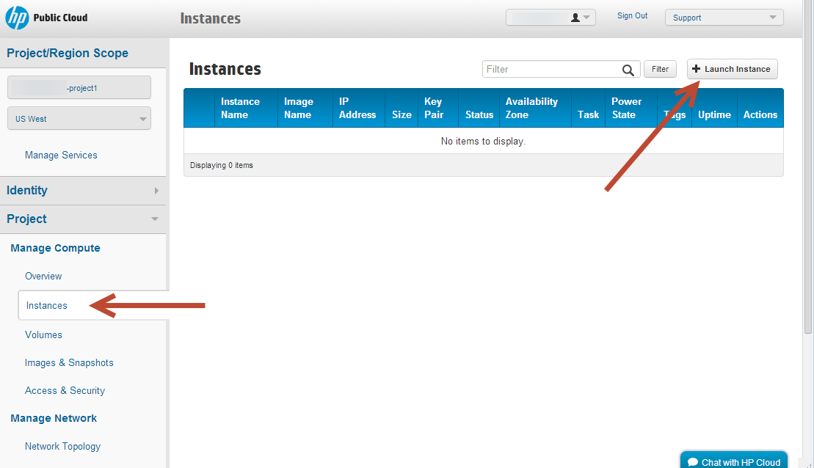

3. You can leave the default choice of the "Any Availability Zone" (AZ) box, which arbitrarily assigns an AZ for an instance or click the drop box to specify  where to locate an instance. **Note**: The default choice locating an instance in any AZ offers high availability, ensuring a high level of operational performance. You can also specify an AZ for an instance if you want to segregate AZs per function for your own organizational purposes; e.g., you could select AZ1 for your data center, and set the remaining two up later for other discrete functions. Such a setup is completely optional as the AZs share all information and work in tandem.

4. Enter a name in the "Instance Name" box.

5. Click the drop-down menu under "Flavor" to select the hardware configuration you want to emulate, i.e., how much disk space and RAM you need. When you select a flavor, the "Flavor Details" box displays the following:

    * Name
    * # of VCPUs
    * Root disk size
    * Ephemeral disk size
    * Total disk size
    * RAM usage

    **Note** The "Project Limits" box under "Flavor Details" graphically displays quotas allowed and usage of Instances, VCPUs, and Total RAM after you select a flavor.

    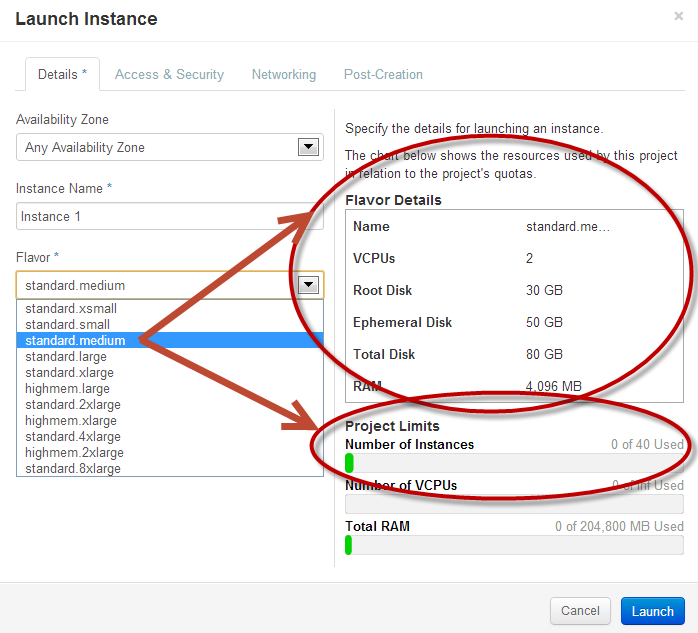

6. Enter the number of instances you want to create under "Instance Count."

7. Select the "Instance Boot Source" source from the drop-down menu. To select an HP Cloud default image, select "Boot from Image" from the drop-down.  

    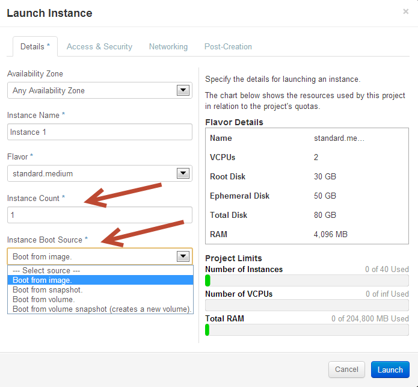

8. Click the "Select Image" drop down under "Image Name." Select one of the images HP Public Cloud provides and click "Launch."

    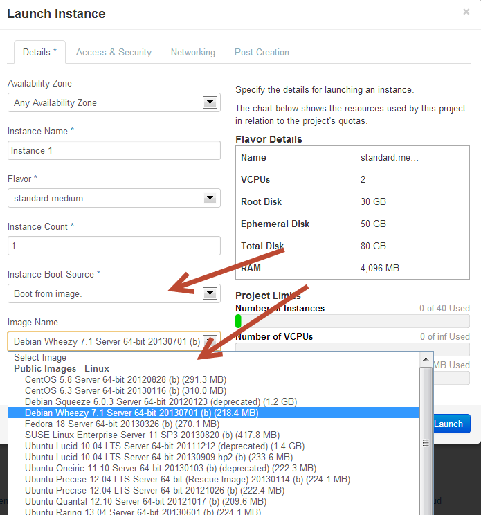

9. Click the "Networking" tab in the upper navigation of  "Launch Instance" and click the "+" next to the network you want to launch an instance from.  You can also drag and drop the network from which you want to launch the instance from the "Available Networks" box to the "Selected Networks" box.

    **Note** If you click "Launch" after "Select Image," before clicking the "Networking" tab, an error message displays; however, you can still select the network desired from the "Available Network" box to the "Selected Networks" box.

10. Click "Launch."

    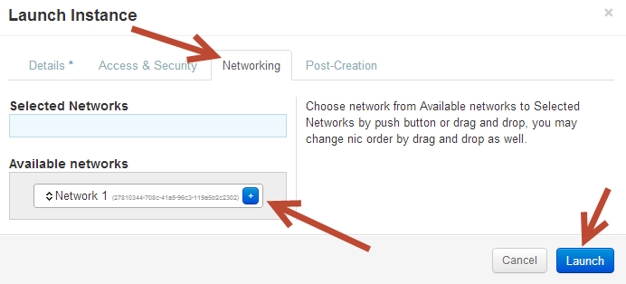

###Create and Attach a Volume### {#Volumes}

A volume is a block storage device you attach to an instance.

**Note**: HP Public Cloud provides a list of images from which you can boot an instance or volume.  While you can also boot from an HP Public Cloud instance you have launched using "Images and Snapshots," it is unnecessary to get up and running in HP Public Cloud and beyond the scope of this document.  
 
1. In the left-hand navigation, click "Volumes" under "Manage Compute."

2. Click "+Create Volume" in the upper right-hand navigation.

    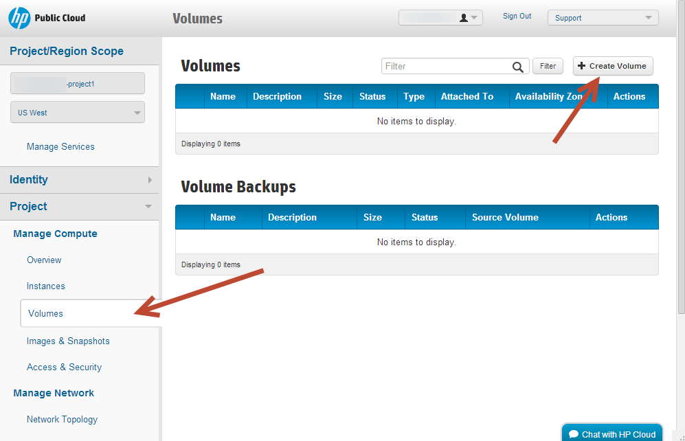

3. Enter a name under "Volume Name" and, optionally, a description in the box below and a "Type" from the following drop-down menu.

4. Staying within the "Volume Limits" shown in the "Create Volume" box, enter a number of GBs under "Size."

    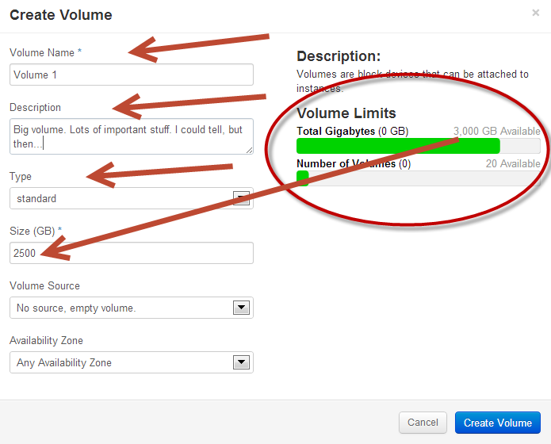

5. Select a volume source from the drop-down menu. 

6. If you select "Image" as your volume source, click the drop-down menu for "Choose an image" under the "Use image as a source" box that appears. Click on the image you want to use. 

    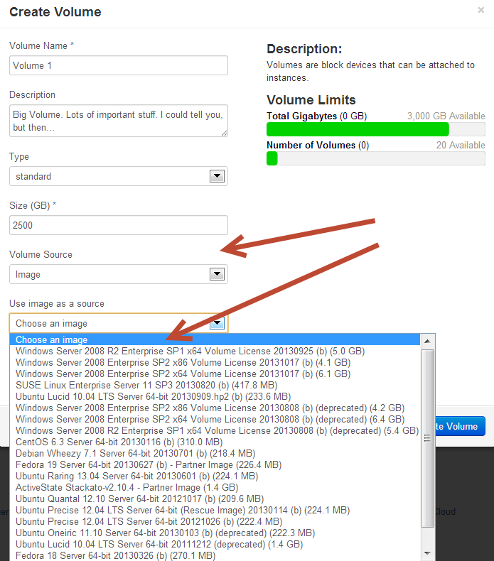

7. Select an AZ. HP Public Cloud recommends the pre-filled "Any Availability Zone."

8. Click "Create Volume."

    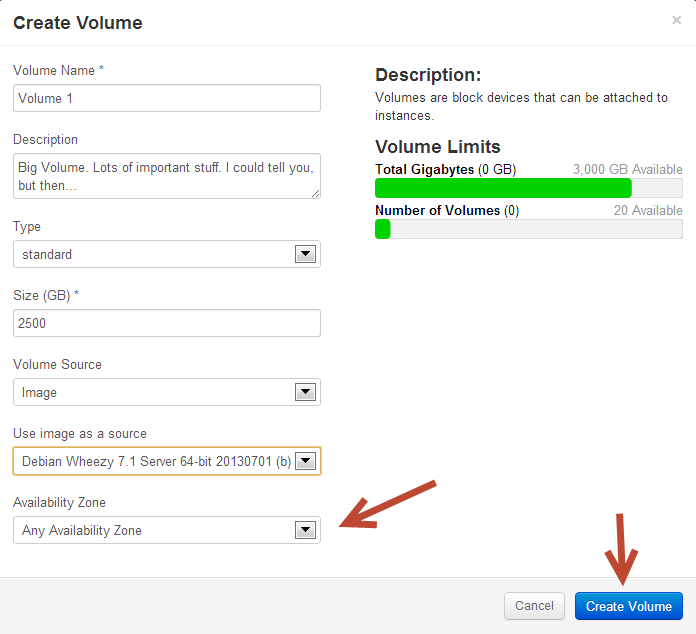

9. To attach the volume to an instance, click "Edit Attachments" under "Action" on the "Volumes" page.

    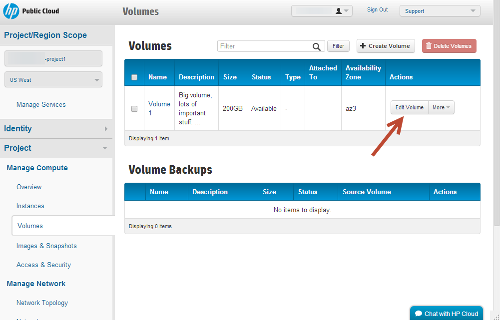

10. Select an instance to attach the volume to from the drop-down menu on the "Manage Volume Attachments" page.

11. Under "Device Name," you can specify a location in the system if desired or enter the displayed default. **Note**: If choosing the default, you must still enter it manually even though it is displayed (greyed out). Otherwise, you receive an error message that you must specify a location. 

12. Click "Attach Volume."

    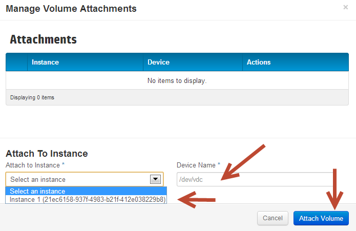

###Images and Snapshots### {#Imagesandsnapshots}

**Functionality Overview**

**Important**: HP Public Cloud provides a list of images from which you can boot an instance.  While you can also boot from an HP Public Cloud instance you have launched and customized using "Images and Snapshots," it is unnecessary to get up and running in the Cloud and beyond the scope of this document. 

While this document does not cover creating snapshots, click "Images and Snapshots" in the left-hand bar to view available server and volume images and their details. For more details, click the image name on the "Images" page. Images listed under "Public" are available to anyone. "Project" images are for your specific project only.

###Access and Security### {#Accessandsecurity}
Security groups and security group rules allow you to specify the type of traffic and direction (inbound/outbound) that is allowed to pass through a network port. A security group is a container for security group rules.

When a port is created in HP Cloud Networking it is associated with a security group. If a security group is not specified the port is associated with a default security group. Security group default rules allow inbound traffic from the same subnet and all outbound traffic. You can add rules to this group to modify behavior or create additional security groups to contain the rules your need.

Click "Access & Security" in the left-hand bar under "Project" and "Manage Compute."   

###Organize and manage HP Cloud Access## {#Identity}

Click  "Identify" in the left-hand interface to display links:

* Domain - The domain is your primary work space in HP Public Cloud.  An individual or company can be the domain owner and enables a project with the necessary services and permissions. The first user created in a domain is considered the domain owner and placed in both the “Users” and “Domain Administrators” groups. 

    A domain has one owner and may have multiple users, groups and roles. A domain owner can allow users of another domain access to its projects.

* Projects – A project is a collection of HP Public Cloud services, e.g., compute, storage, etc. within a domain  A project is defined by selecting services to be activated and a set of users to interact with the services. A Project may contain multiple services, such as compute or object storage. Services can exist multiple times within the same project as long as they have different service endpoints, distinguished by their geography and region.

* Users - Users are defined individually and can be assigned to groups and granted roles either directly or through inclusion in groups.  A user may have multiple roles.

* Groups - When you create a domain, two default groups are created: Users and Domain Administrators. Domain Administrators can add individuals to a group and create new groups, which may contain multiple users. 

* Roles - A role is a user or group  capability within a  service that determines access rights. Roles include  Compute Admin, Network Admin, Object Storage Admin, and others.  Domain owners can  assign roles to individuals or groups. A role may be associated with multiple users and multiple groups.

##For further information## {#Forfurtherinformation}

* For basic information about our HP Cloud compute services, take a look at the [HP Cloud compute overview](/compute/) page
* If you'd rather use the HP Cloud Command Line Interface (CLI) features, choose your topic of interest from our [HP CLoud CLI](/cli) pages.
