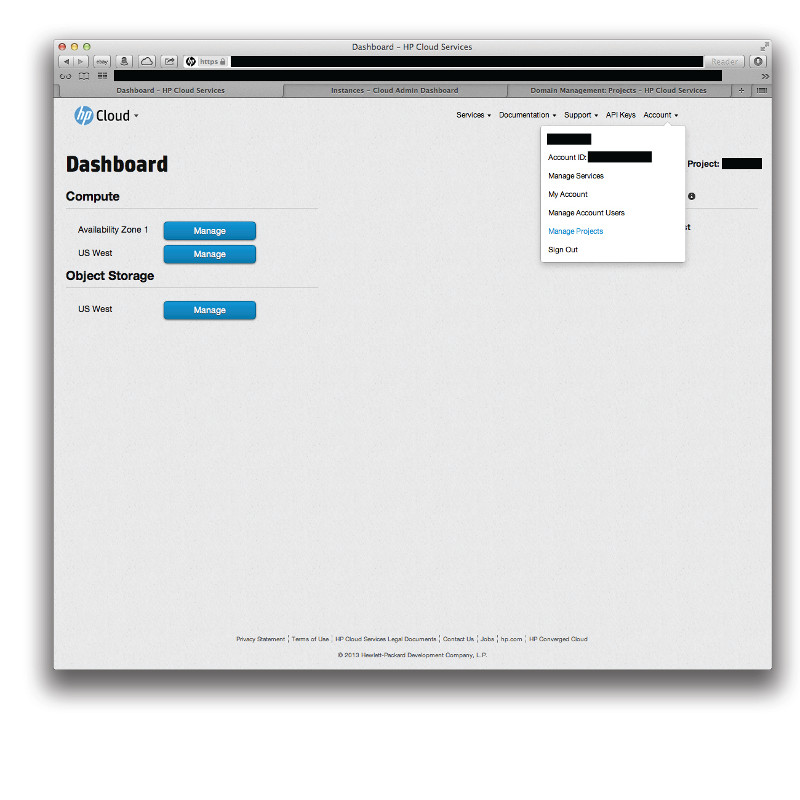
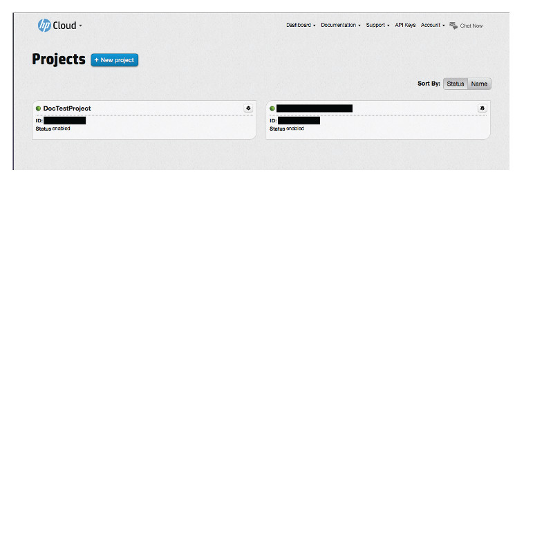

# Management console: Managing projects

This page provides describes to use the management console (MC) to manage your projects with the manage projects screen.  This page covers the following topics:

* [Before you begin](#Overview)
* [Creating a project](#Creating)
* [Disabling a project](#Deleting)
* [Enabling a project](#Enabling)
* [Viewing project details](#Viewing)
* [Editing project details](#Editing)
* [For further information](#ForFurtherInformation)

##Before you begin## {#Overview}

Before you perform any project management, you must:

* [Sign up for an HP Cloud compute account](https://account.hpcloud.com/signup)
* [Activate compute service on your account](/mc/account/using/activating/)
* [Create a network](/mc/compute/networks/create-network/)

##Creating a project## {#Creating}

To create a project in the MC, you can access the project screen by, in the `Account` menu, select `Manage Projects`:

This launches the projects screen of the [account and services dashboard](/mc/account/).  In the projects screen, click the `+ New Project` button to open the new projects pane:

In the new projects pane, enter a `Project name` and `Description`, then click the `Create Project` button.  Your project is created and now appears in the projects screen:

**Note**:  When you create a project, by default it contains one network, one subnet, and one router (which has routes to ext-net and the project's default subnet).

If you have multiple projects, you can sort your list of projects by status or name by clicking your preference on the `Sort By:` toggle in the manage projects screen.

##Disabling a project## {#Deleting}

Information TBD

##Enabling a project## {#Enabling}

Information TBD

##Viewing project details## {#Viewing}

Information TBD

##Editing project details## {#Editing}

Information TBD

##For further information## {#ForFurtherInformation}

* A good place to help you get going managing your account is with our [account and services management use cases](/mc/account/using/)
* Use the MC [site map](/mc/sitemap) for a full list of all available MC documentation pages
* For basic information about our HP Cloud compute services, take a look at the [HP Cloud compute overview](/compute/) page
* If you'd rather use the HP Cloud CLI features, go choose your topic of interest from our [HP CLoud CLI](/cli) pages