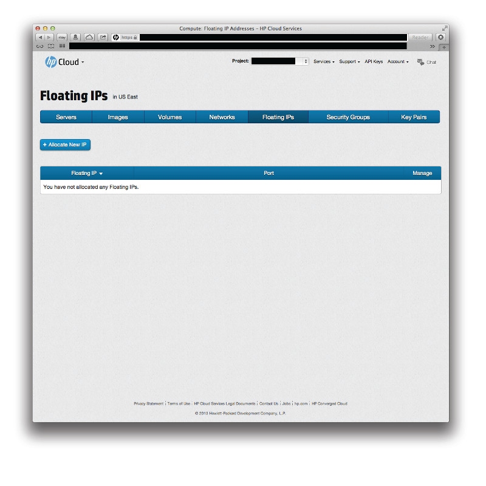

<!--PUBLISHED-->
# Management Console: Floating IPs Screen

The management console (MC) compute dashboard volumes screen allows you to view and manipulate compute floating IPs.  This page covers the following topics:

* [Floating IPs screen overview](#Overview)
* [For further information](#ForFurtherInformation)

##Floating IPs screen overview## {#Overview}

The images screen displays your compute instance floating IP information for the availability zone (AZ) you have selected.

From this screen you can perform the following tasks:

* Connect to a server
* Allocate and deallocate IP addresses
* Attach and detach an IP address to your server

##For further information## {#ForFurtherInformation}

* For basic information about our HP Helion Public Cloud compute services, take a look at the [HP Helion Public Cloud compute overview](/compute/) page
* Use the MC [site map](/mc/sitemap) for a full list of all available MC documentation pages
