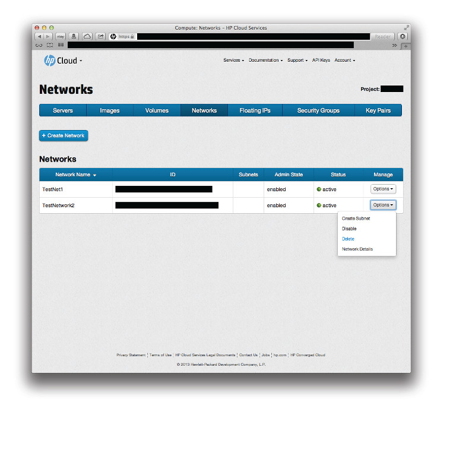

# Management console: Creating and deleting images

This page describes how to create and delete images using the [images screen](/mc/compute/images/) of the [management console](/mc/) (MC).  This page covers the following topics:

* [Before you begin](#Overview)
* [Creating an image](#Creating)
* [Deleting an image](#Deleting)
* [For further information](#ForFurtherInformation)

##Before you begin## {#Overview}

Before you can begin creating or deleting an image, you must:

* [Sign up for an HP Cloud compute account](https://account.hpcloud.com/signup)
* Activate compute service on your account

##Creating an image ## {#Creating}

To create an image, click the `Images` menu bar item.

This launches the images screen.  In the images screen, in the `Image Name` text field enter a name for the image.  In the `Description` text field enter a short description for your image.  Click the `Create` button: 

Your new image is created.

##Deleting a network## {#Deleting}

To delete an existing image, click the `Images` menu bar item.

This launches the images screen.  In the images screen, INFO

Your image is deleted.

<!-- Other methods delete an image? -->

##For further information## {#ForFurtherInformation}

* For basic information about our HP Cloud compute services, take a look at the [HP Cloud compute overview](/compute/) page
* Use the MC [site map](/mc/sitemap) for a full list of all available MC documentation pages
* For information about the Open Stack networking ("Quantum") features, surf on over to  [their Quantum wiki](https://wiki.openstack.org/wiki/Quantum)

