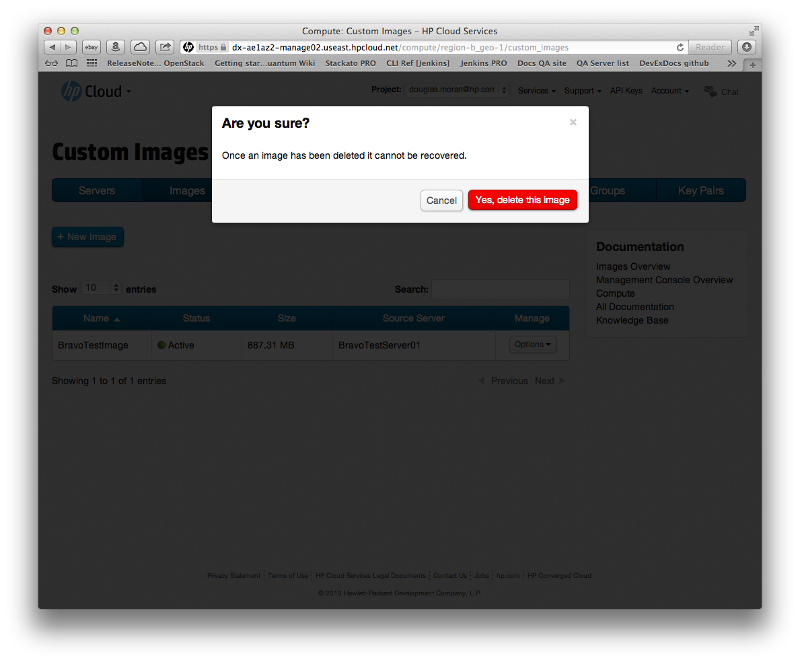
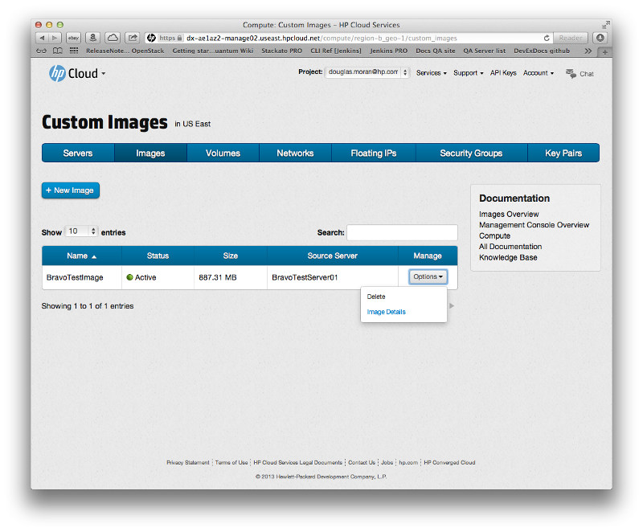
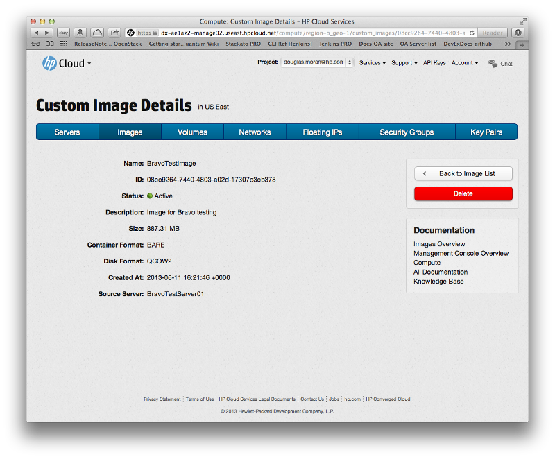

# Management console: Managing images

This page describes how to create and delete images using the [images screen](/mc/compute/images/) of the [management console](/mc/) (MC).  This page covers the following topics:

* [Before you begin](#Overview)
* [Creating an image](#Creating)
* [Deleting an image](#Deleting)
* [Viewing image details](#Viewing)
* [For further information](#ForFurtherInformation)

##Before you begin## {#Overview}

Before you can begin creating or deleting an image, you must:

* [Sign up for an HP Cloud compute account](https://account.hpcloud.com/signup)
* Activate compute service on your account

##Creating an image ## {#Creating}

To create an image, in the [images screen](/mc/compute/images/) click the `+ New Image` menu bar item:

This opens the image creation pane in the images screen:

In the images creation pane, enter a name for your image in the `Image Name` text input field, and (optionally) a description of your image in the `Description` field.  In the `From server` pulldown, select the server from which you would like to create your image.  

Click the `Create` button to create the image with your entered parameters.  The images creation pane closes, and your new image appears in the images list:

The image appears in the list immediately with the status of `Queued`; while your image is being created, the `Status` changes to `Saving` and finally `Active`.

##Deleting an image## {#Deleting}

To delete an existing image, in the [images screen](/mc/compute/images/), in the row for the image you want to delete, in the `Manage` column click the `Options` button and select `Delete`:

A dialog appears to ensure you want to delete that image:

Select `Yes, delete this image` to delete the image; the image is removed and no longer appears in the images list.

Your can also delete an image by clicking the `Delete` button in the [custom image details](#Viewing) screen for that image.

##Viewing image details## {#Viewing}

To access the image details screen, in the [images screen](/mc/compute/images/), in the row for the image you want to delete, in the `Manage` column click the `Options` button and select `Image Details` 

This launches the custom images details screen:

The custom image details screen displays the name, ID, status (active or inactive), description, size, container format (e.g. `BARE`), disk format, creation date, and source server for your image.  You can [delete the image](#Deleting) from this screen by clicking the `Delete` button.

##For further information## {#ForFurtherInformation}

* For basic information about our HP Cloud compute services, take a look at the [HP Cloud compute overview](/compute/) page
* Use the MC [site map](/mc/sitemap) for a full list of all available MC documentation pages
* For information about the Open Stack networking features, surf on over to  [their wiki](https://wiki.openstack.org/wiki/Quantum)

