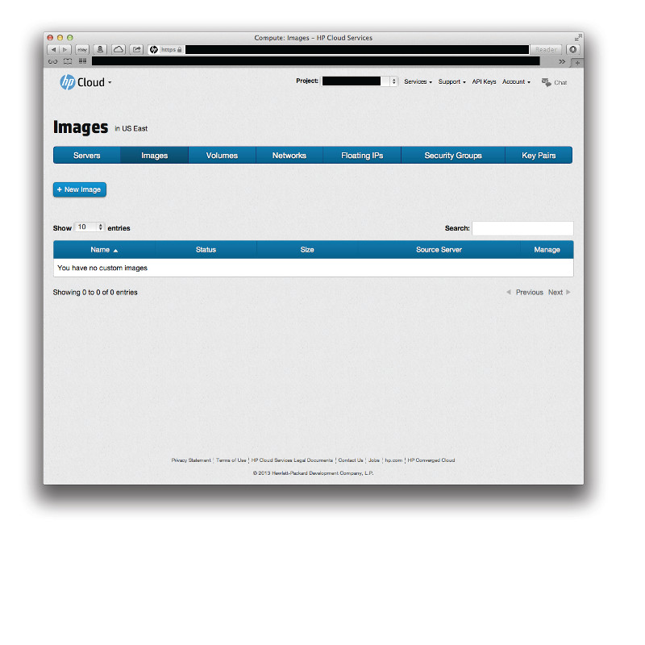

# Management console: Images screen

The management console (MC) compute dashboard images screen allows you to view and manipulate compute instance images.  This page covers the following topics:

* [Images screen overview](#Overview)
* [For further information](#ForFurtherInformation)

##Images screen overview## {#Overview}

The images screen displays your compute instance image information for the availability zone (AZ) you have selected.

The name, status, size, and source server for your images are displayed.  you can sort your list of images based on a particular identifier by just clicking the column heading.  For example, if you want to sort by status, just click the `Status` column header.

Clicking the `+ New Image` button opens the [new image pane](/mc/compute/images/manage#Creating) pane in the images screen:

From the images screen you can:

* [Create an image](/mc/compute/images/manage#Creating)
* [Delete an image](/mc/compute/images/manage#Deleting)

##For further information## {#ForFurtherInformation}

* For basic information about our HP Cloud compute services, take a look at the [HP Cloud compute overview](/compute/) page
* Use the MC [site map](/mc/sitemap) for a full list of all available MC documentation pages