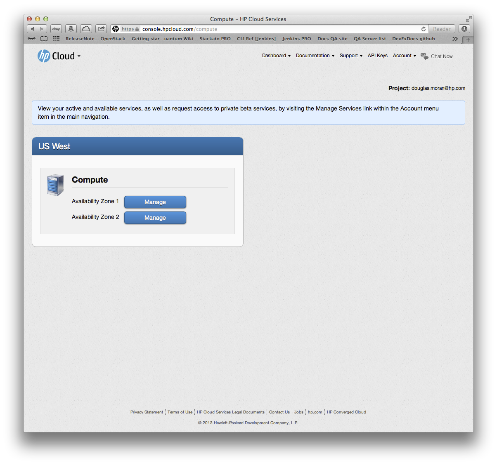

# Management console compute dashboard

This page provides you with an overview of the management console (MC) compute dashboard, which displays your compute information and acts as your main interface to your compute functions.  This page covers the following topics:

* [Compute dashboard overview](#Overview)
* [Navigating to other compute screens](#Navigating)
* [For further information](#ForFurtherInformation)

##Compute dashboard overview## {#Overview}

The MC compute main dashboard displays your active availability zones, divided by region:

In this example, the user has two AZs in the `US West` region.

##Navigating to other compute screens## {#Navigating}

To manage the compute activities for a particular AZ in a particular region, just click the `Manage` button next to the one you're interested in.

Clicking the `Manage` button takes you to the [Servers screen for compute](/mc/compute/servers/).  

The full list screens available for your compute management pleasure:

* [Servers](/mc/computer/servers/)
* [Images](/mc/computer/images/)
* [Volumes](/mc/computer/volumes/)
* [Networks](/mc/computer/networks/)
* [Security groups](/mc/computer/security-groups/)
* [Floating IPs](/mc/computer/floating-ips/)
* [Key pairs](/mc/computer/key-pairs/)

##For further information## {#ForFurtherInformation}

* A good place to help you get going is with our [compute services use cases](/mc/compute/use-cases/)
* For specific functionality--for example, adding [volumes](/mc/compute/volumes)--use the navigation bar at the top of this page; that takes you to whatever section of the MC compute documentation you might be needing
* Use the MC [site map](/mc/sitemap) for a full list of all available MC documentation pages
* For basic information about our HP Cloud compute services, take a look at the [HP Cloud compute overview](/compute/) page
