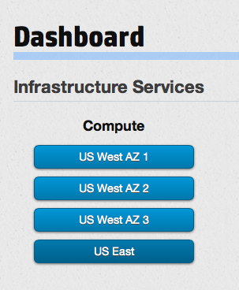

# Management console compute dashboard

This page provides you with an overview of the management console (MC) compute dashboard, which displays your compute information and acts as your main interface to your compute functions.  This page covers the following topics:

* [Compute dashboard overview](#Overview)
* [Navigating to other compute screens](#Navigating)
* [For further information](#ForFurtherInformation)

##Compute dashboard overview## {#Overview}

The MC compute main dashboard displays your active compute instances, divided by region:

In this example, the user has three instances in the `US West` region and one in `US East`.

##Navigating to other compute screens## {#Navigating}

You can navigate to your preferred service in one of two easy ways.  First, you can simply choose your service (and availability zone) from the top-level menu bar.  For example, if you want to go to the compute dashboard, in the `Services` menu select the `Compute` service you want:

You can also navigate by clicking the appropriate button in the service pane.  For example, if you want to navigate to the compute dashboard for the US East region, in the compute pane click the `US East` button:

The full list screens available for your compute management pleasure:

* [Servers](/mc/compute/servers/)
* [Images](/mc/compute/images/)
* [Volumes](/mc/compute/volumes/)
* [Networks](/mc/compute/networks/)
* [Security groups](/mc/compute/security-groups/)
* [Floating IPs](/mc/compute/floating-ips/)
* [Key pairs](/mc/compute/key-pairs/) 

##For further information## {#ForFurtherInformation}

* A good place to help you get going is with our [compute services use cases](/mc/compute/using/)
* For specific functionality--for example, adding [volumes](/mc/compute/volumes)--use the navigation bar at the top of this page; that takes you to whatever section of the MC compute documentation you might be needing
* Use the MC [site map](/mc/sitemap) for a full list of all available MC documentation pages
* For basic information about our HP Cloud compute services, take a look at the [HP Cloud compute overview](/compute/) page
* If you'd rather use the HP Cloud CLI features, go choose your topic of interest from our [HP CLoud CLI](/cli) pages
