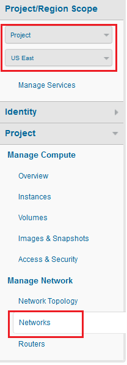
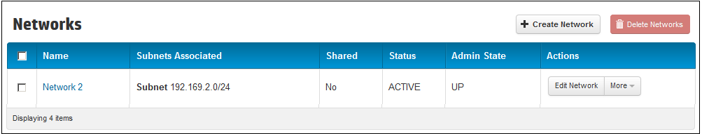
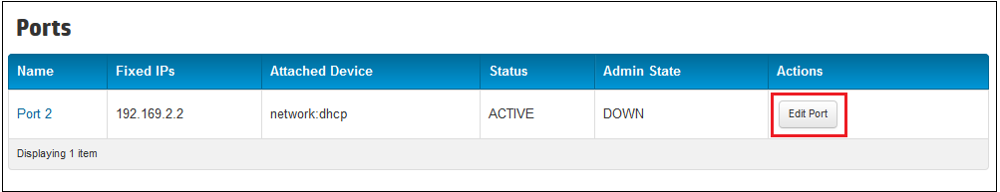
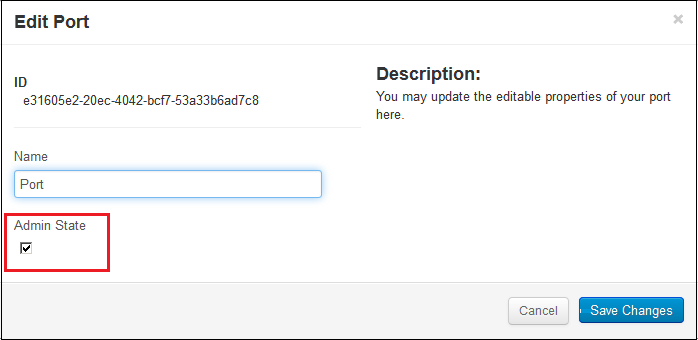

# Management console: Managing ports #

With the default network configuration the instance you create will also create a port automatically for you, with an IP assigned from your subnet, and attach it to your default network.

<!--What is this port? -->

A port represents a virtual switch port on a logical network switch. Virtual instances attach their interfaces into ports. The logical port also defines the MAC address and the IP address(es) to be assigned to the interfaces plugged into them.

When IP addresses are associated to a port, this implies the port is associated with a subnet, as the IP address was taken from the allocation pool for a specific subnet.

You create ports automatically when you create a subnet or a router.
Create network with a subnet (DHCP port)
Add subnet to existing network (DHCP port)
Create router

This page covers how to create and delete a port using the networks screen of the Horizon-based HP Cloud Management Console.  This page covers the following topics:

* [Before you begin](#Overview)
* [Renaming a port](#Rename)
* [Enabling a port](#Enable)
* [Disabling a router](#Disable)
* [For further information](#ForFurtherInformation)

##Before you begin## {#Overview}

Before you perform any network management on your routers, you must:

* [Sign up for an HP Cloud compute account](https://account.hpcloud.com/signup)
* [Activate compute service on your account](https://community.hpcloud.com/article/getting-started-compute-135#actservice)
* [Create a network](/mc/compute/networks/create-network/) that has an associated subnet.

<!--When cloudadmin tool deployed, add a link to it here?-->
<!--Include a link to the CLI process for creating a router here as well?-->

## Rename a port ## {#Rename}

When you create a subnet, a port is automatically created and assigned an ID. On the HP Cloud Management Console **Network Overview** page, the ID appears as the name for the port. You can assign a more meaningful name for the port, if needed.

To rename a port:

1. Log in to the [HP Cloud Management Console](https://horizon.hpcloud.com/).

2. Select the appropriate project and region under the **Project/Region Scope** section.

	

3. Select the **Networks** tab under the **Project** section.

4. Click the network associated with the port on the **Networks** screen.

	

5. Locate the port to enable on the **Network Overview** screen.

	

6. In the **Actions** column, click **Edit Port**. 

7. Enter a name for the port in the **Name** field.

8. Click **Save Changes**.

## Enable a port ## {#Enable}

Ports are enabled by default. However, if a port has been diabled, you can enable the port by turning the administrative status `UP`.

To enable a port:

1. Log in to the [HP Cloud Management Console](https://horizon.hpcloud.com/).

2. Select the appropriate project and region under the **Project/Region Scope** section.

	

3. Select the **Networks** tab under the **Project** section.

4. Click the network associated with the port on the **Networks** screen.

	

5. Locate the port to enable on the **Network Overview** screen.

	

6. In the **Actions** column, click **Edit Port**. 

7. Select the **Admin State** option to enable the port. 

	

8. Click **Save Changes**.

## Disable a port ## {#Disable}

Ports are enabled by default. However, you can disable a port. You disable a port by turning the administrative status `DOWN`. 

To disable a port:

1. Log in to the [HP Cloud Management Console](https://horizon.hpcloud.com/).

2. Select the appropriate project and region under the **Project/Region Scope** section.

	

3. Select the **Networks** tab under the **Project** section.

4. Click the network associated with the port on the **Networks** screen.

	

5. Locate the port to disable on the **Network Overview** screen.

	

6. In the **Actions** column, click **Edit Port**. 

7. Clear the **Admin State** option to enable the port. 

	

8. Click **Save Changes**.

##For further information## {#ForFurtherInformation}

* For information about the router details screen, take a look at the [Viewing router details](/mc/compute/networks/view-router/) page
* For basic information about our HP Cloud compute services, take a look at the [HP Cloud compute overview](/compute/) page
* Use the MC [site map](/mc/sitemap) for a full list of all available MC documentation pages
* For information about the Open Stack networking features, surf on over to [their networking wiki](https://wiki.openstack.org/wiki/Quantum)
