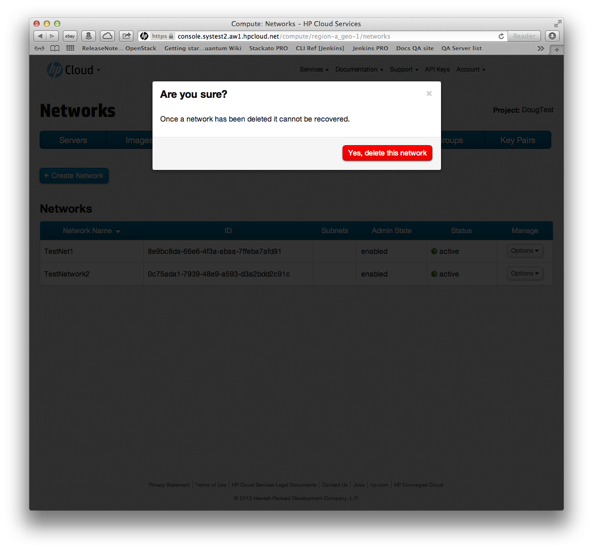

# Management console: Creating and deleting a network

This page covers how to create and delete a network using the networks screen of the management console (MC).  This page covers the following topics:

* [Before you begin](#Overview)
* [Creating a network](#Creating)
* [Deleting a network](#Deleting)
* [For further information](#ForFurtherInformation)

##Before you begin## {#Overview}

Before you can begin creating or deleting a network, you must:

* [Sign up for an HP Cloud compute account](https://account.hpcloud.com/signup)
* Activate compute service on your account

**Note**: By default, when you [create a project](/mc/account/projects#Creating) (in the [account and services](/mc/account/) dashboard), your project is provisioned with a network (username-network), a subnet (username-subnet), and a router (username-router) that is automatically connected to the internet, allowing you to perform tasks such as spinning up servers without accessing the MC networks capability.  The networks screens allow you to control the networks behaviors beyond this default.

##Creating a network## {#Creating}

To create a network, click the `+ Create Network` button in the [networks screen](/mc/compute/networks/):

ILLUSTRATION TBD

This launches the network creation screen.

In the network creation screen, in the `Network Info` pane, enter a name for your network in the `Name` text-entry field and click the `Create` button.  Your new network namespace is created.  This new network appears in the list on the main networks screen.  (To return to the main networks screen, just click the `Networks` item in the menu bar.)

**Next** we suggest you look at the page on [creating a subnet](/mc/compute/networks/manage-subnet/) for your network.  

##Deleting a network## {#Deleting}

To delete an existing network, in the `Manage` column of the `Networks` list, select the `Options` button in the row of the network you want to delete, and choose the `Delete` option.

A verfication window appears asking if you want to delete this network:

Select the button `Yes, delete this network`.  Your network is deleted and no longer appears in the list on the [networks screen](/mc/compute/networks/).

You can also delete a network from its [network details](/mc/compute/networks/view-network/) screen.  In the networks screen, in the `Networks` list, click the name of the network that you want to delete.  This launches the network details screen:

To delete the network, click the `Delete Network` button.  As in the other method, a verification window appears asking if you want to delete this network.

Select the button `Yes, delete this network`.  Your network is deleted and no longer appears in the list on the [networks screen](/mc/compute/networks/).

**Note**: You must [delete all the subnets](/mc/compute/networks/manage-subnet#Deleting/) of your network before you can delete the network itself.

##For further information## {#ForFurtherInformation}

* For information about the network details screen, take a look at the [Viewing network details](/mc/compute/networks/view-network/) page
* For basic information about our HP Cloud compute services, take a look at the [HP Cloud compute overview](/compute/) page
* Use the MC [site map](/mc/sitemap) for a full list of all available MC documentation pages
* For information about the Open Stack networking ("Quantum") features, surf on over to  [their Quantum wiki](https://wiki.openstack.org/wiki/Quantum)

