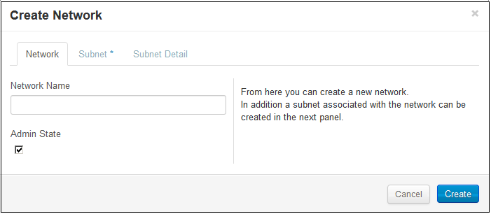

# Management console: Managing ports #

With the default network configuration the instance you create will also create a port automatically for you, with an IP assigned from your subnet, and attach it to your default network.

<!--What is this port? -->

A port represents a virtual switch port on a logical network switch. Virtual instances attach their interfaces into ports. The logical port also defines the MAC address and the IP address(es) to be assigned to the interfaces plugged into them.

When IP addresses are associated to a port, this implies the port is associated with a subnet, as the IP address was taken from the allocation pool for a specific subnet.

You create ports automatically when you create a subnet or a router.
Create network with a subnet (DHCP port)
Add subnet to existing network (DHCP port)
Create router

 

This page covers how to create and delete a port using the networks screen of the management console (MC).  This page covers the following topics:

* [Before you begin](#Overview)
* [Enabling a port](#Enabling)
* [Disabling a router](#Disabling)
* [For further information](#ForFurtherInformation)

##Before you begin## {#Overview}

Before you perform any network management on your routers, you must:

* [Sign up for an HP Cloud compute account](https://account.hpcloud.com/signup)
* [Activate compute service on your account](https://community.hpcloud.com/article/getting-started-compute-135#actservice)
* [Create a network](/mc/compute/networks/create-network/)

<!--When cloudadmin tool deployed, add a link to it here?-->
<!--Include a link to the CLI process for creating a router here as well?-->

##Enabling a router## {#Enabling}

When you enable the compute service, a router is enabled by default.  If you have [disabled](#Disabling) the router, to enable it, in the `Manage` column, select the `Options` button for the router you wish to disable and click the `Disable` item:

 

##Disabling a router## {#Disabling}

When you enable the compute service, a router is enabled by default.  To disable the router, in the `Manage` column, select the `Options` button for the router you wish to disable and click the `Disable` item:

##Attaching an interface to a router## {#Attaching}

To attach an interface to a router, you must first open the [router details](/mc/compute/networks/view-router) screen.  In the `Manage` column, select the `Options` button for the router you wish to view the details of and click the `Router Details` item:

##For further information## {#ForFurtherInformation}

* For information about the router details screen, take a look at the [Viewing router details](/mc/compute/networks/view-router/) page
* For basic information about our HP Cloud compute services, take a look at the [HP Cloud compute overview](/compute/) page
* Use the MC [site map](/mc/sitemap) for a full list of all available MC documentation pages
* For information about the Open Stack networking features, surf on over to [their networking wiki](https://wiki.openstack.org/wiki/Quantum)
