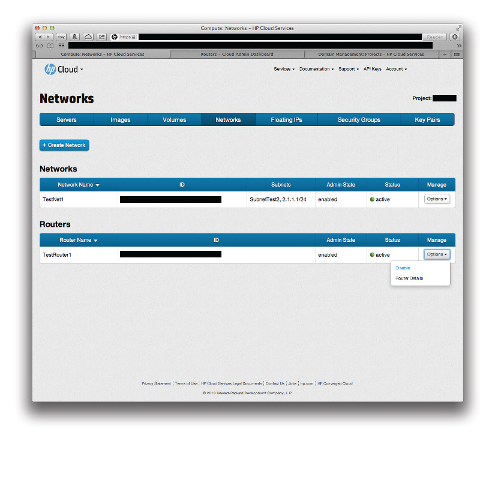
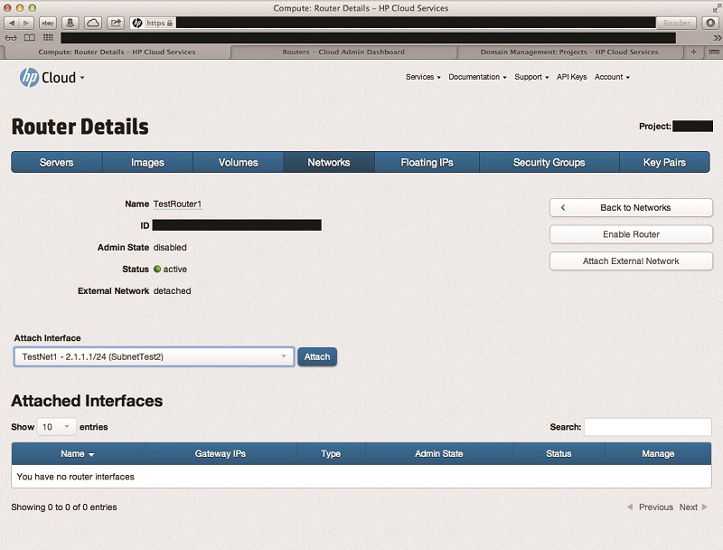
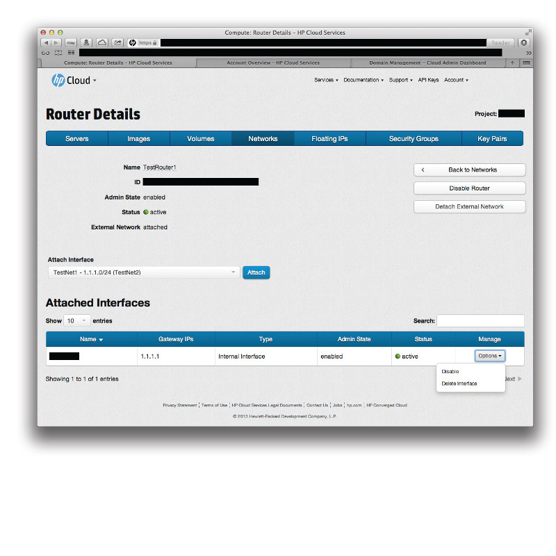
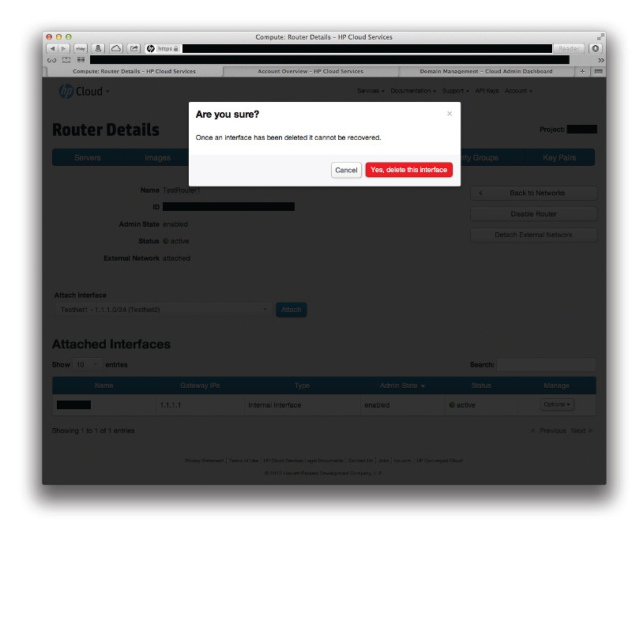

# Management console: Managing routers

This page covers how to create and delete a router using the networks screen of the management console (MC).  This page covers the following topics:

* [Before you begin](#Overview)
<!--Can users enable/disable routers in 13.5?
* [Enabling a router](#Enabling)
* [Disabling a router](#Disabling) -->
* [Attaching an interface to a router](#Attaching)
* [Detaching an interface from a router](#Detaching)
* [Attaching a router to an external network](#AttachExternal)
* [Detaching a router from an external network](#DetachExternal)
* [For further information](#ForFurtherInformation)

##Before you begin## {#Overview}

Before you perform any network management on your routers, you must:

* [Sign up for an HP Cloud compute account](https://account.hpcloud.com/signup)
* Activate compute service on your account
* [Create a network](/mc/compute/networks/create-network/)

<!--When cloudadmin tool deployed, add a link to it here?-->
<!--Include a link to the CLI process for creating a router here as well?-->

<!--Can users enable/disable routers in 13.5?
##Enabling a router## {#Enabling}

When you enable the compute service, a router is enabled by default.  If you have [disabled](#Disabling) the router, to enable it, in the `Manage` column, select the `Options` button for the router you wish to disable and click the `Disable` item:

 

##Disabling a router## {#Disabling}

When you enable the compute service, a router is enabled by default.  To disable the router, in the `Manage` column, select the `Options` button for the router you wish to disable and click the `Disable` item:

-->

##Attaching an interface to a router## {#Attaching}

To attach an interface to a router, you must first open the [router details](/mc/compute/networks/view-router) screen.  In the `Manage` column, select the `Options` button for the router you wish to view the details of and click the `Router Details` item:

You can also launch the router details screen by, in the `Router Name` column,  clicking the name of the router you wish to view the details of.

In the router details screen, in the `Attach Interface` rolling menu, select the interface you wish to attach, then click the `Attach` button.

Your newly-attached interface is displayed in the `Attached Interfaces` list.

##Detaching an interface from a router## {#Detatching}

To detach an interface from a router, you must first open the [router details](/mc/compute/networks/view-router) screen.  In the `Manage` column, select the `Options` button for the router you wish to view the details of and click the `Router Details` item:

You can also launch the router details screen by, in the `Router Name` column,  clicking the name of the router you wish to view the details of.

In the router details screen, in the list of attached interfaces, in the `Manage` column, select `Delete Interface`.

A dialog appears to ensure you want to delete that interface:

Select `Yes, delete this interface`.  This removes the subnet from the router; the subnet still exists in the network itself, but is not attached to the router. 

##Attaching a router to an external network## {#AttachExternal}

To attach a router to an external network, you must first open the [router details](/mc/compute/networks/view-router) screen.  In the `Manage` column, select the `Options` button for the router you wish to view the details of and click the `Router Details` item:

You can also launch the router details screen by, in the `Router Name` column, clicking the name of the router you wish to view the details of.

In the router details screen, click the `Attach External Network` button to attach that router to the external network.

##Detaching a router from an external network## {#DetachExternal}

To detach a router from an external network, you must first open the [router details](/mc/compute/networks/view-router) screen.  In the `Manage` column, select the `Options` button for the router you wish to view the details of and click the `Router Details` item:

You can also launch the router details screen by, in the `Router Name` column,  clicking on the name of the router you wish to view the details of.

In the router details screen, click the `Detach External Network` button to detach that router from the external network.

##For further information## {#ForFurtherInformation}

* For information about the router details screen, take a look at the [Viewing router details](/mc/compute/networks/view-router/) page
* For basic information about our HP Cloud compute services, take a look at the [HP Cloud compute overview](/compute/) page
* Use the MC [site map](/mc/sitemap) for a full list of all available MC documentation pages
* For information about the Open Stack networking features, surf on over to [their networking wiki](https://wiki.openstack.org/wiki/Quantum)
