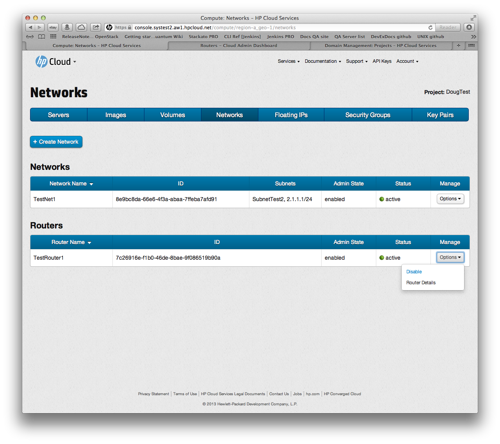

# Management console: Managing routers

This page covers how to create and delete a router using the networks screen of the management console (MC).  This page covers the following topics:

* [Before you begin](#Overview)
* [Enabling a router](#Enabling)
* [Disabling a router](#Disabling)
* 
* [For further information](#ForFurtherInformation)

##Before you begin## {#Overview}

Before you perform any network management on your routers, you must:

* [Sign up for an HP Cloud compute account](https://account.hpcloud.com/signup)
* [Activate compute service on your account](/mc/account/using/activating/)
* [Create a network](/mc/compute/networks/create-network/)
* Create a router by [creating a project](/mc/account/projects#Creating) in the [account and services](/mc/account/) dashboard

<!--When cloudadmin tool deployed, add a link to it here?-->
<!--Include a link to the CLI process for creating a router here as well?-->

From laura: each project is provisioned with one router automatically we don't allow creation or deletion of routers from the MC at this point only management
To create a router, you'll need to go make one in Cloud Admin or via CLI
From the deck: At the time of project creation, each project is provisioned with one network, one subnet, and one router, which will have routes to ext-net and project's default subnet

Create new projects from the projects screen:  https://account.hpcloud.com/projects
my doc for the manage projects screen: /mc/account/projects/
creating a project: /mc/account/projects#Creating

##Enabling a router## {#Enabling}

When you [create a router](/mc/account/projects/), the routing instance is enabled by default.  If you have [disabled](#Disabling) the router, to enable it, in the `Manage` column, select the `Options` button for the router you wish to disable and click the `Disable` item:

 

##Disabling a router## {#Disabling}

When you [create a router](/mc/account/projects/), the routing instance is enabled by default.  To disable the router, in the `Manage` column, select the `Options` button for the router you wish to disable and click the `Disable` item:

##Attaching an interface to a router## {#Attaching}

To attach an interface to a router, you must first open the (router details](/mc/compute/networks/view-router) screen.  You can, in the `Manage` column, select the `Options` button for the router you wish to view the details of and click the `Router Details` item:

You can also launch the router details screen by, in the `Router Name` column,  clicking on the name of the router you wish to view the details of.

In the router details screen, in the `Attach Interface` rolling menu, select the interface you wish to attach, then click the `Attach` button.

Your newly-attached interface is displayed in the `Attached Interfaces` list.

##Detatching an interface from a router## {#Detatching}

info

##For further information## {#ForFurtherInformation}

* For basic information about our HP Cloud compute services, take a look at the [HP Cloud compute overview](/compute/) page
* Use the MC [site map](/mc/sitemap) for a full list of all available MC documentation pages
* For information about the Open Stack networking ("Quantum") features, surf on over to  [their Quantum wiki](https://wiki.openstack.org/wiki/Quantum)
