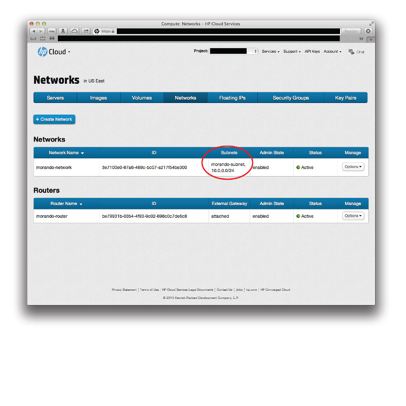
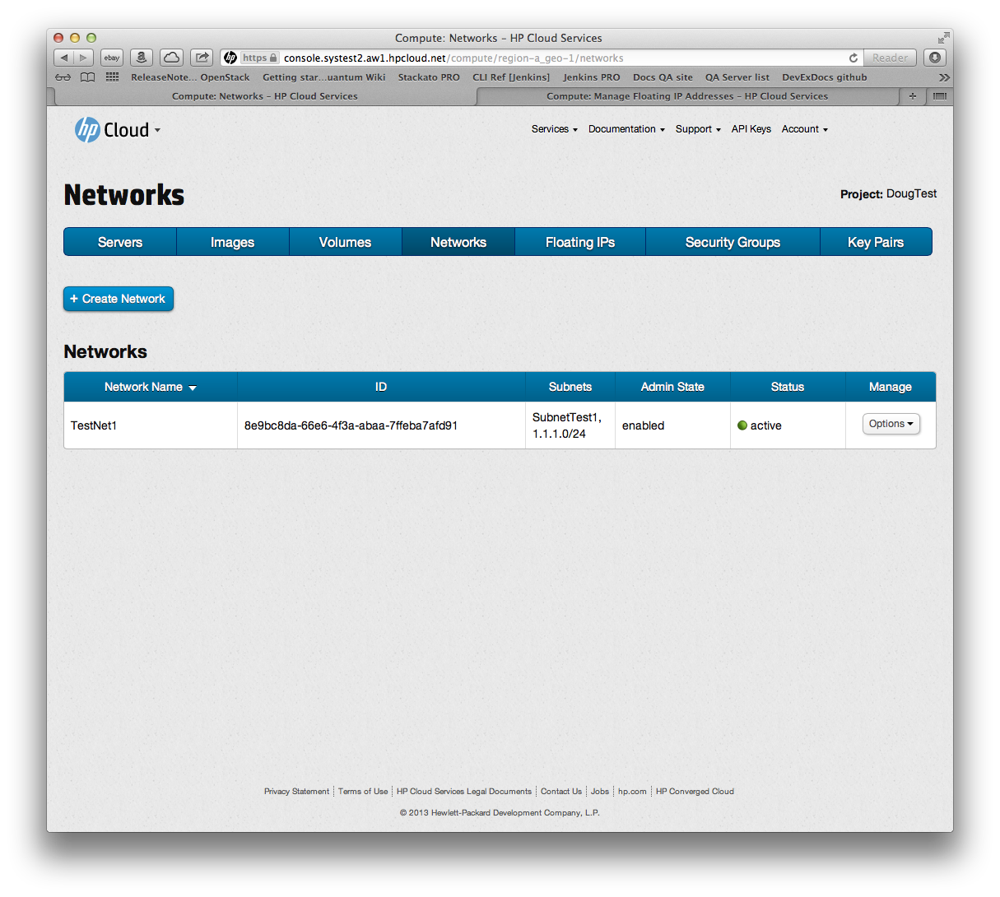
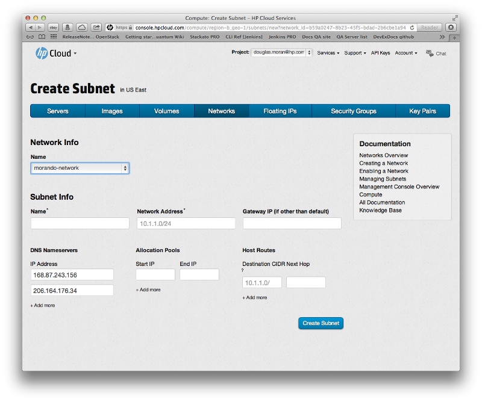
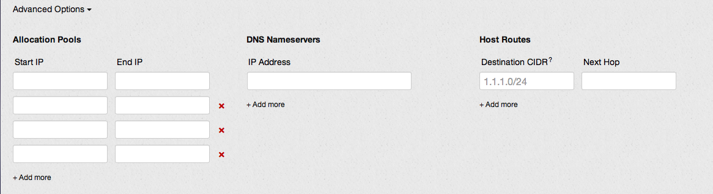
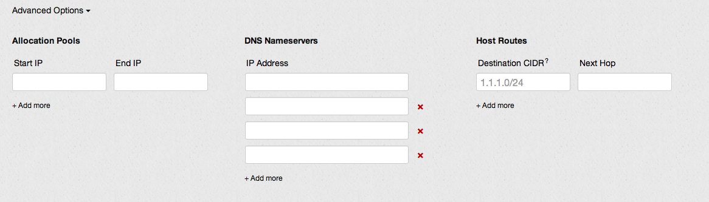
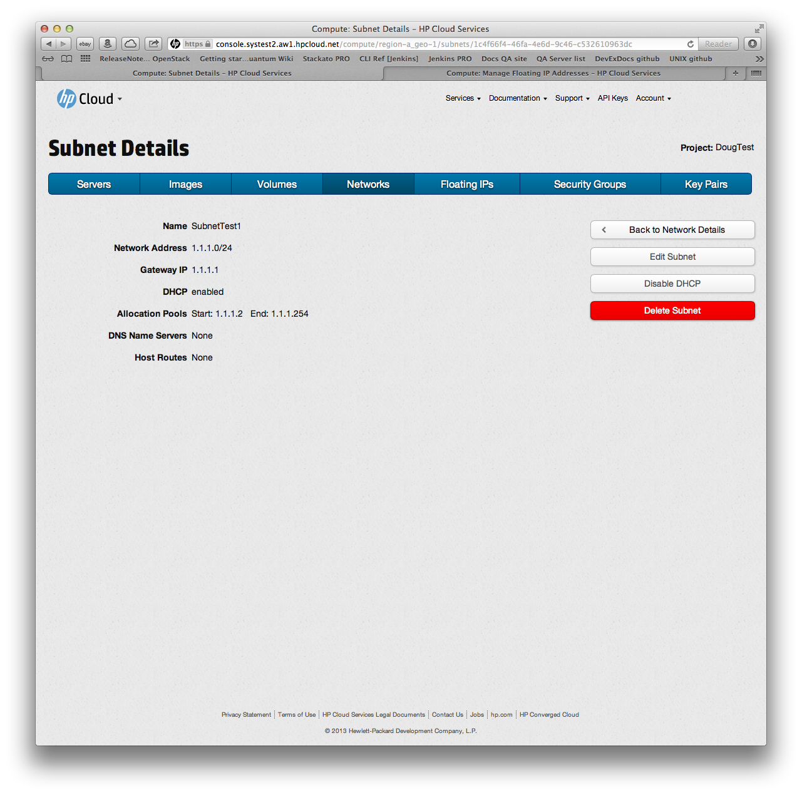

# Management console: Managing a subnet

This page covers how to create and delete a subnet using the networks screen of the management console (MC).  This page covers the following topics:

* [Before you begin](#Overview)
* [Creating a subnet](#Creating)
* [Advanced subnet options](#Advanced)
* [Editing a subnet](#Editing)
* [Enabling and disabling DHCP](#DHCP)
* [Deleting a subnet](#Deleting)
* [For further information](#ForFurtherInformation)

##Before you begin## {#Overview}

Before you can create or delete a subnet of an existing network, you must:

* [Sign up for an HP Cloud compute account](https://account.hpcloud.com/signup)
* [Activate compute service on your account](/mc/account/using/activating/)
* [Create a network](/mc/compute/networks/create-network#Creating/)

##Creating a subnet## {#Creating}

By default, when you [create a network](/mc/compute/networks/create-network/), that network is created with no subnets.  

To create a subnet, in the `Manage` column, select the `Options` button for the network for which you want to create a subnet and select `Create Subnet`:

This launches the subnet creation screen.  

In the subnet creation screen, in the `Subnet Info` pane, enter a name for your subnet in the `Name` text-entry field, the network address for the subnet in the `Network Address` field, (optionally) a Gateway IP address in the `Gateway IP` field (if you want to assign a specific Gateway IP rather than use the default), and click the `Create Subnet` button.  You are returned to the networks screen and your new subnet is displayed in the `Subnets` column:

You can also create a subnet from the [network details](/mc/compute/networks/view-network/) screen.

In the network details screen, just click the `Create Subnet` button.  This launches the subnet creation screen as outlined above; follow the same process from there.

**Note**: When you're creating a subnet, you can also include other subnet details like  allocation pools or DNS Nameservers.  For details, see the section on [advanced subnet options](#Advanced) below.

##Advanced subnet options## {#Advanced}

You can use the Advanced Options pane of the create subnet screen to add other options to your subnet.  This pane is contracted by default; just click the `Advanced Options` button:

You can set the following options via the Advanced Options pane of the create subnet screen:

* [Allocation Pools](#AllocationPools)
* [DNS Nameservers](#DNSNameservers)
* [Host Routes](#HostRoutes)

###Allocation Pools### {#AllocationPools}

To create an allocation pool in the Advanced Options pane, enter the `Start IP` and `End IP` values you want for your subnet in the text entry fields.  If you want to create more than one allocation pool, click the `+Add more` button and additional text entry fields are added.

###DNS Nameservers### {#DNSNameservers}

To create a DNS Nameserver in the Advance Options pane, enter the `IP Address` you want for your subnet in the text entry field.  If you want to create more than one DNS nameserver, click the `+Add more` button and additional text entry fields are added.

###Host Routes### {#HostRoutes}

To create host routes in the Advanced Options pane, enter the `Destination CIDR` and `Next Hop` you want for your subnet in the text entry fields.  If you want to create more than one DNS nameserver, click the `+Add more` button and additional text entry fields are added.

##Editing a subnet## {#Editing}

To modify details of your subnet (such as the name, gateway IP axdress, host routes, and so on), you can use the edit subnet details screen.  There are 

From the main networks screen, click the name of the subnet you want to modify in the `Subnets` column of the `Networks` list:

This launches the subnet details screen.  In the subnet details screen, click the `Edit Subnet` button:

In the edit subnet screen, edit the detail you want to edit and then click the `Update Subnet` button to save your changes.

##Enabling and disabling DHCP## {#DHCP} 

Dynamic host configuration protocol (DHCP) is enabled on your subnet by default.  To disable DHCP for your subnet, in the main networks screen, click the name of the subnet you want to modify in the `Subnets` column of the `Networks` list:

This launches the subnet details screen.  In the subnet details screen, click the `Disable DHCP` button.  DHCP is now disabled on your subnet

If you have at some point disabled DHCP and want to re-enable, click the name of the subnet you want to modify in the `Subnets` column of the `Networks` list:

This launches the subnet details screen.  In the subnet details screen, click the `Enable DHCP` button.  DHCP is now enabled on your subnet

##Deleting a subnet## {#Deleting}

By default, when you [create a network](/mc/compute/networks/create-network/), that network is created with no subnets. If you used the subnet creation screen [create a subnet](/mc/compute/networks/create-subnet#Creating) to create a subnet that you now want to delete, click the subnet you want to delete:

This launches the subnet information screen.

To delete the subnet, click the `Delete Subnet` button.  A verification window appears asking if you want to delete this network:

Select the button `Yes, delete this subnet`.  Your subnet is deleted and no longer appears in the list in the `Subnets` column on the [networks screen](/mc/compute/networks/).

You can also launch the subnet details screen from the [network details](/mc/compute/networks/view-network/) screen.

Just click the subnet name for the subnet you want to delete, and then follow the process outlined above. 

##For further information## {#ForFurtherInformation}

* For information about the subnet details screen, take a look at the [Viewing subnet details](/mc/compute/networks/view-subnet/) page
* For basic information about our HP Cloud compute services, take a look at the [HP Cloud compute overview](/compute/) page
* Use the MC [site map](/mc/sitemap) for a full list of all available MC documentation pages
* For information about the Open Stack networking ("Quantum") features, surf on over to  [their Quantum wiki](https://wiki.openstack.org/wiki/Quantum)
