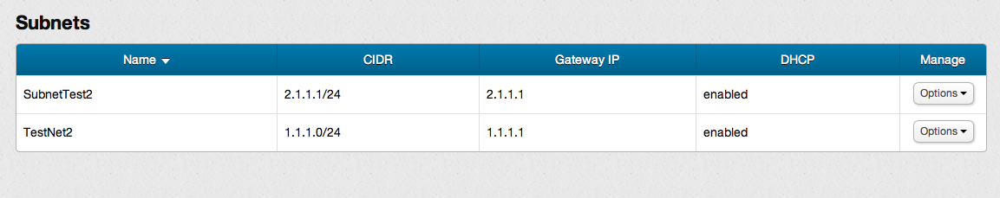
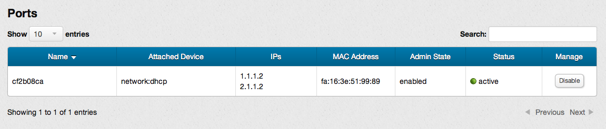
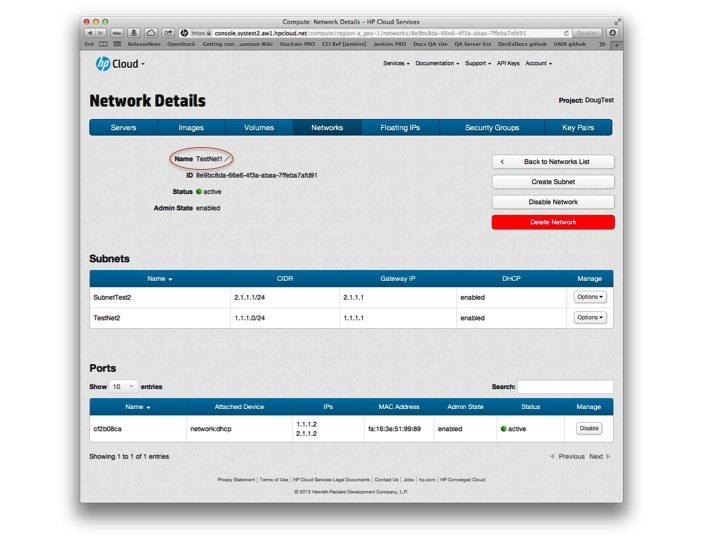

# Management console: Viewing network details

This page covers how to view network details using the networks screen of the management console (MC).  This page covers the following topics:

* [Before you begin](#Overview)
* [Accessing the network details screen](#Accessing)
* [Organization of the network details screen](#Organization)
* [Sorting lists](#Sorting)
* [Editing network names](#Editing)
* [Network details screen available features](#Features)
* [For further information](#ForFurtherInformation)

##Before you begin## {#Overview}

Before you can view the details of an existing network, you must:

* [Sign up for an HP Cloud compute account](https://account.hpcloud.com/signup)
* Activate compute service on your account
* [Create a network](/mc/compute/networks/create-network#Creating/)

##Accessing the network details screen## {#Accessing}

You can access the network details screen from the [network screen](/mc/compute/networks) by, in the `Manage` column of the `Networks` list, select the `Options` button in the row of the network you want to delete, and choose the `Network Details` option.

You can also launch the network details screen from the network screen by, in the `Networks` list, clicking the name of the network for which you want to examine the details.

##Organization of the network details screen## {Organization}

The network details screen is divided into several panes: information pane, subnets pane, and ports pane:

The information pane provides basic information about the selected network, such as the name, ID, and status.  It also contains buttons to allow you to enable and disable the network, create a subnet, and delete the network.

The subnets pane lists the subnets for the network, including their CIDR, Gateway IP, and DHCP information.  The list is sorted by `Name` by default.

The ports pane lists the ports for the network, including any attached devices, IPs, MAC address, admin state, and status.  The list is sorted by `Name` by default.

##Sorting lists## {#Sorting}

You can sort the lists of subnets (in the subnet pane) or ports (in the ports pane) in the network details screen based on a particular identifier by just clicking the column heading.  For example, if you want to sort the subnets list by gateway IP address, just click the `Gateway IP` column header.

##Editing network names## {#Editing}

You can edit the name of a network in the network details screen.  In the information pane, click the `Name` of the network.

In the pop-up displayed, enter the new name and press the `Enter` key on your keyboard to rename the network.

##Network details screen available features## {#Features}

The network details screen provides you access to the following functions:

* [Creating a subnet](/mc/compute/networks/manage-subnet#Creating/)
* [Deleting a subnet](/mc/compute/networks/manage-subnet#Deleting/)
* [Accessing the subnet details screen](/mc/compute/networks/view-subnet/)
* [Disabling a network](/mc/compute/networks/enable-network#Disabling/)
* [Enabling a network](/mc/compute/networks/enable-network#Enabling/)
* [Deleting a network](/mc/compute/networks/create-network#Deleting/)
* [Enabling and disabling DHCP on a subnet](/mc/compute/networks/manage-subnet#DHCP)

##For further information## {#ForFurtherInformation}

* For basic information about our HP Cloud compute services, take a look at the [HP Cloud compute overview](/compute/) page
* Use the MC [site map](/mc/sitemap) for a full list of all available MC documentation pages
* For information about the Open Stack networking ("Quantum") features, surf on over to  [their Quantum wiki](https://wiki.openstack.org/wiki/Quantum)
