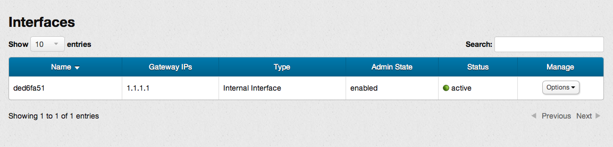

# Management console: Viewing router details

This page covers how to view router details using the networks screen of the management console (MC).  This page covers the following topics:

* [Before you begin](#Overview)
* [Accessing the router details screen](#Accessing)
* [Organization of the router details screen](#Organization)
* [Sorting the interfaces list](#Sorting)
* [Router details screen available features](#Features)
* [For further information](#ForFurtherInformation)

##Before you begin## {#Overview}

Before you can view the details of an existing network, you must:

* [Sign up for an HP Cloud compute account](https://account.hpcloud.com/signup)
* Activate compute service on your account
* [Create a network](/mc/compute/networks/create-network#Creating/)
* Create a router by [creating a project](/mc/account/projects#Creating) in the [account and services](/mc/account/) dashboard

##Accessing the router details screen## {#Accessing}

You can access the router details screen from the [network screen](/mc/compute/networks) by, in the `Manage` column of the `Routers` list, select the `Options` button in the row of the router you want to delete, and choose the `Router Details` option.

You can also launch the router details screen from the network screen by, in the `Routers` list, clicking the name of the router for which you want to examine the details.

##Organization of the router details screen## {#Organization}

The router details screen is divided into the information pane and the interfaces pane.

The information pane provides basic information about the selected router, such as name, ID, admin state (enabled or disabled), status (active or inactive), and whether or not the router is attached to an external network.  It also contains buttons to allow you to [enable or disable](/mc/compute/networks/manage-routers#Enabling/) the router,  [attach or detach](/mc/compute/networks/manage-routers#AttachExternal) the router to external networks, and [add an interface](/mc/compute/networks/manage-routers#Attaching) to a router.

The interfaces pane lists the interfaces associated with the router, including their gateway IP address, type, admin state (enabled or disabled), and status.

##Sorting the interfaces list## {#Sorting}

You can sort the list of interfaces in the interfaces pane by just clicking on the column heading that you want to sort against.  For example, if you want to sort the interfaces list by gateway IP address, just click the `Gateway IP` column header.

##Router details screen available features## {#Features}

The router details screen provides you access to the following functions:

* [Enabling the router](/mc/compute/networks/manage-routers#Enabling/)
* [Disabling the router](/mc/compute/networks/manage-routers#Disabling/)
* [Attaching the router to an external network](/mc/compute/networks/manage-routers#AttachExternal/)
* [Detaching the router from an external network](/mc/compute/networks/manage-routers#DetachExternal/)
* [Adding an interface to the router](/mc/compute/networks/manage-routers#Attaching/)
* [Deleting an interface from the router](/mc/compute/networks/manage-routers#Detaching/)

##For further information## {#ForFurtherInformation}

* For basic information about our HP Cloud compute services, take a look at the [HP Cloud compute overview](/compute/) page
* Go to the [managing routers](/mc/compute/networks/manage-routers) for information on how to manage your routers
* Use the MC [site map](/mc/sitemap) for a full list of all available MC documentation pages
* For information about the Open Stack networking ("Quantum") features, surf on over to  [their Quantum wiki](https://wiki.openstack.org/wiki/Quantum)
