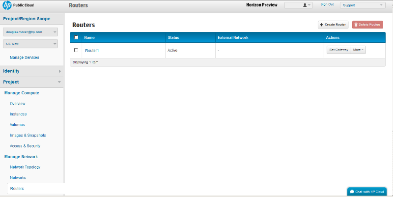

# Horizon console: Routers screen

The Horizon console compute dashboard Routers screen allows you to view and manipulate routers.  This page covers the following topics:

* [Networks screen overview](#Overview)
* [Networks screen functions](#Functions)
* [For further information](#ForFurtherInformation)

##Routers screen overview## {#Overview}

The Routers screen displays the router information for your project.

The name, status, and attached networks are displayed.

Clicking the `+ Create Router` button launches the router creation screen.  Clicking the `Set Gateway` button launches a screen that allows you to attach an external network to the router. Clicking the `More` button allows you to delete the router. 

##Routers screen functions## {#Functions}

From the networks screen you can perform any of the following functions:

* [Managing routers](/mc/compute/networks/mc.compute.networks.manage-routers.md)
* [Viewing router details](/mc/compute/networks/mc.compute.networks.view-router)

##For further information## {#ForFurtherInformation}

* For basic information about our HP Cloud compute services, take a look at the [HP Cloud compute overview](/compute/) page
* Use the MC [site map](/mc/sitemap) for a full list of all available MC documentation pages---
