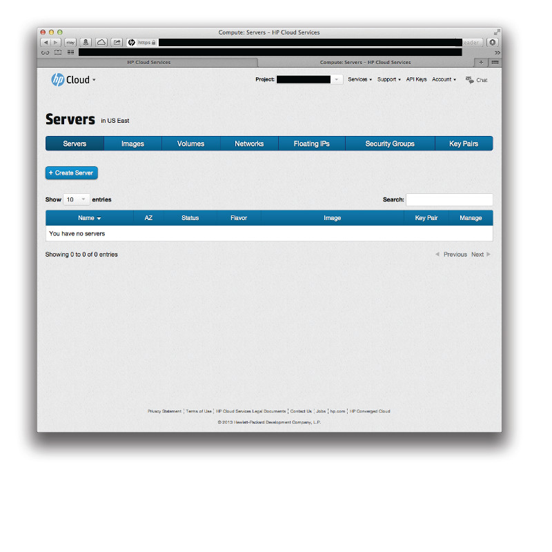
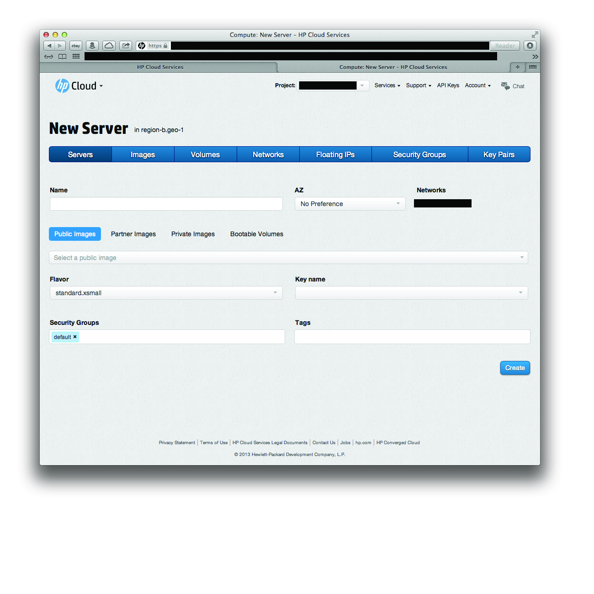
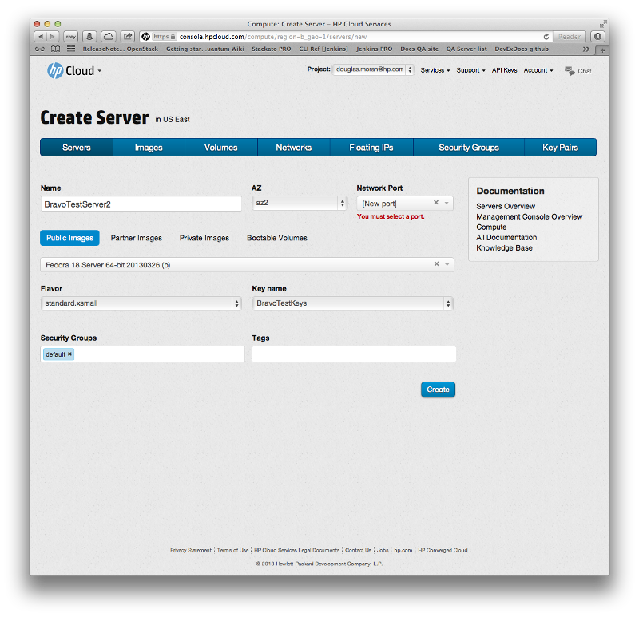

# Management console: Creating a new server

This page describes how to create a new server from a bootable volume using the [networks screen](/mc/compute/networks/) of the [management console](/mc/) (MC).  This page covers the following topics:

* [Before you begin](#Overview)
* [About the image types](#ImageTypes)
* [Creating a server](#Creating)
* [Deleting a server](#Deleting)
* [For further information](#ForFurtherInformation)

##Before you begin## {#Overview}

Before you can begin creating or deleting a server, you must:

* [Sign up for an HP Cloud compute account](https://account.hpcloud.com/signup)
* Activate compute services on your account
* Create an image or bootable volume (optional)

<!-- Need to link to the images pages for the last item -->

##About the image types## {#ImageTypes}

When you create an image, you can do so using one of several different existing image types.  When you [create a server](#Creating) your sever, you must select among one of these image types:

**Public**
:  Publicly-available images, such as Debian Squeeze

**Partner**
:  Images available through partners

**Private**
:  Private image that are available only to a limited set of users

**Bootable Volume**
:  Saved bootable volume that you previously created

<!-- add image type defs. to glossary -->
<!-- creating a bootable volume will be in the compute.volume/block storage pages, so may need to create *those*, too; oy -->

##Creating a server## {#Creating}

To create a server, click the `+ Create Server` button in the [servers screen](/mc/compute/servers/):

This launches the new server screen.

In the new servers screen, select the values for the various fields:

* In the `Name` text field enter a name for your server
* From the `AZ` pull-down menu select an availability zone (AZ)
* From the list of image types, click the button for the type you wish create your server from:  `Public Images`, `Partner Images`, `Private Images`, or `Bootable Volume`
* In the image pull-down menu (below the list of image types), select the image from which you want to create a server
* From the `Flavor` pull-down menu, select the flavor you want for your server
* From the `Key name` pull-down menu, select the key name you want for your server
* In the `Security Groups` text field, enter the security groups of which you want your server to be a part
* In the `Tags` text field, enter any tags you want to associate to your server

When you have filled out all the fields appropriately, click the `Create` button.  Your new server is created.

<!-- Doug: Add the image types to the glossary -->
<!-- Do we want to link stuff here to the glossary terms? -->

##Deleting a server## {#Deleting}

info on deleting a server

##For further information## {#ForFurtherInformation}

* For basic information about our HP Cloud compute services, take a look at the [HP Cloud compute overview](/compute/) page
* Use the MC [site map](/mc/sitemap) for a full list of all available MC documentation pages.