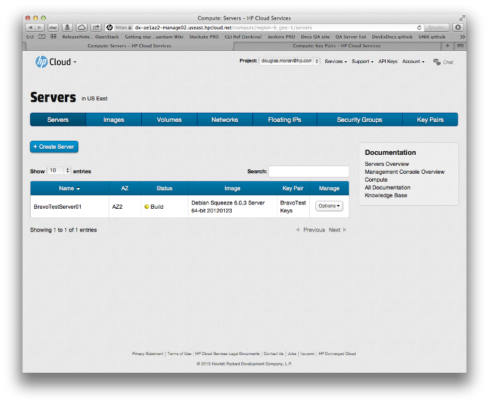
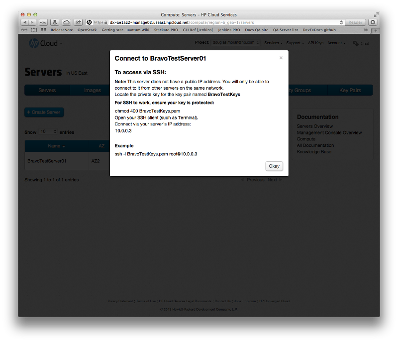
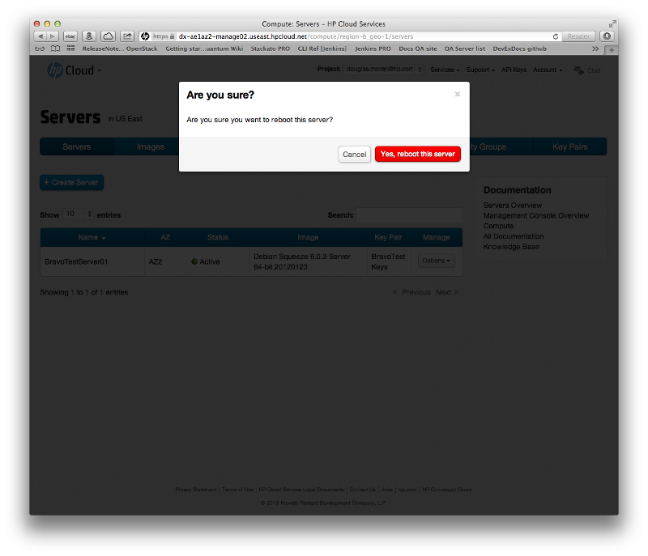
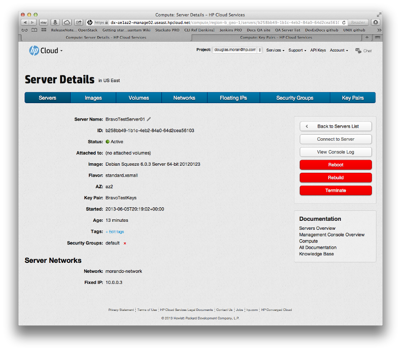
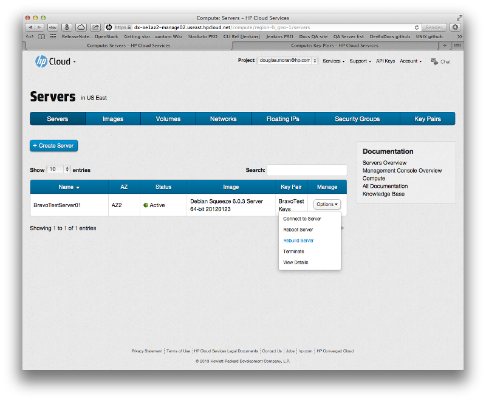
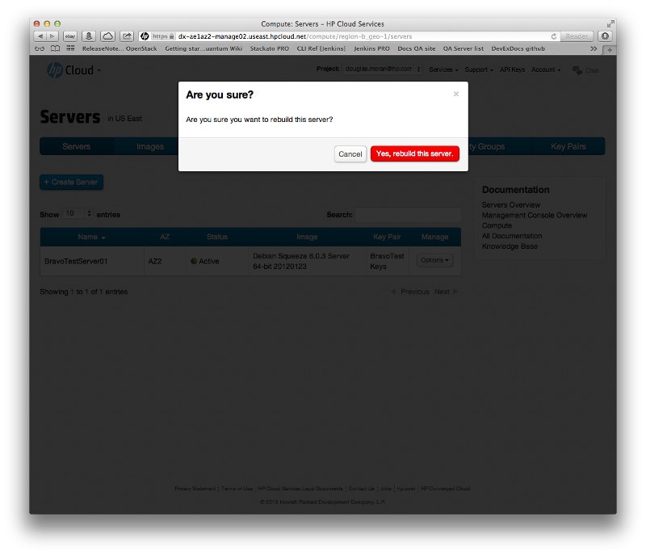
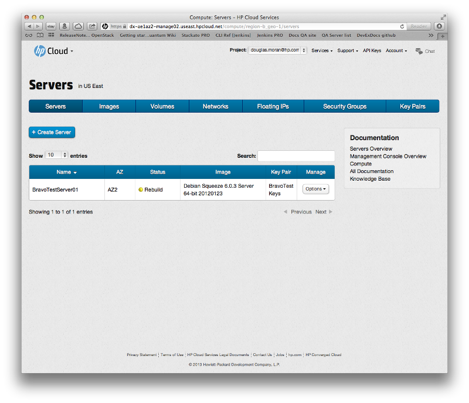
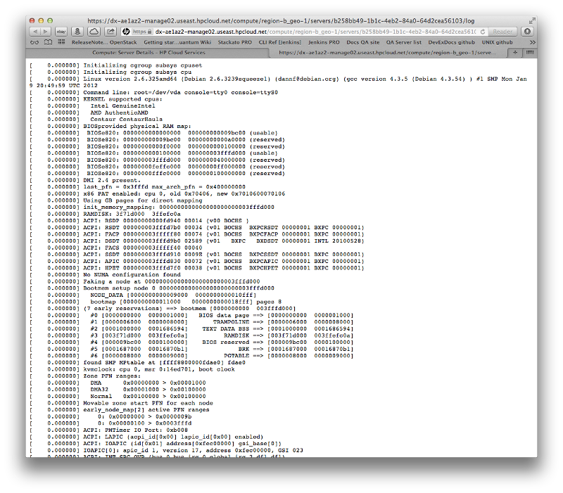

# Management console: Managing servers

This page describes how to manage servers using the [networks screen](/mc/compute/networks/) of the [management console](/mc/) (MC).  This page covers the following topics:

* [Before you begin](#Overview)
* [About the image types](#ImageTypes)
* [Creating a server](#Creating)
* [Connecting to a server](#Connecting)
* [Rebooting a server](#Rebooting)
* [Rebuilding a server](#Rebuilding)
* [Terminating a server](#Terminating)
* [Viewing server details](#Viewing)
* [Viewing the console log](#ViewConsole)
* [For further information](#ForFurtherInformation)

##Before you begin## {#Overview}

Before you can begin creating or deleting a server, you must:

* [Sign up for an HP Cloud compute account](https://account.hpcloud.com/signup)
* Activate compute services on your account
* Create a key pair
* Create an image or bootable volume (optional)

<!-- Need to link to the images pages for the last item -->

##About the image types## {#ImageTypes}

When you create an image, you can do so using one of several different existing image types.  When you [create a server](#Creating) your sever, you must select among one of these image types:

**Public**
:  Publicly-available images, such as Debian Squeeze

**Partner**
:  Images available through partners

**Private**
:  Private image that are available only to a limited set of users

**Bootable Volume**
:  Saved bootable volume that you previously created

<!-- add image type defs. to glossary -->
<!-- creating a bootable volume will be in the compute.volume/block storage pages, so may need to create *those*, too; oy -->

##Creating a server## {#Creating}

To create a server, click the `+ Create Server` button in the [servers screen](/mc/compute/servers/):

This launches the new server screen.

In the new servers screen, select the values for the various fields:

* In the `Name` text field enter a name for your server
* From the `AZ` pull-down menu select an availability zone (AZ)
* From the list of image types, click the button for the type you wish create your server from:  `Public Images`, `Partner Images`, `Private Images`, or `Bootable Volume`
* In the image pull-down menu (below the list of image types), select the image from which you want to create a server
* From the `Flavor` pull-down menu, select the flavor you want for your server
* From the `Key name` pull-down menu, select the key name you want for your server
* In the `Security Groups` text field, enter the security groups of which you want your server to be a part
* In the `Tags` text field, enter any tags you want to associate to your server

When you have filled out all the fields appropriately, click the `Create` button.  Your new server is created.

<!-- Do we want to link stuff here to the glossary terms? -->

##Connecting to a server## {#Connecting}

To connect to an existing server, in the [servers screen](/mc/compute/servers/), in the `Manage` column of the servers list, select the `Options` button in the row of the server to which you want to connect, and choose the `Connect to Server` option:

You are asked to confirm this connection:

Click the `Okay` button to confirm, and your server is connected.

##Rebooting a server## {#Rebooting}

To reboot a server, in the [servers screen](/mc/compute/servers/), in the `Manage` column of the servers list, select the `Options` button in the row of the server to which you want to connect, and choose the `Reboot Server` option:

You are asked to confirm the reboot:

Click the `Yes, reboot this server` button to confirm the reboot.  While your server is rebooting, you can see the status `Reboot` displayed.  

When the reboot is complete, the status changes to `Active`.

You can also reboot a server by selecting the `Reboot` button in the [server details](#Viewing) screen:

##Rebuilding a server## {#Rebuilding}

To rebuild a server, in the [servers screen](/mc/compute/servers/), in the `Manage` column of the servers list, select the `Options` button in the row of the server to which you want to connect, and choose the `Rebuild Server` option:

You are asked to confirm the rebuild:

Click the `Yes, rebuild this server` button to confirm the reboot.  While your server is rebooting, you can see the status `Rebuild` displayed.  

When the rebuild is complete, the status changes to `Active`.

You can also rebuild a server by selecting the `Rebuild` button in the [server details](#Viewing) screen:

##Terminating a server## {#Terminating}

To terminate a server, in the [servers screen](/mc/compute/servers/), in the `Manage` column of the servers list, select the `Options` button in the row of the server you want to terminate, and choose the `Terminate` option:

You can also terminate a server by selecting the `Terminate` button in the [server details](#Viewing) screen:

##Viewing server details## {#Viewing}

To launch the server details screen, in the `Manage` column of the servers list, select the `Options` button in the row of the server you want to terminate, and choose the `View Details` option: 

For more information on the content of this screen, please take a look at the [Viewing server details](/mc/compute/servers/view-details/) page.

##Viewing the console log## {#ViewConsole}

To view the console log, you must first enter the [server details](/mc/compute/servers/view-details/) page.  To launch the server details screen, in the `Manage` column of the servers list, select the `Options` button in the row of the server you want to terminate, and choose the `View Details` option:

To view the console log, in the server details screen, click the `View Console Log` button.  This launches the console log screen:

By default, this screen is displayed in its own tab in your browser.

##For further information## {#ForFurtherInformation}

* For basic information about our HP Cloud compute services, take a look at the [HP Cloud compute overview](/compute/) page
* Use the MC [site map](/mc/sitemap) for a full list of all available MC documentation pages.
