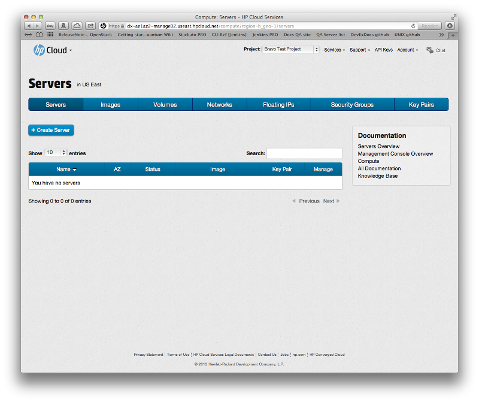
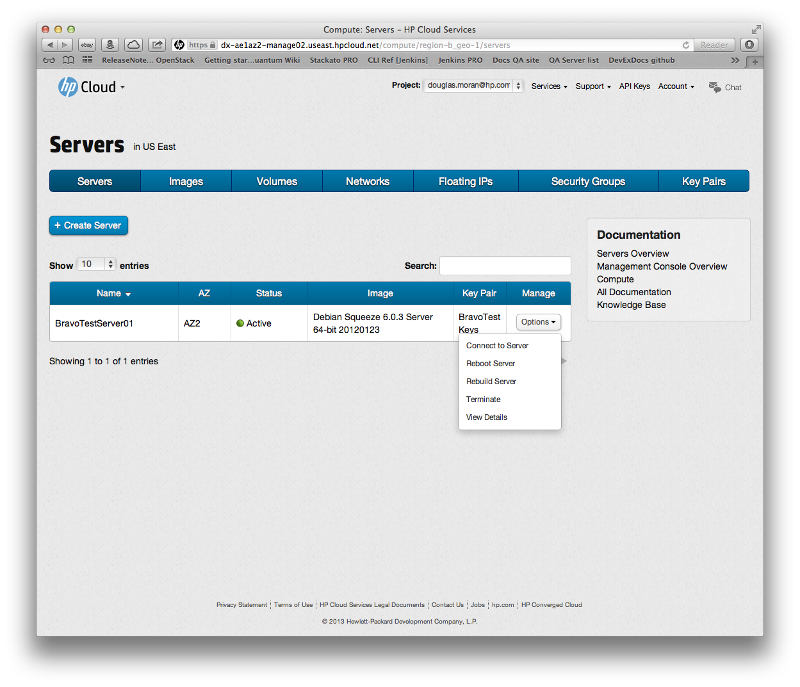

# Management console: Servers screen

The management console (MC) compute dashboard server screen is the default screen you see when you click the `Manage` button in the [compute dashboard](/mc/compute/).  The MC server screen allows you to create new servers, display your server inventory, view the console log, and perform other server-related compute functions.  This page covers the following topics about the MC compute server screen:

* [Servers screen overview](#Overview)
* [For further information](#ForFurtherInformation)

##Servers screen overview## {#Overview}

The servers screen displays the servers information for your project.

The name, availability zone (AZ), status, image, and key pair for your servers are displayed.  You can sort your list of networks based on a particular identifier by just clicking the column heading.  For example, if you want to sort the list by name, just click the `Name` column header.

Clicking the `+ Create Server` button to launch the [new server screen](/mc/compute/servers/create-new/).  Clicking the `Options` button in the `Manage` column allows you to perform a number of functions on that server: 

* [Connect to a server](/mc/compute/servers/manage#Connecting)
* [Reboot](/mc/compute/servers/manage#Rebooting)
* [Rebuild](/mc/compute/servers/manage#Rebuilding)
* [Terminate](/mc/compute/servers/manage#Terminating)
* [View server details](/mc/compute/servers/manage#Viewing) 

##For further information## {#ForFurtherInformation}

* For basic information about our HP Cloud compute services, take a look at the [HP Cloud compute overview](/compute/) page
* Use the MC [site map](/mc/sitemap) for a full list of all available MC documentation pages
