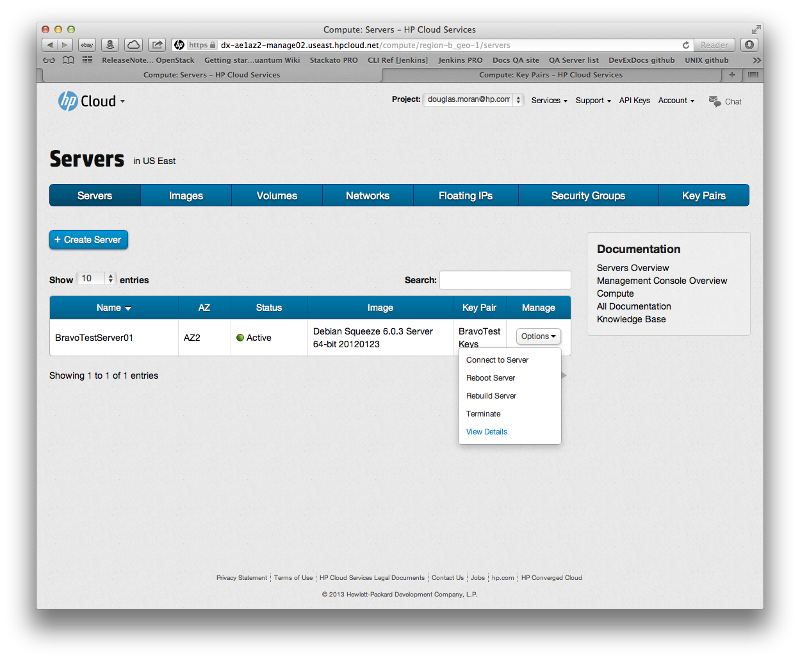

# Management console: Viewing server details

This page describes how to manage servers using the [networks screen](/mc/compute/networks/) of the [management console](/mc/) (MC).  This page covers the following topics:

* [Before you begin](#Overview)
* [Viewing server details](#Viewing)
* [For further information](#ForFurtherInformation)

##Before you begin## {#Overview}

Before you can begin creating or deleting a server, you must:

* [Sign up for an HP Cloud compute account](https://account.hpcloud.com/signup)
* Activate compute services on your account
* Create a key pair
* Create an image or bootable volume (optional)

<!-- Need to link to the images pages for the last item -->

##Viewing server details## {#Viewing}

To launch the server details screen, in the `Manage` column of the servers list, select the `Options` button in the row of the server you want to terminate, and choose the `View Details` option: 

This launches the server details screen:

The server details screen contains the following information on the selected server:

* Name
* ID
* Status (Active, terminating, rebuilding, error, etc.)
* Attached volumes
* Running image
* [Flavor](/glossary#Flavor/)
* [Availability zone (AZ)](/glossary#AvailabilityZone)
* [Key pair](/glossary#KeyPair)
* Start time (time the server was created and enabled)
* Age of the server (in days)
* Tags
* [Security groups](/glossary#SecurityGroup) (if any)
* Network
* Fixed IP address

You can use the server details screen to [connect to](/mc/compute/servers/manage#Connecting), [reboot](/mc/compute/servers/manage#Rebooting), [rebuild](/mc/compute/servers/manage#Rebuilding), and [terminate](/mc/compute/servers/manage#Terminating) a server.  You can also [access your server's console log](/mc/compute/servers/manage#ViewConsole) from this screen.

##For further information## {#ForFurtherInformation}

* See the [compute server screen overview](/mc/compute/servers)
* For basic information about our HP Cloud compute services, take a look at the [HP Cloud compute overview](/compute/) page
* Use the MC [site map](/mc/sitemap) for a full list of all available MC documentation pages.
