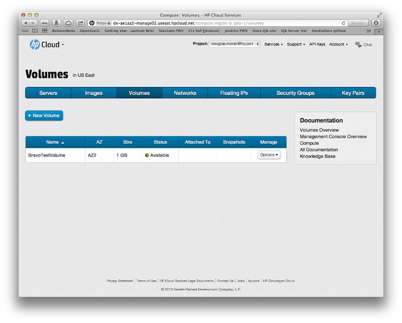
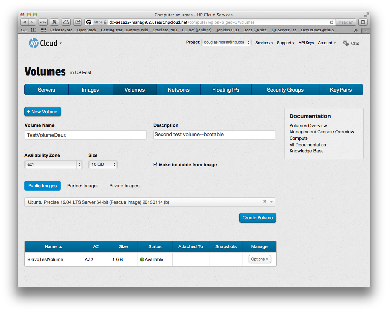
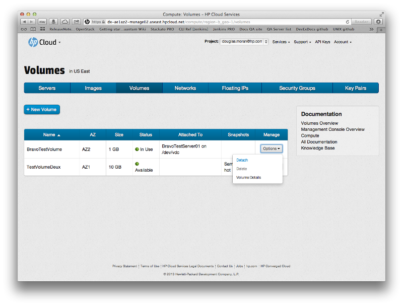
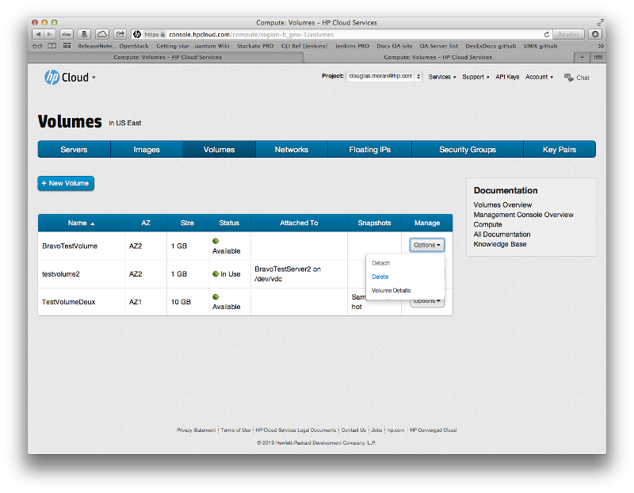
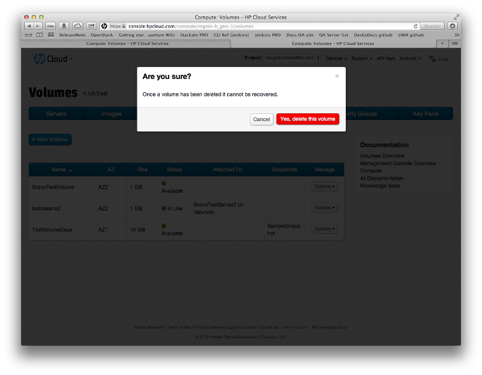

# Management console: Managing volumes

This page describes how to create and delete volumes using the [volumes screen](/mc/compute/volumes/) of the [management console](/mc/) (MC).  This page covers the following topics:

* [Before you begin](#Overview)
* [Creating a volume](#Creating)
* [Creating a bootable volume](#CreateBootable)
* [Attaching and detaching volumes](#Attaching)
* [Managing snapshots](#Snapshot)
* [Deleting a volume](#Deleting)
* [Viewing volume details](#Viewing)
* [For further information](#ForFurtherInformation)

##Before you begin## {#Overview}

Before you can begin creating or deleting an volume, you must:

* [Sign up for an HP Cloud compute account](https://account.hpcloud.com/signup)
* Activate compute service on your account

##Creating a volume ## {#Creating}

To create an volume, in the [volumes screen](/mc/compute/volumes/) click the `+ New Volume` button:

This opens the volume creation pane in the volumes screen:

In the volumes creation pane, select the values for the following fields:

* In the `Volume Name` text field enter a name for your volume
* In the `Description` text field enter a description for your volume (this is optional)
* From the `AZ` pull-down menu select an availability zone (AZ)
* From the `Size` pull-down menu select the size for your volume
* If you want to create a bootable volume, click the `Make bootable from image` checkbox to open the images pane of the volume screen; see the section below for more information on how to [create a bootable volume](#CreatingBootable)

Click the `Create` button to create the volume with your entered parameters.  The volumes creation pane closes, and your new volume appears in the volumes list:

The volume appears in the list immediately with the status of `Creating`, indicating that your volume is queued for creation. 

##Creating a bootable volume## {#CreateBootable}

To create a bootable volume, in the [volumes screen](/mc/compute/volumes/) click the `+ New Volume` button:

This opens the volume creation pane in the volumes screen:

In the volumes creation pane, select the values for the following fields:

* In the `Volume Name` text field enter a name for your volume
* In the `Description` text field enter a description for your volume (this is optional)
* From the `AZ` pull-down menu select an availability zone (AZ)
* From the `Size` pull-down menu select the size for your volume
* Click the `Make bootable from image` checkbox to open the images pane of the volume screen
* Select an image type--`Public`, `Partner`, or `Private` (see the [image types](/mc/compute/servers/manage#ImageTypes/) section on the [server management](/mc/compute/servers/manage/) for more information)
* From the image pull-down menu select the specific image (in this example, `Ubuntu Precise 12.04`)

When you have filled out all the fields appropriately, click the `Create` button.  Your new bootable volume is created.

##Attaching and detaching volumes## {#Attaching}

You can use the MC to [attach](/mc/compute/volumes/view-details#Attaching) and [detach](/mc/compute/volumes/view-details#Detaching) to a server.  For details, see the [volume details](/mc/compute/volumes/view-details/) page.

You can also detach a volume from a server from the main volumes screen.  To detach a volume, in the [volumes screen](/mc/compute/volumes/), in the row for the volume you want to detach, in the `Manage` column click the `Options` button and select `Detach`.

You are asked to verify the request:

Click `Yes, detach this volume`; your volume is detached.

##Managing snapshots## {#Snapshot}

You can [create](/mc/compute/volumes/view-details/), [clone](/mc/compute/volumes/view-details/), [delete](/mc/compute/volumes/view-details/), and [display the details](/mc/compute/volumes/view-details/) of snapshots from the [volume details](/mc/compute/volumes/view-details/) screen.  See the [viewing volume details](#Viewing) section below for information on how to access the volume details screen.

##Deleting a volume## {#Deleting}

To delete an existing volume, in the [volumes screen](/mc/compute/volumes/), in the row for the volume you want to delete, in the `Manage` column click the `Options` button and select `Delete`:

A dialog appears to ensure you want to delete that volume:

Select `Yes, delete this volume` to delete the volume; the volume is removed and no longer appears in the volumes list.

Your can also delete an volume by clicking the `Delete` button in the [custom volume details](#Viewing) screen for that volume.

##Viewing volume details## {#Viewing}

To access the volume details screen, in the [volumes screen](/mc/compute/volumes/), in the row for the volume you want to delete, in the `Manage` column click the `Options` button and select `Volume Details`:

This launches the custom volumes details screen:

(You can also launch the volume details screen by in the `Name` column, clicking on the name of the volume whose details you want to view.)

The custom volume details screen displays the name, ID, status (active or inactive), description, size, container format (e.g. `BARE`), disk format, creation date, and source server for your volume.  You can can perform a number of functions from this screen, such as:

* [Deleting the volume](#Deleting)
* [Creating a snapshot](/mc/compute/volumes/view-details#CreatingSnapshot)
* [Editing the volume name and description](/mc/compute/volumes/view-details#Editing).  

See the [Viewing volume details](/mc/compute/volumes/view-details) page for more information.

##For further information## {#ForFurtherInformation}

* For basic information about our HP Cloud compute services, take a look at the [HP Cloud compute overview](/compute/) page
* Use the MC [site map](/mc/sitemap) for a full list of all available MC documentation pages
* For information about the Open Stack networking features, surf on over to [their wiki](https://wiki.openstack.org/wiki/Quantum)

