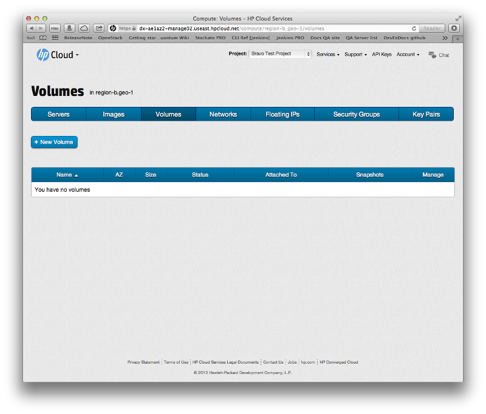

# Management console: Volumes screen

The management console (MC) compute dashboard volumes screen allows you to view and manipulate compute volumes.  This page covers the following topics:

* [Volumes screen overview](#Overview)
* [For further information](#ForFurtherInformation)

##Volumes screen overview## {#Overview}

The images screen displays your compute instance volume information for the availability zone (AZ) you have selected.

From this screen you can:

* Create and delete a volume
* Clone a new volume from an existing snapshot
* Create a bootable volume from an existing image

##For further information## {#ForFurtherInformation}

* For basic information about our HP Cloud compute services, take a look at the [HP Cloud compute overview](/compute/) page
* Use the MC [site map](/mc/sitemap) for a full list of all available MC documentation pages