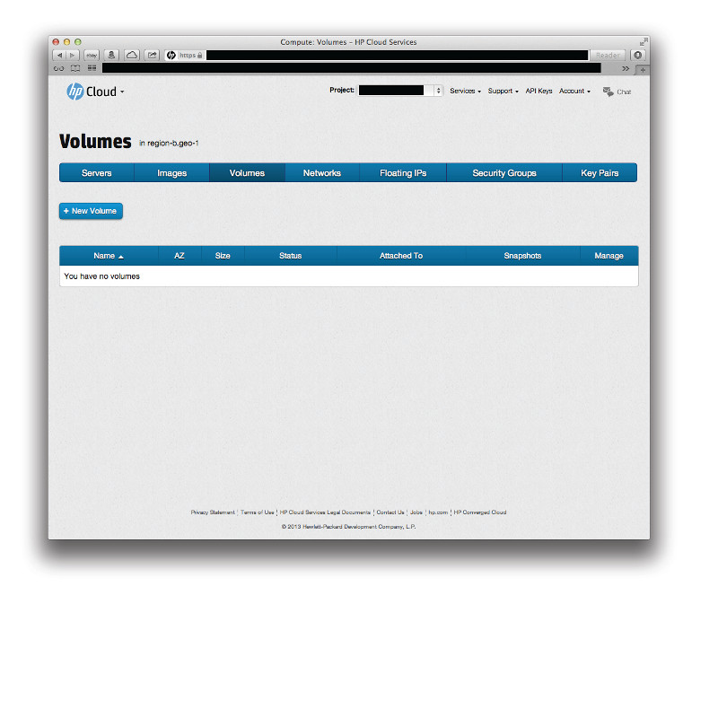

<!--PUBLISHED-->
# Management console: Volumes screen

The management console (MC) Compute dashboard volumes screen allows you to view and manipulate Compute volumes.  This page covers the following topics:

* [Volumes screen overview](#Overview)
* [For further information](#ForFurtherInformation)

##Volumes screen overview## {#Overview}

The volumes screen displays your Compute instance volume information for the availability zone (AZ) you have selected.

The name, AZ, size, status, server to which the volume is attached, and snapshots for each volume are displayed.  You can sort your list of images based on a particular identifier by just clicking the column heading.  For example, if you want to sort by status, just click the `Status` column header.

Clicking the `+ New Volume` button opens the [new volume pane](/mc/compute/volumes/manage#Creating/) in the volumes screen:

From this screen you can:

* [Create a volume](/mc/compute/volumes/manage#Creating/)
* [Delete a volume](/mc/compute/volumes/manage#Deleting/)
* Clone a new volume from an existing snapshot
* Create a bootable volume from an existing image
* [View volume details](/mc/compute/volumes/manage#Viewing/)

##For further information## {#ForFurtherInformation}

* For basic information about our HP Helion Public Cloud Compute services, take a look at the [HP Helion Public Cloud Compute overview](/compute/) page
* Use the MC [site map](/mc/sitemap) for a full list of all available MC documentation pages
