# Management console: Viewing volume details

This page describes the volume details screen of the [management console](/mc/) (MC).  This page covers the following topics:

* [Before you begin](#Overview)
* [Viewing volume details](#Viewing)
* [Editing volume name and description](#Editing)
* [Attaching a volume](#Attaching)
* [Detaching a volume](#Detaching)
* [Creating a volume snapshot](#Snapshot)
* [Cloning a snapshot](#Cloning)
* [Deleting a snapshot](#DeletingSnapshot)
* [Viewing snapshot details](#ViewingSnapshot)
* [For further information](#ForFurtherInformation)

##Before you begin## {#Overview}

Before you can begin viewing the details of a volume, you must:

* [Sign up for an HP Cloud compute account](https://account.hpcloud.com/signup)
* Activate compute services on your account
* [Launch the volume screen](/mc/compute/volumes/manage/)

##Viewing volume details## {#Viewing}

To launch the volume details screen, in the [volumes screen](/mc/compute/volumes/), in the `Manage` column of the volumes list, select the `Options` button in the row of the volume for whose details you want to display, and choose the `Volume Details` option: 

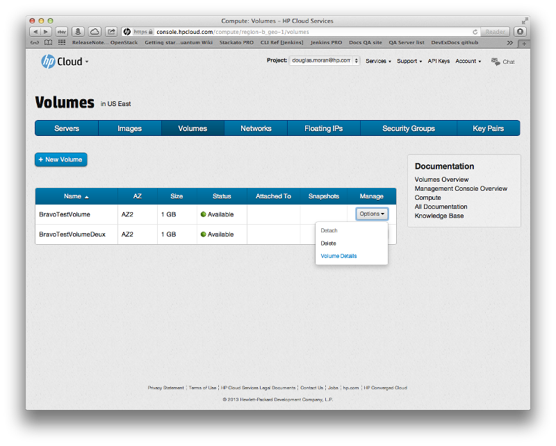

This launches the volume details screen:

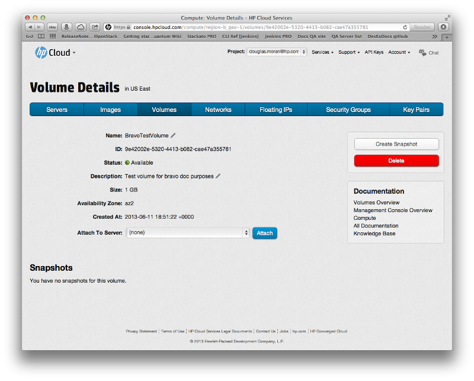

The volume details screen contains the following information on the selected volume:

* Name
* ID
* Status (Available, Unavailable, etc.)
* Description
* Size
* [Availability zone (AZ)](/glossary#AvailabilityZone/)
* Creation time (date and time the volume was created)
* Server to which the volume is attached (if any)

You can use the volume details screen to [create a snapshot of](/mc/compute/volumes/manage#Snapshot/) or [delete](/mc/compute/volumes/manage#Deleting) the volume.  You can also [change the volume name or description](#Editing) from this screen.

##Editing the volume name and description## {#Editing}

You can edit the name or description of the volume in the volume details screen.  To edit the volume name, in the [volume details](#Viewing) screen click the `Name` of the volume:

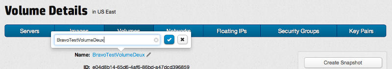 

In the pop-up displayed, enter the new name and click the check mark next to the text-entry field; your volume is renamed.

To edit the volume description, click the `Description` of the volume:

In the pop-up displayed, enter the new description and click the check mark next to the text-entry field; your volume has a new description.

##Attaching a volume## {#Attaching}

To attach a volume to a server, in the [volume details](#Viewing) screen from the `Attach To Server` drop-down list select the server to which you want to attach your volume and click the `Attach` button. 

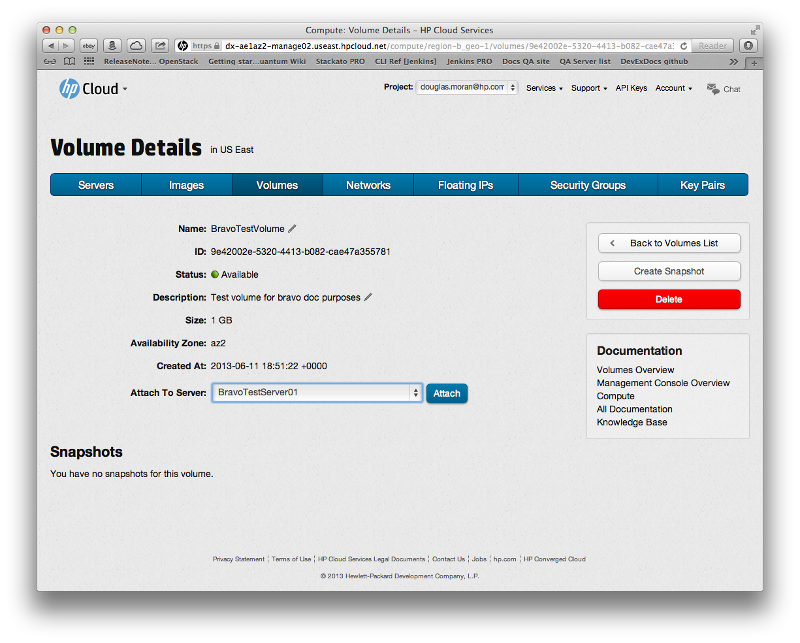

Your volume is attached.  In the volumes screen, the status is displayed as `In Use` for an attached volume:

##Detaching a volume## {#Detaching}

To detach a volume from a server, in the [volume details](#Viewing) screen click the `Detach from Server` button:

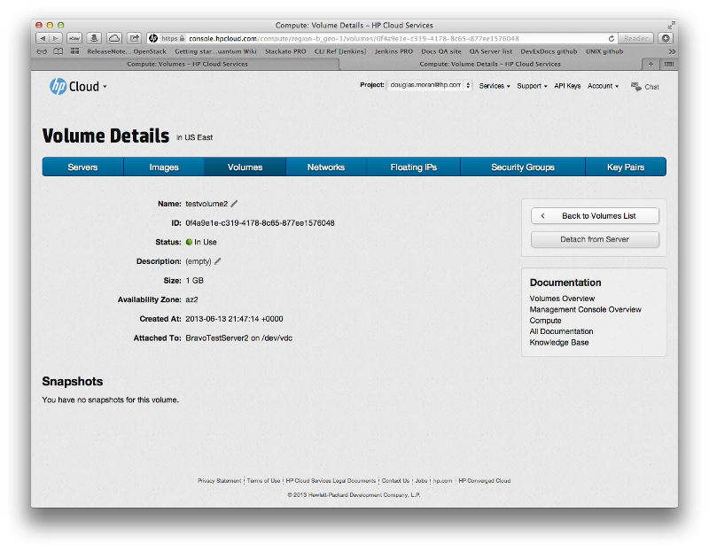

You are asked to verify the request:

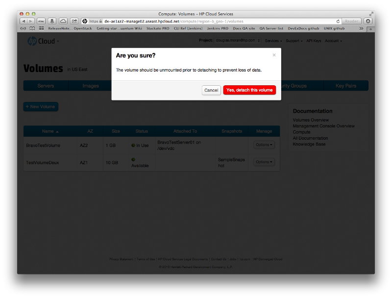

Click `Yes, detach this volume`; your volume is detached.

##Creating a snapshot## {#Snapshot}

To create a snapshot, in the [volume details](#Viewing) screen click the `Create Snapshot` button.  

You are asked to verify the request, and the pop-up dialog requires you to enter a name and description for your snapshot:

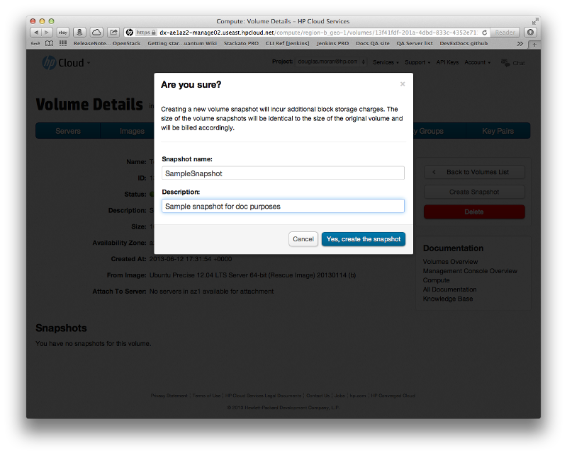

When you have filled out all the fields appropriately, click the `Yes, create the snapshot` button.  Your new bootable volume is created.

##Cloning a snapshot## {#Cloning}

To clone a snapshot, in the [volume details](#Viewing) screen, in the row for the snapshot you want to clone, in the `Manage` column click the `Options` button and select `Clone`:

You are asked to verify the request, and the pop-up dialog requires you to enter a name and description for your clone:

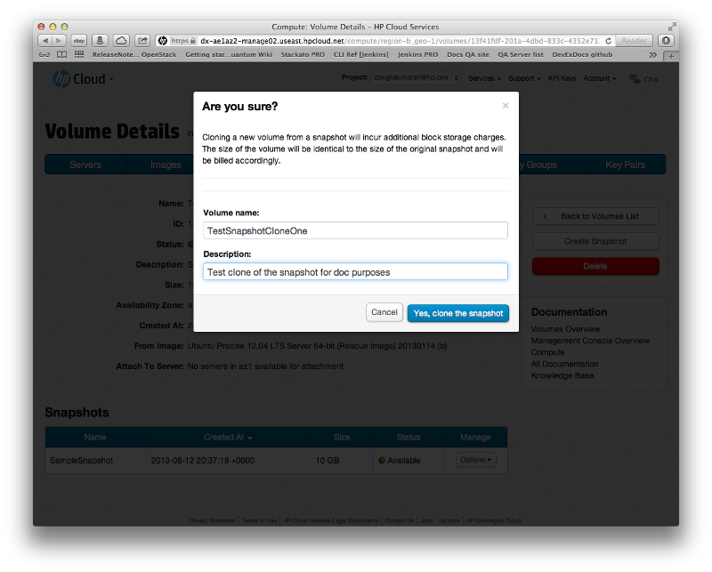

When you have filled out all the fields appropriately, click the `Yes, clone the snapshot` button.  Your snapshot is cloned.

##Deleting a snapshot## {#DeletingSnapshot}

To delete a snapshot, in the [volume details](#Viewing) screen, in the row for the snapshot you want to delete, in the `Manage` column click the `Options` button and select `Delete`:

You are asked to verify the request:

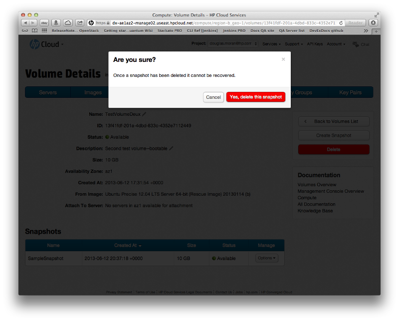

Click `Yes, delete this snapshot`; your snapshot is deleted.  You can also delete a snapshot by clicking the `Delete` button from its [snapshot details](#ViewingSnapshot) screen.

##Viewing snapshot details## {#ViewingSnapshot}

To view the details for a snapshot, in the [volume details](#Viewing) screen, in the row for the snapshot for which you want to view the details, in the `Manage` column click the `Options` button and select `Snapshot Details`:

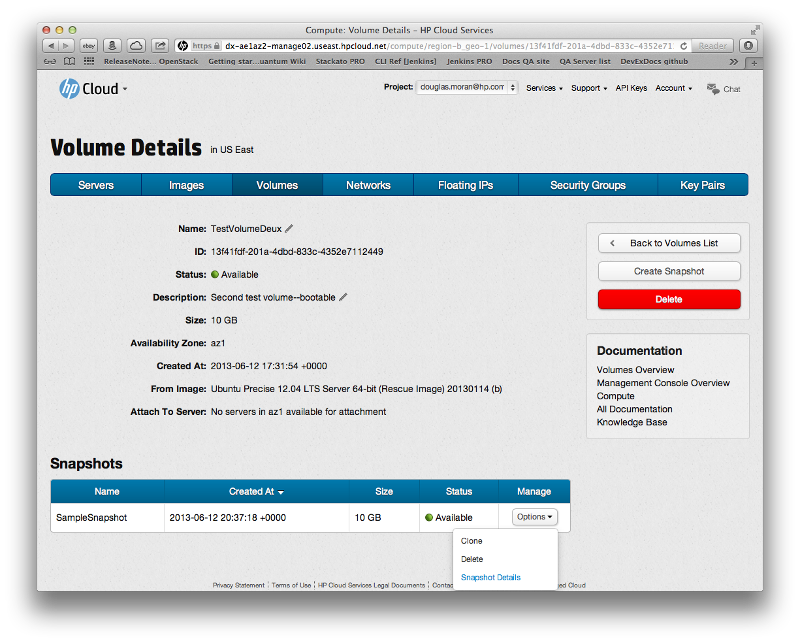

In the snapshot details screen, you can edit the name or description of the snapshot.  You can also delete the snapshot from the details screen by clicking the `Delete` button.

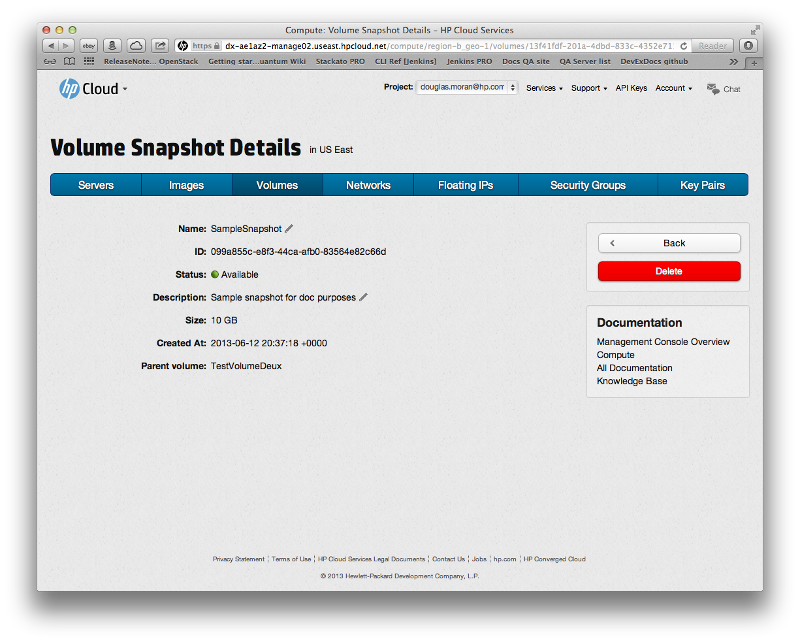

##For further information## {#ForFurtherInformation}

* See the [compute server screen overview](/mc/compute/servers)
* For basic information about our HP Cloud compute services, take a look at the [HP Cloud compute overview](/compute/) page
* Use the MC [site map](/mc/sitemap) for a full list of all available MC documentation pages.
