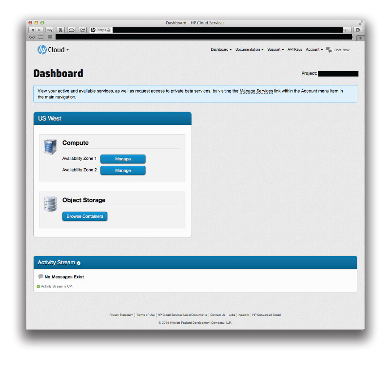
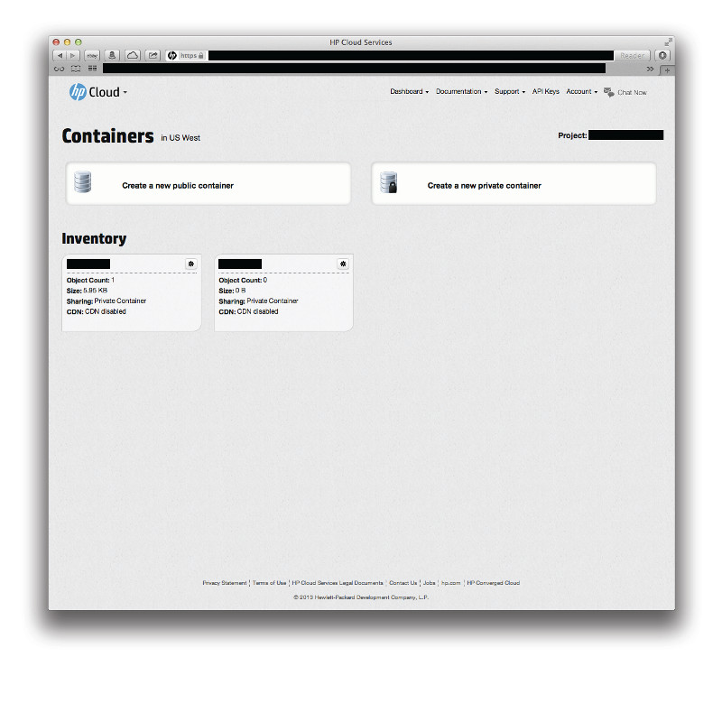
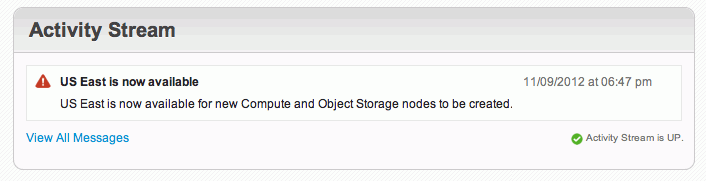

<!--PUBLISHED-->
# Management console main dashboard

This page provides you with an overview of the main management console (MC) dashboard, which displays overview information for your active services (such as Compute).  This page discusses the following topics:

* [Overview of the dashboard](#Overview)
* [Compute pane](#compute)
* [Activity stream pane](#activitystream)

**Note**:  The Compute functionality available through the MC discussed in these pages is only for the US East region; this functionality is not available for the US West region. 

##Overview of the dashboard## {#Overview}

To access the main MC dashboard, from the `Dashboard` menu in the main menu bar select `Dashboard`:

The main MC dashboard displays all your active services.  In this example, the user has the Compute service active for several availability zones in the US West region and one for the US East region.  His activity stream is also displayed.  See the sections below for a bit more discussion!

##Compute pane## {#compute}

The Compute pane of the main MC dashboard displays your active availability zones (AZs), divided by region.  This user, for example, has three Compute instances in region `US West` and one in US East.

If you want to go straight to the Compute dashboard without first going through the main MC dashboard, just select the appropriate `Compute` option from the `Services` item in the main menu bar.

**Note**:  You can also navigate to a particular Compute instance via the main menu bar.

You can manage your activity by clicking the button of the Compute instance you are interested in; this launches the Compute dashboard for that instance.  For example, if you want to access the `US East` Compute instance, just click that button to see the screen:

For additional information about the Compute functions available through the MC, surf on over to the [MC Compute page](/mc/compute).  For an overview of HP Helion Public Cloud's Compute features, please see the [HP Helion Public Cloud Compute overview](/compute) page.

<!-- ##Object Storage pane## {#object-storage}

The Object Storage pane of the main MC dashboard appears directly below the [Compute pane](#compute), divided by region.

To access your object storage containers, just click the `Browse Containers` button.  This launches the object storage details screen and displays your containers and any related information:

This user has two containers in the `US West` region: `Nova-stuff` (which contains one object) and `fog-rocks` (which is empty).  The information block for each container gives you the `Object Count`, `Size`, `Sharing` information, and indicates whether or not CDN is enabled.  You can also use the object storage details screen to create new public or private containers.

For additional information about the Compute functions available through the MC, surf on over to the [MC Object Storage page](/mc/object-storage). 

For an overview of HP Helion Public Cloud's Object Storage features, please see the [HP Helion Public Cloud Object Storage overview](/object-storage/) page. -->

##Activity stream pane## {#activitystream}

The activity stream pane helps you track of various data about the resources you're consuming, their performance, availability, and other activity.  

This pane displays platform alerts, including appropriate date and time information:

For more information, please see the [activity stream](/activity-stream/) page.

<!-- Other panes discussed as they are--theoretically--added 

##Monitoring pane## {#monitoring}

info

##RDB as a service pane## {#RDB}

info

##Load balancing as a service## {#LoadBalancing}

info

##DNS## {#DNS}

info

-->
