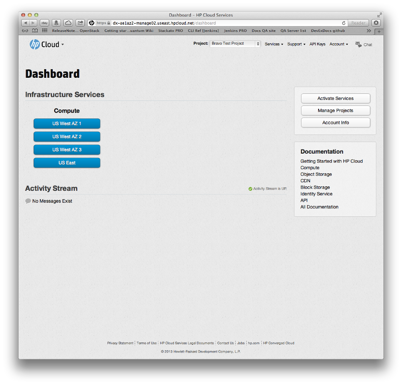
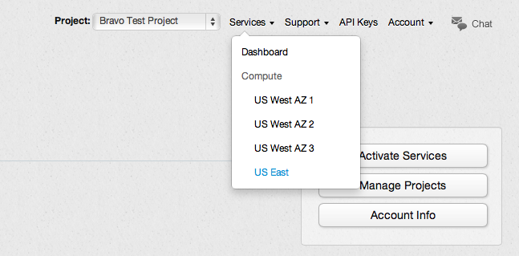
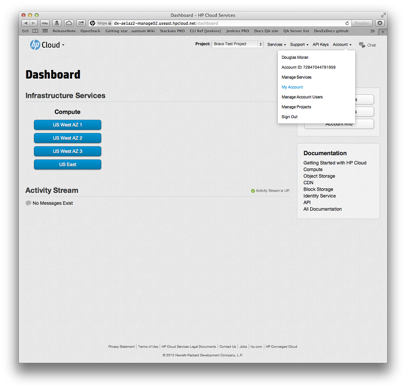

# Management console overview

HP Cloud consists of a bunch of useful services--compute, object storage, block storage, and [many others](/services/)--and the entrance to those services is through the management console (MC).  This page provides you with an overview of the console, along with pointers to other good information to get you going.

* [Management console overview](#Overview)
* [Navigating the services](#NavigatingtheService) 
* [Account management](#AccountManagement)
* [For further information](#FurtherInformation)

##Management console overview## {#Overview}

The main dashboard for the MC displays all your active available services by default.  If you have activated the [compute](/compute/) and [object storage](/object-storage/) services, for example, your dashboard may look something like this:

Each service is in its own pane on the dashboard; compute services in the compute pane, object storage in the object storage pane, and so on. 

**Note**:  If you haven't activated a service, it is not displayed on the main default dashboad.

##Navigating the services## {#NavigatingtheService}

You can navigate to your preferred service in one of two easy ways.  First, you can simply choose your service (and availability zone) from the top-level menu bar.  For example, if you want to go to the compute dashboard, in the `Dashboard` menu select `Compute`:

You can also navigate by clicking the appropriate button in the service pane.  For example, if you want to navigate to the compute dashboard for US West for availability zone 1, in the compute pane click the `Manage` button under US West for `Availability Zone 1`:

You can navigate to any of the other services in a similar way.  To access the main object storage dashboard, in the `Dashboard` menu select `Object Storage`; to access the main relational databases as a service (DBaaS), in the `Dashboard` menu select `RDB`; and so on, for each active service.

##Account management## {#AccountManagement}

To manage your account, in the main menu bar, from the `Account` menu select the `My Account` item:

This launches the account and services dashboard of the MC.  From this screen, you can manage your personal account information (such as your password, name, email address, and other info), API keys, projects, and other details.  

You can also use this dashboard to manage your services.  There are two ways to access your services information:  First, in the main menu bar, from the `Account` menu select `Manage Services`.  Also, in the right-hand navigation menu, you can click the `Services` item:

For more information on using the MC for account and services management, take a look at our [Account and services dashboard](/mc/account/) pages.

##For further information## {#FurtherInformation}

Need more information on the MC?  Take a look at the following pages:

* [Getting started with HP Cloud services](https://docs.hpcloud.com), our top-level technical documentation page
* [Technical documentation site map](/sitemap/) for a full list of all of our technical documentation pages
* [Management console site map](/mc/sitemap/), a map of all the pages specific to our MC
* [Getting started with HP Cloud](https://community.hpcloud.com/article/getting-started-guide) in our [Knowledge Base](https://community.hpcloud.com/)
* [Learn about and explore the HP Cloud](https://www.hpcloud.com/learn)

Or you can just click the link to your topic of interest in the navigation bar to the right at the top of this page on the right-hand side!
