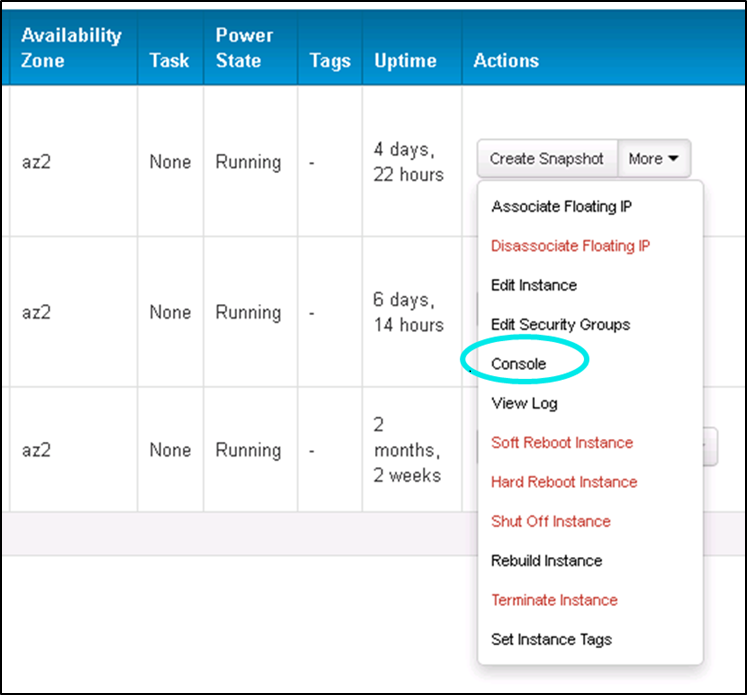
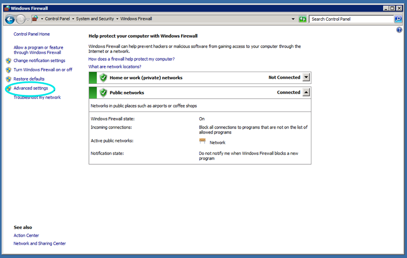
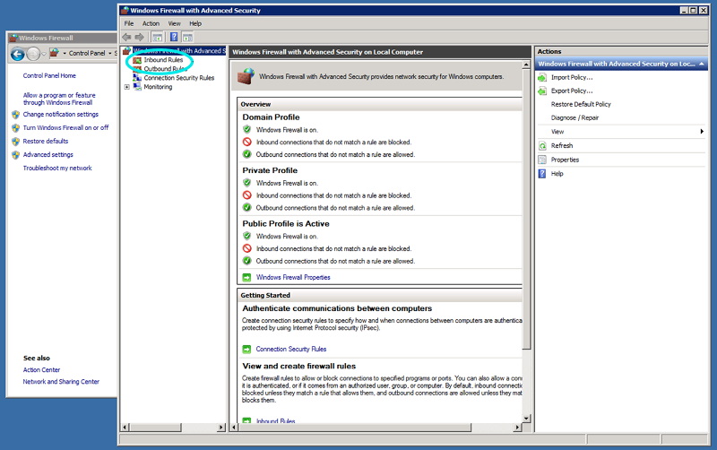
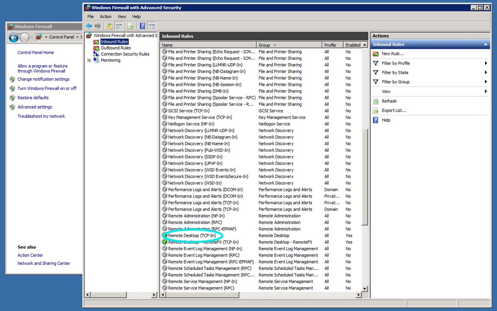
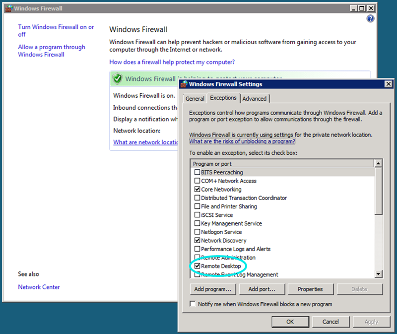

# HP Cloud version 12.12 to 13.5: Assisted Data Transition Guide #

If you need assistance transitioning your data from HP Cloud version 12.12 to 13.5, this page provides you with detailed information about the tasks you need to complete before the data transition. Review this document and [contact support](#ContactingSupport) with any questions.

If you plan on performing the transition without support services, the [Data Transition Guide](/migration-overview) document contains details on how to migrate your data yourself from HP Cloud version 12.12 to 13.5.

**Note:**
Some of the links in this document contain information on using the Horizon-based HP Cloud Console to interact with your instances. HP Cloud Console is an alternative method for performing these tasks. The procedures in this document for using the classic management console are correct and should be followed at this time.

## Before you begin ## {#TransitionOverview}
For assistance with transitioning your data from version 12.12 to 13.5, there are a few preliminary tasks you must complete first:

* [Understand what's new for version 13.5](#VersionDiffs)
* [Review key transition information](#TransitionInfo)
* [Take a snapshot of an ephemeral instance](#Snapshot)
* [Prepare a volume for transition](#PrepVolume)
* [Terminate a persistent instance created from a block volume](#TerminatingPersistent)

Once you have completed these tasks, you must [contact support](#ContactingSupport) to assist you with the rest of your transition. After HP Support has finished helping you transition, you must complete the [post-transition configuration steps for any Windows instances](#PostTransWindows).

## Understand what's new for HP Cloud version 13.5 ## {#VersionDiffs}
HP Cloud version 13.5 is based on the latest version of OpenStack (Havana), which expands functionality and enhances the current capabilities of the existing services. The sections below give a brief overview of what's new for version 13.5.

### HP Cloud Compute ### {#hpCloudCompute}   
Based on the OpenStack Nova project, [HP Cloud Compute](https://community.hpcloud.com/article/getting-started-compute-135) provides on-demand computing giving you the ability to provision and manage large clusters of instances (virtual machines). With the new version you have more flexibility to select the type of instance that meets the needs of your application without having to pay for additional resources.

In addition, you now have larger and more powerful instance types (sizes) to choose from--four times the size of the largest instances offered by most public clouds. And, our large, xlarge, and 2xlarge sizes are also offered in high-memory versions.

### Region-wide resources ### {#RegionWideResources}

Each region--US East and US West--consists of three physically isolated availability zones in which you can create instances and/or block storage volumes. You can use resources spread across multiple availability zones to create an application with high availability.  When you work in a region, the following objects are region wide:

- Images
- Floating IPs
- Network definitions
- Security group definitions
- Keypairs
- SSH keys

If you don't specify an availability zone the compute or storage service automatically assigns one. So, if you do require redundancy for your virtual machines or volumes make sure to specify different availability zones for each.

**Important:** Volumes can only be attached to instances created in the same availability zone.

### Software defined networking ### {#SDN}
HP Cloud v13.5 builds on the OpenStack Neutron service complemented with Software Defined Networking (SDN) technology from [HP Networking ](/api/v13/networking/) to offer more robust and flexible networking capabilities to rapidly customize your network as needed. Then, you can simply connect it with your existing on-premise datacenter via a VPN tunnel. Spinning up a compute instance automatically configures

- A default network 
- A subnet
- A router connected to the subnet and externally to the Internet
- A security group with basic server options

### Block storage ### {#BlockStorage}

[Block storage](https://community.hpcloud.com/article/managing-your-block-storage-135) has always been available in the HP Cloud Compute service, but now HP Cloud provides it as a separate but integrated service based on OpenStack Cinder. Block storage provides persistent, manageable volumes along with the ability to take a snapshot of a volume. Bootable volumes can be created from images in the Image Management service and these bootable volumes can be used to create persistent instances.

### Bulk data import ### {#BulkDataImport}

Bulk import means we load your data into HP Cloud Block Storage or HP Cloud Object Storage--just send a hard drive directly to the HP data centers where we rapidly transfer your data to the cloud. Get apps with big data sets to the HP Cloud quickly and easily.

### For more information ### {#MoreVersionDiffInfo}
For more information on transitioning your services, and to better understand the differences between versions 12.12 and 13.5, see:

* [Release notes](/release-notes)
* [Getting started](https://community.hpcloud.com/article/getting-started-compute-135) 
* [Account limits](https://community.hpcloud.com/article/hp-cloud-account-limits-135)
* [Managing floating IPs](https://community.hpcloud.com/article/managing-your-floating-ips-135)
* [API documentation](/api/v13/)
* [Known issues and best practices](https://community.hpcloud.com/article/known-issues-and-best-practices-compute-and-networking-135)

## Determining if you are copying an instance snapshot or creating a new instance ## {#moveInstanceCreateNew}
For each instance, you need to determine if you want to keep the data that resides on each instance. If you want to keep your existing data, you can do one of two things:

+ Have an instance snapshot copied to version 13.5
+ Create a new, version 13.5 instance and migrate the data

To have an instance snapshot copied, continue with the tasks in this document. To create a new instance and copy your data, *do not continue with this document*; instead, you must follow the [Data Transition Guide](/migration-overview).

Using an instance snapshot can make a transition easier, but might not be suitable for all transitions. An instance snapshot includes only the root partition; ephemeral or additional disk space is not stored in a snapshot.  If you use ephemeral storage, you must [manually transition this data](/migration-overview#createephinstance).  

**Important!** If you have questions about which process is best for your situation, [contact your support engineer](#ContactingSupport). If you do not need to keep your existing data, you should simply [create a new 13.5 instance](https://community.hpcloud.com/article/creating-your-first-instance-135).

## Reviewing key transition information ## {#TransitionInfo}
Before you attempt an assisted transition from HP Cloud version 12.12 to 13.5, review the following critical pieces of information.

##### Unnecessary data and files #####

Before you transition to version 13.5, we recommend you purge any data you no longer need and remove any unnecessary log files.

##### Floating IPs and DNS entries #####

You must acquire [new floating IP addresses](https://community.hpcloud.com/article/managing-your-floating-ips-135) in version 13.5. Since IP addresses change between the two environments, if you have any DNS entries that point to your current configuration, you must plan to change them after your transition.

##### Instances and volumes #####

* Complete instances cannot be directly moved or copied between version 12.12 and 13.5.
* Ephemeral instances might go offline while the snapshot is in process.
* In the steps below, persistent instances are terminated, thus not available.
* Volumes and volumes created from snapshots must be in an Available state during the transition process and will not be accessible by instances.
* By request to customer support, [your block volumes](https://community.hpcloud.com/article/managing-your-block-storage-135) can be moved to version 13.5 and would be immediately available for attachment to instances. When moved, these volumes are available in the same availability zone as the one in which they originated.

##### Snapshots #####

By request to customer support, [your snapshots](https://community.hpcloud.com/article/managing-your-block-storage-135) can be copied to version 13.5, and would be available for use in both version 12.12 and version 13.5.

##### Keypairs #####

You must [recreate your keypairs](https://community.hpcloud.com/article/managing-your-key-pairs-135) in version 13.5; although, you can use your [existing version 12.12 keypairs to create your version 13.5 keypairs](https://community.hpcloud.com/article/migrating-or-transferring-your-key-pairs).

##### Security groups #####

You must [recreate your security groups](https://community.hpcloud.com/article/managing-your-security-groups-135) in version 13.5.

## Taking a snapshot of an ephemeral instance ## {#Snapshot}
To prepare your data for transition to version 13.5, use the [Images screen](/mc/compute/images/) of the [classic management console](/mc/) to take a snapshot of your instance.  

**Note:**
For best results, we recommend using the latest version of the  following HTML5 browsers when accessing the classic management console:

- Chrome
- Firefox
- Internet Explorer (9+)
- Safari

To create a snapshot of an ephemeral instance:

1. From the classic management console, click the `Images` tab.
2. In the [Images screen](/mc/compute/images/), enter an `Image Name` and `Description` for your instance snapshot.
3. In the `From server` drop-down menu, select the server from which you want to create your snapshot.
    
    

4. Click `Create`.

The image appears in the list immediately with the status of `Queued`. While your image is being created, the `Status` changes to `Saving` and finally `Active`.  The new image is a snapshot of your server.

To display the details for the image, you can either click the image name, or click the action button (`*`) and select `Image Details`. 
    

This launches the `Image Details` screen for your image, which contains the `ID`, `Description`, `Status`, `Source Server`, and `Created At` time for your image. 
    

## Preparing a volume for transition ## {#PrepVolume}

To transition your data to version 13.5, you must prepare your volume (and associated data) for transition. When you transition a block volume, the volume, and any volume created from a snapshot of the volume being transitioned, must be in an Available state:

- The data on the volume is not accessible
- The volume is not attached to an instance 
- The volume is not running as an instance

All volume snapshots and volumes created from those snapshots are transitioned as well.

### Detaching a block volume ### {#DetachingBlock}

**IMPORTANT!** You need to unmount any device from your instance prior to detaching it to avoid  possible issues, such as data corruption.

To detach a volume:

1. From the classic management console, click the [Volumes](/mc/compute/volumes/) tab.
2. In the `Inventory` pane, click the action button (`*`) of the volume whose instance you want to detach and select `Detach`.

    

3. To verify the request, click `Yes, detach this volume`.

    

Your volume is detached.

You can also detach a volume using the [volume details](/mc/compute/servers/view-details/) screen of the classic management console. To access the volume details screen from the `Inventory` pane, click on the volume name or click the action button (`*`) and select `Volume Details`. 
    

Support must transition all assets associated with your volumes (such as volume snapshots, the original volume if created from a snapshot, and the volume being requested). [Contact support](#ContactingSupport) for help when you reach this step.

## Terminating a persistent instance created from a block volume ## {#TerminatingPersistent}

You cannot detach a volume that is running an instance; you must terminate the instance to make the volume available.

**Note**: When you terminate a persistent instance that was created from a bootable volume, any ephemeral storage that is being used is lost and the public IP is released for use. 

To terminate an instance:

1. From the classic management console, click the `Servers` tab.
2. In the `Inventory` pane, click the action button (`*`) of the server whose instance you want to terminate and select `Terminate`.

    

3. To verify the request, click `Yes, terminate this server`.

    

Your instance is terminated.

You can also terminate the instance from the [server details](/mc/compute/servers/view-details/) screen of the classic management console. To access the server details screen from the `Inventory` pane, click on the server name or click the action button (`*`) and select `Server Details`. 
    

See the [Managing volumes](/mc/compute/volumes/manage/) page for details on using the classic management console for creating and deleting a volume and bootable volumes, attaching and detaching volumes, managing volume snapshots, and viewing volume details.

## Contacting support ## {#ContactingSupport}

Congratulations on completing your preliminary transition steps. Before you contact [our Support team](https://www.hpcloud.com/contact_us), you must have the following information available:

Volume transition requirements

* Project ID
* User ID
* List of volume IDs
* Availability zone of current volume
* Volume name

Image transition requirements

* User ID owner of the image
* Tenant
* Image ID
* Availability zone where snapshot/image resides
* Image name

Once you have this information, contact support:

* Start a live chat from hpcloud.com by clicking `Chat` in the top, right corner of the classic management console
* [Open a support case](https://account.hpcloud.com/cases)
* [Email support@hpcloud.com](mailto:support@hpcloud.com)
* Call at 1-855-61CLOUD (1-855-612-5683) in the U.S. or +1-678-745-9010 internationally.

## Post-transition configuration for Windows images ## {#PostTransWindows}

After customer support has assisted with your Windows image transition from HP Cloud version 12.12 to 13.5, you will not be able to connect to the KMS host to receive the required license activation, and you might not be able to connect to your volume using a remote desktop connection. To ensure your Windows 12.12 image is usable in 13.5, you **must** change your remote desktop firewall exceptions and modify the KMS host. 

### Changing Remote Desktop Firewall exception ###

Once you boot an instance based on a transitioned Windows volume, you might not be able to connect using a remote desktop connection. This can happen if Windows detects a different DHCP subnet or a different DNS domain; it will change the network type from a private network to a public network and disable the Remote Desktop firewall exception that the volume originally had enabled.

You can easily fix this by logging into your instance and re-enabling the Remote Desktop exception in the Windows Firewall settings.

1. Log in to the instance from either the Horizon-based HP Cloud Management Console or through a [VNC connection](https://community.hpcloud.com/article/using-vnc-console-access-your-instance-135) using your Web Browser.

    **Note:** You will **NOT** be able to complete this step using the classic management console.
	
    **Using the Horizon-based HP Cloud Management Console:**

    a. Locate your Windows instance on the Instances screen.

    b. In the Actions column, click More -> Console for your  transitioned instance. 

    
    
    **Using the Nova CLI:**

    a. Find your instance id (for example, b290ade3-2fbb-46fc-bdd4-322741daeeb) using a command such as `nova list`.

    b. Issue the following command to get a URL:
    
    `nova get-vnc-console <instance_id> novnc`

    c. Copy the URL and paste it into the URL field of your favorite Web Browser to connect to the VNC display.

2. At the Windows log in screen, enter a user name and password with Administrator privileges. This password will be the same as it was before transition.

3. Once connected, navigate to Windows Firewall. Depending on how your Control Panel is configured, use one of these two paths:

    - Start->Control Panel->Security->Windows Firewall
	- Start->Control Panel->Windows Firewall

4. Since the Windows Firewall user interfaces are slightly different between Windows Server 2008 R2 SP1 and Windows Server 2008 R1 SP2, follow the appropriate  steps for your instance.

    **For Windows Server 2008 R2 SP1**

    a. Click `Advanced settings`.

    

    b. In the Windows Firewall with Advanced Security window, click `Inbound Rules`.

    

    c. In the Inbound Rules pane, right-click the `Remote Desktop (TCP-in)` entry, and select `Enable`.

    

    **For Windows Server 2008 R1 SP2 x86 and x64**

    a. Click `Allow a program through Windows Firewall`.

    

    b. In the Windows Firewall Settings window, click the `Exceptions` tab.

    c. Select `Remote Desktop`, and then click `OK`.

    

You have now added the Remote Desktop exception back into the Windows Firewall settings.

### Modifying KMS host ###

Any instance booted from a Windows image transitioned from version 12.12 will not be able to connect to the KMS host to receive the required license activation. To fix this:

1. Log in to the Windows instance (as described above).
2. Run the following as Administrator:

    `slmgr.vbs /skms 169.254.169.254:1688`

Microsoft gives you a 3-day grace period for acquiring a license activation for *new instances*. However, KMS activations are valid for 180 days. For volumes that are transitioned, we assume those volumes had an instance using the volume and had acquired license activation. This means you would be working within the 180-day limit and not the 3-day grace period.

You must reactivate your license for your KMS client within 180 days; however, by default the KMS client will attempt to reactivate every 7 days. If this fails, the client will then try every two hours until it is reactivated, giving up after 180 days.

## For further information ## {#MoreInfo}

For more information on data transitioning, as well as general information about version 13.5:

* The [Data Transition Guide](/migration-overview) page contains details on how to migrate your data yourself from version 12.12 to 13.5 of the HP Cloud
* [Known issues and best practices](https://community.hpcloud.com/article/known-issues-and-best-practices-compute-and-networking-135) in version 13.5
* Our [release notes for version 13.5](/release-notes/) of the HP Cloud software
* The [version 13.5 overview](/version-overview/) provides a look at the different software versions available
* The [technical support knowledge base](https://community.hpcloud.com/knowledge-base)
