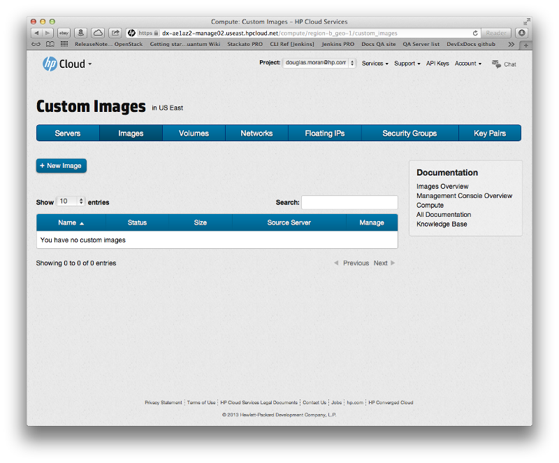
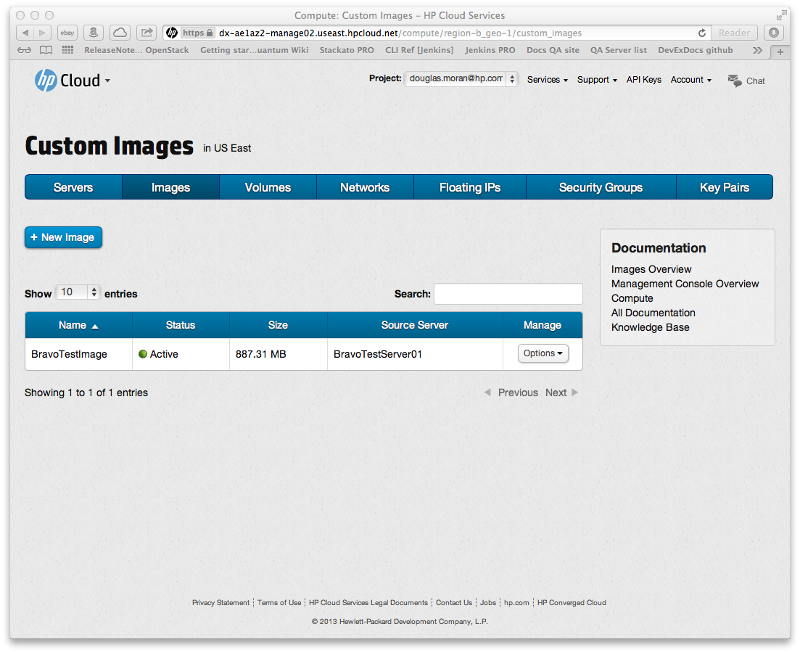

# HP Cloud Services version 12.12 to 13.5 assisted transition

This page provides with the key details you need to perform an assisted migration--using the HP Cloud support team--from version 12.12 to 13.5 of the HP Cloud software services.  If you plan on performing the migration yourself without support services, surf over to the [migration overview](/migration-overview) page for details.

This page covers the following topics and tasks:

* [Before you begin](#BeforeYouBegin)
* [Taking an image snapshot](#Snapshot)
* [Preparing a volume for migration](#PrepVolume)
* [Contacting support](#ContactingSupport)
* [For further information](#MoreInfo)

## Before you begin ## {#BeforeYouBegin}

Before you transition to version 13.5, we recommend:

* Purge any data you no longer need
* Remove any unnecessary log files

For each instance image, you need to determine if you want to move a snapshot of the root partition of that instance to version 13.5, or if you prefer to just create a new instance.

**Note to Damian**: Any other stuff for this section?

## Taking an image snapshot ## {#Snapshot}

The first step in preparing your data for migration to version 13.5 is to use the [Images screen](/mc/compute/images/) of the [Management Console](/mc/) (MC) to take a snapshot of your image.  

Using an image snapshot can make migration easier, but doesn't work in all instances.  Work with your support engineer to determine if this method is best for you, rather performing [self-migration](/migration-overview) using tools such as rsync, SCP, and other similar tools.

To create a snapshot:

In the [images screen](/mc/compute/images/) click the `+ New Image` menu bar item:

This opens the image creation pane in the images screen:

In the images creation pane, enter a name for your image in the `Image Name` text input field, and (optionally) a description of your image in the `Description` field.  In the `From server` pulldown, select the server from which you would like to create your image.  

Click the `Create` button to create the image with your entered parameters.  The images creation pane closes, and your new image appears in the images list:

The image appears in the list immediately with the status of `Queued`; while your image is being created, the `Status` changes to `Saving` and finally `Active`.  The new image is a snapshot of the server's image.

See the [Managing images](/mc/compute/images/manage/) page for details on using the MC for creating, deleting, and viewing image details.

## Preparing a volume for migration ## {PrepVolume}

The next step in transitioning your data to version 13.5 is to prepare your volume (and associated data) for migration.  When you migrate a block volume, it must be available; that is, not attached to an instance or running as an instance.  You also need to be aware that when you migrate a volume, all snapshots and volumes created from those snapshots are migrated as well.

To prepare your volume for migration:

1. detach from an instance
2. migrate all assets associated with the volumes (snapshots, the original volume if created from a snapshot, and the volume being requested)

**Note**: If you are using ephemeral storage to migrate a persistent instance, your data is lost when you terminate the instance.

<!--Note from Damian:  This should basically explain how to detach from an instance and that all assets associated with the volumes will be migrated (Snapshot, original volume if created from a snapshot, and the volume being requested.) -->

<!--Second note from Damian:  For a Block Volume to be migrated it will need to be in an “Available” state. This means it can’t be attached to an instance or running as an instance.  The customer should be made aware that when a Volume is migrated all snapshots and Volumes created from those snapshots will be migrated. They should be warned that if it is a persistent instance and they are using ephemeral storage that data will be lost when terminating an instance. -->

## Contacting support ## {#ContactingSupport}

Now that you have completed your preliminary transition steps, you need to [contact our Support team](https://www.hpcloud.com/contact_us):

* [live chat from hpcloud.com](https://account.hpcloud.com/cases#support_chat)
* [open a support case](https://account.hpcloud.com/cases)
* [email support@hpcloud.com](mailto:support@hpcloud.com)
* call at 1-855-61CLOUD (1-855-612-5683) in the U.S. or +1-678-745-9010 internationally.

## For further information ## {#MoreInfo}

For more information on migrating your services, as well as general information about version 13.5:

* The [migration overview](/migration-overview) page contains details on how to perform a self-migration from version 12.12 to 13.5 of the HP Cloud software
* Our [release notes for version 13.5](/release-notes/) of the HP Cloud software
* The [version overview](/version-overview/) provides a look at the different software versions available
* The [technical support knowledge base](https://community.hpcloud.com)
* [UNIX command-line interface migration information](/cli/unix/articles/migration/)
