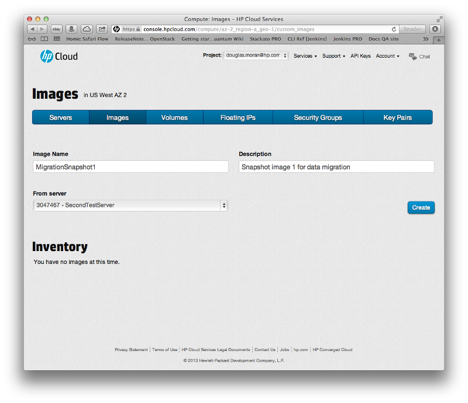
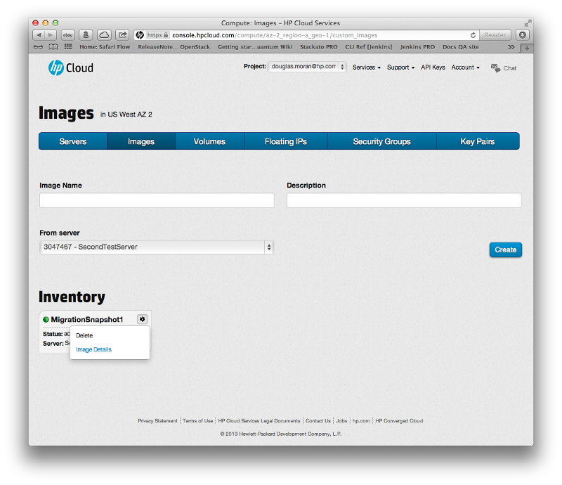
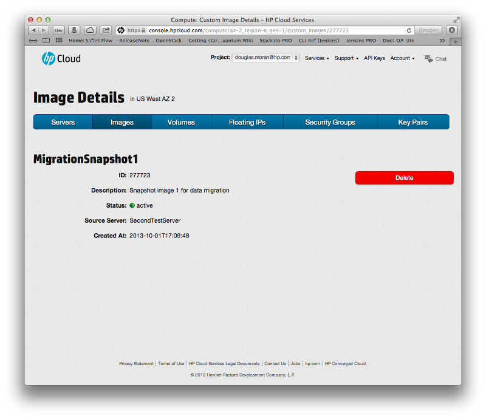
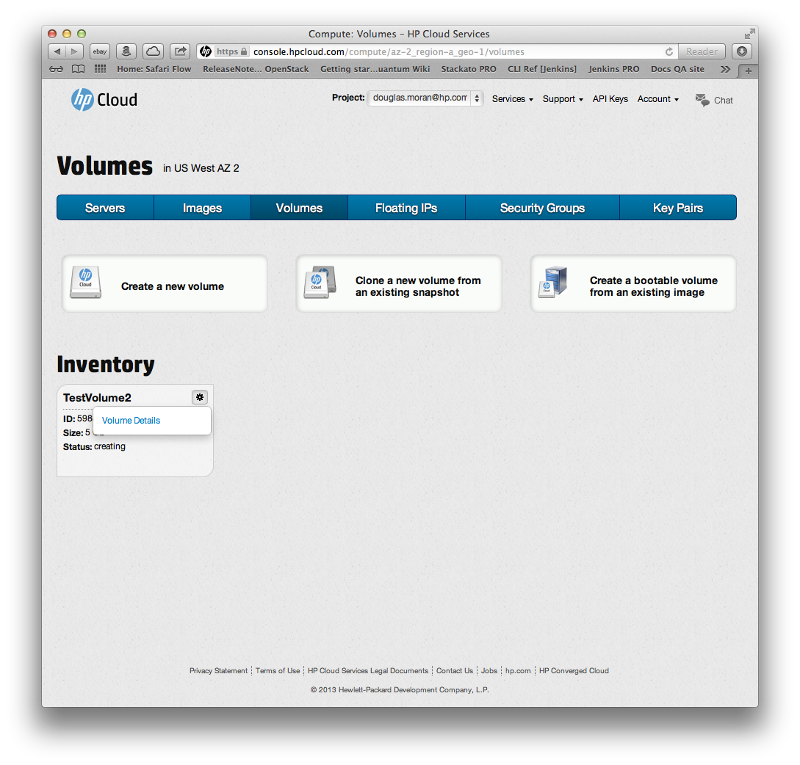
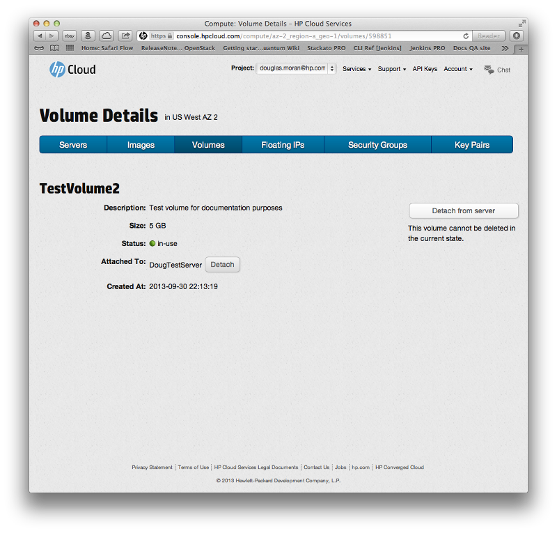
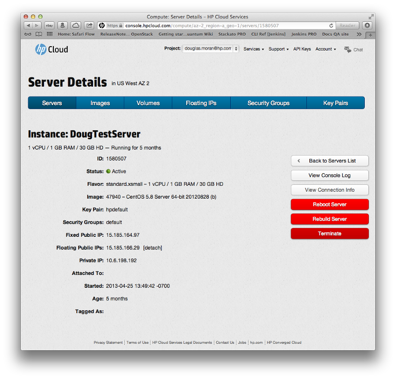

# HP Cloud Services version 12.12 to 13.5 assisted transition

This page provides with the key details you need to perform an assisted transition--using the HP Cloud support team--from version 12.12 to 13.5 of the HP Cloud software services.  If you plan on performing the migration yourself without support services, surf over to the [transition overview](/migration-overview) page for details.

This page covers the following topics and tasks:

* [Before you begin](#BeforeYouBegin)
* [Taking an image snapshot](#Snapshot)
* [Preparing a volume for migration](#PrepVolume)
* [Terminating a persistent instance created from a block volume](#TerminatingPersistent)
* [Contacting support](#ContactingSupport)
* [For further information](#MoreInfo)

## Before you begin ## {#BeforeYouBegin}

Before you transition to version 13.5, we recommend:

* Purge any data you no longer need
* Remove any unnecessary log files
* Review this document, and [contact support](#ContactingSupport) with any questions you have prior to following any steps outlined here.

###Key transition information###

Before attempted an assisted transition from version 12.12 to 13.5 of the HP Cloud software, be sure to keep the following critical pieces of information in mind:

* Review the [For further information](#MoreInfo) section at the bottom of this page to better understand the differences between the version 12.12 and 13.5 Compute environments
* IP addresses change between the two environments; if you have any DNS entries that point to your current configuration, you must plan to change them after your transition
* Instances are offline and volumes unavailable during the transition process outlined on this page
* For each instance image, you need to determine if you want to move a snapshot of the root partition of that instance to version 13.5, or if you prefer to just create a new instance.

## Taking a snapshot of an ephemeral instance ## {#Snapshot}

The first step in preparing your data for migration to version 13.5 is to use the [Images screen](/mc/compute/images/) of the [Management Console](/mc/) (MC) to take a snapshot of your instance.  

Using an image snapshot can make migration easier, but but may not be suitable for all transitions.  An instance snapshot includes only the root partition; ephemeral or additional disk space is not stored in a snapshot.  If you use ephemeral storage, you must [manually transition this data](/migration-overview#Ephemeral/).  

If you have questions on which process is best for your situation, contact your support engineer to determine what method is best for you rather than performing [self-migration](/migration-overview) using tools such as rsync, SCP, and other similar tools.

To create a snapshot:

In the [images screen](/mc/compute/images/), enter an `Image Name` and `Description` for your snapshot image, select the server from which you wish to create your snapshot in the `From server` drop-down menu, and click the `Create` button:

The image appears in the list immediately with the status of `Queued`; while your image is being created, the `Status` changes to `Saving` and finally `Active`.  The new image is a snapshot of the server's image.

To display the details for the image, you can either click the image name, or click the action button (`*`) and select `Image Details`:

This launches the `Image Details` screen for your image, which contains the `ID`, `Description`, `Status`, `Source Server`, and creation time for your image:

## Preparing a volume for migration ## {#PrepVolume}

The next step in transitioning your data to version 13.5 is to prepare your volume (and associated data) for migration.  When you migrate a block volume, it must be available; that is, not attached to an instance or running as an instance.  You also need to be aware that when you migrate a volume, it must be available, and all snapshots and volumes created from those snapshots are migrated as well.

###Detaching a block volume### {#DetachingBlock}

To detach a volume, in the [volumes screen](/mc/compute/volumes/), in the `Inventory` pane, click the action button (`*`) of the volume whose instance you wish to detach and select `Volume Details`:

This launches the `Volume Details` screen.  In the volume details screen, 

You are asked to verify the request:

Click `Yes, detach this volume`; your volume is detached.

Support must migrate all assets associate associated with the volumes (such as volume snapshots, the original volume if created from a snapshot, and the volume being requested). [Contact support](#ContactingSupport) for help when you reach this step.

**Note**: If you are using ephemeral storage to migrate a persistent instance, your data is lost when you terminate the instance.

See the [Managing volumes](/mc/compute/volumes/manage/) page for details on using the MC for creating and deleting a volume and bootable volumes, attaching and detaching volumes, managing volume snapshots, and viewing volume details.

##Terminating a persistent instance created from a block volume ## {#TerminatingPersistent}

You can't detach a volume that is running an instance; you must first terminate the instance to make the volume available.  To terminate an instance:

In the `Inventory` pane of the `Servers` screen of the [management console](/mc), click the action button (`*`) of the server whose instance you wish to terminate and select `Terminate`:

You instance is terminated.  You can also terminate the instance from the [server details](/mc/compute/servers/view-details/) screen of the MC.  To access the server details screen, just click on the server name (in the above example, `DougTestServert`) in the `Inventory` pane of the servers screen in the MC:

**Note**: When you terminate a persistent instance that was created from a bootable volume, any ephemeral storage that is being used is lost and the public IP is released for use. 

## Contacting support ## {#ContactingSupport}

Now that you have completed your preliminary transition steps, you need to [contact our Support team](https://www.hpcloud.com/contact_us):

* [live chat from hpcloud.com](https://account.hpcloud.com/cases#support_chat)
* [open a support case](https://account.hpcloud.com/cases)
* [email support@hpcloud.com](mailto:support@hpcloud.com)
* call at 1-855-61CLOUD (1-855-612-5683) in the U.S. or +1-678-745-9010 internationally.

## For further information ## {#MoreInfo}

For more information on migrating your services, as well as general information about version 13.5:

* The [migration overview](/migration-overview) page contains details on how to perform a self-migration from version 12.12 to 13.5 of the HP Cloud software
* Our [release notes for version 13.5](/release-notes/) of the HP Cloud software
* The [version overview](/version-overview/) provides a look at the different software versions available
* The [technical support knowledge base](https://community.hpcloud.com)
* [UNIX command-line interface migration information](/cli/unix/articles/migration/)
