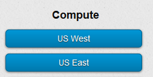
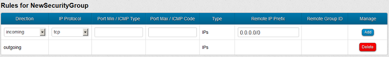
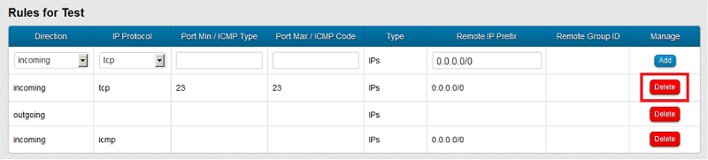

#HP Cloud Services 12.12 to 13.5: Data Transition Guide#

This page provides you with information to help you transition an HP Cloud Services version 12.12 instance to an HP Cloud Services 13.5 instance. 

In general, the process for transitioning to 13.5 involves creating a new 13.5 instance, configuring that instance, and moving any required data files to that new instance.  

This overview outlines the tasks you will need to perform, based upon the operating system on your cloud client system (your local system) and the operating systems used by your cloud instance(s).

Before deciding which tool to use, make sure the tools are installed and configured on the client system and your instances, as required. 

**Note**: Some of the links in this document contain information on using the Horizon-based HP Public Cloud Console to interact with your instances. HP Public Cloud Console is an alternative method for performing these tasks. The procedures in this document for using the classic management console are correct and should be followed at this time.

If you have any questions or concerns about which files to copy, [contact our Support team](#support).

##Tasks for the Cloud migration## {#tasks}

In order to transition version 12.12 to version 13.5, you will need to perform the following general steps: 

1. [Review the tasks in Before You Begin](#before).

2. [Generate a security key pair to use with the 13.5 instance](#keypair).

3. [Configure security groups to use with the 13.5 instance](#securitygroup).

4. [Create the HP Cloud Services 13.5 instance](#createinstance).

5. [Connect to the 13.5 instance from a local system](#connect).

6. [Copy data from the 12.12 instance to 13.5 instance](#copydata).

7. [Create and attach 13.5 block volumes to the 13.5 instance and copy data, as needed](#transdata).

8. [Review further information](#furtherinfo).

Within each of these general tasks, there are procedures for different operating systems and software tools.

##Before you begin## {#before}

Before you begin transitioning to a 13.5 instance, there are a few preliminary tasks you must complete first.

### Understand what's new for HP Cloud Services version 13.5 ### {#VersionDiffs}
HP Cloud Services version 13.5 is based on the latest version of OpenStack (Havana), which expands functionality and enhances the current capabilities of the existing services. The sections below give a brief overview of what's new for version 13.5.

#### HP Cloud Compute #### {#hpCloudCompute}   
In version 13.5, the HP Cloud Compute service provides on-demand computing giving you the ability to provision and manage large clusters of instances (virtual machines). You have more flexibility to select the type of instance that meets the needs of your application without having to pay for additional resources.

In addition, you now have larger and more powerful instance types (sizes) to choose from--four times the size of the largest instances offered by most public clouds. And, our large, xlarge, and 2xlarge sizes are also offered in high-memory versions.

#### Region-wide resources #### {#RegionWideResources}

Each region--US East and US West--consists of three physically isolated availability zones in which you can create instances and block storage volumes. You can use resources spread across multiple availability zones to create an application with high availability. If you require redundancy for your virtual machines or volumes make sure to specify different availability zones for each.

**Important!** Volumes can only be attached to instances created in the same availability zone.

#### Software defined networking #### {#SDN}

With the addition of our new best-in-class software defined networking (SDN) technology from HP Networking, you get enhanced network functionality and  a rich set of additional functionality including the ability to:

* Define and configure your own private virtual L2 networks
* Establish a VPN connection between the networks you create and your existing on-premise network
* Specify IP address ranges and security group parameters that define the firewall rules for your instances to ensure they don't conflict with your existing on-premise network
* Allocate and manage public floating IP addresses
* Connect to a specific network and connect an instance to more than one network
	
#### Block storage #### {#BlockStorage}

Block storage has always been available in the HP Cloud Compute service, but now it is a separate, but integrated, service, providing persistent, manageable volumes along with the ability to take a snapshot of a volume. Bootable volumes can be created from images in the Image Management service and these bootable volumes can be used to create persistent instances.

#### Bulk data import #### {#BulkDataImport}

Bulk import means we load your data into HP Cloud Block Storage or HP Cloud Object Storage--just send a hard drive directly to the HP data centers where we rapidly transfer your data to the cloud. Get apps with big data sets to the HP Cloud quickly and easily.

#### For more information #### {#MoreVersionDiffInfo}
For more information on migrating your services, and to better understand the differences between versions 12.12 and 13.5, see [Review further information](#furtherinfo).

###Purge unnecessary data and files###

We recommend you purge any data you no longer need and remove any unnecessary log files from your 12.12 instance(s). 

Log into the 12.12 instance using a tool such as WinSCP, or rsync and delete any files and data that does not need to be copied to the 13.5 instance. Having less data to copy will make the process quicker.

##Section 1: Generating a key pair## {#keypair}

Before you create your first HP Cloud Services 13.5 instance, you must generate a key pair for that instance. The new key pair can be used with any subsequent 13.5 instances you create. 

A key pair is a cryptographic tool that uses two mathematically related keys. One key can be used to encrypt a message that can only be decrypted using the other key. 

When you create a key pair, the key pair tool creates a private key and a public key. When you create an instance, you must select a key pair. The public key is injected into your instance and saved in the `.ssh` folder as an authorized key. To access that instance, you must have the private key associated with that public key on the client system.

You create both keys at the same time using any of multiple methods, including the following:
	
- [Using the classic management console](#keypairconsole) 
- [Using the API](#keypairapi) 
- [Using the HP Cloud UNIX CLI](#keypairunix)
- [Using the NovaClient CLI](#keypairnova)
- [Using an existing public key](#keypairown)

####Key Pairs and Availability Zones####

Key pairs are specific to a region, either US East or US West. Key pairs created in the US West or US East region can be used in any availability zone in that region.

In HP Cloud version 12.12, key pairs could be used only in a specific availability zone in the US West region. 

###Generating a Key Pair using the management console### {#keypairconsole}

You can use the management console to generate a key pair.

**Note**: In the management console, there is a 100-character limit in the `Key Name` field. To use a longer name, use the API following [the steps below](#keypairapi) to create a key pair.

To create a key pair using the management console:

1. Log in to the [classic management console](https://console.hpcloud.com/manage) using an HP Cloud Services client. 

	The log in page is similar to the following: 
     

2. In the Dashboard, click the appropriate compute region for the 13.5 instance, as shown.
 

3. From the menu, select **Key Pairs**. 

    The **Key Pairs** page appears.

4. Click **Add Key Pair**.

	The **Name** field displays, as shown.
	 

5. In the **Name** field, enter a name for the key pair. 

	Use only alphanumeric characters. Do not use spaces or special characters, such as periods. For more information, see [Naming Convention Best Practices](https://community.hpcloud.com/article/naming-convention-best-practices).

6. Click **Create Key**.

	After creating the key pair, the management console displays the contents of the private key, as shown. 
	 

7. Click `Download` to save the private key in a PEM file to the local system or copy the key pairs into a text editor and save the file in the PEM format on the local system. Note the location where you save the file for later use.

	IMPORTANT: If you copy the text, do not change the formatting of the text.

###Generating a key pair using the API### {#keypairapi}

To generate the key pair using the API: 

1.  On the 13.5 instance, use the following call, depending upon the data serialization format you choose, XML or JSON :
 

    `POST v2/{tenant_id}/os-keypairs`

	Where:

    	tenant_id (optional) - xsd:string - The ID for the tenant or account in a multi-tenancy cloud. You can find the tenant ID on the API Keys page in the management console. 

    	name (required) - xsd:string - The name to be associated with the key pair.

		public_key (optional) - xsd:string - The SSH public key to import. If not provided, both a public and private keys are returned to the user.

	XML

		<?xml version="1.0" ?>
		<keypair>
		    <name>{Name}</name>
		</keypair>

	JSON

		{
    		"keypair": {
    		    "name": "{Name}"
			}
		}

	The following examples create a key pair called `keypair-2`.

	XML

		<?xml version="1.0" ?>
			<keypair>
				<name>keypair-2</name>
			</keypair>

	JSON

		{
    		"keypair": {
    		    "name": "keypair-2"
			}
		}

	The key pair displays when created. 

2. Copy the private key into a text editor and save the file in the PEM format on the local system. Note the location where you save the file for later use. 

For more information on this API call, see [HP Cloud Compute Service API Reference](https://docs.hpcloud.com/api/v13/compute/#createKeypair).

###Generating a Key Pair using the HP Cloud UNIX Command Line Interface### {#keypairunix}

There are two methods you can use to create a key pair using the HP Cloud Services UNIX CLI. 

- Create your key pair using the `-o` flag to save the key pair file in the `~/.hpcloud/keypairs` folder. The flag does not display the key pair on the screen. Saving to a file allows you to use the auto-connect feature after you create an instance with that key pair. 
- Create a key pair without the `-o` flag to have the key pair display on screen. You will need to manually save the key pair in a text file.

**Tip**: For the full list of HP Cloud Services UNIX CLI commands, see the [UNIX command line interface commands](http://docs.hpcloud.com/cli/unix/reference).

To generate a key pair in UNIX:

1. Launch an SSH client to connect with the 12.12 instance you are migrating. 
	
2. Use either of the following commands:

    `hpcloud keypairs:add -o KEYPAIR_NAME`

	`hpcloud keypairs:add KEYPAIR_NAME`

	The following example creates a key pair named `test` and saves the key pair to a file at `/home/ubuntu/.hpcloud/keypairs/test.pem`:

    `$ hpcloud keypairs:add test`

3. Navigate to the key pair file. By default, the key pair is stored in the `/home/ubuntu/.hpcloud/keypairs/` directory.

4. Execute the following command to view the key pair file.

	`cat KEYPAIR_NAME2.pem`

	The key pair file contains text similar to the following:
	 

5. Copy the entire output into a text file on the local system, as shown in the following figure, and save the file in the PEM format. Note the location for future use.
	 
	
###Generating a Key Pair using the NovaClient CLI### {#keypairnova}

1. Connect with the 12.12 instance you are migrating.

2. Launch a command line window or UNIX shell.

3. Run the following command to create a key pair:

		nova keypair-add KEYPAIR_NAME

	Where:

	KEYPAIR_NAME. The name to assign to the key pair.

	Use only alphanumeric characters. Do not use spaces or special characters, such as periods, slashes, colons, commas, period, semicolons, underscores, or equal signs. Refer to [Naming Convention Best Practices](https://community.hpcloud.com/article/naming-convention-best-practices) for more information.

	**Note**: There is a 255-character limit in the NAME field. You will see a "Invalid keypair name (HTTP 400)" error if you've exceeded that limit.

	NovaClient creates the key pair. The private key pair displays, similar to the following. 
 

3. Copy the key pair into a text editor, as shown in the following figure, and save the file in the PEM format. Note the location for future use.
 

	**Note**: If you plan to connect to an instance using PuTTY, convert the PEM file to PPK file for use in PuTTY using a program such as PuTTYgen. For more information, see [Converting Your Keypair File](https://community.hpcloud.com/article/converting-your-keypair-file). 

###Uploading Your Own Public Key### {#keypairown}

You can use an existing public key to generate a new key pair based on that public key.

To generate a new public key using an existing private key:

1. Locate the public key file on the client system.

2. Log in to the [classic management console](https://console.hpcloud.com/manage).

3. In the Dashboard, click the appropriate compute region for the 13.5 instance.

4. From the menu, click **Key Pairs**.

5. In the Key Pairs screen, click **Add Key Pair**.

6. In the **Key Name** field, enter a name for the new key pair.

	Use only alphanumeric characters for the key pair name. Do not use spaces or special characters, such as periods. Refer to [Naming Convention Best Practices](https://community.hpcloud.com/article/naming-convention-best-practices) for more information.

	**Note**: In the management console, there is a 100-character limit in the Key Name field. To use a longer name, use the API following [the steps below](#keypairapi) to create a key pair.

6. Click **Show Public Key Field**. The **Show Public Key** field displays, similar to the following.
 

7. Copy and paste your public key into the text box, as shown. 
 

8. Click **Create Key**.

	The management console creates the key pair based on the public key you entered.

##Section 2: Controlling traffic using security groups## {#securitygroup}

Access to your instances is controlled by security groups. A security group is a collection of inbound and outbound rules that determine the protocols and ports an instance can send and receive traffic from. When you create an instance, you select a security group.

Security group rules specify the traffic that is allowed through to the server. No traffic can be received by an instance unless a security group rule explicitly allows that traffic from that IP address. 

The system includes one default security group, containing four rules, which appears similar to the following in the management console:
 

	Outgoing: This rule allows all outgoing traffic.
    Incoming ICMP: This rule allows all inbound ICMP traffic.
	Incoming TCP Port 22: This rule allows SSH traffic through port 22.
    Incoming Group Rule: A rule that adds the default group to itself.

You can create your own security groups or you can change the default group, as needed.

There are different methods that you can use to manage security groups:

- [Using the Management Console to control traffic](#securitygroupconsole)
- [Using the API](#securitygroupapi)
- [Using Python-NovaClient commands](#securitygrouppyth)

####About using CIDR to control traffic#### {#securitygroupcidr}

You can restrict access to your 13.5 instance by configuring security group rules using Classless Inter-Domain Routing (CIDR).

CIDR specifies an IP address range using a combination of an IP address and its associated network mask. CIDR notation uses the following format:

	xxx.xxx.xxx.xxx/n 

Where

	xxx.xxx.xxx.xxx - the IP address that is affected by the rule.
  
	/n - the network mask.

The following is an example of a typical CIDR network address:

    192.30.250.00/18

The `192.30.250.00` is the network address. The `/18` indicates that the first 18 bits are the network part of the address and the last 14 bits for specific host addresses.

The following examples show how to restrict access using CIDR:

	0.0.0.0/0 - This CIDR affects traffic across all IP addresses
	15.185.1.1/0 - This CIDR affects traffic across all IP addresses
	15.185.1.1/8 - This CIDR affects traffic to IP addresses starting with 15.x.x.x
	15.185.1.1/16 - This CIDR affects traffic to IP addresses starting with 15.185.x.x
	15.185.1.1/24 - This CIDR affects traffic to IP addresses starting with 15.185.1.x
	15.185.1.1/32 - This CIDR affects traffic to a single host with IP address 15.185.1.1

For more information on security groups, see [How To Add/Remove Security Groups from an Existing Instance](https://community.hpcloud.com/article/how-addremove-security-groups-existing-instance) and
[Common Ports and their Service](https://community.hpcloud.com/article/common-ports-and-their-service).

###Controlling traffic using the management console ### {#securitygroupconsole}

You can use the management console to add, delete, and modify security groups. 	

When you add, modify, or delete a security group rule, the rule immediately goes into effect for all instances using that security group.

####Creating a security group#### {#securitygroupconsolecreate}

To create a new security group:

1. Log in to the [classic management console](https://console.hpcloud.com/manage).

2. In the Dashboard, click the appropriate compute region for the 13.5 instance.

3. From the menu, click `Security Groups`.

4. In the Security Groups page, click `New Security Group`.

5. Enter a name and description for the security group in the fields that appear.

	A new security group is listed, similar to the following image.
	 

6. Click the name of the security group in the list to edit that group using the steps in the [following section](#securitygroupconsoleedit).

####Modifying a security group#### {#securitygroupconsoleedit}

To modify a security group:

1. Log in to the [classic management console](https://console.hpcloud.com/manage).

2. In the Dashboard, click the appropriate compute region for the 13.5 instance.

3. From the menu, click `Security Groups`.

4. In the Security Groups page, click the name of the security group to modify.

5. Add or edit a rule as follows:

	- Add a new rule by specifying the following in the top row in the Rules table, then click `Add` in the Manage column:

		-  Direction. Select *incoming* if the rule applies to traffic coming into the instance or *outgoing* if the traffic is leaving the instance.
		-  IP Protocol. Select UDP, TCP, or ICMP for the rule.
		-  Port Min / ICMP Type. Enter the port or ICMP type the rule affects. For a range of ports, enter the beginning port in the range. 
		-  Port Max / ICMP Code. Enter the port or ICMP type the rule affects. For a single port, enter the same port that you entered in the Port Min field. For a range of ports, enter the last port in the range.
		-  Remote IP Prefix. Enter the IP address and associated network mask that the rule affects, [using CIDR](#securitygroupcidr).

	- Delete a rule by clicking `Delete` in the Manage column for that rule, as shown. 
 

###Managing your Security Groups using the API### {#securitygroupapi}

You can create and configure security groups using the API.

To create a security zone and add rules:

1. Use the following [API call](https://docs.hpcloud.com/api/v13/compute/#4.1.12SecurityGroups) to add a security group to the list of security groups that are associated with the server.

	`POST v2/{tenant_id}/servers/{server_id}/action`

	Where: 

    	tenant_id - xsd:string - The ID for the tenant or account in a multi-tenancy cloud. You can find the tenant ID on the API Keys page in the management console.

		server_id - csapi:ID or UUID -- Server ID. This parameter can be an integer ID or a UUID. In either case, the specified server must be in the addressed Availability Zone. 

	XML

		<?xml version="1.0" ?>
			<addSecurityGroup xmlns="http://docs.openstack.org/compute/api/v2">
    		<name>security-group-2</name>
		</addSecurityGroup>

	JSON

  		{
    		"addSecurityGroup": {
    		    "name": "security-group-1"
    		}
		}

2. Use the following [API call](https://docs.hpcloud.com/api/v13/compute/#createSecGroupRule-jumplink-span) to create a security group rule. 

	`POST v2/{tenant_id}/os-security-group-rules`

	Where:

		tenant_id (optional) - xsd:string - The ID for the tenant or account in a multi-tenancy cloud.	You can find the tenant ID on the API Keys page in the management console.

		parent_group_id (required) - xsd:int - ID of the security group to which this rule will belong.

    	ip_protocol (optional) - xsd:string - Packets using  the specified IP protocol (TCP, UDP, ICMP) are delivered to the server. If ip_protocol is specified, the from_port and to_port must also be specified. If ip_protocol is omitted, traffic is delivered without regard to protocol. 

    	from_port (optional) - xsd:int - For TCP and UDP packets, traffic to ports between `from_port` and `to_port` are delivered to the server. For ICMP packets, the `from_port` specifies the ICMP type of the packets that will be accepted. If `from_port` is specified, the `to_port` and `ip_protocol` must also be specified.

    	to_port (optional) - xsd:int - For TCP and UDP packets, traffic to ports between `from_port` and `to_port` are delivered to the server. For ICMP packets, the `from_port` specifies the ICMP type of the packets that will be accepted. If `from_port` is specified, the `to_port` and `ip_protocol` must also be specified.

    	cidr (optional) - xsd:string - Traffic from source with an IP address in the range specified by CIDR will be accepted. Either `cidr` or `group_id` must be specified.

    	group_id (optional) - xsd:int - Traffic from all servers associated with the security group specified by `group_id` will be accepted. Either `cidr` or `group_id` must be specified.

For information on using the API to create and configure security groups, see the [HP Cloud Compute Service API Reference: Security Groups](https://docs.hpcloud.com/api/v13/compute/#4.1.12SecurityGroups).

###Managing your Security Groups using Python-NovaClient commands### {#securitygrouppyth}

You can use Python-NovaClient commands to add, delete, and modify security groups. 

####Creating a security group#### {#securitygrouppythcreate}

To create a new security group:

1. Connect with the 12.12 instance you are migrating.

2. Launch a command line window or UNIX shell.

3. Execute the following command to create a security group.

	`nova secgroup-create <name> <"description">`

	Where 

		name - The name of the security group.

		description - The Description of the security group. Use quotes with the description. 

	The following example creates a security group called *pgroup*.

		`$ nova secgroup-create pgroup testing`

4. Edit the group using the steps in the [following section](#securitygroupconsoleedit).

####Modifying a security group#### {#securitygrouppythedit}

To modify a security group:

1. Connect with the 12.12 instance you are migrating.

2. Launch a command line window or UNIX shell.

3. Execute the following command to display a list of the security groups for the current instance.

	`nova secgroup-list`

	A list of security groups displays, similar to the following: 
	 

4. Execute the following command to display the rules in a specified security group.

	`nova secgroup-list-rules [security_group_name]`

	Where

		security_group_name - The name of the security group.

	The following example lists the rules in the default security group.

		`nova secgroup-list-rules default`

	A list of rules in that security group displays, similar to the following: 
	 

		- The ICMP rule allows all ICMP traffic.
		- The TCP port 22 rule allows SSH traffic over port 22.
		
5. Use the commands in the [Python Novaclient CLI: Command Line Reference](https://docs.hpcloud.com/cli/nova/reference) to add and remove the rules as needed.

	**Add a rule to a security group.**

    `nova secgroup-add-rule <secgroup> <ip_proto> <from_port> <to_port> <cidr>`

	Where:

		secgroup - The ID of the security group.
	
		ip_proto - IP protocol type (ICMP, TCP, or UDP).

		from_port - The port at start of range. For a range of ports, enter the beginning port in the range.

		to_port - The port at the end of range. For a single port, enter the same port in the Port Min field. For a range of ports, enter the last port in the range.

		cidr - Classless inter-domain routing (CIDR) for the address range. 

	**Remove a rule from a security group.**

	`nova secgroup-delete-rule <secgroup> <ip_proto> <from_port> <to_port> <cidr>`

**Note**: You can type `nova help` before any of the commands for more information and to get the syntax used including both required and optional arguments. 

##Section 3: Creating the storage instance## {#createinstance}

The [OpenStack Storage](http://www.openstack.org/software/openstack-storage) infrastructure provides two classes of storage: *ephemeral* instance storage and *persistent* instance storage.

Ephemeral instance storage exists only for the life of an instance. An ephemeral instance persists across reboots of the client system, but when an instance is terminated the associated data is also deleted.  

Persistent image storage exists beyond the life of an instance. When you create a persistent instance, you also create a bootable volume. If you terminate the instance, the root file system continues to exist and the data is retained.

- [Create an ephemeral instance](#createephinstance)
- [Create a persistent instance](#createpersinstance)

After you create the instance, you can copy the data from your HP Cloud Services version 12.12 instance to your new version 13.5 instance.

###Creating an ephemeral instance### {#createephinstance}

You can create an ephemeral instance for HP Cloud Services by using either the management console or by using Python-NovaClient commands.

- [Using the classic management console](#createephinstanceconsole)
- [Using Python-NovaClient](#createephinstancepyth)

**Note:** HP Cloud Services 13.5 does not assign a public IP address automatically. To connect with the instance, you must assign a *floating* public IP address to the instance. The following procedures contain steps to assign the floating IP to the new instance.

For more information on floating IP addresses, see [Managing Your Floating IPs](https://community.hpcloud.com/article/managing-your-floating-ips-135#fipnovacli). 

####Creating an ephemeral instance using the management console#### {#createephinstanceconsole}

To create an ephemeral instance using the management console:

1. Log in to the [classic management console](https://console.hpcloud.com/manage).

2. In the Dashboard, click the appropriate compute region for the 13.5 instance.

3. In the Security Groups page, click `Create Server`.

4. Enter the appropriate information in the following fields:

	Name - Enter a display name for the instance.

	AZ (optional) - Select a specific availability zone. Select **No Preference** to have an availability zone assigned randomly.

	Source Image - Select a bootable image, denoted in the list with a (b) from one of the following lists:
	- Public - A user-uploaded images or custom images (for example, made from a snapshot of current images)
	- Partner Images - An image made available by HP partners.
	- Private - A private image that are available only to a limited set of users.
	- Bootable Volume - A saved bootable volume that you previously created. 

	**Tip**: The public image list might contain deprecated images. You should avoid using deprecated images, except in specific situations where that operating system is required.

	Flavor - Select a flavor for the instance. A flavor is a set of resources, including the number of virtual CPUs, the amount of RAM, and the size of the ephemeral disks.

	Key name - Select the key pair you created for the instance. For more information on key pairs, see [Generating a key pair](#keypair). 

	Security Group - Select the security group to assign to your server. For more information on security groups, see [Managing traffic using security groups](#securitygroup). 

5. Click `Create`.

	The management console lists the new instance with a status of `Build`. When the instance is `Active`, you must assign a *floating* public IP address to the instance in order to access the instance.

6. In the menu, click `Floating IPs`.

7. In the Floating IPs page, click `Allocate New IP`.

	A new floating IP address is added to the table on the page.

8. Select the new instance from the `Port` drop down and click `Apply`. 

	The IP is assigned to the instance and can be used to connect with that instance.

After you assign the floating IP address, you can [connect to the instance](#connect).

####Creating an ephemeral instance using Python-NovaClient commands#### {#createephinstancepyth}

To create an ephemeral instance using Python-NovaClient commands:

1. Connect with the 12.12 instance you are migrating using a SSH tool, such as PuTTY.

2. Launch a command line window or UNIX shell.

3. Execute the `nova boot` command:

		nova help boot
		usage: nova boot [--flavor ] [--image ]
		[--meta ] [--file ]
		[--key-name ] [--user_data ]
		[--availability_zone ]
		[--security_groups ]
		[--block_device_mapping ]
		[--nic ]
		[--config-drive ]
    	
	**Note**: Only `--flavor`, `--image`, and name are required.

	Where:

		--flavor (required) - The ID number for the flavor to use for the new instance. Use the nova flavor-list command to view a list of flavors and IDs. 
	
		--image (required) - The ID number for the boot image to use. Use the nova image-list command to view a list of images and IDs. 

		--meta (optional) - Metadata to associate with the instance for use with the metadata service.

		--file (optional) - File(s) from the local server to store on the new instance. You may store up to 5 files.

		--key_name (optional) - The name of the key pair that should be used. The key pair must already exist. 
	
		--user_data (optional) - User data file to pass into the metadata server.

		--availability_zone (optional) -- The availability zone for instance placement.

		--security_groups (optional) - The name of the security group to use. 
	
		--block_device_mapping (optional) - A definition of any block devices to attach to the instance. For onformaton, see [Block mapping](#blockmapping). 

		--nic (optional) - Create a network interface card (NIC) on the server. Specify the option multiple times to create multiple NICs. Use either the UUID or IPv4 fixed address for the NIC.

			- nic net-id:UUID to attach the NIC using the UUID (optional) 
			- nic v4-fixed-ip:IPv4_fixed_address for NIC (optional). port-id: attach NIC to port with this UUID (optional)

		--config-drive (optional) - Enables configuration drive.

		--name (required) - The name for the instance.

	The following example is a NovaClient command to create an XSmall Ubuntu 12.04 instance.  The following example will attempt boot from image 75845 on a selected network. The instance does not delete on terminate.

	    nova boot --flavor "100" --image "75845" --key_name "az1" --security_groups "default" -block_device_mapping vda=50357:::0 --nic network-id=UUID1 TEST_SERVER

	The output displays, similar to the following:
	 

4. Use the following command to allocate a floating IP address that you can attach to the instance.

	`nova floating-ip-create`

	HP Cloud Services 13.5 does not assign a public IP address automatically. To connect with the instance, you must assign a *floating* public IP address to the instance. 
	 

5. Use the following command to attach the floating IP to an instance:

	`nova add-floating-ip SERVER IP_ADDRESS`

	Where:

		Server - The name or ID of the instance to attach the floating IP.

		IP_Address - The floating IP address you allocated.

After you assign the floating IP address, you can [connect to the instance](#connect).

####About block mappings#### {#blockmapping}

A block device mapping defines the block devices to be attached to an instance.

A block device mapping uses the format: 

	`[dev_name=[id]:[type]:[size(GB)]:[delete_on_terminate]` 

Where:

	dev_name - The device name (or drive name) ID of the device to attach the volume. This value is typically /dev/vda#. Use `	` to list device names.

	type - The volume type, either *snap* or blank. Enter *snap* if the volume is based on a snapshot. Leave blank if the volume is not based on a snapshot.

	size (GB) - The size of the volume, in GB. Or, leave the value blank to have the Compute service determine the size.

	delete_on_terminate. Indicate whether the volume should be deleted when the instance is terminated. Enter *True* or *1* to delete the volume. Enter *False* or *0* to not delete.

The following example attaches a volume with ID 50357 to a device named vda. The volume will not be deleted when the associated instance is terminated.

	`-block_device_mapping vda=50357:::0 boot-from-vol-test`
	
###Creating a persistent instance### {#createpersinstance}

Use any of several tools to create bootable block volume and a 13.5 persistent instance.

The process for creating a persistent instance involves creating a storage volume then creating a server to host that volume.

- [Using the classic management console](#createperinstanceconsole)
- [Using Python-NovaClient commands](#createperinstancepyth)	

**Note:** HP Cloud Services 13.5 does not assign a public IP address automatically. To connect with the instance, you must assign a *floating* public IP address to the instance. The following procedures contain steps to assign the floating IP to the new instance.

For more information on floating IP addresses, see [Managing Your Floating IPs](https://community.hpcloud.com/article/managing-your-floating-ips-135#fipnovacli). 

####Creating a persistent instance using the management console#### {#createpersinstance}

1. Log in to the [classic management console](https://console.hpcloud.com/manage).

2. In the Dashboard, click the appropriate compute region for the 13.5 instance.

3. In the menu, click `Volumes`.

4. In the Volumes page, click `New Volume` to create a bootable volume.

5. Enter the appropriate information in the following fields:	

	Volume Name - Enter a name for the volume.

	Description - Enter a description for the volume.

	Availability Zone - Select the Availability Zone for the volume, or select No Preference to use the volume in any zone.

	Size - Select the size of the volume from the drop down menu.
	
6. Select the `Make bootable from Image`. 

	Three buttons and a drop down list appear. 

	A bootable volume enables you to launch an instance from that volume. You must make the volume bootable to use the volume to create a persistent server.

7. Click one of the image type buttons: 

	- Public - A user-uploaded images or custom images (for example, made from a snapshot of current images)
	- Partner Images - An image made available by HP partners.
	- Private - A private image that are available only to a limited set of users.
	- Bootable Volume - A saved bootable volume that you previously created. 

8. Select the specific image from the drop down list.
	
9. In the Volumes page, click `Create Volume`.

	The volume is created. Now, you create the instance and attach the new volume to that instance.

10. In the menu, click `Servers`.

11. In the Servers page, click `New Server`.

12. Enter the appropriate information in the following fields:
	
	Name - Enter a name for the server.

	Availability Zone - Select the same Availability Zone as the volume you created, or select No Preference to use a volume from any zone.

	Network Port - Select a port use if you've manually created a network port.

	Image type - Click `Bootable Volumes` and select the bootable volume you created.
	
	Key name - Select the key pair to use with the server.

	Flavor - Select a flavor for the server.
	
	Security Groups - Select a security group to use with the server.

	Tags (optional) - Enter text to create metadata to associate with the instance for use with the metadata service.

12. Click `Create` to create the instance.

	The management console lists the new instance with a status of `Build`. When the instance is `Active`, you must assign a *floating* public IP address to the instance in order to access the instance.

13. In the menu, click `Floating IPs`.

14. In the Floating IPs page, click `Allocate New IP`.

	A new floating IP address is added to the table on the page.

15. Select the new instance from the `Port` drop down and click `Apply`. 

	The IP is assigned to the instance and can be used to connect with that instance.

After you assign the floating IP address, you can [connect to the instance](#connect).

####Creating a persistent instance using Python-NovaClient commands#### {#createperinstancepyth}

1. Connect with the 12.12 instance you are migrating using a SSH tool, such as PuTTY.

2. Launch a command line window or UNIX shell.

3. Execute the following command to identify an image to use with the bootable volume:

	`nova image-list`

	A list of images displays, with an ID on the left column.
	 

	**Note**: Multi-part images (where the kernel and RAM disk are separate) do not work as bootable volumes. You can identify a multi-part volume in an image list if the image names are identical, as shown in the following example.
	 
	
4. Create the volume using the following command:

    `nova volume-create --image-id  --display-name <size>`

	Where:

		image_id - The ID of the image to use.
	
		display_name - A name to associate to the volume. 
	
		Size - Specify the size of the volume in giga-bytes (GB). This option takes no argument. The minimum size for a Linux Instance is 10 GB.

	The following example creates a 20 GB volume called TestBootableVolume:  

		`nova volume-create --image_id 50421 --display_name TestBootableVolume 20`

5. Confirm that the volume was created using the following command:

	`nova volume-list`

	The output appears similar to the following:
	 
	
6. Obtain a flavor, key pair name, security group name, and flavor ID to use with the instance. Use the following commands to obtain these values, as needed:
	
	`nova flavor-list`

	`nova image-list`

	`nova keypair-list`
	
	`nova secgroup-list`

7. Create the instance using the following command:

		nova help boot
			usage: nova boot [--flavor ] [--image ]
			[--meta ] [--file ]
			[--key-name ] [--user_data ]
			[--availability_zone ]
			[--security_groups ]
			[--block_device_mapping ]
			[--nic ]
			[--config-drive ]
    	

	**Note**: Only `--image`, `--flavor`, and name are required. 

	For definitions of each property, see [Creating an ephemeral instance using Python-NovaClient commands](#createephinstancepyth).

	Output similar to the following indicates that the persistent instance has been created:
	 

8. Allocate and assign a floating IP using the following command.	

	HP Cloud Services 13.5 does not assign a public IP address automatically. To connect with the instance, the instance requires a floating IP address.

9. Use the following command to allocate a floating IP address that you can attach to the instance.

	`nova floating-ip-create`

	Output similar to the following lists the allocated IP address.
	

10. Use the following command to attach the floating IP to an instance:

	`nova add-floating-ip SERVER IP_ADDRESS`

	Where:

		Server - The name or ID of the instance to attach the floating IP.

		IP_Address - The floating IP address you allocated.

After you assign the floating IP address, you can [connect to the instance](#connect).

##Section 4: Connecting To Your Instance## {#connect}

After you have created your instance, you need to connect to the instance in order to work with the instance. For example, you must connect to the instance to copy data to the instance.

**Note:** When you connect to an HP Cloud Services version 13.5 instance, you must use the floating IP address you created for the instance. If you do not know the floating IP, you can find the address using the management console on the Server Details page for your server. 
	
Use one of the following methods to connect to the new instance, based on the operating system you are connecting from.

- [Connecting to an Windows instance from Windows O/S](#connectwindows)
- [Connecting to an Linux instance from Windows O/S](#connectputty)
- [Connecting to a linux instance from Linux O/S](#connectlinux)
- [Connecting to an Linux instance from Mac O/S](#connectmac)

###Connecting to a Windows system from a Windows system### {#connectwindows}

You can use Windows Remote Desktop Connection (RDC) to access the new instance. In order to use RDC, you must have the password for a user account on the 13.5 instance. By default, an Administrator account is present on all new instances. The following procedure includes steps for retrieving the Administrator password.

**IMPORTANT!** You must have [port 3389 open in your Security Group](#securitygroup) in order to RDP as this is the port that service uses.

To connect to a Windows instance from a Windows client:

1. Launch Windows Remote Desktop connection, by default **Start > All Programs > Accessories > Remote Desktop Connection**. 

2. Enter the floating IP address of the instance to which you want to connect, and then click **Connect**.

3. Click Use another account to enter the user name and password. For a new instance, the user name is `Administrator`. 
 
	To retrieve the Administrator password:	

	a. Log in to the [classic management console](https://console.hpcloud.com/manage).

	b. In the Dashboard, click the appropriate compute region for the 13.5 instance.

	c. From the menu, click **Servers**.
	
	d. For the server to which you want the password, click **Options > View Connection Info**.
	
	e. Enter the private key pair in the field that displays and click **Get Administrator Password**.

	The current Administrator password displays. For more information, see    	

3. After entering the user name and password, click **Connect**.

RDC launches the Windows desktop for the new instance.

###Connecting to a Linux instance from a Windows system using PuTTY### {#connectputty}

Before you start, make sure your key pair file has been converted from the PEM to PPK format and is stored on the local system. For more information, see [Converting Your Keypair File](https://community.hpcloud.com/article/converting-your-keypair-file). 

To connect to an instance using PuTTY:
	
1. Launch the PuTTY interface.

2. Enter the following information, using appropriate values:

	a. In the Category list, select **Session**. This pane might be active by default. 

	b. In `Host Name (or IP address)` field, enter the floating IP address for your instance.

	c. In the `Category` list, select `Connection` -> `SSH` -> `Auth`. 

	d. In the `Private key file` field, click `Browse` and locate your PPK file that you created for your instance. To use PuTTY, you must have a key pair in the PPK format.

	e. In the Category list, select `Session`. 

	f. In `Saved Sessions` field, enter a name for the SSH session and click `Save`.

3. Open the session by selecting saved sessions and click `Open`.

4. In the dialog that appears, click `YES`.

	**Note**: If your instance uses Ubuntu version 11.10 and higher, use the default user name *ubuntu*. Other Linux images, use *root* as the default user name. 

	If you are prompted for a password upon first time log in, check the following:

	- Load up your instance settings and make sure that the key pair is loaded under **Connection > SSH > Auth > Private key file** for authentication.
	- Make sure that you created the PEM or PPK key pair file correctly. Remake the file if needed.

	For more information, see: [Getting prompted for a password when accessing your instance for the first time](https://community.hpcloud.com/article/getting-prompted-password-when-accessing-your-instance-first-time-135).

After logging in, a system window displays, which indicates you are connected to the HP Cloud Instance.

###Connecting to a Linux Instance from a Linux system using Terminal### {#connectlinux}

Before you start, make sure your key pair file in PEM format is stored on the local system. For more information, see [Generate a security key pair]($keypair).

To connect to an instance using the Linux CLI:

1. Open a terminal session on the local system and browse to the directory where the key pair file is stored.

2. Execute the following command, using the appropriate key pair name:

	`chmod 400 keypair_name.pem`
 	
	Where 

		keypair_name - the name of the key pair PEM file.

	This command grants read access to only the owner of the file.

3. Execute one of the following commands to open an SSH session to the instance, based on your Linux distribution:

	CentOS or Fedora:

	`ssh -i	 keypair_name.pem root@floating_ip`

	Ubuntu or Debian:

	`ssh -i keypair_name.pem ubuntu@floating_ip`

	Where 

		keypair_name - the name of the key pair PEM file.

		(user)@floating_ip - the default user name and floating IP address assigned to the instance.

4. If you see a prompt similar to the following, enter `Y` to select Yes to continue connecting.

	`The authenticity of host 'FLOATING_IP (FLOATING_IP)' can't be established.
	RSA key fingerprint is 17:7f:a9:ae:9d:6c:76:bf:be:68:a4:05:f6:da:84:7b.
	Are you sure you want to continue connecting (yes/no)? yes
	Warning: Permanently added 'FLOATING_IP' (RSA) to the list of known hosts.`

You are now connected to the instance.

###Connecting to a Linux instance from a Mac system### {#connectmac}

Before you start, make sure your key pair file in the PEM format is stored on the local system.

To connect to an instance using a Mac operating system:

1. Launch a Terminal from the **Applications > Utilities** menu.

2. Browse to the directory where the key pair (PEM) file is located.

3. Execute the following command,  to protect your key pair file:

	`chmod 400 KEYPAIR_NAME.pem`

	This command grants read access to only the owner of the file.

4. Execute one of the following commands to connect to the instance using SSH, depending upon your Linux distribution:

	CentOS or Fedora:

	`ssh -i KEYPAIR_NAME.pem root@FLOATING_IP`

	Ubuntu or Debian:

	`ssh -i KEYPAIR_NAME.pem ubuntu@FLOATING_IP`

	Where 

		keypair_name - the name of the key pair PEM file.

		(user)@floating_ip - the default user name and floating IP address assigned to the instance.

5. If you see a prompt similar to the following, enter `Y` to continue connecting,

		The authenticity of host 'FLOATING_IP (FLOATING_IP)' can't be established.
		RSA key fingerprint is 17:7f:a9:ae:9d:6c:68:a4:05:f6:da:84:7b.
		Are you sure you want to continue connecting (yes/no)? yes
		Warning: Permanently added 'FLOATING_IP' (RSA) to the list of known hosts.

##Section 5: Copying data from a 12.12 instance to v13.5 instance## {#copydata}

After you create a new 13.5 instance and have connected to that instance on your local system, you can copy the data from your version 12.12 instance to your new 13.5 instance. You can use any data transfer tool of your choice (for example, SCP or FTP), including the following methods, to copy the data to the new instance.

- [Using SFTP with Windows instances](#copydatascp)
- [Using rsync with Linux instances](#copydatarsync)

If you have any questions or concerns about which files to copy, contact [Support](#support).

###Using SFTP to Transfer Files between Windows Instances###{#copydatascp}

Set up freeFTPd

Use WinSCP

####Using WinSCP to transfer files to your Windows instance#### {#copydatascp}

WinSCP is a free program available for Windows that enables you to transfer files between attached systems.

To use WinSCP to transfer files, either the 12.12 instance or the 13.5 instance must have an FTP server configured and running and the other instance must have a properly-configured Win SCP client. The following procedure assumes the 12.12 instance is the server and the 13.5 instance is the client.

**Note**: For information on setting up an FTP server, see [Using FileZilla](#copydatazill).

Before starting to transfer files:

- You must use the floating IP address you created for the instance. If you do not know the floating IP, you can find the address using the management console on the Server Details page for your server. 
- Make sure that Port 22 is open in the security group associated with your instance. For more information, see [Controlling traffic using security groups](#securitygroup).
- Make sure your private key file is in PPK format on the client system.  You can convert a PEM key pair into PPK format. For more information, see
[Converting Your Keypair File](https://community.hpcloud.com/article/converting-your-keypair-file).

To transfer files to your 13.5 instance:

1. Use a remote desktop application (RDA) to connect with the 13.5 instance with the WinSCP client.

2. In the instance, launch WinSCP.

3. Use WinSCP to log into the HP Cloud Services 12.12 instance using the fields on the Session page:
	- Host name. Enter the floating IP address of your instance.
	- Port number. Enter the port number for your instance or use the default, port 22.
	- User name: If the instance requires a specific user for WinSCP enter the name.
	- Password. Enter the password for the specified user or leave blank if a password is not required.
	- Private key file: Click `Browse` to locate the PPK file that you created for this instance.

4. Click `Login` to connect. 

	When you are connected, the files and folders in the default directory display.

5. Select all required files from the 12.12 server and move the files to the 13.5 instance.

###Using rsync to transfer files to your Instance (Mac OSX or Linux)### {#copydatarsync}

rsync is an open source utility that provides file transfers between connected systems. 

Before starting to transfer files, make sure the private key associated with the instance is stored on the local system. For more information, see  [Generate a security key pair](#keypair).

To transfer files using rsync:

1. On the 12.12 instance, click **Applications > Utilities** to launch a terminal.

2. Browse to the directory where the key pair (PEM) file is located.

3. Execute the following command, to protect your key pair file:

	`chmod 400 KEYPAIR_NAME.pem`

	This command grants read access to only the owner of the file.

4. Execute a command similar to the following to select a directory from the 12.12 instance and move the directory to the 13.5 instance.

    `rsync -e "ssh -i [key].pem" -avz [source directory on instance] [user]@[instance ip]:[destination directory on local]`

	Where:

    -e. Specifies the remote shell to use. Enter `ssh -i [key].pem` to use SSH and to specific the private key.
    
    -avz. Specifies rsync Archive mode (-a), Verbose mode (-v), and to compress data while in transit.

		Archive mode preserves file permissions and other file attributes (Using `-a` is equivalent to `-rlptgoD`).  

		Verbose mode provides detailed information about the transfer. Or, use the `-q` option to suppress non-error messages (quiet mode). 

	key - The location of the key pair (PEM) file using the full path, such as `/home/user1/Key1.pem`.
    
	source directory on instance - The location of the directory on the 12.12 instance to copy.
	
	user - A user account with permissions on the remote instance.
	
	instance IP - The floating IP address of the instance to which you are copying data.
    
	destination directory on local - The location on the 13.5 instance to copy the data. 

Additionally, you can include the `--progress` option to show a progress bar of the transfer.

The following example copies the files from one instance (`/home/user1/projects/web/html`) to the `/var/www` directory on instance at 15.15.15.15:

	rsync -e "ssh -i /home/usr1/Key1.pem" -avz  /home/user1/projects/web/html administrator@15.15.15.15:/var/www

For more information on using rsync to move files, see [Using RSYNC to Upload or Transfer Files on Linux and Mac OSX](https://community.hpcloud.com/article/using-rsync-upload-or-transfer-files-linux-and-mac-osx).

##Section 6: Creating and attaching block volumes## {#transdata}

If 12.12 instance uses one or more cloud block storage volumes, you must transition the data in those block volumes to a 13.5 instance.	

The process for transitioning the data for block volumes involves creating and attaching a 13.5 block volume and copying the data from your version 12.12 instance to the new instance.

You can perform these tasks using a number of tools including:

- [Using the classic management console](#transdataconsole)
- [Using the UNIX CLI tool](#transdataunix)
- [Using Windows PowerShell](#transdatawin)

###Creating and attaching a block volume using the management console### {#transdataconsole}

To create a block volume and attach the volume to the instance:

1. Log in to the [classic management console](https://console.hpcloud.com/manage).

2. In the Dashboard, click the appropriate compute region for the 13.5 instance.

3. From the menu, click **Volumes**.

4. In the Security Groups page, click **New Volume**.

5. Enter the appropriate information in the following fields:

	Volume Name - Enter a name for the volume.

	Description - Enter a description for the volume.

	Availability Zone - Select the Availability Zone for the volume, or select No Preference to use the volume in any zone.

	Size - Select the size of the volume from the drop down menu.

6. Click **Create Volume**.

	The volume appears in the Volumes screen with a status of *Creating*. When the volume creation is complete, the status changes to *Available*.

7. To attach the volume to an instance, click **Options > Attach** in the Manage column. 

8. In the Attach to Server page, select the instance from the drop-down menu.

9. Click **Attach**. 

	The volume attaches to the first available device on the specified server. If only one volume is attached to the instance, the first device will be `/dev/vdc`. 
	
	To select a specific device to attach, use one of our CLI tools or the API.

	After the volume is attached to the instance, the volume appears in the Volumes screen with a status of `In Use`, and the name of the attached server.

10. You need to prepare your volume for use, to bring the volume on line or partition and format the volume. See [Preparing Your Block Storage Volume For Use](https://community.hpcloud.com/article/preparing-your-block-storage-volume-use).

11. When the volume is available, you can copy the data from your version 12.12 instance attached volume to your new version 13.5 instance, as described in [Copy data from the 12.12 instance to the 13.5 instance](#copydata).

###Creating and attaching a block volume using a UNIX CLI tool### {#transdataunix}

You can use a HP Cloud Services UNIX CLI to create and attach a block volume on the 13.5 instance. Then, copy the data on the 12.12 instance to the new 13.5 instance.

To create a block volume and attach the volume to the instance:

1. Launch an SSH tool, such as PuTTY to access the 13.5 instance.

2. Execute the following command to add a new volume, using the appropriate values:

    `$ hpcloud volumes:add <name> <size>`

	Where

		name - the name to assign to the block volume.

		size - the size of the block volume in giga-bytes (GB).
    
	The following example creates a 1GB volume called `test`.

	`$ hpcloud volumes:add test 1`

3. Execute the following command to attach the new volume to the server, using the appropriate values: 

	`$ hpcloud volumes:attach <volume> <instance> <device>`

	Where:

		volume - the name of the volume to attach.

		instance - the name of the 13.5 instance to attach the instance to.
	
		device - The Linux device name (or drive name) ID of the device where the instance resides. This value is typically /dev/vda#.
		
		**Tip**: Use the Linux commmands such as `fdisk -l` or `cat /proc/partitions` to view a list of device names.

	The following example attaches a volume, *test*, to the srv1 instance on */dev/vdi*.

    	$ hpcloud volumes:attach test srv1 /dev/vdi

4. You need to prepare your volume for use, by using  the UNIX CLI to partition and format the volume. See [Preparing Your Block Storage Volume For Use](https://community.hpcloud.com/article/preparing-your-block-storage-volume-use#bocklinux).

5. Copy the data from your version 12.12 instance attached volume to your new version 13.5 instance, as described in [Copy data from the 12.12 instance to the 13.5 instance](#copydata).

###Creating and attaching a block volume using Windows PowerShell### {#transdatawin}

You can use a Windows PowerShell to create and attach a block volume on the 13.5 instance. Then, copy the data on the 12.12 instance to the new 13.5 instance.

To create a block volume and attach the volume to the instance:

1. On the 13.5 instance, launch a Windows PowerShell window.  

	Select the shell appropriate to your system, either the 64-bit or 32-bit version. 

2. Enter the HP Cloud Services CLI by entering:

	`PS C:> cd HPCS:`

3. Create a new block storage volume by executing the following command, using the appropriate values:

		PS HPCS:\\> New-Volume <"name"> <"Description"> <size> "metadata|metadata"

	Where:
	
		name - the name for the new volume in quotes

		description - a description for the new volume in quotes

		size - the size of the volume 

		metadata - metadata to associate with the instance for use with the metadata service, in quotes and separated by a pipe character.

	The following example creates a new volume with the name `MyNewVolume`, a description of `MyNewVolume Description` and a volume size of 10 gigabytes. 

    	PS HPCS:\\> New-Volume "MyNewVolume" "MyNewVolume Description" 10 "test|data"
 

4. Attach the volume to an existing server by executing the following command, using the appropriate values:

		`PS HPCS:\\> Attach-Volume <server_ID> <volume_ID> <device_name>

	Where:
	
		instance_ID - the ID number of the instance

		volume_ID - the ID number of the volume to attach

		device - The Linux device name (or drive name) ID of the device where the instance resides. This value is typically /dev/vda#. 

		**Tip**: To obtain the ID number for the instance and volume ID, use the `ls` command.

	The following example attaches the volume 31415 to instance 99 on the device /dev/vpd. 

	`PS HPCS:\\> Attach-Volume 99 31415 "/dev/vdp"` 

5. You need to prepare your volume for use, to bring the volume on line. See [Preparing Your Block Storage Volume For Use](https://community.hpcloud.com/article/preparing-your-block-storage-volume-use#bockwin).

6. Copy the data from your version 12.12 instance attached volume to your new version 13.5 instance, as described in [Copy data from the 12.12 instance to the 13.5 instance](#copydata).

##Contacting Support## {#support}

If you have any questions or concerns about which files to copy, contact our Support team:

- [Live chat from hpcloud.com](https://depot.liveagentforsalesforce.com/app/chat.php?id=9668&button_id=15220&src=https%3A%2F%2Faccount.hpcloud.com%2Fcases%23support_chat#license_id=16368&deployment_id=9668&button_id=15220&session_id=177518f6d-cb96-4840-9fa0-6fb1f1c91c17&tracking_id=9668-177518f6d-cb96-4840-9fa0-6fb1f1c91c17)
- (https://account.hpcloud.com/cases#support_chat)
- [Open a support case](https://account.hpcloud.com/cases)
- [Using email](support@hpcloud.com)
- By phone at 1-855-61CLOUD (1-855-612-5683) in the U.S. or +1-678-745-9010 internationally.

##For further information## {#furtherinfo}

For more information on version 13.5:

<li>Our <a href="/release-notes/">release notes for version 13.5</a> of the HP Cloud software</li>
<li>The <a href="/version-overview/">version 13.5 overview</a> provides a look at the different software versions available</li>
<li>The <a href="https://community.hpcloud.com/knowledge-base">technical support knowledge base</a></li>

