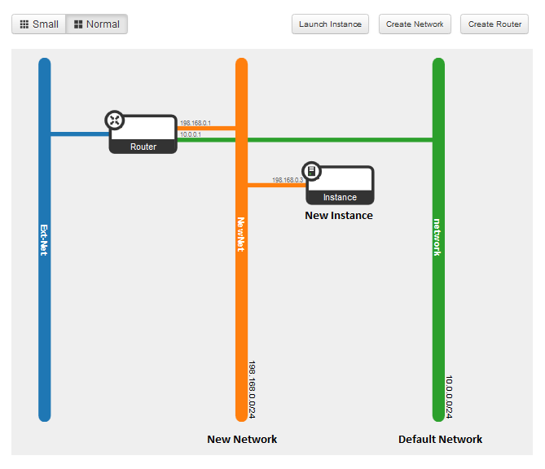

# HP Cloud Networking: Quick start guide ## {#top}

HP Cloud Networking is a virtual networking service that provides network connectivity and IP addressing for HP Cloud compute devices. It is based on OpenStack Networking open source software. 

This guide covers the following:

- [Overview](#overview)
- [Viewing your network in the HP Public Cloud Console](#NetworkTopo)
- [Customizing your network](#customize)
- [For further information](#ForFurtherInformation)

## Overview ## {#overview}

This guide provides the information you will need to get started in setting up a network, such as the example shown in the following image.

Here, the left side of the image represents the HP Public Cloud environment and the right side is your local system.

You can configure rich network topologies by creating and configuring networks and subnets, and then instructing other services like Compute to attach virtual devices to ports on these networks.

In particular, Networking supports each tenant having multiple private networks, and allows tenants to choose their own IP addressing scheme (even if those IP addresses overlap with those that other tenants use). 

The Networking service offers flexibility for the cloud administrator to customize network offerings, such as building multi-tiered web applications and enabling migration of applications to the cloud without changing IP addresses.

HP Public Cloud compute activation comes with a default configuration that includes:

* A network 
* A subnet
* A router for connecting the subnets to the Internet
* A security group with basic server options

You can use the default network to deploy HP Public Cloud compute virtual servers, or modify the network configuration using the HP Public Console or the HP Cloud 13.5 CLI.

See [Customizing your Configuration](#customize).

### Audience ### {#audience}
This guide is designed for those in the following or similar roles:   

- Networking Engineers    
- Networking Administrators
- Cloud Administrators

To use this solution effectively, you should be familiar with   

- Local network configuration in HP Cloud     
- HP Cloud Compute and Networking services 
- OpenStack Nova and Neutron CLI and API   
- Virtual Private Networks (VPN)    
- strongSwan or other IPsec-based software solutions   
    

### Key Terms ### {#terms}

**Network**: An isolated L2 segment, analogous to VLAN in the physical networking world. A network allows you to define network connectivity and addressing in the Cloud, providing "networking as a service" between interface devices managed by other HP Public Cloud, such as compute. 

**Subnet**: A block of v4 or v6 IP addresses and associated configuration state.

Contains IP address blocks that assign IP addresses to virtual servers. In addition, a subnet can have a gateway, a list of DNS name servers, and host routes. Information provided by DHCP is pushed to servers with interfaces associated with the subnet.

**Port**: A connection point for attaching a single device, such as a virtual server's NIC, to a virtual network.  The port describes the associated network configuration, such as the MAC and IP addresses to be used by the attached device.

**Router**: A device that forwards data packets along networks. 

**Security Groups and Security Group Rules**: Security groups and security group rules allow you to specify the type of traffic and direction (inbound/outbound) that is allowed to pass through a port. A security group is a container for security group rules.

When a port is created in HP Cloud Networking it is associated with a security group. If a security group is not specified the port is associated with a default security group. Security group default rules allow inbound traffic from the same subnet and all outbound traffic. You can add rules to this group to modify behavior. 

back to the [top](#top)

## Viewing your network in the HP Public Cloud Console ## {#NetworkTopo}

The Network Topology tab is a physical representation of your network configuration.

After activating the Compute 13.5 region, HP Public Cloud creates a default network that looks like the following diagram. 

    

A default router (here, labeled Router 1) is created and attached to the external network (labeled "Ext-Net") so it can be reached from the Internet. A default network (labeled Network1) is also created and attached to the router.

The default configuration contains a subnet that serves as your DHCP server. The subnet has a CIDR of 10.0.0.0/24, which is the pool of fixed private IPs that are assigned to your instances. 

Any instance you create can be attached to your network, using a port automatically created using an fixed private IP from your subnet.

##Customizing your network## {#customize}

You can use the default network or customize the default network using either the HP Cloud Networking API or the HP Cloud Management Console. Customizing a network enables you to manage the networks your virtual servers connect to.

HP Cloud Networking expands networking capabilities, allowing you to perform many tasks, including:

- Viewing network and router details
- [Creating a network](#Enabling)
- [Creating a subnet](#CreateSubUI)
- [Creating a port](#CreatePortUI)
- [Creating a router](#AssignRouterUI)
- [Assigning a router to a network](#AssignRouter)

All of the procedures in this section require that you access the Networks or Routers tab in the Project section of the HP Public Cloud Console, <a name="NetworkTab">as shown</a>:

    

You might need to modify the default network or create additional networks.  This page gives you some how-to's to use the [Horizon Cloud Console](#console) or [HP Cloud CLI for Windows PowerShell](#powershell) to create and configure networks, routers, and ports.  

**Note:** You can also use the [HP Cloud v13.5 Compute Service API](https://docs.hpcloud.com/api/v13/compute/) and [HP Cloud v13.5 Networking API](https://docs.hpcloud.com/api/v13/networking/) to configure your network. 

### Activate the compute service in HP Cloud ### {#compute}

If you have not previously created an account and activated the compute service please sign up at [http://hpcloud.com](http://hpcloud.com).  

Make sure you activate a compute instance in HP Cloud version 13.5 to access the networking and VPN capabilities.

### Creating a network ### {#CreateNetwork}

In order to associate an instance with a network, the network much exist. HP Public Cloud creates a default network when you activate a service. You can skip this step if you are using the network and subnet provided with your service activation.

However, if you want to define the IP addresses for your network and instances, you can create a new network using the [HP Public Cloud Console](#CreateNetworkUI) or [HP Cloud 13.5 CLI](CreateNetworkCLI).

#### Using the HP Public Cloud Console to create a network and subnet#### {#CreateNetworkUI}

To create a network and subnet, use the following steps:

1. Login to the [Horizon Console](https://horizon.hpcloud.com/).

2. Select the [Networks tab](#NetworkTab) under the Project section.

3. Click **Create Network**. 
	 

4. On the **Network** tab, enter a name for the network  and leave the **Admin State** selected.  
	 

5. Click **Next** to configure a subnet for the network. 

6. On the **Subnet** tab, enter the subnet name
	 

7. In the **Network Address** field enter a network address in Classless Inter-Domain Routing (CIDR) format: 192.168.0.0/24.

8. In the **IP Version** field, select IPv4 or IPv6, as appropriate.

9. Leave the **Gateway IP** field blank to use the default value for the gateway IP address; for example, 192.168.0.1 for 192.168.0.0/24.

6. Click **Next**. 

10. On the **Subnet Details** tab, select Enable DHCP to.
	 

11. To create an allocation pool, enter the starting and ending IP addresses you want for your subnet in the text entry fields, in the format `192.168.1.10,192.168.1.120`.  

12. To create a DNS Nameserver, enter the `IP Address` you want for your subnet in the text entry field.

13. To create host routes, enter the `Destination CIDR` and `Next Hop` you want for your subnet in the text entry fields.  

14. Click **Create**. 

To see a graphic display of your network setup, click **Network Topology** under **Manage Network** in the left-hand navigation.  

    

#### Using the CLI to create a network and subnet #### {#CreateNetworkCLI}

Once you [activate](#compute) the compute service, in order to use the HP Cloud 13.5 CLI to configure the network, you need to [install the CLI](http://docs.hpcloud.com/cli/nova). 

To create a network and subnet, use the following steps:

1. Launch a command line window or UNIX shell on a system configured to access the availability zone where you want to create the new network.

2. Execute the `neutron net-create` command to create the network:

    neutron net-create vpn_network

	Where `vpn_network` is the name of the network.

3. Execute the `neutron subnet-create` command to create the subnet:

    neutron subnet-create ext-net  --allocation-pool start=FLOATING_IP_START,end=FLOATING_IP_END --gateway=EXTERNAL_INTERFACE_GATEWAY --enable_dhcp=False EXTERNAL_INTERFACE_CIDR 

	Where:

		NETWORK - Enter the network id or name this subnet belongs to. 
		
		CIDR - Enter the network address in Classless Inter-Domain Routing (CIDR) format to assign to the subnet, for example: 192.168.0.0/24.
		
		tenant-id - The tenent ID 
		
		name - Enter a name to assign to the subnet.
        
		gateway - Enter a private IP address to use as the gateway address.
        
		no-gateway 
		
		allocation-pool -  Enter the starting and ending IP addresses for your subnet in the format: start=IP_ADDR,end=IP_ADDR.
		
		host-route - Create a route table by entering destination CIDR and a Next Hop address you want for your subnet, use the format: `destination=CIDR,nexthop=IP_ADDR`
		
		dns-nameserver - Specify a DNS nameserver.
		
		disable-dhcp - Enter `FALSE` to enable DHCP or `TRUE` to disable DHCP.

	The following example creates a subnet called `subnet1` with network address (10.0.0.0/24). The subnet is associated with the `vpn_network` network. DHCP is active and will use an IP address from the specified pool of addresses. 

		neutron subnet-create netw1 10.0.0.0/24 --name subnet1 --enable_dhcp=false --allocation-pool start=192.168.0.32,end=192.168.0.63

To see a graphic display of your network setup, login to the [Horizon Console](https://horizon.hpcloud.com/). Click **Network Topology** under **Manage Network** in the left-hand navigation.  

    

### Connecting to a network ### {#ConnectNetwork}

After the new network and subnet are created, you need to connect the network to the router. A router and network connect through an *interface* from the router to the network.

#### Using the HP Public Cloud to connect to a network #### {#ConnectNetworkUI}

To connect a network to a router, use the following steps:

1. Login to the [Horizon Console](https://horizon.hpcloud.com/).

2. Select the [Routers tab](#NetworkTab) under the Project section.

3. Click the router name on the **Routers** tab.

4. Click "Add Interface" on the far-right of the "Router Overview" tab. 

    

5. In the **Subnet** list, select the network you want to connect with. 

6. Optionally, enter an IP address in the **IP Address** field or allow a default IP address to be assigned.  

	**Notes:**
	- The default interface IP address is the external gateway for the subnet, and is usually the best choice unless you are setting up a more complicated connection. 
	- If you specify an IP address, the address must belong to the subnet in the drop-down menu. 

7. Click **Add Interface**. The router and network are now connected, similar to the following image:

    

#### Using the CLI to connect to a network #### {#ConnectNetworkUI}

To connect a network to a router, use the following steps:

1. Launch a command line window or UNIX shell on a system configured to access the availability zone where you want to create the new network.

2. Execute the `neutron router-interface` command to create the network:

	neutron router-interface-add ROUTER_ID SUBNET_ID

	Where

		ROUTER_ID - The name or ID of the router.

		SUBNET_ID - The name or ID of the subnet.

### Create a new server instance ###

After the network is configured, you can create a server instance and attach the instance to the new network.

#### Using the HP Public Cloud Console to create an instance ####

#### Using the CLI to create an instance ####

**Note:** These instructions use the HP Cloud v13.5 CLI on an Ubuntu server instance. You may, of course, choose to use another instance type and still use these directions as a general guide for setting up your VPN.
 
Set up a new Ubuntu server instance&mdash;separate from your other VPC gateway machines and using the command line. Test the setup of this new server.

1. Install Python-NovaClient and Python-NeutronClient on this server. See the [Knowledge Base](https://community.hpcloud.com/article/cloud-135-cli-installation-instructions) for instructions.
2. Verify that you can access the Nova and Neutron APIs for your tenant from this Python Client by running the `nova list` and `neutron port-list` commands.

<!--
#### Create a port #### {#CreatePortUI}

When you create a network, ports are automatically created. You can edit the ports  

1. Login to the [HP Public Cloud Console](https://horizon.hpcloud.com/).

2. Select the appropriate project and availability zone.

2. Select the [Networks tab](#NetworkTab) under the Project section.

#### Create a router #### {#SpecifyIP}

1. Login to the [HP Public Cloud Console](https://horizon.hpcloud.com/).

2. Select the [Networks tab](#NetworkTab) under the Project section.

#### Assign a router to an external network #### {#AssignRouterUI}

1. Login to the [Horizon Console](https://horizon.hpcloud.com/).

2. Select the [Routers tab](#RouterTab) under the Project section.

3. On the Routers screen, locate the network which you want to rename.

4. In the Actions column, click **Set Gateway** for your the network. 

5. In the Set Gateway screen, select a network from the **External Network** list and click **Set Gateway**
	 

    

-->

##For further information## {#ForFurtherInformation}

* For information about the router details screen, take a look at the [Viewing router details](/mc/compute/networks/view-router/) page
For the full reference of supported HP Cloud CLI commands for Windows PowerShell, see [HP Cloud Environment CLI Software for Windows PowerShell Command Line Reference](docs.hpcloud.com/cli/windows/2/reference/)
* For basic information about our HP Cloud compute services, take a look at the [HP Cloud compute overview](/compute/) page
* Use the MC [site map](/mc/sitemap) for a full list of all available MC documentation pages
* For information about the Open Stack networking features, surf on over to [their networking wiki](https://wiki.openstack.org/wiki/Quantum)
