# HP Cloud Networking: Quick start guide # {#top}

HP Cloud Networking is a virtual networking service that provides network connectivity and IP addressing for HP Cloud compute devices. It is based on OpenStack Networking open source software. 

This guide covers the following:

- [Overview](#overview)
- [Before you begin](#begin)
- [Viewing your network in the HP Public Cloud Console](#NetworkTopo)
- [Using the Default Network](#default)
- [Customizing your network](#customize)
- [For further information](#ForFurtherInformation)

## Overview ## {#overview}

This guide provides the information you will need to get started in setting up a network, such as the example shown in the following image.

Here, the left side of the image represents the HP Public Cloud environment and the right side is your local system.

The Networking service offers flexibility for the cloud administrator to configure rich network topologies by creating and configuring networks and subnets, and then instructing other services like Compute to attach virtual devices to ports on these networks.

The Networking service supports a tenant having multiple private networks, and allows tenants to choose their own IP addressing scheme (even if those IP addresses overlap with those that other tenants use), enabling the migration of applications to the cloud without changing IP addresses.

### Audience ### {#audience}
This guide is designed for those in the following or similar roles:   

- Networking Engineers    
- Networking Administrators
- Cloud Administrators

To use this solution effectively, you should be familiar with:   

- Network configuration     
- HP Cloud Compute and Networking services 
- OpenStack Nova and Neutron CLI    
        

## Before you begin ### {#begin}

Before you can begin working with a network, make sure you have activated the [compute service](#compute) and [installed the HP Cloud 13.5 CLI](#installcli), if you prefer to use the CLI.

#### Activating the compute service in HP Cloud (optional) #### {#compute}

If you have not previously created an account and activated the compute service please sign up at [http://hpcloud.com](http://hpcloud.com).  

Make sure you activate a compute instance in HP Cloud version 13.5 to access the networking and VPN capabilities.

#### Installing the CLI #### {#installcli}

Before you can use the CLI:

1. Install Python-NovaClient and Python-NeutronClient on this server. See the [Knowledge Base](https://community.hpcloud.com/article/cloud-135-cli-installation-instructions) for instructions.

2. Verify that you can access the Nova and Neutron APIs for your tenant from this Python Client by running the `nova list` and `neutron port-list` commands.

## Viewing your network in the HP Public Cloud Console ## {#NetworkTopo}

The Network Topology tab is a physical representation of your network configuration.

After activating the Compute 13.5 region, HP Public Cloud creates a default network that looks like the following diagram. Login to the [HP Public Cloud Console](https://horizon.hpcloud.com/) and select the Network Topology tab under the Project section.

    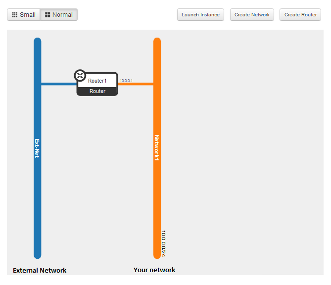

A default router (here, labeled Router 1) is created and attached to the external network (labeled "Ext-Net") so it can be reached from the Internet. A default network (labeled Network1) is also created and attached to the router.

The default configuration contains a subnet that serves as your DHCP server. The subnet has a CIDR of 10.0.0.0/24, which is the pool of fixed private IPs that are assigned to your instances. 

Any instance you create can be attached to your network, using a port automatically created using an fixed private IP from your subnet.

## Using the Default Network ## {#default}

HP Public Cloud compute activation comes with a default configuration that includes: 

* A network 
* A subnet
* A router for connecting the subnets to the Internet
* A security group with basic server options

You can use the default network to [deploy HP Public Cloud virtual server instances](#CreateServer), or [modify the network configuration](#customize) using the HP Public Console or the HP Cloud 13.5 CLI.

**Note:** The default security group allows all traffic to and from the network. For information on security groups in version 13.5, please see the knowledge base article [Managing Your Security Groups](https://community.hpcloud.com/article/managing-your-security-groups-135) for details.

##Customizing your network## {#customize}

You customize the default network using either the HP Public Cloud 13.5 CLI or the HP Public Cloud Console. 

When you first activate the compute service, a [default](#default) configuration is created that should provide enough capacity for typical needs. However, you can create a new network, allowing you to assign a specific IP address to the network and subnet.

This document introduces you to the HP Networking Service and provide steps to get you up and running with a network configuration, performing the following tasks: 

- [Viewing network and router details](#NetworkTopo)
- [Creating a network and subnet](#CreateNetwork)
- [Connecting to a network](#Connect)

HP Cloud Networking allows you to perform many tasks beyond those described here including:

- creating a router
- creating one or more networks
- configuring subnets 

For more information on networking capabilities, see: 

**Note:** You can also use the [HP Cloud v13.5 Compute Service API](https://docs.hpcloud.com/api/v13/compute/) and [HP Cloud v13.5 Networking API](https://docs.hpcloud.com/api/v13/networking/) to configure your network. 

### Creating a network ### {#CreateNetwork}

In order to associate an instance with a network, the network much exist. HP Public Cloud creates a default network when you activate a service. You can skip this step if you are using the network and subnet provided with your service activation.

However, if you want to define the IP addresses for your network and instances, you can create a new network using the [HP Public Cloud Console](#CreateNetworkUI) or [HP Cloud 13.5 CLI](CreateNetworkCLI).

#### Using the HP Public Cloud Console to create a network and subnet#### {#CreateNetworkUI}

To create a network and subnet, use the following steps:

1. Login to the [HP Public Cloud Console](https://horizon.hpcloud.com/).

2. Select the [Networks tab](#NetworkTab) under the Project section.

3. Click **Create Network**. 
	 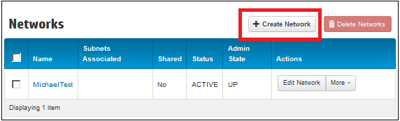

4. On the **Network** tab, enter a name for the network  and leave the **Admin State** selected.  
	 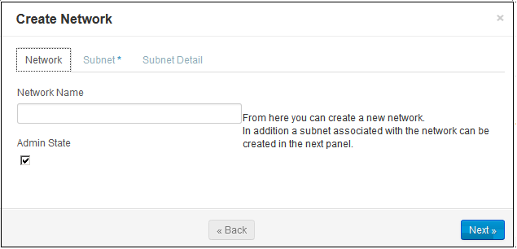

5. Click **Next** to configure a subnet for the network. 

6. On the **Subnet** tab, enter the subnet name
	 

7. In the **Network Address** field enter a network address range for the subnet in Classless Inter-Domain Routing (CIDR) format, for example: 192.168.0.0/24.

8. In the **IP Version** field, select IPv4 or IPv6, as appropriate.

9. Leave the **Gateway IP** field blank to use the default value for the gateway IP address; for example, 192.168.0.1 for 192.168.0.0/24.

10. To disable the network gateway for this network, select  **Disable Gateway**. You will not be able to connect this network to the router if the gateway is disabled. 

11. Click **Next**. 

11. On the **Subnet Details** tab, DHCP is enabled by default. If you do not want to use the DCHP server on this subnet, clear the **Enable DHCP** option.
	 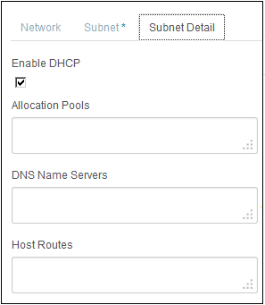

12. To create an allocation pool, enter the starting and ending IP addresses you want for your subnet in the text entry fields, in the format IP_ADDR,IP_ADDR. For example: `192.168.1.10,192.168.1.120`.  

13. To create a DNS Nameserver, enter the `IP Address` you want for your subnet in the text entry field.

14. To create host routes, enter the `Destination CIDR` and `Next Hop` you want for your subnet in the text entry fields.  

15. Click **Create**. 

To see a graphic display of your network setup, click **Network Topology** under **Manage Network** in the left-hand navigation.{#ConnectNetwork}  

    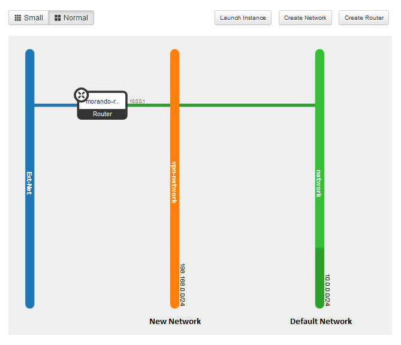

#### Using the CLI to create a network and subnet #### {#CreateNetworkCLI}

Once you [activate](#compute) the compute service, in order to use the HP Cloud 13.5 CLI to configure the network, you need to [install the CLI](http://docs.hpcloud.com/cli/nova). 

To create a network and subnet, use the following steps:

1. Launch a command line window or UNIX shell on a system configured to access the availability zone where you want to create the new network.

2. Execute the `neutron net-create` command to create the network:

    neutron net-create vpn_network

	Where `vpn_network` is the name of the network.

	A table with information on the new network appears.

	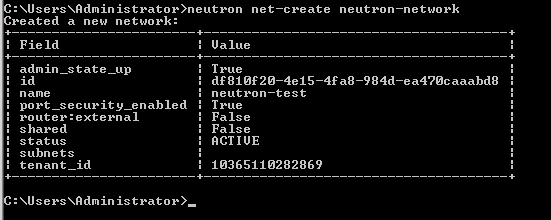

3. Execute the `neutron subnet-create` command to create the subnet:

	`neutron subnet-create <NETWORK> <CIDR>  --allocation-pool start=FLOATING_IP_START,end=FLOATING_IP_END --gateway=EXTERNAL_INTERFACE_GATEWAY --disable_dhcp ``

	Where:

		NETWORK - Enter the network id or the name this subnet belongs to. 
		
		CIDR - Enter a network address range for the subnet in Classless Inter-Domain Routing (CIDR) format, for example: 192.168.0.0/24.
		
	Optional arguments

		tenant-id - The tenent ID 
		
		name - Enter a name to assign to the subnet.
        
		gateway - Enter a private IP address to use as the gateway address.
        
		no-gateway - Use this parameter to disable the network gateway for this network. You will not be able to connect this network to the router if the gateway is disabled
		
		allocation-pool -  Enter the starting and ending IP addresses for your subnet in the format: start=IP_ADDR,end=IP_ADDR.
		
		host-route - Create a route table by entering destination CIDR and a Next Hop address you want for your subnet, use the format: `destination=CIDR,nexthop=IP_ADDR`
		
		dns-nameserver - Specify a DNS nameserver.
		
		disable-dhcp - Enter `FALSE` to enable DHCP or `TRUE` to disable DHCP.

	The following example creates a subnet called `subnet1` with network address (192.166.0.0/24). The subnet is associated with the `vpn_network` network. DHCP is active and will use an IP address from the specified address pool. 

		neutron subnet-create vpn_network 192.166.0.0.0/24 --name subnet1 --allocation-pool start=192.166.0.32,end=192.166.0.63

	A table with information on the new network appears.

	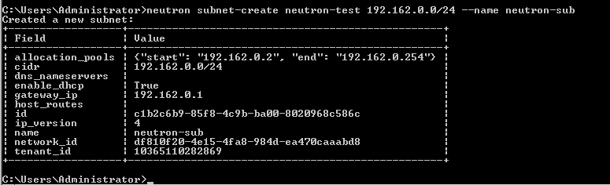

To see a graphic display of your network setup, login to the [Horizon Console](https://horizon.hpcloud.com/). Click **Network Topology** under **Manage Network** in the left-hand navigation.  

    

#### Using Windows PowerShell to create a network and subnet #### {#powershell}

The HP Cloud environment command-line interface (CLI) software for Windows PowerShell allows Windows users to manage their HP Cloud services from the command line.

1. On the 13.5 instance, launch a Windows PowerShell window.  

	Select the shell appropriate to your system, either the 64-bit or 32-bit version. 

2. Enter the HP Cloud environment CLI by entering:

	`PS C:> cd HPCS:`

3. Create a new network by executing the following command, using the appropriate values:

	`new-network -n Name - asu AdminStateUp`

	Where:

		n - The name of new Network.

		asu - Determines if the `AdminStateUp` flag is true or false.

	The following example creates a new network named `testNet1` with AdminStateUp set to `true`.
	
		new-network "testNet1" -asu 

4. Create a new subnet by executing the following command, using the appropriate values:

	`new-subnet -nid NetworkID -ipv IPVersion -c CIDRValue -a AllocationPools`

	Where:

		nid - Subnet name.

		ipv - Sets the IP Version

		c - CIDR value.

		a - Lists Allocation Pools, separating them by commas.

	The following example creates a new subnet called `testSubnet`.

		new-subnet -n testSubnet -nid bd1c30f7-71f1-455e-b91e-8d03da7f5224 -ipv 4 -c "10.0.6.0/24" -a "10.0.6.20", "10.0.6.22" , "10.0.6.26", "10.0.6.29" 

### Connecting to a network ### {#Connect}

After the new network and subnet are created, you can connect the network to the router. A router and network connect through an *interface* from the router to the network.

#### Using the HP Public Cloud to connect to a network #### {#ConnectNetworkUI}

To connect a network to a router, use the following steps:

1. Login to the [HP Public Cloud Console](https://horizon.hpcloud.com/).

2. Select the [Routers tab](#NetworkTab) under the Project section.

3. Click the router name on the **Routers** tab.

4. Click **Add Interface** on the far-right of the **Router Overview** tab. 

    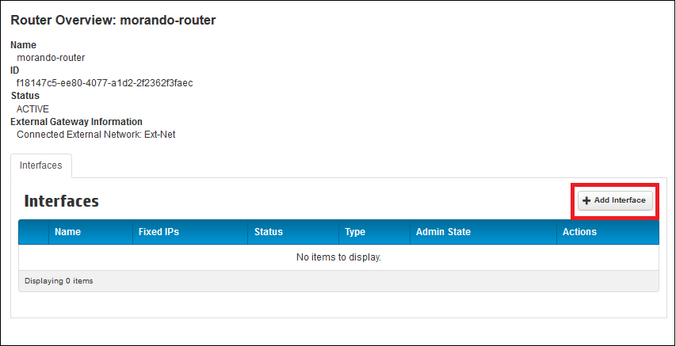

5. In the **Subnet** list, select the network you want to connect with. 

6. Optionally, specify an IP address in the **IP Address** field or allow a default IP address to be assigned.  

	**Notes:**

	- The default interface IP address is the external gateway for the subnet, and is usually the best choice unless you are setting up a more complicated connection. 
	- If you specify an IP address, the address must belong to the subnet in the drop-down menu. 

7. Click **Add Interface**. The router and network are now connected, similar to the following image:

    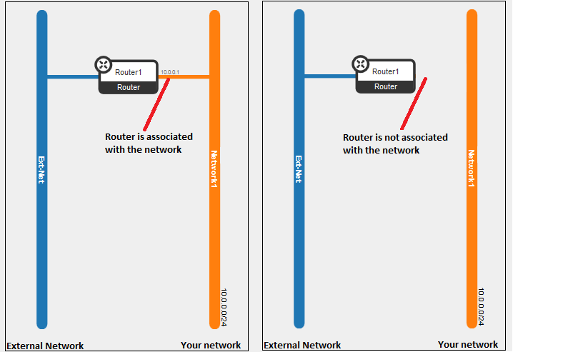

#### Using the CLI to connect to a network #### {#ConnectNetworkUI}

To connect a network to a router, use the following steps:

1. Launch a command line window or UNIX shell on a system configured to access the availability zone where you want to create the new network.

2. Execute the `neutron router-interface` command to create the network:

	neutron router-interface-add ROUTER_ID SUBNET_ID

	Where

		ROUTER_ID - The name or ID of the router.

		SUBNET_ID - The name or ID of the subnet.

### Create a new server instance ### {#CreateServer}

After the network is configured, you can create a server instance and attach the instance to the new network. You can use the [HP Public Cloud Console](#CreateServerUI) or the [HP Cloud 13.5 CLI](#CreateServerCLI)

**Note:** Before creating an instance, you must create a security [key pair](/mc/compute/key-pairs/).

#### Using the HP Public Cloud Console to create an instance#### {#CreateServerUI}

An instance is a virtual server.

1. Login to the [HP Public Cloud Console](https://horizon.hpcloud.com/).

2. Click "Instances" under "Manage Compute" under the Project section.

3. Click **Launch Instance** in the upper right-hand navigation of the screen. 

    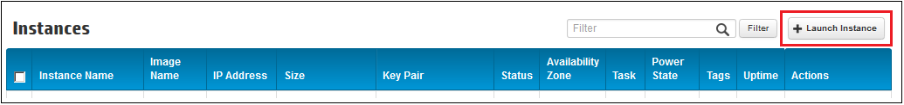

4. Select an availability zone for the instance. Or, leave the default choice of the "Any Availability Zone" (AZ), which arbitrarily assigns an AZ for an instance.

    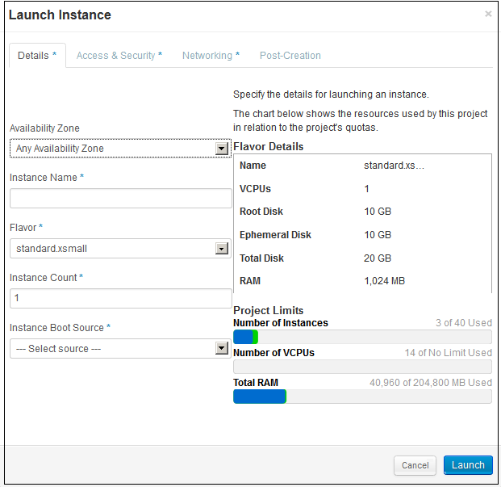

	You can use availability zones for your own organizational purposes; e.g., you could select AZ1 for your data center, and set the remaining two up later for other discrete functions. 

	**Note**: The default choice locating an instance in any AZ offers high availability, ensuring a high level of operational performance. 

5. Enter a name in the **Instance Name** field.

6. Select the flavor (hardware configuration) for the instance from the **Flavor** list. 
	
	A flavor determines how much disk space and RAM is allocated for the instance. When you select a flavor, the "Flavor Details" box displays the specifications for that flavor.

    **Note** The "Project Limits" box under "Flavor Details" graphically displays quotas allowed and usage of Instances, VCPUs, and Total RAM after you select a flavor.

    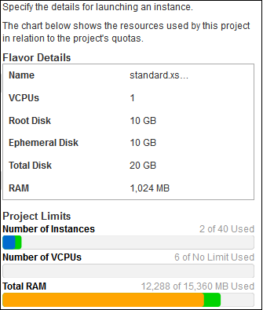

7. Enter the number of instances you want to create in the  **Instance Count** list.

8. Select a type of image from the **Instance Boot Source** list. To select an HP Cloud default image, select **Boot from Image**.  

    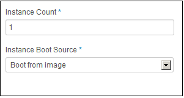

9. Select a specific boot source from the image list. The name of the list reflects the type of source you selected.

    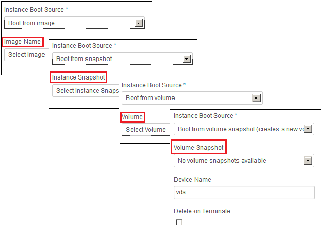

10. Click the **Access & Security** tab in the upper navigation of the screen.

    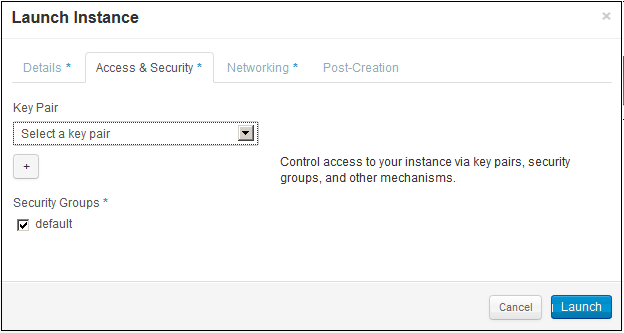

11. Select the appropriate key pair from the **Key Pair** list.

12. Click the **Networking** tab in the upper navigation of the screen. 

    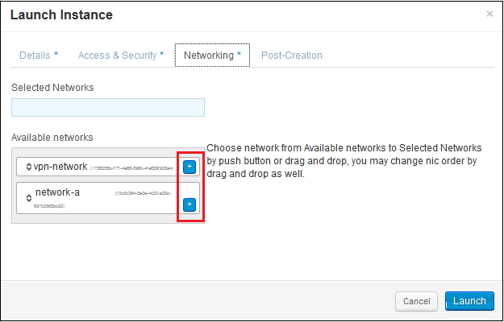

13. Click the **+** next to the network in the **Available networks** list that you want to attach the instance to, or drag and drop the network to the **Selected Networks** box.

14. Click **Launch**.

#### Using the HP Cloud 13.5 CLI to create an instance #### {#CreateServerCLI}

You can use the HP Cloud 13.5 CLI (Python Novaclient) commands to create an instance.

**Important**: You must have the Python Novaclient installed on the instance before using the CLI commands. For more information, see [HP Cloud Python Novaclient CLI Installation](https://docs.hpcloud.com/cli/nova/install).

To create an instance or your network, use the following steps:

1. Launch a command line window or UNIX shell on a system configured to access the availability zone where you want to create the new network.

2. Execute the `nova boot` command:

		nova boot
		usage: nova boot [--flavor ] [--image ]
		[--meta ] [--file ]
		[--key-name ] [--user_data ]
		[--availability_zone ]
		[--security_groups ]
		[--block_device_mapping ]
		[--nic ]
		[--config-drive ]
    	
	**Note**: Only `--flavor`, `--image`, and name are required.

	Where:

		--flavor (required) - The ID number for the flavor to use for the new instance. Use the nova flavor-list command to view a list of flavors and IDs. 
	
		--image (required) - The ID number for the boot image to use. Use the nova image-list command to view a list of images and IDs. 

		--meta (optional) - Metadata to associate with the instance for use with the metadata service.

		--file (optional) - File(s) from the local server to store on the new instance. You may store up to 5 files.

		--key_name (optional) - The name of the key pair that should be used. The key pair must already exist. 
	
		--user_data (optional) - User data file to pass into the metadata server.

		--availability_zone (optional) -- The availability zone for instance placement.

		--security_groups (optional) - The name of the security group to use. 
	
		--block_device_mapping (optional) - A definition of any block devices to attach to the instance. For onformaton, see [Block mapping](#blockmapping). 

		--nic (optional) - Create a network interface card (NIC) on the server. Specify the option multiple times to create multiple NICs. Use either the UUID or IPv4 fixed address for the NIC.

			- nic net-id:UUID to attach the NIC using the UUID (optional) 
			- nic v4-fixed-ip:IPv4_fixed_address for NIC (optional). port-id: attach NIC to port with this UUID (optional)

		--config-drive (optional) - Enables configuration drive.

		--name (required) - The name for the instance.

	The following example is a Novaclient command to create an XSmall Ubuntu 12.04 instance.  The following example boots from image 75845 on a selected network.

	    nova boot --flavor "100" --image "75845" --key_name "az1" --security_groups "default" -block_device_mapping vda=50357:::0 --nic network-id=UUID1 TEST_SERVER

	The output displays, similar to the following:
     

##For further information## {#ForFurtherInformation}

* For information about the HP Cloud Networking, take a look at the [HP Cloud Networking Overview](/compute/network-guide) page
For the full reference of supported HP Cloud CLI commands for Windows PowerShell, see [HP Cloud Environment CLI Software for Windows PowerShell Command Line Reference](docs.hpcloud.com/cli/windows/2/reference/)
* For basic information about our HP Cloud compute services, take a look at the [HP Cloud compute overview](/compute/) page
* Use the MC [site map](/mc/sitemap) for a full list of all available MC documentation pages
* For information about the Open Stack networking features, surf on over to [their networking wiki](https://wiki.openstack.org/wiki/Quantum)
